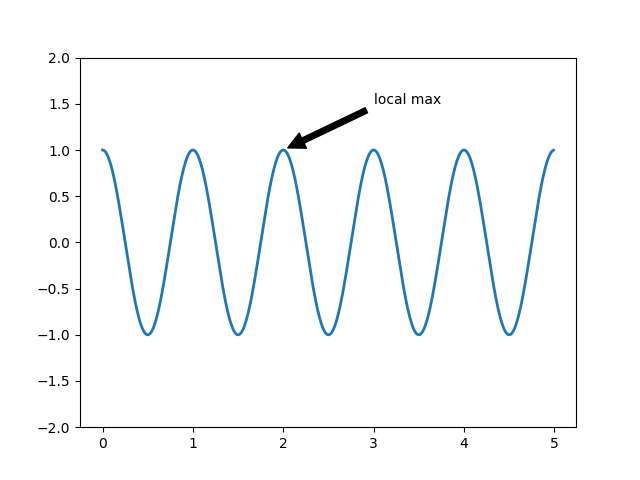

# 注释

- [注释](#注释)
  - [基本注释](#基本注释)
  - [参考](#参考)

2021-02-07, 15:47

## 基本注释

`text()` 方法可以在 Axes 的任意位置放置文本，`annotate` 提供了注释方面的辅助功能。一个注释至少包含两点：

- 待注释的数据点位置 `xy`
- 放置注释文本的位置 `xytext`

如下所示：

在设置点的位置时，有多种坐标系可供选择：

|参数|坐标系|
|---|---|
|'figure points'|从 figure 的左上角开始的数据点|

## 参考

- [matplotlib](https://matplotlib.org/tutorials/text/annotations.html#sphx-glr-tutorials-text-annotations-py)