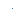

# matplotlib.markers

## 简介

用于处理 marker 的函数，`plot`, `scatter` 以及 `errorbar` 等函数使用。

这里定义的所有 markers:

|marker|symbol|说明|
|---|---|---|
|`"."`||point|
|`","`||pixel|
|`"o"`||circle|
|`"v"`|

triangle_down

"^"

triangle_up

"<"

triangle_left

">"

triangle_right

"1"

tri_down

"2"

tri_up

"3"

tri_left

"4"

tri_right

"8"

octagon

"s"

square

"p"

pentagon

"P"

plus (filled)

"*"

star

"h"

hexagon1

"H"

hexagon2

"+"

plus

"x"

x

"X"

x (filled)

"D"

diamond

"d"

thin_diamond

"|"

vline

"_"

hline

0 (TICKLEFT)

tickleft

1 (TICKRIGHT)

tickright

2 (TICKUP)

tickup

3 (TICKDOWN)

tickdown

4 (CARETLEFT)

caretleft

5 (CARETRIGHT)

caretright

6 (CARETUP)

caretup

7 (CARETDOWN)

caretdown

8 (CARETLEFTBASE)

caretleft (centered at base)

9 (CARETRIGHTBASE)

caretright (centered at base)

10 (CARETUPBASE)

caretup (centered at base)

11 (CARETDOWNBASE)

caretdown (centered at base)

"None", " " or ""

nothing

'$...$'

Render the string using mathtext. E.g "$f$" for marker showing the letter f.

verts

A list of (x, y) pairs used for Path vertices. The center of the marker is located at (0, 0) and the size is normalized, such that the created path is encapsulated inside the unit cell.

## 参考

- https://matplotlib.org/stable/api/markers_api.html
