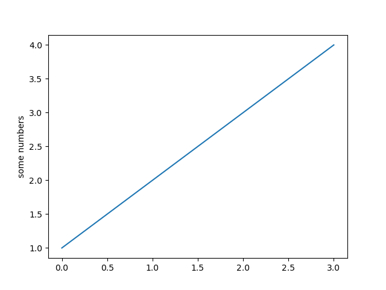

# Pyplot Simple

Last updated: 2022-09-23, 09:33
****

一个非常简单的 pyplot 示例，Y 对索引创建折线图。

```python
import matplotlib.pyplot as plt

plt.plot([1, 2, 3, 4])
plt.ylabel('some numbers')
plt.show()
```



## 参考

- https://matplotlib.org/stable/gallery/pyplots/pyplot_simple.html
