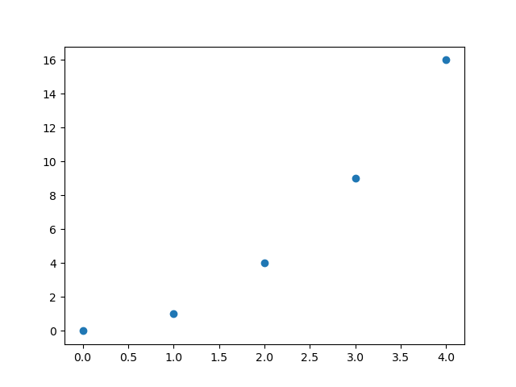
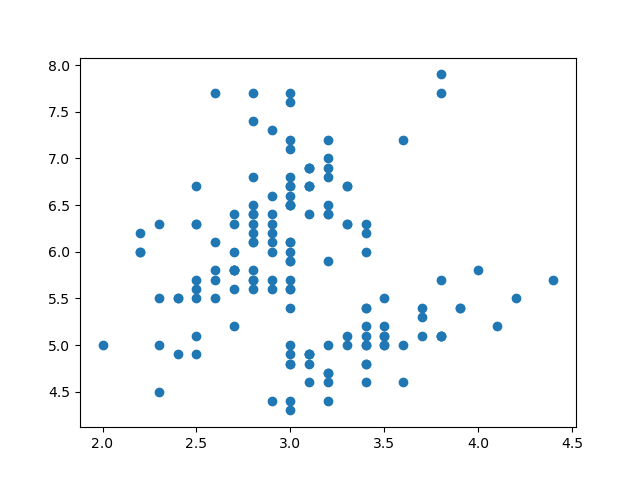
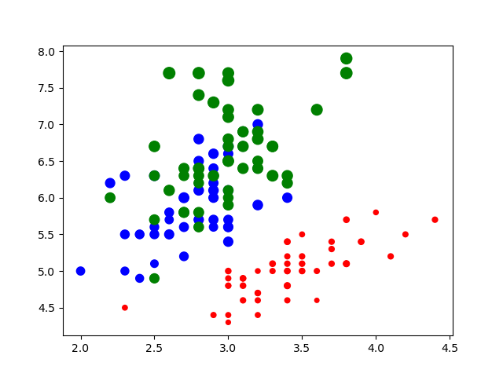
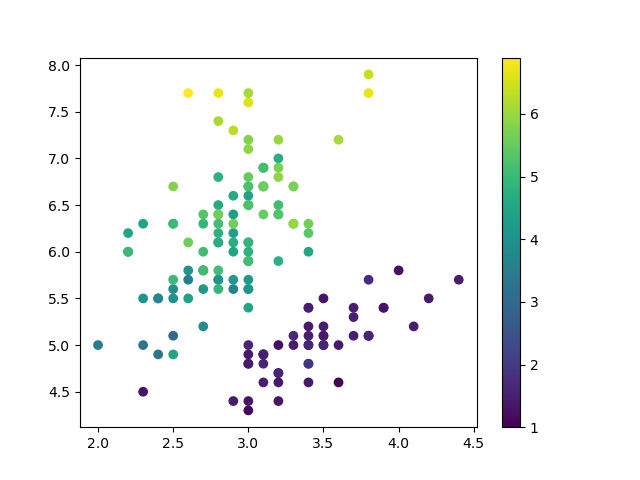
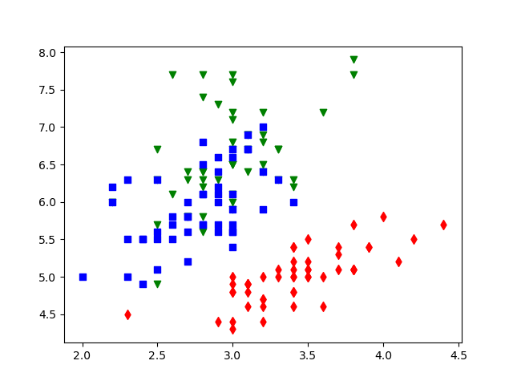

# 散点图

2022-04-11, 09:05
@author Jiawei Mao
***

## 数组作为数据源

```py
import matplotlib.pyplot as plt

x = [0, 1, 2, 3, 4]
y = [0, 1, 4, 9, 16]

fig, ax = plt.subplots()
ax.scatter(x, y)

plt.show()
```



## DataFrame 作为数据源

```py
import plotly.express as px
import matplotlib.pyplot as plt

data = px.data.iris()

fig, ax = plt.subplots()
ax.scatter(x="sepal_width", y="sepal_length", data=data)

plt.show()
```



## 气泡图

- 映射分类变量

```py
import plotly.express as px
import matplotlib.pyplot as plt

data = px.data.iris()
colors = {'setosa': 'red', 'virginica': 'green', 'versicolor': 'blue'}

fig, ax = plt.subplots()
ax.scatter(x="sepal_width", y="sepal_length", data=data,
           c=data["species"].map(colors),
           s=data["petal_length"] * 16)

plt.show()
```



- 映射连续变量

```py
import plotly.express as px
import matplotlib.pyplot as plt

data = px.data.iris()

fig, ax = plt.subplots()
pc = ax.scatter(x="sepal_width", y="sepal_length", data=data,
                c=data["petal_length"])
fig.colorbar(pc)
plt.show()
```



## symbol 映射

```py
import plotly.express as px
import matplotlib.pyplot as plt

data = px.data.iris()

fig, ax = plt.subplots()
species = ["setosa", "virginica", "versicolor"]
markers = ["d", "v", "s"]
colors = ['red', 'green', 'blue']

for s, m, c in zip(species, markers, colors):
    ax.scatter(x="sepal_width", y="sepal_length", data=data[data["species"] == s],
               c=c, marker=m)

plt.show()
```



