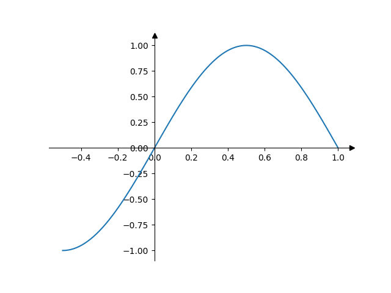

# Spines 居中带箭头

Last updated: 2022-09-23, 16:45
****

下面绘制数学课本上的那种样式的图，其 spines（坐标轴线）绘制在 `x=0`, `y=0` 处，末端带箭头。

```python
import matplotlib.pyplot as plt
import numpy as np

fig, ax = plt.subplots()
# 将左下轴线分别移动 x=0 和 y=0 位置
ax.spines[["left", "bottom"]].set_position(("data", 0))
# 隐藏顶部和右侧轴线
ax.spines[["top", "right"]].set_visible(False)

# 轴线末尾绘制箭头 (黑色三角形: ">k"/"^k")
# 对每种情况，其中一个坐标 (0) 是数据坐标（例如 y=0 或 x=0）
# 另一个 (1) 为轴坐标（例如在轴的 right/top）
# 关闭 clipping (clip_on=False)，因此箭头 marker 实际上超出了轴范围
ax.plot(1, 0, ">k", transform=ax.get_yaxis_transform(), clip_on=False)
ax.plot(0, 1, "^k", transform=ax.get_xaxis_transform(), clip_on=False)

# 样本数据
x = np.linspace(-0.5, 1., 100)
ax.plot(x, np.sin(x * np.pi))

plt.show()
```



## 参考

- https://matplotlib.org/stable/gallery/spines/centered_spines_with_arrows.html
