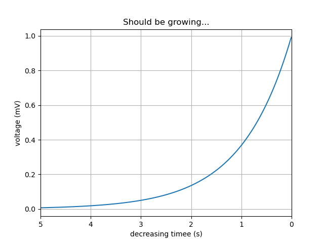

# Invert Axes

Last updated: 2022-09-23, 10:40
****

通过翻转坐标轴的范围设置，使坐标轴从小到大的顺序变为从大到小。

```python
import matplotlib.pyplot as plt
import matplotlib.axes._axes as axes
import matplotlib.figure as figure
import numpy as np

t = np.arange(0.01, 5.0, 0.01)
s = np.exp(-t)

fig, ax = plt.subplots() # type:figure.Figure, axes.Axes

ax.plot(t, s)
ax.set_xlim(5, 0)  # decreasing time，传入的 x 范围 left 和 right 大小反转
ax.set_xlabel('decreasing timee (s)')
ax.set_ylabel('voltage (mV)')
ax.set_title('Should be growing...')
ax.grid(True)

plt.show()
```



## 参考

- https://matplotlib.org/stable/gallery/subplots_axes_and_figures/invert_axes.html
