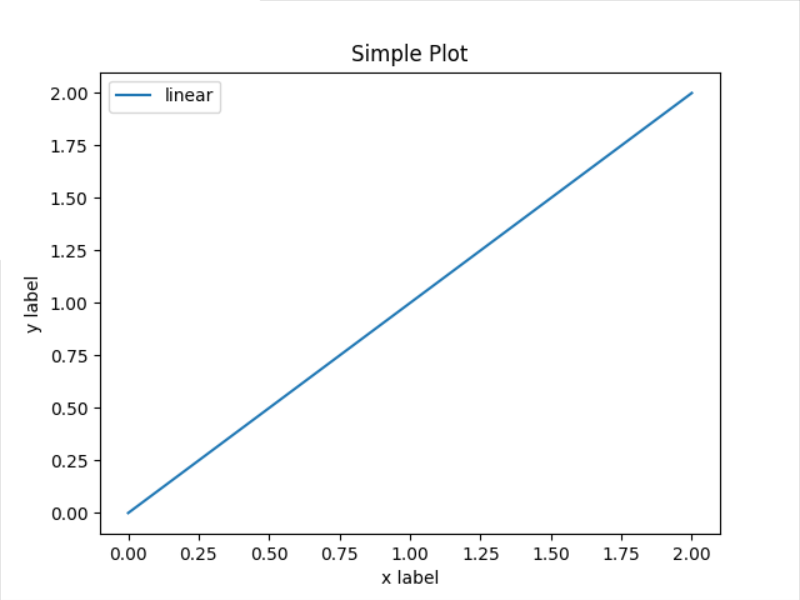
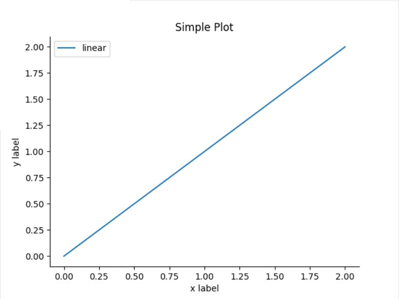
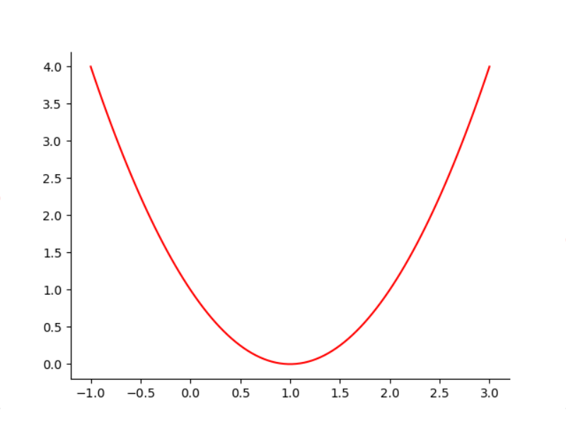

# Spines

- [Spines](#spines)
  - [简介](#简介)
  - [隐藏图脊](#隐藏图脊)
  - [设置图脊位置](#设置图脊位置)
  - [参考](#参考)

2021-02-07, 14:55
****

## 简介

在 Matplotlib 中，Spine 指绘图区四周的边界线（这里姑且将其翻译为图脊），如下图所示。


使用 `Axes.spines` 更改图脊的属性。实现诸如删除顶部和右侧的图脊，或者将左侧图脊移动原点等功能。

`Axes.spines` 属性是一个字典对象，通过 `right`, `left`, `top`, `bottom` 键可以访问各个方位的图脊。

## 隐藏图脊

使用 `set_color` 将图脊的颜色设置为 `None`，可以隐藏图脊，例如，绘制一个简单的线性图：

```py
import matplotlib.pyplot as plt
import numpy as np

x = np.linspace(0, 2, 100)

fig, ax = plt.subplots()

ax.plot(x, x, label="linear")

plt.xlabel('x label')
plt.ylabel('y label')
plt.title("Simple Plot")

plt.legend()
plt.show()
```



下面移除右侧和上面的图脊：

```py
import matplotlib.pyplot as plt
import numpy as np

x = np.linspace(0, 2, 100)

fig, ax = plt.subplots()

ax.plot(x, x, label="linear")

ax.spines['right'].set_color('none') // 隐藏右侧图脊
ax.spines['top'].set_color('none') // 隐藏上面图脊

plt.xlabel('x label')
plt.ylabel('y label')
plt.title("Simple Plot")

plt.legend()
plt.show()
```



## 设置图脊位置

使用 `set_position()` 方法设置图脊位置，其参数为 tuple 类型 ，包含两个需要设置的值 `(position_type, amount)`。一个是位置类型：

- 'outward'，将图脊向图形区域外移动；
- 'axes'，将图脊放在指定的 Axes 坐标（0到1之间）；
- 'data'，将图脊放在指定的数据坐标位置。

另外还有两个特殊值：

- 'center' 表示 ('axes', 0.5)
- 'zero' 表示 ('data', 0.0)

下面我们绘制一个二次曲线图：

```py
import matplotlib.pyplot as plt
import numpy as np

x = np.linspace(-1, 3, 100)
y = (x - 1) ** 2

fig = plt.figure()
ax = fig.add_subplot(1, 1, 1)

ax.spines['right'].set_color('none') # 隐藏右侧图脊
ax.spines['top'].set_color('none') # 隐藏上面图脊

# plot the function
plt.plot(x, y, 'r')

# show the plot
plt.show()
```




然后我们将左侧图脊移到 0 位置：

```py
import matplotlib.pyplot as plt
import numpy as np

x = np.linspace(-1, 3, 100)
y = (x - 1) ** 2

fig = plt.figure()
ax = fig.add_subplot(1, 1, 1)

ax.spines['left'].set_position('zero') # 额外添加行

ax.spines['right'].set_color('none')
ax.spines['top'].set_color('none')


# plot the function
plt.plot(x, y, 'r')

# show the plot
plt.show()
```


## 参考

- [matplotlib User's Guide](https://matplotlib.org/tutorials/introductory/usage.html#sphx-glr-tutorials-introductory-usage-py)
