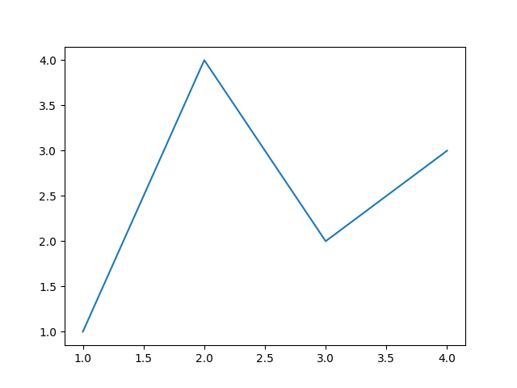
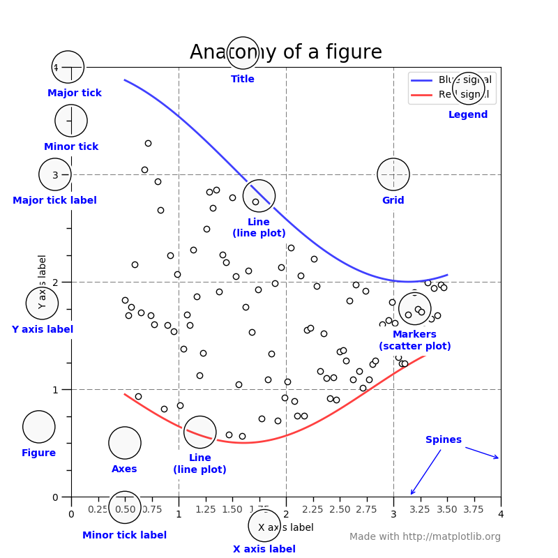
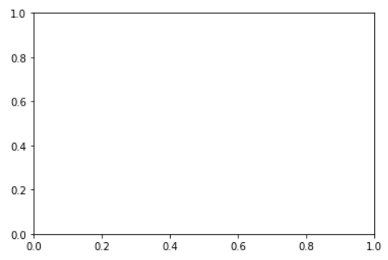
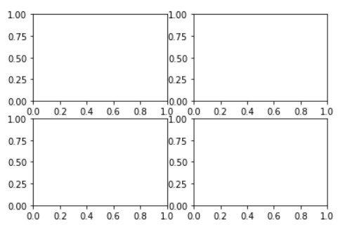
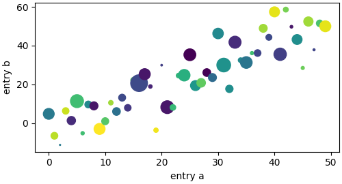
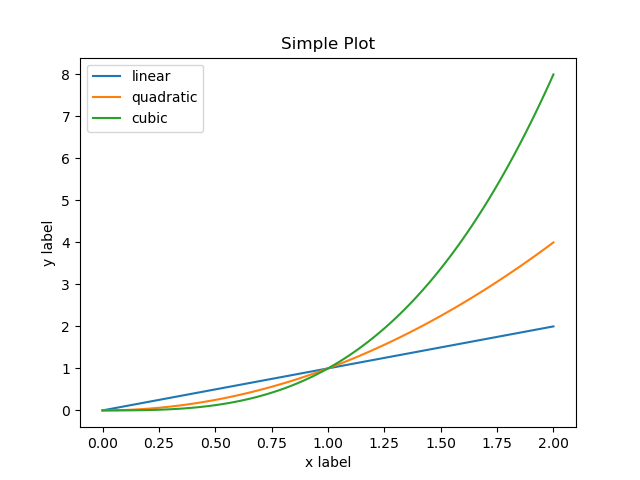
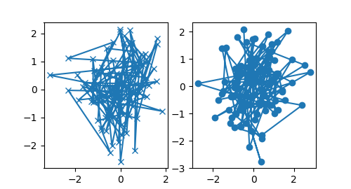

# 基本用法

- [基本用法](#基本用法)
  - [简介](#简介)
  - [一个简单示例](#一个简单示例)
  - [Figure 结构](#figure-结构)
    - [Figure](#figure)
    - [Axes](#axes)
    - [Axis](#axis)
    - [Artist](#artist)
  - [输入数据类型](#输入数据类型)
  - [代码样式](#代码样式)
    - [面向对象和 pyplot 接口](#面向对象和-pyplot-接口)
    - [辅助函数](#辅助函数)
  - [后端](#后端)
    - [设置后端](#设置后端)
    - [内置后端](#内置后端)
  - [交互模式](#交互模式)
    - [交互实例](#交互实例)
    - [非交互实例](#非交互实例)
    - [总结](#总结)
  - [性能](#性能)
    - [线段简化](#线段简化)
    - [Marker 简化](#marker-简化)
    - [线段分段](#线段分段)
    - [fast 样式](#fast-样式)
  - [参考](#参考)

2020-06-29, 21:31
@author Jiawei Mao
***

## 简介

[Matplotlib](https://github.com/matplotlib/matplotlib) 是一个 Python 2D 绘图库，可以生成各种出版品质的硬拷贝格式和跨平台交互式环境数据。Matplotlib 可用于 Python 脚本，Python 和 IPython shell（例如 MATLAB 或 Mathematica），Web 应用程序服务器和各种图形用户界面工具包。

Python 可视化的库很多，包括 seaborn, networkx, vispy. 大多数库都或多或少依赖于 matplotlib。

matplotlib 大致可以分为三部分：

- matplotlib.pylab 部分提供类似于 MATLAB 图表功能的函数；
- matplotlib api 提供创建和管理图表、文本、线条、图形等；
- backends 部分则用于输出图表。

matplotlib 代码很多，初看很难使用。不过 matplotlib 的基本框架理解起来比较简单，入门相对容易。

matplotlib API 是分层组织的：

- 顶层是 `matplotlib.pyplot` 模块，用于添加 plot 元素（lines, images, text, etc.）到当前 figure 的当前 axes中，同 MATLAB 。
- 下一次是面向对象的接口层，这一层，`pyplot` 只用于少量位置，如创建 `figure`，然后通过 `figure` 创建 `axes`，余下的绘制任务基本由 `axes` 对象完成。
- 如果要更深层次的控制，如将 matplotlib 图嵌入到 GUI 应用，则完全抛弃 pyplot，完全使用面向对象的方法。

下面介绍 matplotlib 的一些基本使用模式和最佳实践。

## 一个简单示例

Matplotlib 将数据绘制在 **Figure** 上，如 windows, jupyter widgets 等，每个 figure 包含一个或多个轴（**Axes**），Axes 可以理解为坐标系，是指定数据点的地方，如 x-y 坐标系，极坐标系中的 theta-r，3D 绘图中的 x-y-z 等。创建带一个 Axes 的 Figure 最简单方式是使用 `pyplot.subplots`。然后使用 `Axes.plot` 在 Axes 上绘制数据点：

```python
fig, ax = plt.subplots()  # Create a figure containing a single axes.
ax.plot([1, 2, 3, 4], [1, 4, 2, 3]);  # Plot some data on the axes.
```



## Figure 结构

下图是 Figure 的各个组成部分：



| 模块 | 说明 |
| ---- | --- |
| Figure | 整个区域，一个 figure 可以包含多个 subplots  |
| Subplot | 在一个 `axes` 展示的所有相关内容的区域，为 figure 的子区域，子图等效于 Axes |
| Axis | 坐标轴  |
| Axes | 绘图区域  |
| Spine | 数据区域的边框的四条线  |
| Grid        | 数据区域内的线，方便数值的读取 |
| Title       | figure 标题 |
| Axis labels | 坐标轴标题，最好给出单位  |
| Ticks       | 坐标轴上的刻度，可以有 major ticks 和 minor ticks |
| Tick labels | major 和 minor ticks 都可以标记。除了常规标记，可以指定格式，log 转换以自定义函数格式化标记 |
| Legend      | 图例，为每个数据系列设置的标签  |
| Patches     | 形状，通过 `matplotlib.patches`可以添加矩形、圆形等形状 |

### Figure

`Figure` 为顶层容器，包含：

- 所有子图 `Axes`
- 少量特殊元素（titles, figure legends, etc）
- 画板（canvas）
- 嵌套子 figuree

画板是用于绘制图表的对象，在使用 matplotlib 中几乎不接触。

每个 Figure 可以包含任意数目的 `Axes`，不过为 0 没有意义.

使用 `pyplot` 创建 figure 最简单：

- 创建空 Figure，即没有 Axes

```python
fig = plt.figure()
```

- 创建包含一个 Axes 的 Figure

```python
fig, ax = plt.subplots()
```



- 创建包含 2x2 网格布局共 4 个 Axes 的 Figure

```py
fig, axs = plt.subplots(2, 2)
```



可以在创建 Figure 时创建 Axes，也可以先创建 Figure，随后逐渐添加 Axes。

### Axes

Axes 是 Axis 的复数，两个坐标轴组成一个二维坐标空间，每个平面图都有一个二维坐标空间，所以 matplotlib 干脆使用 `Axes` 表示一个二维图。

即 `Axes` 表示图，具有绘图区域及对应的数据空间，`Axes` 具有如下特征：

- 一个 Figure 可以包含多个 `Axes`，但一个 `Axes` 只能属于一个 `Figure`；
- 一个 `Axes` 包含 2 个（对 3D 图为 3 个）`Axis` 对象，即坐标轴，包含数据范围、刻度和刻度标签；
  - 通过 `Axes` 的 `set_xlim()` 和 `set_ylim()` 也可以设置坐标轴范围。
- 每个 `Axes` 包含标题 `set_title()`，x 轴标签 `set_xlabel()`和 y 轴标签 `set_ylabel()`、

`Axes` 是 OO 接口最重要的类，大部分绘制工作在 `Axes` 对象上进行，包括数据点、ticks、labels 等内容。一般通过 subplot 函数设置 `Axes`。`Axes` 和 `Subplot` 含义相同。

### Axis

坐标轴，**数值-线**对象，用于生成坐标轴、刻度、标签和值范围等。

- 刻度的位置由 `Locator` 设置；
- 刻度标签由 `Formatter` 格式化。

结合使用 `Locator` 和 `Formatter` 可以精细控制刻度位置和标签。

### Artist

Figure 上的所有可见元素基本都是 `Artist` (`Figure`, `Axes`, `Axis` 等)，还包括 `Text`, `Line2D`, `collections` 和 `Patch` 对象等。在渲染 Figure 时，所有 artists 被绘制到 **canvas**。

大部分 Artists 和 `Axes` 绑定，这些 Artist 不能在多个 `Axes` 中共享，也不能从一个 `Axes` 移到另一个。

## 输入数据类型

所有的绘图函数支持 `numpy.array` 或 `np.ma.masked_array` 类型数据，或者 `numpy.asarray` 支持的对象。类数组（array-like）对象，如 pandas 数据对象以及 `numpy.matrix` 可能无法正常工作。推荐在绘图前将输入类型转换为 `np.array` 对象。

- 例如，将 `pandas.DataFrame` 转换为 `np.array`:

```python
a = pandas.DataFrame(np.random.rand(4,5), columns = list('abcde'))
a_asndarray = a.values
```

- 将 `np.matrix` 转换为 `np.array`:

```python
b = np.matrix([[1,2],[3,4]])
b_asarray = np.asarray(b)
```

大多数方法还支持可寻址底线，如 `dict`, `numpy.recarray` 或者 `pandas.DataFrame`。通过 `data` 关键字参数提供数据，根据变量名称提取数据。

```python
np.random.seed(19680801)  # seed the random number generator.
data = {'a': np.arange(50),
        'c': np.random.randint(0, 50, 50),
        'd': np.random.randn(50)}
data['b'] = data['a'] + 10 * np.random.randn(50)
data['d'] = np.abs(data['d']) * 100

fig, ax = plt.subplots(figsize=(5, 2.7), layout='constrained')
ax.scatter('a', 'b', c='c', s='d', data=data)
ax.set_xlabel('entry a')
ax.set_ylabel('entry b');
```



## 代码样式

### 面向对象和 pyplot 接口

使用 Matplotlib 的方式有两种：

- 创建 Figures, Axes，然后调用它们的方法（面向对象风格）；
- 使用 pyplot 函数创建和设置 Figure 和 Axes，使用 pyplot 函数绘图。

pyplot 模块具有当前 figure 和 axes 的概念，所有操作都作用于当前对象。`pyplot` 为面向对象 API 提供了状态机接口，状态机隐式的自动创建 Figures 和 Axes。

例如，`plt.plot` 创建了子图，随后所有的 `plt.plot` 都添加线条到当前子图。

- OO 实例：

```py
x = np.linspace(0, 2, 100)

# OO 样式也是使用 `pyplot.figure` 创建 figure
fig, ax = plt.subplots()  # 创建 figure 和 axes
ax.plot(x, x, label='linear')
ax.plot(x, x ** 2, label='quadratic')
ax.plot(x, x ** 3, label='cubic')
ax.set_xlabel("x label")
ax.set_ylabel("y label")
ax.set_title("Simple Plot")
ax.legend()

plt.show()
```



- pyplot 实例

```py
x = np.linspace(0, 2, 100)

plt.plot(x, x, label='linear')  # Plot some data on the (implicit) axes.
plt.plot(x, x ** 2, label='quadratic')  # etc.
plt.plot(x, x ** 3, label='cubic')
plt.xlabel('x label')
plt.ylabel('y label')
plt.title("Simple Plot")
plt.legend()
```


第一次调用 `plt.plot` 时自动创建了 figure 和 axes，后面调用 `plt.plot` 则利用前面创建的 axes。设置 title, legend, axis labels 也自动使用当前的 axes。

Matplotlib 的文档和示例同时使用 OO 和 pyplot 样式：

- 一般来说，推荐使用 OO 风格，特别是复杂的绘图，以及打算作为更大项目的函数和脚本；
- pyplot 风格适合快速交互式。

### 辅助函数

不同人熟悉的代码风格不一，matplotlib 提供了两种官方风格。

对 pyplot 风格，顶层导入：

```py
import matplotlib.pyplot as plt
import numpy as np
```

然后调用 `np.arange`, `np.zeros`, `np.pi`, `plt.figure`, `plt.plot`, `plt.show` 等。使用 pyplot 接口创建 figures，然后使用对象方法定义 figure。面向对象 API 的最大的好处，就是清晰明了，方便重现和自定义。

如果你经常绘制相同的图，只是数据不同，此时可以创建自定义函数，推荐的函数签名：

```python
def my_plotter(ax, data1, data2, param_dict):
    """
    绘图函数
    Parameters
    ----------
    ax : Axes
        The axes to draw to

    data1 : array
       The x data

    data2 : array
       The y data

    param_dict : dict
       Dictionary of kwargs to pass to ax.plot

    Returns
    -------
    out : list
        list of artists added
    """
    out = ax.plot(data1, data2, **param_dict)
    return out
```

然后使用如下方式调用：

```python
data1, data2, data3, data4 = np.random.randn(4, 100)
fig, ax = plt.subplots(1, 1)
my_plotter(ax, data1, data2, {'marker': 'x'})
```

多图形式：

```python
fig, (ax1, ax2) = plt.subplots(1, 2)
my_plotter(ax1, data1, data2, {'marker': 'x'})
my_plotter(ax2, data3, data4, {'marker': 'o'})
```



## 后端

matplotlib 支持多种输出格式，每一种输出格式称为一个后端（backend），而前端（frontend）是代码。有两种类型的后端：

- UI 后端（如 PyQt/PySide, PyGObject, wxpython, tkinter, macosx）,也称为交互后端。
- 硬拷贝后端，即图片文件（PNG, SVG, PDF, PS）等，也称为无交互后端。

### 设置后端

配置后端的方法有三种：

1. `matplotlibrc` 文件中的 `rcParams["backend"]` 参数
2. `MPLBACKEND` 环境变量
3. `matplotlib.use()` 函数

如果不同配置方法存在冲突，靠后的优先。例如，调用 `matplotlib.use()` 会覆盖 `matplotlibrc`。

如果没有显式设置，Matplotlib 会自动检测可用后端。在 Linux，如果没有设置 `DISPLAY` 环境变量，"event loop" 被识别为 "headless"，从而导致回退到非交互后端（agg）。在其它情况，都是首选交互式后端。

下面对不同配置方法进行说明。

1. `matplotlibrc` 文件中的 `backend` 参数

`matplotlibrc` 的 `rcParams["backend"]` 参数默认为 `agg`。

例如，使用配置 antigrain (agg) 渲染的 wxpython:

```py
backend: WXAgg
```

2. 设置环境变量 `MPLBACKEND`

可以在当前 Shell 会脚本中设置环境变量。

- 对 Unix，可以在 shell 会单个脚本中设置

```py
> export MPLBACKEND=qt5agg
> python simple_plot.py

> MPLBACKEND=qt5agg python simple_plot.py
```

- 对 Windows，只能使用 Shell

```cmd
> set MPLBACKEND=qt5agg
> python simple_plot.py
```

设置该环境变量会覆盖 `matplotlibrc` 中的 `backend` 参数，即使 `matplotlibrc` 文件在当前工作目录。

因此不推荐设置全局的 `MPLBACKEND` 环境变量。

3. 如果你的脚本依赖于特定后端，可以使用 `matplotlib.use()` 函数

```py
import matplotlib
matplotlib.use('qt5agg')
```

必须在创建 figure 之前设置，否则 Matplotlib 可能无法切换后端，抛出 `ImportError`。

如果用户想使用不同的后端，对 `use` 来说必须修改代码，因此，除非必须，否则应当尽量避免调用 `use`。

### 内置后端

默认情况下，Matplotlib 会自动选择一个后端，使得在交互式窗口能输出到屏幕，对脚本能输出文件，因此，对初始应用不需要担心后端问题。不过也有例外，如果没有安装 `tkinter`，也没有安装其它 GUI 工具包，这种情况在有些 Linux 系统中很常见，此时需要安装 python-tk。

为了使 GUI 可定制性更强，matplotlib 将 renderer（执行绘图的对象）和 canvas (绘图的位置) 分离。用于 GUI 的渲染器为 `Agg`，它使用 Anti-Grain Geometry C++ 库生成 figure 的栅格图，`Qt5Agg`, `Qt4Agg`, `GTK3Agg`, `wxAgg`, `TkAgg` 以及 `macosx` 后端都是使用该渲染器。另一个渲染器是基于 `Cairo` 库，`Qt5Cairo`, `Qt4Cairo` 等后端使用该渲染器。

另外，渲染器还可以分为矢量渲染和栅格渲染。矢量渲染没有精度问题，栅格渲染的清晰度取决于 DPI 设置。

下表是 matplotlib 渲染器，每个渲染器都有一个同名后端，对应非交互后端，可以写入文件。

|Renderer|文件类型|说明|
|---|---|---|
|AGG|png|raster graphics -- high quality images using the Anti-Grain Geometry engine|
|PS|ps, eps|vector graphics -- Postscript output|
|PDF|pdf|vector graphics -- Portable Document Format|
|SVG|svg|vector graphics -- Scalable Vector Graphics|
|Cairo|png, ps, pdf, svg|raster or vector graphics -- using the Cairo library|

使用 `matplotlib.pyplot.savefig('filename')` 写入文件。

下面是 UI 和渲染器组合，对应交互后端，可以在输出到屏幕:

|后端|说明|
|---|---|
|Qt5Agg|Agg 渲染到 Qt5 canvas(requires PyQt5). 在 IPython 使用 `%matplotlib qt5` 启用|
|ipympl|Jupyter widget 嵌入Agg 渲染(requires ipympl). 在 Jupyter notebook 使用 `%matplotlib ipympl` 启用|
|GTK3Agg|Agg 渲染到 GTK 3.x canvas (requires PyGObject, and pycairo or cairocffi). 在 IPython 使用 `%matplotlib gtk3` 启用|
|macosx|Agg rendering into a Cocoa canvas in OSX. This backend can be activated in IPython with %matplotlib osx.|
|TkAgg|Agg rendering to a Tk canvas (requires TkInter). This backend can be activated in IPython with %matplotlib tk.|
|nbAgg|Embed an interactive figure in a Jupyter classic notebook. This backend can be enabled in Jupyter notebooks via %matplotlib notebook.|
|WebAgg|On show() will start a tornado server with an interactive figure.|
|GTK3Cairo|Cairo rendering to a GTK 3.x canvas (requires PyGObject, and pycairo or cairocffi).|
|Qt4Agg|Agg rendering to a Qt4 canvas (requires PyQt4 or pyside). This backend can be activated in IPython with %matplotlib qt4.|
|wxAgg|Agg rendering to a wxWidgets canvas (requires wxPython 4). This backend can be activated in IPython with %matplotlib wx.|

> 内置后端名称不区分大小写

## 交互模式

交互后端将图渲染到屏幕。是否渲染，何时渲染，渲染到屏幕后是否继续脚本，取决于调用的函数和方法，以及 matplotlib 是否处于交互模式。

是否处于交互模式的默认配置在 `matplotlibrc` 文件，可以和其它参数一样自定义。也可以通过 `matplotlib.interactive()` 设置，使用 `matplotlib.is_interactive()` 查询。

使用 `matplotlib.pyplot.ion()` 开启交互模式，使用 `matplotlib.pyplot.ioff()` 关闭。

### 交互实例

在 python console 中，输入如下命令：

```py
import matplotlib.pyplot as plt
plt.ion() # 开启交互模式
plt.plot([1.6, 2.7])
```


此时会出现一个绘图窗口，然后可以输入绘图命令，例如：

```py
plt.title("interactive test")
plt.xlabel("index")
```

绘图窗口实时更新：


对大多数交互后端，使用面向对象的接口修改，图形窗口也会更新。例如，使用 `Axes` 实例设置：

```py
ax = plt.gca()
ax.plot([3.1, 2.2])
```


如果使用 `macosx` 后端，或者使用老版本的 Matplotlib，可能图形窗口没有更新，此时可以显式调用 `draw()` 更新图形：

```py
plt.draw()
```

### 非交互实例

关闭交互模式，绘制相同的图：

```py
import matplotlib.pyplot as plt
plt.ioff() # 关闭交互模式
plt.plot([1.6, 2.7])
```

什么都没发生，或者说没有任何东西在屏幕显示。要显示内容，需要调用：

```py
plt.show()
```

此时可以看到该图，但是 python 终端不再响应，`pyplot.show()` 阻止其它输入命令，直到手动终止绘图窗口。

强行阻塞是为了查看figure，否则脚本直接执行结束，figure显示后马上结束，屏幕上什么都看不见。

另外，在非交互模式，所有的绘制操作都延迟到调用 `show()` 执行，这比每次添加内容就重新绘制要高效。

如果多次调用 `show()`:

```py
import numpy as np
import matplotlib.pyplot as plt

plt.ioff()
for i in range(3):
    plt.plot(np.random.rand(10))
    plt.show()
```

生成三个 plots，每次一个，关闭后下一个才显示。

### 总结

在交互模式，pyplot 函数自动渲染到屏幕，如果使用面向对象函数，则需要调用 `draw()` 更新 plot。

如果要生成多个 figures，请使用非交互模式，使用 `show()` 显示 figures。

## 性能

无论是交互模式还是保存图片，都需要考虑性能问题。Matplotlib 提供了多种减少渲染时间的方法，代价是图的外观会略微改变。减少渲染时间的方法和图的类型有关。

### 线段简化

对包含线段的图（如线图，多边形的边框等），其渲染性能可以通过 `matplotlibrc` 文件中的 `path.simplify` 和 `path.simplify_threshold` 参数控制。

- `path.simplify` 为 boolean 类型参数，表示是否简化线段，默认为 True；
- `path.simplify_threshold` 设置简化线段的程度，值越大，渲染越快，默认 0.111111111111。

如下：第一个不简化，第二个简化

```py
import numpy as np
import matplotlib.pyplot as plt
import matplotlib as mpl

# Setup, create data
y = np.random.rand(100000)
y[50000:] *= 2
y[np.logspace(1, np.log10(50000), 400).astype(int)] = -1
mpl.rcParams['path.simplify'] = True

mpl.rcParams['path.simplify_threshold'] = 0.0  # 无简化
plt.plot(y)
plt.show()

mpl.rcParams['path.simplify_threshold'] = 1.0  # 简化
plt.plot(y)
plt.show()
```

Matplotlib 目前默认的简化阈值为 1/9. 如果想修改默认值，修改 `matplotlibrc` 文件即可。

另外，可以对交互绘图（最大简化）和发表质量绘图（最小简化）使用不同的风格，在需要时启用。

线段简化是通过将相邻的线段合并为单个矢量，直到下一个线段和当前线段的垂直距离大于 `path.simplify_threshold` 阈值。

### Marker 简化

标记也可以简化，不过没有线段稳定。标记简化只对 `Line2D` 对象有效，通过 `markevery` 属性设置。在创建 `Line2D` 时可以传入该参数，例如：

```py
plt.plot(x, y, markevery=10)
```

`markevery` 参数允许简单抽样，或者均匀间隔抽样。

### 线段分段

对 Agg 后端可以使用 `agg.path.chunksize` rc 参数，默认为 0.

### fast 样式

fast 样式可用于自动设置简化参数，对大数据绘图加快渲染速度。

```py
import matplotlib.style as mplstyle
mplstyle.use('fast')
```

fast 是很轻量级的样式，和其它样式一起使用也很方便，不会要确定将其放在最后，从而避免被覆盖：

```py
mplstyle.use(['dark_background', 'ggplot', 'fast'])
```

## 参考

- https://matplotlib.org/stable/tutorials/introductory/usage.html
