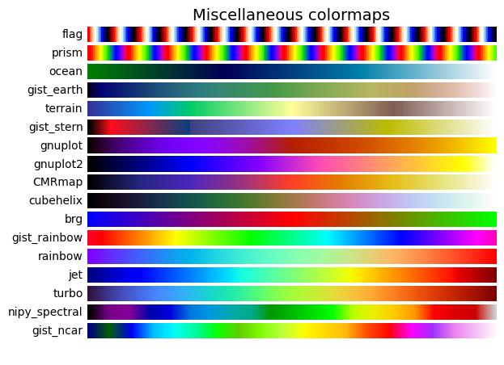

# Colormap 选择

- [Colormap 选择](#colormap-选择)
  - [1. 简介](#1-简介)
  - [2. colormap 分类](#2-colormap-分类)
    - [2.1 Sequential](#21-sequential)
    - [2.2 Sequential2](#22-sequential2)
    - [2.3 Diverging](#23-diverging)
    - [2.4 Cyclic](#24-cyclic)
    - [2.5 Qualitative](#25-qualitative)
    - [2.6 其它](#26-其它)
  - [3. Colormap 亮度](#3-colormap-亮度)
  - [4. 转换为灰度图](#4-转换为灰度图)
  - [5. 色觉缺陷](#5-色觉缺陷)
  - [6. 参考](#6-参考)

Last updated: 2023-01-12, 11:35
****

## 1. 简介

Matplotlib 在 `matplotlib.colormaps` 中内置了许多 colormap，还有[第三方库](https://matplotlib.org/mpl-third-party/#colormaps-and-styles)提供的 colormap。

colormap 是为了让数据集在 3D 颜色空间获得更好的展示。对给定数据集，选择 colormap 要考虑许多因素：

- 表单数据还是度量（metric）数据^[http://ccom.unh.edu/sites/default/files/publications/Ware_1988_CGA_Color_sequences_univariate_maps.pdf]
- 对数据的了解，例如，是否存在临界值
- 对特定数据是否已有直观的配色方案
- 对所在领域是否有标准配色

对许多应用，选择感知均一（uniform）的 colormap 最佳，即数据以线性的方式映射到颜色空间。研究发现，人脑将亮度变化感知为数据变化最灵敏，比色调的变化要好得多。因此，亮度单调递增的 colormap 更利于读者查看。[第三方 colormap](https://matplotlib.org/mpl-third-party/#colormaps-and-styles) 提供了许多优秀的感知均一 colormap。

颜色在三维空间中表示的方式有多种。例如 CIELAB 将颜色空间表示为亮度 $L^*$, red-green $a^*$ 和 yellow-blue $b^*$。其中亮度 $L^*$ 是评估 colormap 感知均一的重要参数。

[A rule-based tool for assisting colormap selection](https://ieeexplore.ieee.org/document/480803) 对人类感知 colormap 做了很好的介绍。

## 2. colormap 分类

colormap 根据功能可以分为如下几类^[http://www.kennethmoreland.com/color-maps/ColorMapsExpanded.pdf]：

1. 连续（Sequential）：亮度和饱和度递增，一般使用单个色调，用于表示有序信息；
2. 发散（Diverging）：两种不同颜色亮度甚至饱和度从两边到中间变化，中间饱和度最低。当数据有一个关键的中间值时使用；
3. 循环（Cyclic）：两种不同颜色的亮度变化，在开头/结尾和中间饱和度最低。适合循环数据，如角度、风向等；
4. 定性（Qualitative）：通常为杂色，用来表示没有顺序或关系的信息。

```python
import numpy as np
import matplotlib as mpl
import matplotlib.pyplot as plt
from colorspacious import cspace_converter
```

先定义一个显示 colormap 范围的函数：

```python
cmaps = {}

gradient = np.linspace(0, 1, 256) # [0,1] 均匀分布的 256 个数
gradient = np.vstack((gradient, gradient))

def plot_color_gradients(category, cmap_list):
    # Create figure and adjust figure height to number of colormaps
    nrows = len(cmap_list)
    # 设置 figure 高度，subplots 顶部边缘 0.35，底部 0.15，行填充为行高的 10%
    figh = 0.35 + 0.15 + (nrows + (nrows - 1) * 0.1) * 0.22
    # 创建 nrows+1 个 subplot，最上边为标题
    fig, axs = plt.subplots(nrows=nrows + 1, figsize=(6.4, figh))
    fig.subplots_adjust(top=1 - 0.35 / figh, bottom=0.15 / figh,
                        left=0.2, right=0.99)
    axs[0].set_title(f'{category} colormaps', fontsize=14)

    for ax, name in zip(axs, cmap_list):
        ax.imshow(gradient, aspect='auto', cmap=mpl.colormaps[name])
        ax.text(-0.01, 0.5, name, va='center', ha='right', fontsize=10,
                transform=ax.transAxes)

    # Turn off *all* ticks & spines, not just the ones with colormaps.
    for ax in axs:
        ax.set_axis_off()

    # Save colormap list for later.
    cmaps[category] = cmap_list
```

> **NOTE** 下面内容结合 [Colormap 亮度](#3-colormap-亮度) 这一节阅读更容易理解。

### 2.1 Sequential

Sequential plot 的**亮度单调递增**。有些 colormap 的亮度值从 0 到 100，有些从 20 开始。需要注意的是，Sequential colormaps 感知均一的 colormap 亮度为线性的，其它的则为非线性。

```python
plot_color_gradients('Perceptually Uniform Sequential',
                     ['viridis', 'plasma', 'inferno', 'magma', 'cividis'])
```


```python
plot_color_gradients('Sequential',
                     ['Greys', 'Purples', 'Blues', 'Greens', 'Oranges', 'Reds',
                      'YlOrBr', 'YlOrRd', 'OrRd', 'PuRd', 'RdPu', 'BuPu',
                      'GnBu', 'PuBu', 'YlGnBu', 'PuBuGn', 'BuGn', 'YlGn'])
```


### 2.2 Sequential2

Sequential2 中的许多 $L^*$ 亮度是单调递增的，但是有些 (autumn, cool, spring 和 winter) 在 $L^*$ 空间有个平台期，甚至上下浮动。其它的 (afmhot, copper, gist_heat 和 hot) 的 $L^*$ 函数有个扭点（kink）。处于 colormap 平台区域或拐点的数据在图中给人条带的感觉，可参考 [mcarta-banding 示例](https://mycarta.wordpress.com/2012/10/14/the-rainbow-is-deadlong-live-the-rainbow-part-4-cie-lab-heated-body/)。

```python
plot_color_gradients('Sequential (2)',
                     ['binary', 'gist_yarg', 'gist_gray', 'gray', 'bone',
                      'pink', 'spring', 'summer', 'autumn', 'winter', 'cool',
                      'Wistia', 'hot', 'afmhot', 'gist_heat', 'copper'])
```


### 2.3 Diverging

Diverging colormap $L^*$ 值单调递增到最大（接近 100），然后单调递减。colormap 两端具有近似的最小 $L^*$ 值。按照该标准，BrBG 和 RdBu 是很好的选择，coolwarm 也不错，但是其 L 值范围不够大。

```python
plot_color_gradients('Diverging',
                     ['PiYG', 'PRGn', 'BrBG', 'PuOr', 'RdGy', 'RdBu', 'RdYlBu',
                      'RdYlGn', 'Spectral', 'coolwarm', 'bwr', 'seismic'])
```


### 2.4 Cyclic

Cyclic colormap 的起始和结束颜色相同，中间有个对称点。亮度 $L^*$ 从开始到中间单调变化，从中间到结尾反向单调变化。亮度的增或减是对称的，只是色调不同。更多有关 cyclic map 的设计可以参考 [kovesi-colormaps](https://arxiv.org/abs/1509.03700)。

常用的 HSV colormap 也放在这一组 colormaps，虽然它不是中心对称的。此外，HSV 的$L^*$ 在整个 colormap 变化很大，因此不适合用来展示数据。

```python
plot_color_gradients('Cyclic', ['twilight', 'twilight_shifted', 'hsv'])
```


### 2.5 Qualitative

定性（Qualitative）colormap 不用作感知 map 来表达数据，从其亮度变化就可以发现这一点。定性 colormap 的亮度变化没有规律。

```python
plot_color_gradients('Qualitative',
                     ['Pastel1', 'Pastel2', 'Paired', 'Accent', 'Dark2',
                      'Set1', 'Set2', 'Set3', 'tab10', 'tab20', 'tab20b',
                      'tab20c'])
```


### 2.6 其它

其它 colormap 各有特殊用途。例如 gist_earth, ocean 和 terrain 是为了绘制地形图（green/brown）和水深（blue）而创建。其中还有发散（divergence）colormap，但是包含多个拐点，如 gist_earch 和 terrain。CMRmap 是为了转换为灰度图而设计，虽然其亮度函数包含几个拐点。cubehelix 的亮度和色调变化都很平滑，但是其绿色区域有个小凸起。turbo 用来显示深度和视差数据。

这组 colormap 还包含常用的 jet colormap，jet 的 $L*$ 变化很大，不适合用来表示数据。详细信息可参考 [mycarta-jet](https://mycartablog.com/2012/10/06/the-rainbow-is-deadlong-live-the-rainbow-part-3/) 和 [turbo](https://ai.googleblog.com/2019/08/turbo-improved-rainbow-colormap-for.html)。

```python
plot_color_gradients('Miscellaneous',
                     ['flag', 'prism', 'ocean', 'gist_earth', 'terrain',
                      'gist_stern', 'gnuplot', 'gnuplot2', 'CMRmap',
                      'cubehelix', 'brg', 'gist_rainbow', 'rainbow', 'jet',
                      'turbo', 'nipy_spectral', 'gist_ncar'])

plt.show()
```



## 3. Colormap 亮度

查看 matplotlib colormaps 的亮度：

```python
mpl.rcParams.update({'font.size': 12})

# 不同 cmap 类别下单个 subplot 中 colormap 数
_DSUBS = {'Perceptually Uniform Sequential': 5, 'Sequential': 6,
          'Sequential (2)': 6, 'Diverging': 6, 'Cyclic': 3,
          'Qualitative': 4, 'Miscellaneous': 6}

# Spacing between the colormaps of a subplot
_DC = {'Perceptually Uniform Sequential': 1.4, 'Sequential': 0.7,
       'Sequential (2)': 1.4, 'Diverging': 1.4, 'Cyclic': 1.4,
       'Qualitative': 1.4, 'Miscellaneous': 1.4}

# Indices to step through colormap
x = np.linspace(0.0, 1.0, 100)

# Do plot
for cmap_category, cmap_list in cmaps.items():

    # Do subplots so that colormaps have enough space.
    # Default is 6 colormaps per subplot.
    dsub = _DSUBS.get(cmap_category, 6)
    nsubplots = int(np.ceil(len(cmap_list) / dsub))

    # squeeze=False to handle similarly the case of a single subplot
    fig, axs = plt.subplots(nrows=nsubplots, squeeze=False,
                            figsize=(7, 2.6 * nsubplots))

    for i, ax in enumerate(axs.flat):

        locs = []  # locations for text labels

        for j, cmap in enumerate(cmap_list[i * dsub:(i + 1) * dsub]):

            # Get RGB values for colormap and convert the colormap in
            # CAM02-UCS colorspace.  lab[0, :, 0] is the lightness.
            rgb = mpl.colormaps[cmap](x)[np.newaxis, :, :3]
            lab = cspace_converter("sRGB1", "CAM02-UCS")(rgb)

            # Plot colormap L values.  Do separately for each category
            # so each plot can be pretty.  To make scatter markers change
            # color along plot:
            # https://stackoverflow.com/q/8202605/

            if cmap_category == 'Sequential':
                # These colormaps all start at high lightness but we want them
                # reversed to look nice in the plot, so reverse the order.
                y_ = lab[0, ::-1, 0]
                c_ = x[::-1]
            else:
                y_ = lab[0, :, 0]
                c_ = x

            dc = _DC.get(cmap_category, 1.4)  # cmaps horizontal spacing
            ax.scatter(x + j * dc, y_, c=c_, cmap=cmap, s=300, linewidths=0.0)

            # Store locations for colormap labels
            if cmap_category in ('Perceptually Uniform Sequential',
                                 'Sequential'):
                locs.append(x[-1] + j * dc)
            elif cmap_category in ('Diverging', 'Qualitative', 'Cyclic',
                                   'Miscellaneous', 'Sequential (2)'):
                locs.append(x[int(x.size / 2.)] + j * dc)

        # Set up the axis limits:
        #   * the 1st subplot is used as a reference for the x-axis limits
        #   * lightness values goes from 0 to 100 (y-axis limits)
        ax.set_xlim(axs[0, 0].get_xlim())
        ax.set_ylim(0.0, 100.0)

        # Set up labels for colormaps
        ax.xaxis.set_ticks_position('top')
        ticker = mpl.ticker.FixedLocator(locs)
        ax.xaxis.set_major_locator(ticker)
        formatter = mpl.ticker.FixedFormatter(cmap_list[i * dsub:(i + 1) * dsub])
        ax.xaxis.set_major_formatter(formatter)
        ax.xaxis.set_tick_params(rotation=50)
        ax.set_ylabel('Lightness $L^*$', fontsize=12)

    ax.set_xlabel(cmap_category + ' colormaps', fontsize=14)

    fig.tight_layout(h_pad=0.0, pad=1.5)
    plt.show()
```


## 4. 转换为灰度图

我们不可避免地会遇到彩色 plot 转换为灰度图的情况，如在黑白打印机上打印彩色图片。因此要仔细选色，否则彩色图转换为黑白图后可能丢失重要信息。

彩图转换为灰度图的方法有多种。比如使用像素 rgb 值的线性组合，或者使用像素的亮度值的非线性组合。一般来说，如果选择的 colormap 的亮度值是单调递增的，就能合理地转换为灰度。

因此 Sequential colormap 可以安全地转换为灰度图。部分 Sequential2 colormaps 也能够安全转换为灰度图，而有些 colormap (autumn, spring, summer, winter) 则灰度变化很小。对使用这类 colormap 的 plot，如果将其打印为灰度图，许多不同的信息可能被映射到相同的灰度值。

- Diverging colormaps 从外边缘的深灰色到中间的白色。部分（PuOr 和 seismic）一边明显比另一边更灰暗，两边不对称。
- coolwarm 灰度范围很小，打印成灰度图会损失很多细节；
- 许多 Qualitative 和 Miscellaneous colormaps，如 Accent, hsv, jet 和 turbo，整个 colormap 从深色到浅色，然后回到深灰色，打印成灰度图展示的信息往往难以解释。

```python
mpl.rcParams.update({'font.size': 14})

# Indices to step through colormap.
x = np.linspace(0.0, 1.0, 100)

gradient = np.linspace(0, 1, 256)
gradient = np.vstack((gradient, gradient))

def plot_color_gradients(cmap_category, cmap_list):
    fig, axs = plt.subplots(nrows=len(cmap_list), ncols=2)
    fig.subplots_adjust(top=0.95, bottom=0.01, left=0.2, right=0.99,
                        wspace=0.05)
    fig.suptitle(cmap_category + ' colormaps', fontsize=14, y=1.0, x=0.6)

    for ax, name in zip(axs, cmap_list):
        # Get RGB values for colormap.
        rgb = mpl.colormaps[name](x)[np.newaxis, :, :3]

        # Get colormap in CAM02-UCS colorspace. We want the lightness.
        lab = cspace_converter("sRGB1", "CAM02-UCS")(rgb)
        L = lab[0, :, 0]
        L = np.float32(np.vstack((L, L, L)))

        ax[0].imshow(gradient, aspect='auto', cmap=mpl.colormaps[name])
        ax[1].imshow(L, aspect='auto', cmap='binary_r', vmin=0., vmax=100.)
        pos = list(ax[0].get_position().bounds)
        x_text = pos[0] - 0.01
        y_text = pos[1] + pos[3] / 2.
        fig.text(x_text, y_text, name, va='center', ha='right', fontsize=10)

    # Turn off *all* ticks & spines, not just the ones with colormaps.
    for ax in axs.flat:
        ax.set_axis_off()

    plt.show()


for cmap_category, cmap_list in cmaps.items():
    plot_color_gradients(cmap_category, cmap_list)
```


## 5. 色觉缺陷

有很多关于色盲的信息^[http://www.color-blindness.com/]，此外，还有一些工具可以帮助将图像转换为适合不同类型色盲查看的样式。

常见的色盲为红绿色盲，因此避免使用同时包含绿色和红色的 colormap 可以避免许多问题。

## 6. 参考

- https://matplotlib.org/stable/tutorials/colors/colormaps.html
