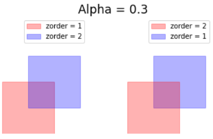
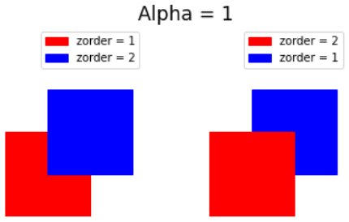
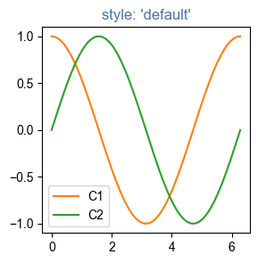
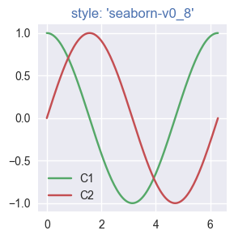
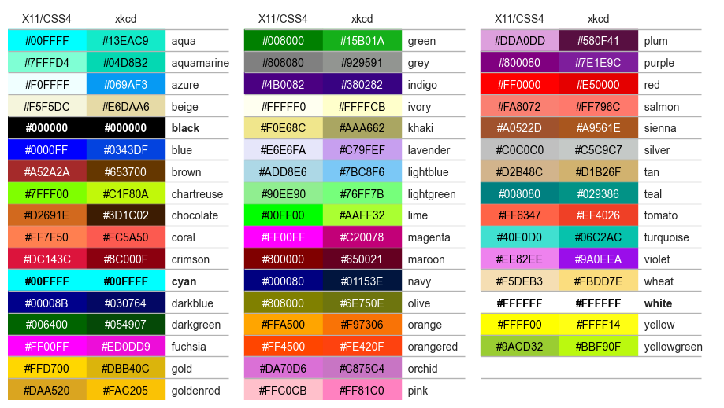

# 指定颜色

- [指定颜色](#指定颜色)
  - [1. 颜色](#1-颜色)
  - [2. 选择 CN 颜色](#2-选择-cn-颜色)
  - [3. X11/CSS4 和 xkcd 对比](#3-x11css4-和-xkcd-对比)
  - [4. 参考](#4-参考)

Last updated: 2023-01-11, 10:04
****

## 1. 颜色

Matplotlib 支持以下颜色格式。

- RGB or RGBA (red, green, blue, alpha) tuple of float values in a closed interval [0, 1].

例如：`(0.1, 0.2, 0.5)`, `(0.1, 0.2, 0.5, 0.3)`

- Case-insensitive hex RGB or RGBA string.

例如 `'#0f0f0f'`, `'#0f0f0f80'`

- Case-insensitive RGB or RGBA string equivalent hex shorthand of duplicated characters.

例如： `'#abc'` as `'#aabbcc'`，`'#fb1'` as `'#ffbb11'`

- String representation of float value in closed interval `[0, 1]` for grayscale values.

例如：'0' as black，'1' as white，'0.8' as light gray

- 一些基本颜色的单字符缩写

|缩写|颜色|
|---|---|
|'b'|blue|
|'g'|green|
|'r'|red|
|'c'|cyan|
|'m'|magenta|
|'y'|yellow|
|'k'|black|
|'w'|white|

> **NOTE:** green, cyan, magenta 和 yellow 与 X11/CSS4 颜色不一致。它们的特殊色调是为了在典型背景下更好地显示彩色线条。

- 来自 [xkcd color survey](https://xkcd.com/color/rgb/) 以 `'xkcd:'` 开头 case-insensitive 颜色名

例如：`'xkcd:sky blue'`，`'xkcd:eggshell'`

- 来自 'T10' 分类调色板的 case-insensitive Tableau 颜色
  - 'tab:blue'
  - 'tab:orange'
  - 'tab:green'
  - 'tab:red'
  - 'tab:purple'
  - 'tab:brown'
  - 'tab:pink'
  - 'tab:gray'
  - 'tab:olive'
  - 'tab:cyan'

> **NOTE** 这是默认颜色循环。

- "CN" 颜色规范，`'C'` + 数字作为默认周期索引。

例如：`'C0'`, `'C1'`

> **NOTE:** Matplotlib 在绘制时索引颜色，如果周期（cycle）不包含颜色，则默认为黑色。

`rcParams["axes.prop_cycle"]` (default: cycler('color', ['#1f77b4', '#ff7f0e', '#2ca02c', '#d62728', '#9467bd', '#8c564b', '#e377c2', '#7f7f7f', '#bcbd22', '#17becf']))

"Red", "Green" 和 "Blue" 表示这些颜色的强度，组合起来代表颜色空间。

Matplotlib 根据 `zorder` 参数绘制 Artists，如果不指定，默认为 Artists 添加到 `Axes` 的顺序。

`Artist` 的 alpha 值设置不透明度，控制新的 Artist 的 RGB 颜色如何与 `Axes` 上已有的 RGB 颜色结合。

两个 Artist 组合使用 alpha 合成。Matplotlib 使用如下方程计算混合的新的 Artist：

$$RGB_{new}=RGB_{below}*(1-\alpha)+RGB_{artist}*\alpha$$

Alpha 为 1 表示新的 Artist 完全覆盖前面的颜色。Alpha 为 0 表示顶部颜色不可见；但是作为以前所有 Artists 的累计结果，它有助于混合中间值。如下表所示：

|Alpha 值|效果|
|---|---|
|0.3||
|1||

## 2. 选择 CN 颜色

Matplotlib 在绘制 Artists 将 "CN" 颜色转换为 RGBA。

```python
import numpy as np
import matplotlib.pyplot as plt
import matplotlib as mpl

th = np.linspace(0, 2 * np.pi, 128)

def demo(sty):
    mpl.style.use(sty)
    fig, ax = plt.subplots(figsize=(3, 3))

    ax.set_title('style: {!r}'.format(sty), color='C0')

    ax.plot(th, np.cos(th), 'C1', label='C1')
    ax.plot(th, np.sin(th), 'C2', label='C2')
    ax.legend()

demo('default')
demo('seaborn-v0_8')
```





第一个颜色 `'C0'` 为标题颜色。每个 plot 使用样式 `rcParams["axes.prop_cycle"]` 的第二种和第三种颜色。

## 3. X11/CSS4 和 xkcd 对比

xkcd 颜色来自网络漫画 [xkcd 进行的一个用户调查](https://blog.xkcd.com/2010/05/03/color-survey-results/)。

X11/CSS4 的 148 种颜色中，有 95 个在 xkcd 颜色调查中出现。除了 'black', 'white' and 'cyan' 相同，其它颜色都映射到 X11/CSS4 和 xkcd 调色板中的不同颜色值。

例如，`'blue'` 映射为 `'#0000FF'`，而 `'xkcd:blue'` 映射为 `'#0343DF'`。由于这些名称冲突，所有 xkcd 颜色都加了前缀 `'xkcd:'`。

下图显示名称冲突。颜色值一致的颜色名称以粗体显示。

```python
import matplotlib.colors as mcolors
import matplotlib.patches as mpatch

overlap = {name for name in mcolors.CSS4_COLORS
           if f'xkcd:{name}' in mcolors.XKCD_COLORS}

fig = plt.figure(figsize=[9, 5])
ax = fig.add_axes([0, 0, 1, 1])

n_groups = 3
n_rows = len(overlap) // n_groups + 1

for j, color_name in enumerate(sorted(overlap)):
    css4 = mcolors.CSS4_COLORS[color_name]
    xkcd = mcolors.XKCD_COLORS[f'xkcd:{color_name}'].upper()

    # Pick text colour based on perceived luminance.
    rgba = mcolors.to_rgba_array([css4, xkcd])
    luma = 0.299 * rgba[:, 0] + 0.587 * rgba[:, 1] + 0.114 * rgba[:, 2]
    css4_text_color = 'k' if luma[0] > 0.5 else 'w'
    xkcd_text_color = 'k' if luma[1] > 0.5 else 'w'

    col_shift = (j // n_rows) * 3
    y_pos = j % n_rows
    text_args = dict(fontsize=10, weight='bold' if css4 == xkcd else None)
    ax.add_patch(mpatch.Rectangle((0 + col_shift, y_pos), 1, 1, color=css4))
    ax.add_patch(mpatch.Rectangle((1 + col_shift, y_pos), 1, 1, color=xkcd))
    ax.text(0.5 + col_shift, y_pos + .7, css4,
            color=css4_text_color, ha='center', **text_args)
    ax.text(1.5 + col_shift, y_pos + .7, xkcd,
            color=xkcd_text_color, ha='center', **text_args)
    ax.text(2 + col_shift, y_pos + .7, f'  {color_name}', **text_args)

for g in range(n_groups):
    ax.hlines(range(n_rows), 3 * g, 3 * g + 2.8, color='0.7', linewidth=1)
    ax.text(0.5 + 3 * g, -0.3, 'X11/CSS4', ha='center')
    ax.text(1.5 + 3 * g, -0.3, 'xkcd', ha='center')

ax.set_xlim(0, 3 * n_groups)
ax.set_ylim(n_rows, -1)
ax.axis('off')

plt.show()
```



## 4. 参考

- https://matplotlib.org/stable/tutorials/colors/colors.html
