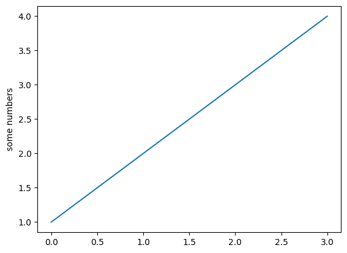
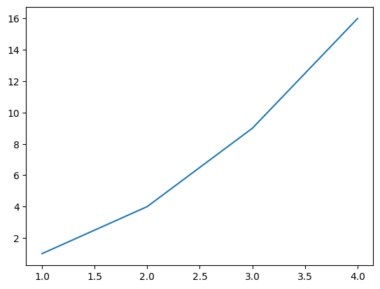
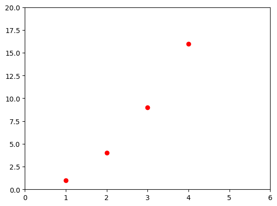
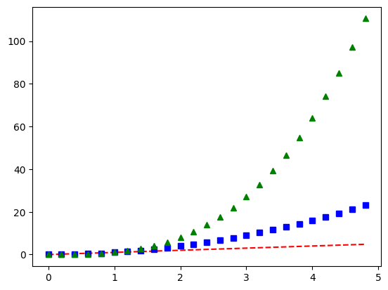
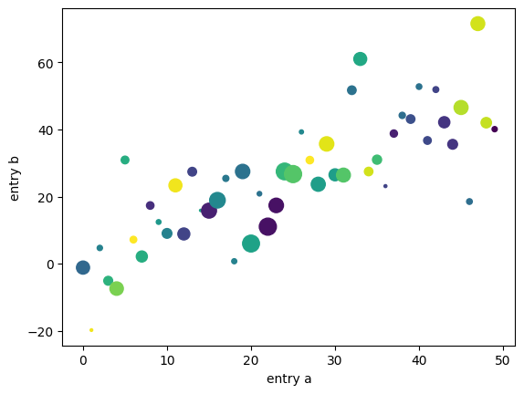
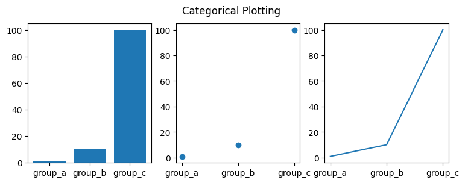
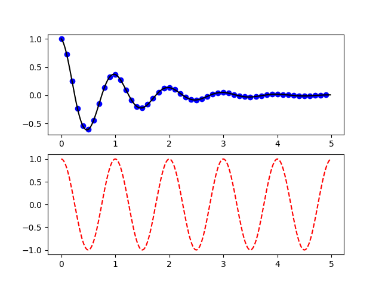
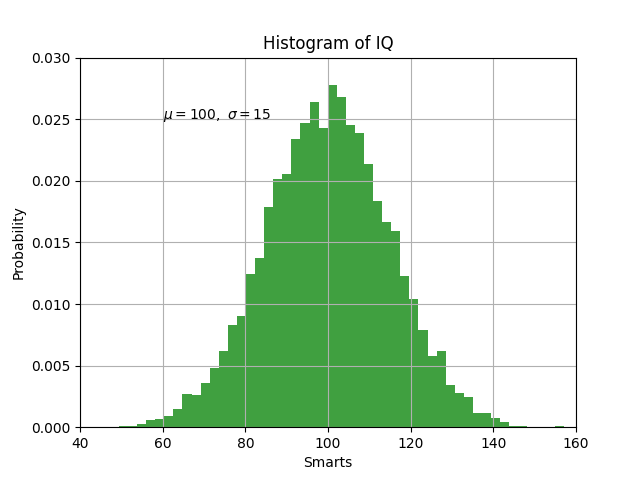
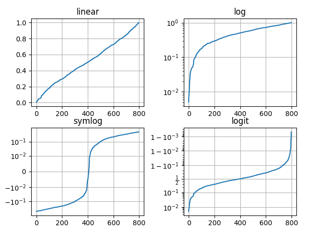

# Pyplot 教程

- [Pyplot 教程](#pyplot-教程)
  - [1. 简介](#1-简介)
    - [1.1 样式设置](#11-样式设置)
  - [2. 关键字参数](#2-关键字参数)
  - [3. 分类变量](#3-分类变量)
  - [4. 线段属性设置](#4-线段属性设置)
  - [5. 多图](#5-多图)
  - [6. text](#6-text)
    - [6.1 数学表达式](#61-数学表达式)
    - [6.2 注释文本](#62-注释文本)
  - [7. 对数轴和其它非线性轴](#7-对数轴和其它非线性轴)
  - [8. 参考](#8-参考)

Last updated: 2023-01-05, 14:26
*****

## 1. 简介

`matplotlib.pyplot` 包含一系列类似 MATLAB 的绘图函数。每个 `pyplot` 函数对 figure 进行一些修改，如创建 figure，在 figure 中创建 plot，在 plot 中添加线段、标签等。

`matplotlib.pyplot` 在不同函数调用之间维持状态不变，记录当前 figure 和绘图区域等信息，以及对当前 axes 进行操作的绘图函数。

> pyplot 主要用于交互式绘图以及较为简单的绘图，对复杂的绘图，还是建议面向对象 API。且 `pyplot` 的大部分函数 `Axes` 对象也有。

使用 pyplot 绘图很方便：

```python
import matplotlib.pyplot as plt

plt.plot([1, 2, 3, 4])
plt.ylabel('some numbers')
plt.show()
```



只为 `plot()` 函数提供一个列表或数组，matplotlib 默认其为 y 值，并以索引作为 x 值，所以上图中 x 为 `[0, 1, 2, 3]`。

`plot()` 是一个多功能函数，可以使用多个参数。例如：

```python
plt.plot([1, 2, 3, 4], [1, 4, 9, 16])
```



### 1.1 样式设置

对每对 x, y 参数，都有第三个可选的格式化字符串参数，用于设置线条类型和颜色。格式化字符串来自 MATLAB，可以将颜色和线条样式串一起。默认格式化字符串为 `'b-'`，表示蓝色实线。例如，绘制红色圆圈：

```python
plt.plot([1, 2, 3, 4], [1, 4, 9, 16], 'ro')
plt.axis([0, 6, 0, 20])
plt.show()
```



`.axis()` 用于指定坐标轴范围，格式为 `[xmin, xmax, ymin, ymax]`。

matplotlib 内部使用 numpy 存储数据，其它序列类型数据在内部也被转换为 ndarray。

下面使用一个命令绘制多条不同样式的线条：

```python
import numpy as np

# evenly sampled time at 200ms intervals
t = np.arange(0., 5., 0.2)

# red dashes, blue squares and green triangles
plt.plot(t, t, 'r--', t, t ** 2, 'bs', t, t ** 3, 'g^')
plt.show()
```



`np.arange(start, end, step)` 生成一个 `ndarray`，然后使用 `plot()` 函数绘制 $y=x$, $y=x^2$, $y=x^3$。

'r--' 表示红色虚线，'bs' 表示红色方块，'g^' 表示绿色三角。

## 2. 关键字参数

有些数据类型可以通过变量名称访问数据，如 `numpy.recarray` 和 `pandas.DataFrame`。Matplotlib 允许通过 `data` 关键字参数提供这类数据，然后使用变量名称指定绘图数据。

```python
data = {'a': np.arange(50),
        'c': np.random.randint(0, 50, 50),
        'd': np.random.randn(50)}
data['b'] = data['a'] + 10 * np.random.randn(50)
data['d'] = np.abs(data['d']) * 100

plt.scatter('a', 'b', c='c', s='d', data=data)
plt.xlabel('entry a')
plt.ylabel('entry b')
plt.show()
```



## 3. 分类变量

Matplotlib 可以使用分类变量绘图：

```python
names = ['group_a', 'group_b', 'group_c']
values = [1, 10, 100]

plt.figure(figsize=(9, 3))

plt.subplot(131) # 1 行 3 列第一个
plt.bar(names, values)

plt.subplot(132) # 1 行 3 列第二个
plt.scatter(names, values)

plt.subplot(133)
plt.plot(names, values)

plt.suptitle('Categorical Plotting')
plt.show()
```



## 4. 线段属性设置

线段的属性包括：linewidth, dash style, antialiased 等；线段由 [`matplotlib.lines.Line2D`](https://matplotlib.org/stable/api/_as_gen/matplotlib.lines.Line2D.html) 类表示。

设置 Line2D 属性的方法有三种：

1. 使用关键字参数

```python
plt.plot(x, y, linewidth=2.0)
```

2. 使用 `Line2D` 的 `setter` 方法

`plot()` 函数返回 `Line2D` 对象列表，例如 `line1, line2 = plot(x1, y1, x2, y2)`。下面创建一个 `Line2D` 对象：

```python
line, = plt.plot(x, y, '-')
line.set_antialiased(False) # turn off antialiasing
```

3. 使用 `setp`

下面使用 MATLAB 风格函数设置多个线条的多个属性。在其中可以使用关键字参数，也可以使用 string/value 设置。例如：

```py
lines = plt.plot(x1, y1, x2, y2)
# 使用关键字参数
plt.setp(lines, color='r', linewidth=2.0)

# 使用 MATLAB 样式 string value pairs
plt.setp(lines, 'color', 'r', 'linewidth', 2.0)
```

`Line2D` 属性如下：

|属性|类型|
|---|---|
|alpha|float|
|animated|`[True | False]`|
|antialiased or aa|`[True | False]`|
|clip_box|a matplotlib.transform.Bbox instance|
|clip_on|`[True | False]`|
|clip_path|a Path instance and a Transform instance, a Patch|
|color or c|any matplotlib color|
|contains|the hit testing function|
|dash_capstyle|`['butt' | 'round' | 'projecting']`|
|dash_joinstyle|`['miter' | 'round' | 'bevel']`|
|dashes|sequence of on/off ink in points|
|data|(np.array xdata, np.array ydata)|
|figure|a matplotlib.figure.Figure instance|
|label|any string|
|linestyle or ls|`[ '-' | '--' | '-.' | ':' | 'steps' | ...]`|
|linewidth or lw|float value in points|
|marker|`[ '+' | ',' | '.' | '1' | '2' | '3' | '4' ]`|
|markeredgecolor or mec|any matplotlib color|
|markeredgewidth or mew|float value in points|
|markerfacecolor or mfc|any matplotlib color|
|markersize or ms|float|
|markevery|`[ None | integer | (startind, stride) ]`|
|picker|used in interactive line selection|
|pickradius|the line pick selection radius|
|solid_capstyle|`['butt' | 'round' | 'projecting']`|
|solid_joinstyle|`['miter' | 'round' | 'bevel']`|
|transform|a matplotlib.transforms.Transform instance|
|visible|`[True | False]`|
|xdata|np.array|
|ydata|np.array|
|zorder|any number|

通过 `setp` 函数可以查看线段可以设置的属性：

```python
In [1]: lines = plt.plot([1, 2, 3])
In [2]: plt.setp(lines)
alpha: float
animated: [True | False]
antialiased or aa: [True | False]
...snip
```

## 5. 多图

MATLAB 和 pyplot 都有当前 figure 和当前 axes 的概念。所有绘图函数应用于当前 axes。函数 `gca` 返回当前 axes (`matplotlib.axes.Axes` 实例)，`gcf` 返回当前 figure (`matplotlib.figure.Figure` 实例)。

下面创建两个 subplots：

```python
def f(t):
    return np.exp(-t) * np.cos(2*np.pi*t)

t1 = np.arange(0.0, 5.0, 0.1)
t2 = np.arange(0.0, 5.0, 0.02)

plt.figure()
plt.subplot(211)
plt.plot(t1, f(t1), 'bo', t2, f(t2), 'k')

plt.subplot(212)
plt.plot(t2, np.cos(2*np.pi*t2), 'r--')
plt.show()
```



这里调用 `figure` 是可选的，如果没有 Figure，Matplotlib 会自动创建一个。`subplot` 指定 `numrows`, `numcols`, `plot_number`，其中 `plot_number` 范围从 1 到 `numrows*numcols`。如果 `numrows*numcols<10`，`subplot` 中的逗号是可选的，即 `subplot(211)` 等价于 `subplot(2, 1, 1)`。

可以创建任意数目的 subplots 和 axes，还可以使用 `axes([left, bottom, width, height])` 手动指定 axes 位置，这些值是 (0 to 1) 的比例值。

可以通过数字编号来创建多个 figure：

```python
import matplotlib.pyplot as plt

plt.figure(1)                # the first figure
plt.subplot(211)             # the first subplot in the first figure
plt.plot([1, 2, 3])
plt.subplot(212)             # the second subplot in the first figure
plt.plot([4, 5, 6])

plt.figure(2)                # a second figure
plt.plot([4, 5, 6])          # creates a subplot() by default

plt.figure(1)                # figure 1 current; subplot(212) still current
plt.subplot(211)             # make subplot(211) in figure1 current
plt.title('Easy as 1, 2, 3') # subplot 211 title
```

使用 `clf` 清除当前 figure，使用 `cla` 清除当前 axes。如果你觉得这种当前图像、当前 axes 很烦人，则推荐使用 OO API。

figures 持有的内存不会自动释放，需要调用 `close`。

## 6. text

`text` 可以在任意位置添加文本，`xlabel`, `ylabel` 和 `title` 则在特定位置添加文本。

```python
mu, sigma = 100, 15
x = mu + sigma * np.random.randn(10000)

# 直方图数据
n, bins, patches = plt.hist(x, 50, density=1, facecolor='g', alpha=0.75)

plt.xlabel('Smarts')
plt.ylabel('Probability')
plt.title('Histogram of IQ')
plt.text(60, .025, r'$\mu=100,\ \sigma=15$')
plt.axis([40, 160, 0, 0.03])
plt.grid(True)
plt.show()
```



`text` 函数返回 `matplotlib.text.Text` 实例。可以使用关键字参数或 `setp` 设置文本属性：

```python
t = plt.xlabel('my data', fontsize=14, color='red')
```

### 6.1 数学表达式

matplotlib 支持 TeX 数学表达式。例如，在标题中写入 $\sigma_i=15$，可以用 `$` 包围 TeX 表达式：

```python
plt.title(r'$\sigma_i=15$')
```

标签字符串前的 `r` 很重要，它表示字符串是原始字符串，以避免把反斜杠识别为转义。matplotlib 内置一个 TeX 表达式解析引擎和渲染引擎，并包含数学字体，详情参考 [Writing mathematical expressions](https://matplotlib.org/stable/tutorials/text/mathtext.html)。因此不需要安装 TeX 就能跨平台使用数学文本。对已经安装 LaTeX 和 dvipng 的用户，也可以使用 LaTeX 来格式化文本，并将输出直接合并到显示的 figure 或保存的 postscript 中，详情请参考 [Text rendering with LaTeX](https://matplotlib.org/stable/tutorials/text/usetex.html)。

### 6.2 注释文本

`text` 可以将文本放到 Axes 的任意位置。`text` 一般用来注释图的某些特征，而 `annotate` 方法提供了一些辅助功能，使得注释更容易。在注释中，需要考虑两个点：待注释数据点的位置 `xy` 和注释文本的位置 `xytext`。这两个参数都是 `(x, y)` tuple。

```python
import matplotlib.pyplot as plt
import numpy as np

ax = plt.subplot()

t = np.arange(0.0, 5.0, 0.01)
s = np.cos(2 * np.pi * t)
line, = plt.plot(t, s, lw=2)

plt.annotate('local max', xy=(2, 1), xytext=(3, 1.5),
             arrowprops=dict(facecolor='black', shrink=0.05), )

plt.ylim(-2, 2)
plt.show()
```


## 7. 对数轴和其它非线性轴

`matplotlib.pyplot` 除了线性轴，还支持对数和 logit 轴。当数据跨度多个数量级，可以使用该方法。更改轴的 scale 很容易：

```python
plt.xscale('log')
```

例如，四个具有相同数据，但 y 轴 scale 不同的图：

```python
import matplotlib.pyplot as plt
import numpy as np

# Fixing random state for reproducibility
np.random.seed(19680801)

# make up some data in the open interval (0, 1)
y = np.random.normal(loc=0.5, scale=0.4, size=1000)
y = y[(y > 0) & (y < 1)]
y.sort()
x = np.arange(len(y))

# plot with various axes scales
plt.figure()

# linear
plt.subplot(221)
plt.plot(x, y)
plt.yscale('linear')
plt.title('linear')
plt.grid(True)

# log
plt.subplot(222)
plt.plot(x, y)
plt.yscale('log')
plt.title('log')
plt.grid(True)

# symmetric log
plt.subplot(223)
plt.plot(x, y - y.mean())
plt.yscale('symlog', linthresh=0.01)
plt.title('symlog')
plt.grid(True)

# logit
plt.subplot(224)
plt.plot(x, y)
plt.yscale('logit')
plt.title('logit')
plt.grid(True)
# Adjust the subplot layout, because the logit one may take more space
# than usual, due to y-tick labels like "1 - 10^{-3}"
plt.subplots_adjust(top=0.92, bottom=0.08, left=0.10, right=0.95, hspace=0.25,
                    wspace=0.35)

plt.show()
```



## 8. 参考

- https://matplotlib.org/stable/tutorials/introductory/pyplot.html
