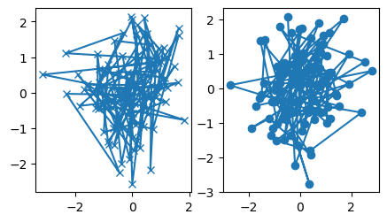

# Matplotlib 入门指南

- [Matplotlib 入门指南](#matplotlib-入门指南)
  - [简介](#简介)
  - [简单示例](#简单示例)
  - [Figure 结构](#figure-结构)
    - [Figure](#figure)
    - [Axes](#axes)
    - [Axis](#axis)
    - [Artist](#artist)
  - [输入数据类型](#输入数据类型)
  - [代码风格](#代码风格)
    - [显式和隐式接口](#显式和隐式接口)
    - [辅助函数](#辅助函数)
  - [设置样式](#设置样式)
    - [颜色](#颜色)
    - [线条和标记属性](#线条和标记属性)
  - [标签](#标签)
    - [Axes 标签和文本](#axes-标签和文本)
    - [文本中使用数学表达式](#文本中使用数学表达式)
    - [注释](#注释)
    - [Legend](#legend)
  - [坐标轴](#坐标轴)
    - [比例尺](#比例尺)
    - [Tick](#tick)
    - [绘制日期和字符串](#绘制日期和字符串)
    - [额外 Axis](#额外-axis)
  - [数据映射颜色](#数据映射颜色)
    - [Colormap](#colormap)
    - [Normalization](#normalization)
    - [Colorbar](#colorbar)
  - [多个 Figure 和 Axes](#多个-figure-和-axes)
  - [参考](#参考)

Last updated: 2022-12-16, 15:44
****

## 简介

下面介绍 Matplotlib 使用的基本模式和最佳实践。

```python
import matplotlib as mpl
import matplotlib.pyplot as plt
import numpy as np
```

## 简单示例

Matplotlib 在 `Figure` 上绘制数据，如 windows, jupyter widgets 等，每个 figure 至少包含一个 `Axes`，Axes 可以理解为坐标系，是绘制数据点的区域，如 x-y 坐标系，极坐标系中的 theta-r，3D 绘图中的 x-y-z 等。创建带一个 `Axes` 的 `Figure` 最简单方式是使用 `pyplot.subplots`。然后使用 `Axes.plot` 在 `Axes` 上绘制数据点：

```python
fig, ax = plt.subplots()  # 创建包含 1 个 axes 的 figure
ax.plot([1, 2, 3, 4], [1, 4, 2, 3])  # 在 axes 上绘制数据
```


## Figure 结构

下图是 Figure 的各个组成部分：


| 模块 | 说明 |
| ---- | --- |
| Figure | 整个区域，一个 figure 可以包含多个 subplots  |
| Subplot | 在一个 `axes` 展示的所有相关内容的区域，为 figure 的子区域，子图等效于 Axes |
| Axis | 坐标轴  |
| Axes | 绘图区域  |
| Spine | 数据区域的边框的四条线  |
| Grid        | 数据区域内的线，方便数值的读取 |
| Title       | figure 标题 |
| Axis labels | 坐标轴标题，最好给出单位  |
| Ticks       | 坐标轴上的刻度，可以有 major ticks 和 minor ticks |
| Tick labels | major 和 minor ticks 都可以标记。除了常规标记，可以指定格式，log 转换以自定义函数格式化标记 |
| Legend      | 图例，为每个数据系列设置的标签  |
| Patches     | 形状，通过 `matplotlib.patches`可以添加矩形、圆形等形状 |

### Figure

`Figure` 表示整个图，为顶层容器，包含：

- 所有子图 `Axes`
- 一组特殊元素：titles, figure legend，色条等
- 画板（canvas）
- 嵌套子 Figure

画板是用于绘制图表的对象，在使用 matplotlib 中几乎不接触。

每个 Figure 可以包含任意数目的 `Axes`，不过为 0 没有意义.

使用 `pyplot` 创建 `Figure` 最简单：

- 创建空 Figure，即没有 Axes

```python
fig = plt.figure()
```

- 创建包含一个 `Axes` 的 `Figure`

```python
fig, ax = plt.subplots()
```


- 创建包含 2x2=4 个 `Axes` 的 `Figure`

```py
fig, axs = plt.subplots(2, 2)
```


可以在创建 `Figure` 时创建 `Axes`，也可以先创建 `Figure`，随后逐渐添加 `Axes`。

### Axes

Axes 是 `Axis` 的复数，两个坐标轴组成一个二维坐标空间，每个平面图都有一个二维坐标空间，所以 matplotlib 干脆使用 `Axes` 表示一个二维图。

即 `Axes` 表示单个图，具有绘图区域及对应的数据空间，`Axes` 具有如下特征：

- 一个 Figure 可以包含多个 `Axes`，但一个 `Axes` 只能属于一个 `Figure`；
- `Axes` 包含 2 个（对 3D 图为 3 个）`Axis` 对象，即坐标轴，包含刻度和刻度标签；
  - 通过 `Axes` 的 `set_xlim()` 和 `set_ylim()` 也可以设置坐标轴范围。
- `Axes` 包含标题 `set_title()`，x 轴标签 `set_xlabel()`和 y 轴标签 `set_ylabel()`、

`Axes` 是 OO 接口最重要的类，大部分绘制工作在 `Axes` 对象上进行。一般通过 `subplot` 函数设置 `Axes`。`Axes` 和 `Subplot` 含义相同。

### Axis

坐标轴，**数值-线**对象，用于生成坐标轴、刻度、标签和值范围等。

- 刻度位置由 `Locator` 设置；
- 刻度标签由 `Formatter` 格式化。

结合使用 `Locator` 和 `Formatter` 可以精细控制刻度位置和标签。

### Artist

`Figure` 上的所有可见元素基本都是 `Artist` (`Figure`, `Axes`, `Axis` 等)，还包括 `Text`, `Line2D`, `collections` 和 `Patch` 对象等。在渲染 `Figure` 时，所有 artists 被绘制到 **canvas**。

大部分 Artists 和 `Axes` 绑定，这些 `Artist` 不能在多个 `Axes` 中共享，也不能从一个 `Axes` 移到另一个。

## 输入数据类型

Matplotlib 的绘图函数支持 `numpy.array` 或 `numpy.ma.masked_array` 类型的输入数据，或者 `numpy.asarray` 支持的对象。类数组（array-like）对象，如 pandas 数据对象以及 `numpy.matrix` 可能无法正常工作。推荐先转换为 `np.array`。例如：

- 将 `pandas.DataFrame` 转换为 `np.array`

```python
a = pandas.DataFrame(np.random.rand(4,5), columns = list('abcde'))
a_asndarray = a.values
```

- 将 `np.matrix` 转换为 `np.array`

```python
b = np.matrix([[1,2],[3,4]])
b_asarray = np.asarray(b)
```

大多数方法还支持**可寻址对象**，如 `dict`, `numpy.recarray` 或者 `pandas.DataFrame`。通过 `data` 关键字参数提供数据，根据变量名称提取数据。

```python
np.random.seed(19680801)
data = {'a': np.arange(50),
        'c': np.random.randint(0, 50, 50),
        'd': np.random.randn(50)}
data['b'] = data['a'] + 10 * np.random.randn(50)
data['d'] = np.abs(data['d']) * 100

fig, ax = plt.subplots(figsize=(5, 2.7), layout='constrained')
ax.scatter('a', 'b', c='c', s='d', data=data)
ax.set_xlabel('entry a')
ax.set_ylabel('entry b')
```


## 代码风格

### 显式和隐式接口

使用 Matplotlib 的方式有两种：

- 显式创建 Figures, Axes，然后调用它们的方法（面向对象风格）；
- 使用 pyplot 函数隐式创建和管理 Figure 和 Axes，使用 pyplot 函数绘图。

pyplot 模块具有当前 figure 和 axes 的概念，所有操作都作用于当前对象。例如，`plt.plot` 创建了子图，随后所有的 `plt.plot` 都添加线条到当前子图。

- OO 实例：

```py
x = np.linspace(0, 2, 100)

# OO 样式也是使用 `pyplot.figure` 创建 figure
fig, ax = plt.subplots()  # 创建 figure 和 axes
ax.plot(x, x, label='linear')
ax.plot(x, x ** 2, label='quadratic')
ax.plot(x, x ** 3, label='cubic')
ax.set_xlabel("x label")
ax.set_ylabel("y label")
ax.set_title("Simple Plot")
ax.legend()
```


- pyplot 实例

```py
x = np.linspace(0, 2, 100)

plt.plot(x, x, label='linear')  # Plot some data on the (implicit) axes.
plt.plot(x, x ** 2, label='quadratic')  # etc.
plt.plot(x, x ** 3, label='cubic')
plt.xlabel('x label')
plt.ylabel('y label')
plt.title("Simple Plot")
plt.legend()
```


> **NOTE** 还有第三种方法，在 GUI 中嵌入 Matplotlib，此时彻底不用 pyplot，包括创建 Figure。具体可参考[在 GUI 中嵌入 Matplotlib](https://matplotlib.org/stable/gallery/user_interfaces/index.html)

第一次调用 `plt.plot` 时自动创建了 figure 和 axes，后面调用 `plt.plot` 则利用前面创建的 axes。设置 title, legend, axis labels 也自动使用当前的 axes。

> OO 风格和 pyplot 的主要差别：OO 风格绘图功能都放在 `Axes` 对象中，而 pyplot 都在 pyplot 中。

Matplotlib 的文档和示例同时使用 OO 和 pyplot 样式：

- 一般来说，推荐使用 OO 风格，特别是复杂的绘图，以及打算作为更大项目的函数和脚本；
- pyplot 风格适合快速交互式。

### 辅助函数

面向对象 API 的最大的好处，就是清晰明了，方便重现和自定义。

如果经常需要绘制相同的图，只是数据不同，此时可以自定义函数，推荐的函数签名：

```python
def my_plotter(ax, data1, data2, param_dict):
    """
    绘图辅助函数
    """
    out = ax.plot(data1, data2, **param_dict)
    return out
```

然后可以重复调用绘制多个图：

```python
data1, data2, data3, data4 = np.random.randn(4, 100)
fig, (ax1, ax2) = plt.subplots(1, 2, figsize=(5, 2.7))
my_plotter(ax1, data1, data2, {'marker': 'x'})
my_plotter(ax2, data3, data4, {'marker': 'o'})
```



## 设置样式

大多数绘图方法都有设置 Artist 样式的选项，可以在调用绘图方法时设置，也可以通过 Artist 的 "setter" 方法设置。例如，在 `plot` 方法中设置 Artist 的颜色、线宽（linewidth）和线条样式，第二个图使用 `set_linestyle` 设置线条样式：

```python
fig, ax = plt.subplots(figsize=(5, 2.7))
x = np.arange(len(data1))
ax.plot(x, np.cumsum(data1), color='blue', linewidth=3, linestyle='--')
l, = ax.plot(x, np.cumsum(data2), color='orange', linewidth=2)
l.set_linestyle(':')
```


### 颜色

Matplotlib 指定颜色的方式非常灵活。有些 Artist 使用多种颜色，例如 `scatter` 图 marker 的边框和内部颜色可以不同：

```python
fig, ax = plt.subplots(figsize=(5, 2.7))
ax.scatter(data1, data2, s=50, facecolor='C0', edgecolor='k')
```


### 线条和标记属性

线条包含线条样式和线宽属性。线宽一般以排版点（point, 1 pt=1/72 inch）为单位。

marker 大小取决于使用的方法。`plot` 以 `pt` 为单位指定 marker 大小，一般为直径或宽度；`scatter` 以相对 marker 可见区域的比例指定 marker 大小。marker 样式可以通过[字符串指定](https://matplotlib.org/stable/api/markers_api.html#module-matplotlib.markers)，也可以[自定义样式](https://matplotlib.org/stable/gallery/lines_bars_and_markers/marker_reference.html)。

```python
fig, ax = plt.subplots(figsize=(5, 2.7))
ax.plot(data1, 'o', label='data1')
ax.plot(data2, 'd', label='data2')
ax.plot(data3, 'v', label='data3')
ax.plot(data4, 's', label='data4')
ax.legend()
```


## 标签

### Axes 标签和文本

`set_xlabel`, `set_ylabel` 和 `set_title` 用于在指定位置添加文本。也可以使用 `text` 直接添加文本：

```python
mu, sigma = 115, 15
x = mu + sigma * np.random.randn(10000)
fig, ax = plt.subplots(figsize=(5, 2.7), layout='constrained')
# the histogram of the data
n, bins, patches = ax.hist(x, 50, density=True, facecolor='C0', alpha=0.75)

ax.set_xlabel('Length [cm]')
ax.set_ylabel('Probability')
ax.set_title('Aardvark lengths\n (not really)')
ax.text(75, .025, r'$\mu=115,\ \sigma=15$')
ax.axis([55, 175, 0, 0.03])
ax.grid(True)
```


`text` 函数返回 `matplotlib.text.Text` 实例。和上面的线图一样，可以加入关键字参数自定义属性：

```python
t = ax.set_xlabel('my data', fontsize=14, color='red')
fig
```


### 文本中使用数学表达式

Matplotlib 在任何文本中都支持 TeX 数学表达式。例如，要在标题中写入 $\sigma_i=15$，可以编写一个由美元符号包围的 TeX 表达式：

```python
ax.set_title(r'$\sigma_i=15$')
```

标题字符串前的 `r` 表示该字符串是原始字符串，不将反斜杠视为 Python 转义。Matplotlib 内置有 TeX 表达式解析器和布局引擎，并自带数学字体，详情可参考[编写数学表达式](https://matplotlib.org/stable/tutorials/text/mathtext.html)。也可以直接使用 LaTeX 格式化文本，并将输出合并到图形，参考[使用 LaTeX 渲染文本](https://matplotlib.org/stable/tutorials/text/usetex.html)。

### 注释

注释图中的数据点，通常包括位于 `xytext` 的文本和指向数据点 `xy` 的箭头组成：

```python
fig, ax = plt.subplots(figsize=(5, 2.7))

t = np.arange(0.0, 5.0, 0.01)
s = np.cos(2 * np.pi * t)
line, = ax.plot(t, s, lw=2)

ax.annotate('local max', xy=(2, 1), xytext=(3, 1.5),
    arrowprops=dict(facecolor='black', shrink=0.05))

ax.set_ylim(-2, 2);
```


在本例中，`xy` 和 `xytext` 都在数据坐标中。也有许多其它坐标系可供选择，详情可参考[基本注释](https://matplotlib.org/stable/tutorials/text/annotations.html#annotations-tutorial)和[高级注释](https://matplotlib.org/stable/tutorials/text/annotations.html#plotting-guide-annotation)。

### Legend

我们经常需要使用 `Axes.legend` 标识线条或 marker：

```python
fig, ax = plt.subplots(figsize=(5, 2.7))
ax.plot(np.arange(len(data1)), data1, label='data1')
ax.plot(np.arange(len(data2)), data2, label='data2')
ax.plot(np.arange(len(data3)), data3, 'd', label='data3')
ax.legend()
```


Matplotlib 中的图例（Legend）在布局、位置等方面非常灵活，详情可参考 [Legend 指南](https://matplotlib.org/stable/tutorials/intermediate/legend_guide.html)。

## 坐标轴

每个 `Axes` 包含两个（或三个）`Axis` 对象，用来表示 x轴 和 y-轴。它们控制坐标轴的缩放、刻度位置、刻度标签格式化等。还可以添加额外的 Axes 以显示更多的 Axis 对象。

### 比例尺

除了线性轴，Matplotlib 还支持非线性坐标轴，如 log-scale。由于对数轴使用很广泛，所以 Matplotlib 提供有现成的方法，如 `loglog`, `semilogx` 和 `semilogy` 等。下面手动设置 scale：

```python
fig, axs = plt.subplots(1, 2, figsize=(5, 2.7), layout='constrained')
xdata = np.arange(len(data1))  # make an ordinal for this
data = 10 ** data1
axs[0].plot(xdata, data)

axs[1].set_yscale('log')
axs[1].plot(xdata, data)
```


Scale 设置数据到 Axis 的映射。

### Tick

每个 `Axis` 都有一个 tick *locator* 和 *formatter*。例如，使用 `set_xticks` 设置 x 轴刻度：

```python
fig, axs = plt.subplots(2, 1, layout='constrained')
axs[0].plot(xdata, data1)
axs[0].set_title('Automatic ticks')

axs[1].plot(xdata, data1)
axs[1].set_xticks(np.arange(0, 100, 30), ['zero', '30', 'sixty', '90'])
axs[1].set_yticks([-1.5, 0, 1.5])  # note that we don't need to specify labels
axs[1].set_title('Manual ticks');
```


不同的 scale 可以有不同的 locator 和 formatter，例如上面的 log-scale 使用 `LogLocator` 和 `LogFormatter`。

### 绘制日期和字符串

Matplotlib 可以处理日期数组和字符串数组，根据需要使用特殊的 locator 和 formatter。对日期：

```py
fig, ax = plt.subplots(figsize=(5, 2.7), layout='constrained')
dates = np.arange(np.datetime64('2021-11-15'), np.datetime64('2021-12-25'),
    np.timedelta64(1, 'h'))
data = np.cumsum(np.random.randn(len(dates)))
ax.plot(dates, data)
cdf = mpl.dates.ConciseDateFormatter(ax.xaxis.get_major_locator())
ax.xaxis.set_major_formatter(cdf)
```


对字符串，进行分类绘制：

```py
fig, ax = plt.subplots(figsize=(5, 2.7), layout='constrained')
categories = ['turnips', 'rutabaga', 'cucumber', 'pumpkins']

ax.bar(categories, np.random.rand(len(categories)))
```


### 额外 Axis

在一张图中绘制不同量级的数据可能需要额外的 y 轴。可以使用 `twinx` 添加一个新的 `Axes`，该 Axes 的 x 轴不可见，y 轴放在右边。

同样，可以使用 `secondary_xaxis` 或 `secondary_yaxis` 添加一个或多个与主 Axis scale 不同的 axis。

```py
fig, (ax1, ax3) = plt.subplots(1, 2, figsize=(7, 2.7), layout='constrained')
l1, = ax1.plot(t, s)
ax2 = ax1.twinx()
l2, = ax2.plot(t, range(len(t)), 'C1')
ax2.legend([l1, l2], ['Sine (left)', 'Straight (right)'])

ax3.plot(t, s)
ax3.set_xlabel('Angle [rad]')
ax4 = ax3.secondary_xaxis('top', functions=(np.rad2deg, np.deg2rad))
ax4.set_xlabel('Angle [°]')
```


## 数据映射颜色

经常需要使用颜色表示第三维数据。Matplotlib 有多种这类图表类型：

```py
X, Y = np.meshgrid(np.linspace(-3, 3, 128), np.linspace(-3, 3, 128))
Z = (1 - X / 2 + X ** 5 + Y ** 3) * np.exp(-X ** 2 - Y ** 2)

fig, axs = plt.subplots(2, 2, layout='constrained')
pc = axs[0, 0].pcolormesh(X, Y, Z, vmin=-1, vmax=1, cmap='RdBu_r')
fig.colorbar(pc, ax=axs[0, 0])
axs[0, 0].set_title('pcolormesh()')

co = axs[0, 1].contourf(X, Y, Z, levels=np.linspace(-1.25, 1.25, 11))
fig.colorbar(co, ax=axs[0, 1])
axs[0, 1].set_title('contourf()')

pc = axs[1, 0].imshow(Z ** 2 * 100, cmap='plasma',
    norm=mpl.colors.LogNorm(vmin=0.01, vmax=100))
fig.colorbar(pc, ax=axs[1, 0], extend='both')
axs[1, 0].set_title('imshow() with LogNorm()')

pc = axs[1, 1].scatter(data1, data2, c=data3, cmap='RdBu_r')
fig.colorbar(pc, ax=axs[1, 1], extend='both')
axs[1, 1].set_title('scatter()')
```


### Colormap

这些都是从 `ScalarMappable` 对象派生的 Artists。它们都可以设置 `vmin` 和 `vmax` 到 `cmap` 指定的 colormap。

Matplotlib 提供了而[许多 colormap](https://matplotlib.org/stable/tutorials/colors/colormaps.html)，也可以[自定义 colormap](https://matplotlib.org/stable/tutorials/colors/colormap-manipulation.html)，或下载[第三方包](https://matplotlib.org/mpl-third-party/#colormaps-and-styles)。

### Normalization

如果需要将数据非线性映射到 colormap，使用 `ScalarMappable` 的 `norm` 参数而不是上面的 `vmin` 和 `vmax`。详情可参考 [Colormap Normalization](https://matplotlib.org/stable/tutorials/colors/colormapnorms.html)。

### Colorbar

colorbar 展示颜色与数据之间的关联。colorbar 是 figure-level 的 Artist，与 `ScalarMappable` 绑定，并从父 Axes 获得空间。放置 colorbar 很复杂，详情可参考 [Placing Colorbars](https://matplotlib.org/stable/gallery/subplots_axes_and_figures/colorbar_placement.html)。

可以用 `extend` 关键字修饰 colorbar 的外观（在末端添加箭头），使用 `shrink` 和 `aspect` 设置大小。最后，colorbar 带有合适的 locator 和 formatte，设置方法与 Axis 一样。

## 多个 Figure 和 Axes

多次调用 `fig = plt.figure()` 或 `fig2, ax = plt.subplots()` 可以创建多个 Figures。保存 `Figure` 对象引用，可以为每个 `Figure` 添加 Artists。

添加多个 `Axes` 的方法有多种，`plt.subplots()` 是最基本。使用 `subplot_mosaic` 可以创建更复杂的布局。

```py
fig, axd = plt.subplot_mosaic([['upleft', 'right'],
                               ['lowleft', 'right']], layout='constrained')
axd['upleft'].set_title('upleft')
axd['lowleft'].set_title('lowleft')
axd['right'].set_title('right')
```


## 参考

- https://matplotlib.org/stable/tutorials/introductory/quick_start.html
