# Axes

- [Axes](#axes)
  - [简介](#%e7%ae%80%e4%bb%8b)
  - [对数坐标轴（Logaritmic Axes）](#%e5%af%b9%e6%95%b0%e5%9d%90%e6%a0%87%e8%bd%b4logaritmic-axes)
    - [log in px](#log-in-px)
    - [log in go](#log-in-go)
  - [坐标轴转换为 categorical 类型](#%e5%9d%90%e6%a0%87%e8%bd%b4%e8%bd%ac%e6%8d%a2%e4%b8%ba-categorical-%e7%b1%bb%e5%9e%8b)
    - [Subcategory (Multicategory) Axes](#subcategory-multicategory-axes)
  - [坐标轴属性](#%e5%9d%90%e6%a0%87%e8%bd%b4%e5%b1%9e%e6%80%a7)
  - [刻度](#%e5%88%bb%e5%ba%a6)
    - [添加刻度（tick mark）](#%e6%b7%bb%e5%8a%a0%e5%88%bb%e5%ba%a6tick-mark)
    - [刻度数据](#%e5%88%bb%e5%ba%a6%e6%95%b0%e6%8d%ae)
    - [起始刻度位置和刻度之间的距离](#%e8%b5%b7%e5%a7%8b%e5%88%bb%e5%ba%a6%e4%bd%8d%e7%bd%ae%e5%92%8c%e5%88%bb%e5%ba%a6%e4%b9%8b%e9%97%b4%e7%9a%84%e8%b7%9d%e7%a6%bb)
    - [自定义刻度位置](#%e8%87%aa%e5%ae%9a%e4%b9%89%e5%88%bb%e5%ba%a6%e4%bd%8d%e7%bd%ae)
    - [刻度样式](#%e5%88%bb%e5%ba%a6%e6%a0%b7%e5%bc%8f)
    - [刻度标签](#%e5%88%bb%e5%ba%a6%e6%a0%87%e7%ad%be)
    - [刻度标签旋转角度和字体](#%e5%88%bb%e5%ba%a6%e6%a0%87%e7%ad%be%e6%97%8b%e8%bd%ac%e8%a7%92%e5%ba%a6%e5%92%8c%e5%ad%97%e4%bd%93)
    - [枚举所有刻度](#%e6%9e%9a%e4%b8%be%e6%89%80%e6%9c%89%e5%88%bb%e5%ba%a6)
  - [网格线和零线](#%e7%bd%91%e6%a0%bc%e7%ba%bf%e5%92%8c%e9%9b%b6%e7%ba%bf)
    - [开关网格线](#%e5%bc%80%e5%85%b3%e7%bd%91%e6%a0%bc%e7%ba%bf)
    - [开关零线](#%e5%bc%80%e5%85%b3%e9%9b%b6%e7%ba%bf)
    - [使用 update axis 方法设置](#%e4%bd%bf%e7%94%a8-update-axis-%e6%96%b9%e6%b3%95%e8%ae%be%e7%bd%ae)
    - [禁用 Express 创建的 figure 的网格线及零线](#%e7%a6%81%e7%94%a8-express-%e5%88%9b%e5%bb%ba%e7%9a%84-figure-%e7%9a%84%e7%bd%91%e6%a0%bc%e7%ba%bf%e5%8f%8a%e9%9b%b6%e7%ba%bf)
    - [轴线](#%e8%bd%b4%e7%ba%bf)
    - [坐标轴线镜像](#%e5%9d%90%e6%a0%87%e8%bd%b4%e7%ba%bf%e9%95%9c%e5%83%8f)
    - [网格线样式](#%e7%bd%91%e6%a0%bc%e7%ba%bf%e6%a0%b7%e5%bc%8f)
    - [零线样式](#%e9%9b%b6%e7%ba%bf%e6%a0%b7%e5%bc%8f)
  - [轴标题](#%e8%bd%b4%e6%a0%87%e9%a2%98)
    - [轴标题文本](#%e8%bd%b4%e6%a0%87%e9%a2%98%e6%96%87%e6%9c%ac)
    - [轴标题位置](#%e8%bd%b4%e6%a0%87%e9%a2%98%e4%bd%8d%e7%bd%ae)
    - [轴标题字体](#%e8%bd%b4%e6%a0%87%e9%a2%98%e5%ad%97%e4%bd%93)
  - [坐标轴尺寸](#%e5%9d%90%e6%a0%87%e8%bd%b4%e5%b0%ba%e5%af%b8)
    - [坐标轴范围](#%e5%9d%90%e6%a0%87%e8%bd%b4%e8%8c%83%e5%9b%b4)
    - [固定比例](#%e5%9b%ba%e5%ae%9a%e6%af%94%e4%be%8b)
  - [xaxis](#xaxis)
    - [visible](#visible)
  - [yaxis](#yaxis)
    - [`automargin`](#automargin)
  - [References](#references)

2020-04-18, 16:18
***

## 简介

下面介绍如何调整坐标轴。包括线性、对数坐标，以及坐标轴标题、样式、颜色、网格线等等。

下面介绍笛卡尔坐标系的坐标轴，即 `go.layout.XAxis` 和 `go.layout.YAxis`。

笛卡尔坐标系的类型有：

- linear
- log
- date
- category
- multicategory

## 对数坐标轴（Logaritmic Axes）

设置 axis 的属性 `type='log'`，坐标轴的刻度按照对数增长。

### log in px

[例如](../src/plotly_test/axes_log.py)：

```py
import numpy as np
import plotly.express as px

x = np.arange(10)
fig = px.scatter(x=x, y=x ** 3, log_x=True, log_y=True)
fig.show()
```

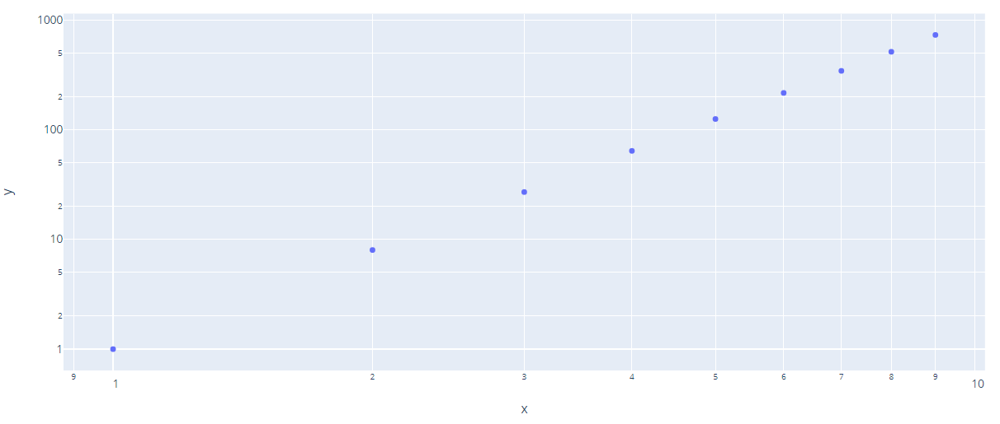

### log in go

[例如](../src/plotly_test/axes_log_go.py)

```py
import plotly.graph_objects as go

fig = go.Figure(data=[
    go.Scatter(
        x=[1, 10, 20, 30, 40, 50, 60, 70, 80],
        y=[80, 70, 60, 50, 40, 30, 20, 10, 1]
    ),
    go.Scatter(
        x=[1, 10, 20, 30, 40, 50, 60, 70, 80],
        y=[1, 10, 20, 30, 40, 50, 60, 70, 80]
    )
])

fig.update_xaxes(type='log')
fig.update_yaxes(type='log')
fig.show()
```

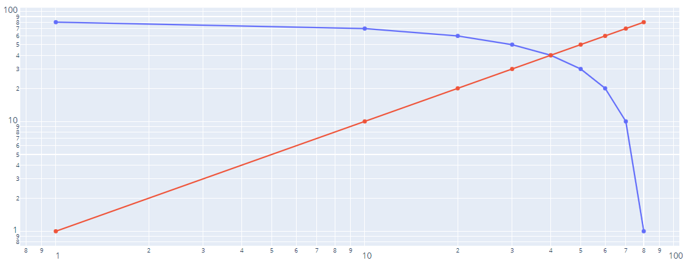

## 坐标轴转换为 categorical 类型

如果 `x` 和 `y` 参数值为字符串，plotly 会自动将对应轴设置为 category 类型，但是不能是数字字符串，此时坐标轴为 `linear` 类型。

可以通过设置 `xaxis_type=category` 强制[设置坐标轴类型](../src/plotly_test/axis_type.py)：

```py
import plotly.express as px

fig = px.bar(x=[1, 2, 4, 10], y=[8, 6, 11, 5])
fig.update_layout(xaxis_type='category',
                  title_text="Bar chart with categorical axes")
fig.show()
```


### Subcategory (Multicategory) Axes

将 `x` 或 `y` 设置为二维列表，第一个列表为外部分类值，第二个列表为内部分类值。

下面创建一个包含 4 个水平 `box` trace 的图表，y 轴为二维分类：

```py
import plotly.graph_objects as go

fig = go.Figure()

fig.add_trace(go.Box(
    x=[2, 3, 1, 5],
    y=[['First', 'First', 'First', 'First'],
       ["A", "A", "A", "A"]],
    name="A",
    orientation="h"
))

fig.add_trace(go.Box(
    x=[8, 3, 6, 5],
    y=[['First', 'First', 'First', 'First'],
       ["B", "B", "B", "B"]],
    name="B",
    orientation="h"
))

fig.add_trace(go.Box(
    x=[2, 3, 2, 5],
    y=[['Second', 'Second', 'Second', 'Second'],
       ["C", "C", "C", "C"]],
    name="C",
    orientation="h"
))

fig.add_trace(go.Box(
    x=[7.5, 3, 6, 4],
    y=[['Second', 'Second', 'Second', 'Second'],
       ["D", "D", "D", "D"]],
    name="D",
    orientation="h"
))

fig.update_layout(title_text="Multi-category axis", )

fig.show()
```

"first", "second" 为第一维，为外面的分类；"A", "B", "C", "D" 第二维，内部的分类。

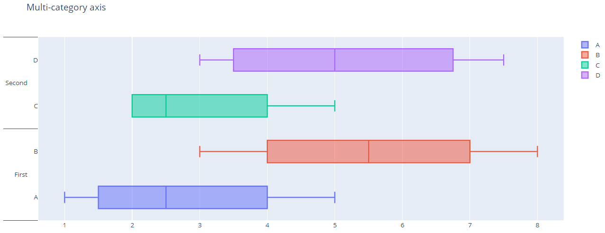

## 坐标轴属性

笛卡尔坐标系坐标轴属性：

- 刻度值（tick value）为刻度标记 (tick mark) 的位置，刻度标签（tick label）放在刻度值处
- lines: 网格线（穿过刻度值）、轴线和零线
- 坐标轴标题
- 坐标轴范围
- domain of axis

## 刻度

### 添加刻度（tick mark）

plotly 的默认主题不显示刻度，将坐标轴的 `ticks` 属性设置为 `"inside"` 或 `"outside"` 显示刻度，对应的标记在轴的里面或外面。

下面[以 Express 创建 figure](../src/plotly_test/axes_tick_px.py)。注意其中的 `update_yaxes` 的 `col` 参数用于选择启用刻度的坐标轴。

```py
import plotly.express as px
df = px.data.iris()

fig = px.scatter(df, x="sepal_width", y="sepal_length", facet_col="species")
fig.update_xaxes(ticks="inside")
fig.update_yaxes(ticks="inside", col=1)

fig.show()
```

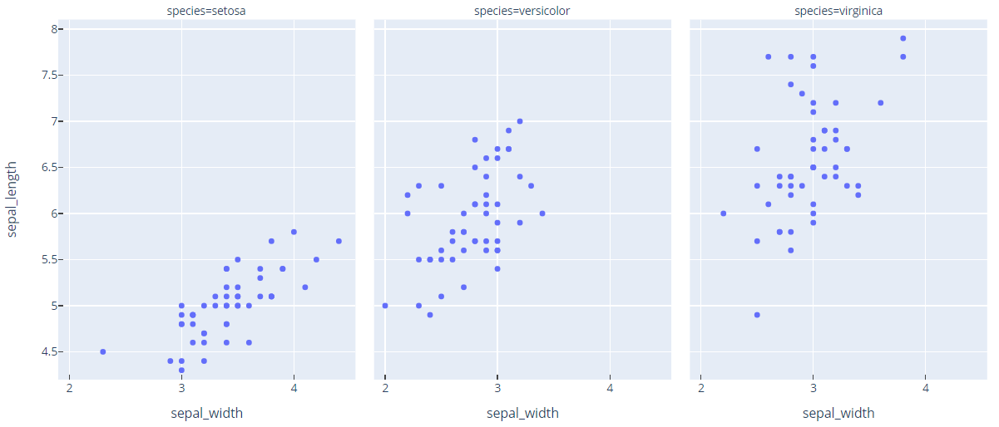

### 刻度数据

使用 `nticks` 属性设置刻度数目。网格线和刻度的数目相同。

下面以 Express 创建一个 figure，刻度数目设置为20：

```py
import plotly.express as px
df = px.data.iris()

fig = px.scatter(df, x="sepal_width", y="sepal_length", facet_col="species")
fig.update_yaxes(nticks=20)

fig.show()
```

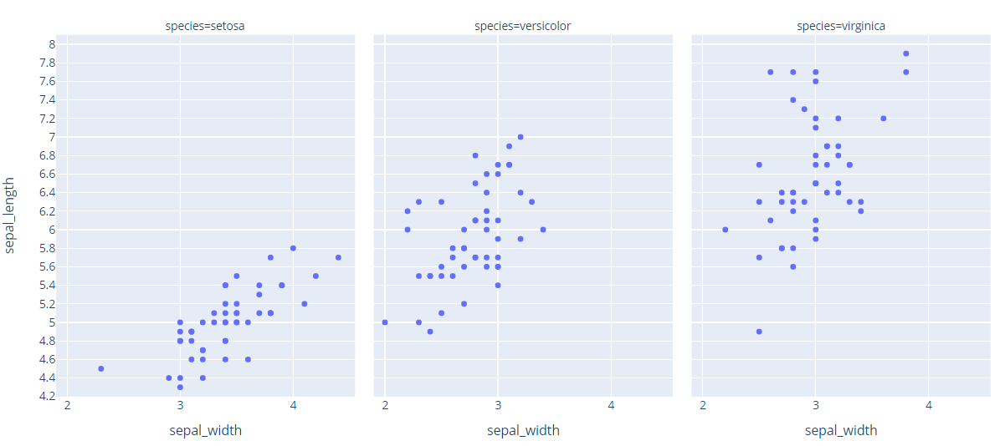

### 起始刻度位置和刻度之间的距离

`tick0` 为刻度的起始位置，即第一个刻度放在该位置，`dtick` 指定刻度之间的距离。

例如，将起始刻度的位置设置为 0.25，刻度之间的距离设置为 0.5:

```py
import plotly.express as px
df = px.data.iris()

fig = px.scatter(df, x="sepal_width", y="sepal_length", facet_col="species")
fig.update_yaxes(tick0=0.25, dtick=0.5)

fig.show()
```

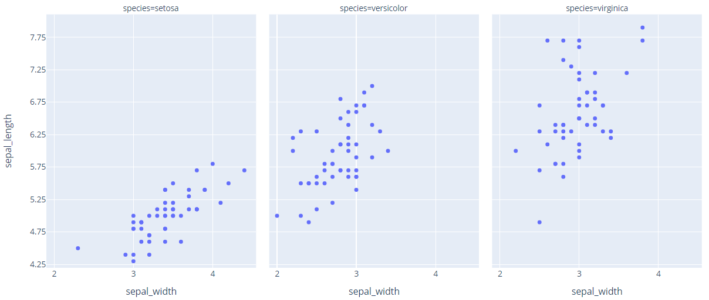

可以看到起始刻度没有显示，不过确保了每个刻度的值。

### 自定义刻度位置

通过 `tickvals` 属性可以设置刻度标记的准确位置。例如：

```py
import plotly.express as px
df = px.data.iris()

fig = px.scatter(df, x="sepal_width", y="sepal_length", facet_col="species")
fig.update_yaxes(tickvals=[5.1, 5.9, 6.3, 7.5])

fig.show()
```

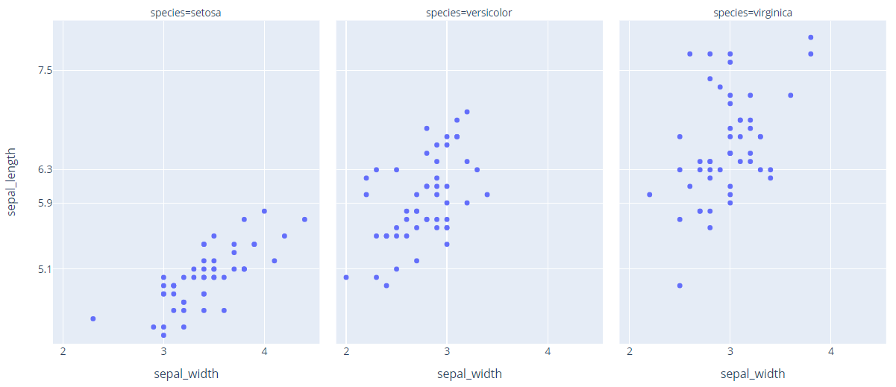

### 刻度样式

默认主题 `plotly` 不显示刻度，可以通过设置 `ticks` 属性为 `"inside"` 或 `"outside"` 显示刻度。

显示的刻度可以设置长度 `ticklen`，宽度 `tickwidth`和颜色 `tickcolor`。

下面创建一个 faceted figure，显示并设置刻度的样式。同上, `update_yaxes`的`col` 参数用于选择显示刻度的坐标轴：

```py
import plotly.express as px
df = px.data.iris()

fig = px.scatter(df, x="sepal_width", y="sepal_length", facet_col="species")
fig.update_xaxes(ticks="outside", tickwidth=2, tickcolor='crimson', ticklen=10)
fig.update_yaxes(ticks="outside", tickwidth=2, tickcolor='crimson', ticklen=10, col=1)

fig.show()
```

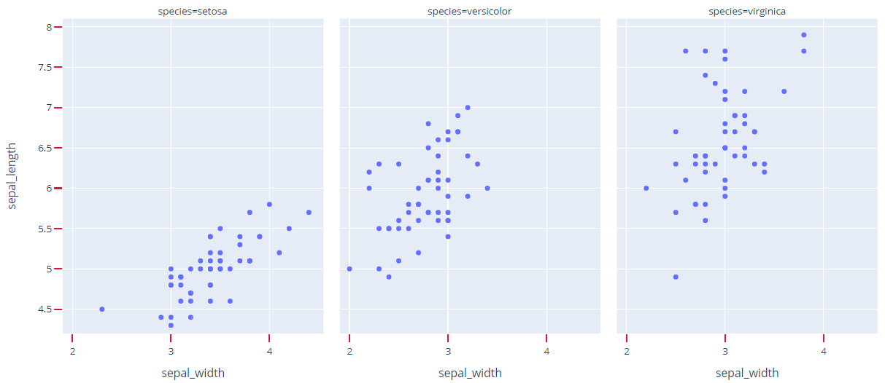

### 刻度标签

设置 `showticklabels=False` 可以禁用刻度标签。

例如，下面创建一个 faceted figure，禁用其刻度标签：

```py
import plotly.express as px
df = px.data.iris()

fig = px.scatter(df, x="sepal_width", y="sepal_length", facet_col="species")
fig.update_xaxes(showticklabels=False)
fig.update_yaxes(showticklabels=False)

fig.show()
```

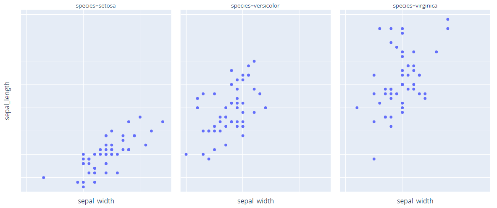

### 刻度标签旋转角度和字体

`tickangle` 属性设置刻度标签旋转的角度。`tickangle` 是顺时针旋转的度数（如90度）。

刻度标签的字体、字体大小及字体颜色在 `tickfont` 属性中设置。

下面创建一个 faceted histogram figure，x 轴的刻度标签旋转 45°，并自定义字体：

```py
import plotly.express as px
df = px.data.tips()

fig = px.histogram(df, x="sex", y="tip", histfunc='sum', facet_col='smoker')
fig.update_xaxes(tickangle=45, tickfont=dict(family='Rockwell', color='crimson', size=14))

fig.show()
```

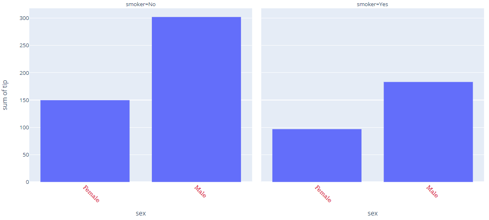

### 枚举所有刻度

结合 `tickvals` 和 `ticktext` 属性可以自定义刻度位置及文本。两个属性列表长度必须相同：

- `tickvals` 包含刻度位置列表
- `ticktext` 包含刻度标签列表

例如：

```py
import plotly.graph_objects as go
import pandas as pd

# Load and filter Apple stock data for 2016
apple_df = pd.read_csv(
    "https://raw.githubusercontent.com/plotly/datasets/master/finance-charts-apple.csv",
    parse_dates=["Date"],
    index_col="Date"
)

apple_df_2016 = apple_df["2016"]

# Create figure and add line
fig = go.Figure()
fig.add_trace(go.Scatter(
    x=apple_df_2016.index,
    y=apple_df_2016["AAPL.High"],
    mode="lines"
))

# 自定义 x 轴的刻度标签
fig.update_xaxes(
    ticktext=["End of Q1", "End of Q2", "End of Q3", "End of Q4"],
    tickvals=["2016-04-01", "2016-07-01", "2016-10-01", apple_df_2016.index.max()],
)

# Prefix y-axis tick labels with dollar sign
fig.update_yaxes(tickprefix="$")

# Set figure title
fig.update_layout(title_text="Apple Stock Price")

fig.show()
```

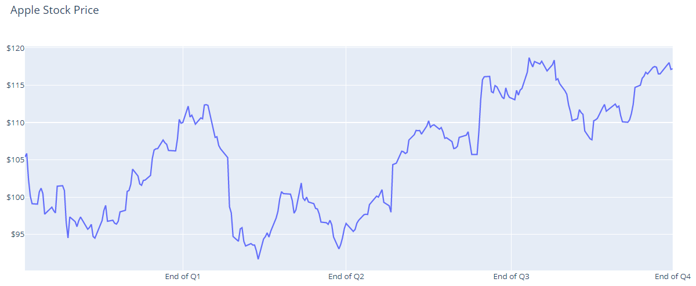

## 网格线和零线

### 开关网格线

默认显示网格线，通过 `showgrid` 属性可以开、关网格线。

例如，下面移除网格线：

```py
import plotly.express as px

fig = px.line(y=[1, 0])
fig.update_layout(xaxis_showgrid=False, yaxis_showgrid=False)
fig.show()
```


### 开关零线

默认有一条线通过坐标轴零位置，可以通过 `zeroline=False` 禁用零线。

```py
import plotly.express as px

fig = px.line(y=[1, 0])

fig.update_layout(
    xaxis=dict(showgrid=False, zeroline=False),
    yaxis=dict(showgrid=False, zeroline=False),
)
fig.show()
```

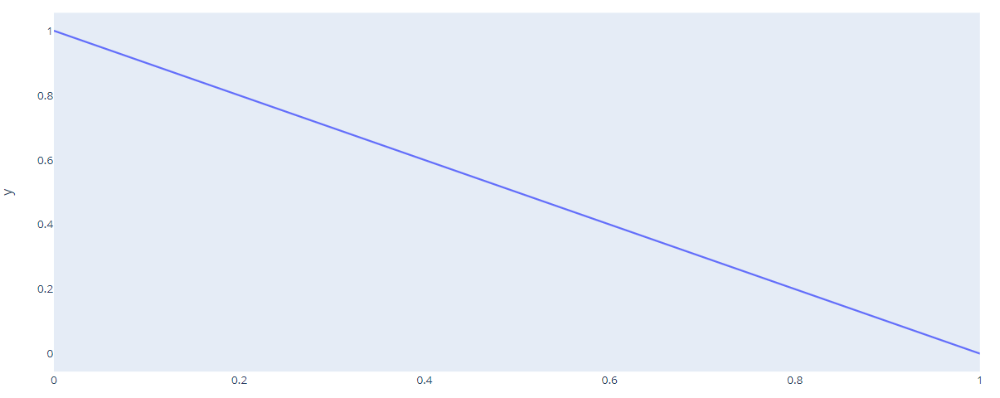

### 使用 update axis 方法设置

创建 figure 对象后，可以使用其 `update_xaxes` 和 `update_yaxes` 开关网格线和零线。

下面使用 `update_xaxes` 和 `update_yaxes` 方法禁用网格线和零线：

```py
import plotly.express as px

fig = px.line(y=[1, 0])
fig.update_xaxes(showgrid=False, zeroline=False)
fig.update_yaxes(showgrid=False, zeroline=False)

fig.show()
```


### 禁用 Express 创建的 figure 的网格线及零线

`update_xaxis` 和 `update_yaxis` 的优点是它们默认应用于 figure 中的所有 axes。这对自定义 Express, `make_subplots`, figure factory 等方法创建的 figure 很有用。

例如，下面使用 express 创建 faceted figure，然后禁用其网格线和零线：

```py
import plotly.express as px
df = px.data.iris()

fig = px.scatter(df, x="sepal_width", y="sepal_length", facet_col="species")
fig.update_xaxes(showgrid=False, zeroline=False)
fig.update_yaxes(showgrid=False, zeroline=False)

fig.show()
```

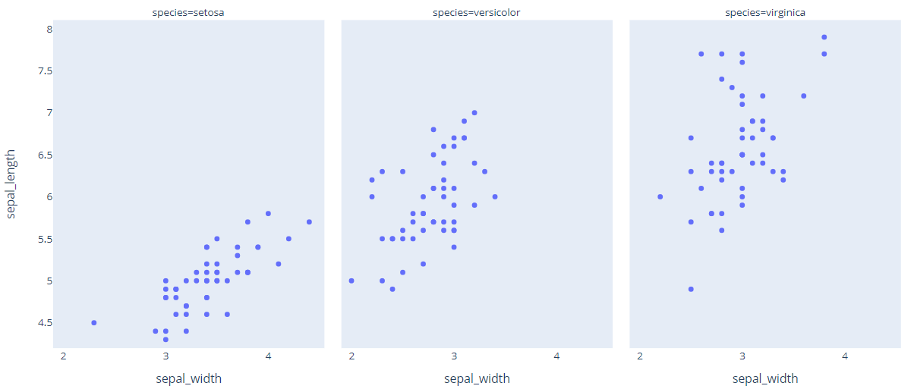

### 轴线

`showline` 设置坐标轴线的可见性。

`linecolor` 设置坐标轴的颜色。

`linewidth` 设置坐标轴线条宽度。

下面创建一个 histogram，设置坐标轴可见，自定义宽度和颜色：

```py
import plotly.express as px
df = px.data.tips()

fig = px.histogram(df, x="sex", y="tip", histfunc='sum', facet_col='smoker')
fig.update_xaxes(showline=True, linewidth=2, linecolor='black')
fig.update_yaxes(showline=True, linewidth=2, linecolor='black')

fig.show()
```

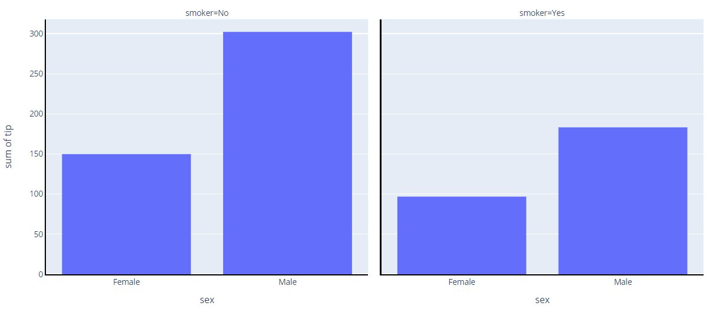

### 坐标轴线镜像

将 `mirror=True`，将坐标轴线镜像到绘图区域的另一侧。

例如，创建一个 faceted histogram，将 x 和 y 轴线镜像到另一侧：

```py
import plotly.express as px
df = px.data.tips()

fig = px.histogram(df, x="sex", y="tip", histfunc='sum', facet_col='smoker')
fig.update_xaxes(showline=True, linewidth=2, linecolor='black', mirror=True)
fig.update_yaxes(showline=True, linewidth=2, linecolor='black', mirror=True)

fig.show()
```

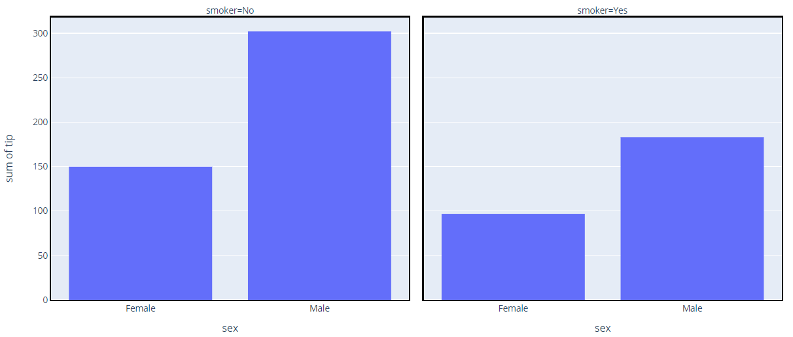

这样上下左右就都有线条，且属性相同。

### 网格线样式

`gridwidth` 设置网格线宽度。

`gridcolor` 设置网格线颜色。

例如，创建一个 faceted scatter plot，个性化网格线：

```py
import plotly.express as px
df = px.data.iris()

fig = px.scatter(df, x="sepal_width", y="sepal_length", facet_col="species")
fig.update_xaxes(showgrid=True, gridwidth=1, gridcolor='LightPink')
fig.update_yaxes(showgrid=True, gridwidth=1, gridcolor='LightPink')

fig.show()
```

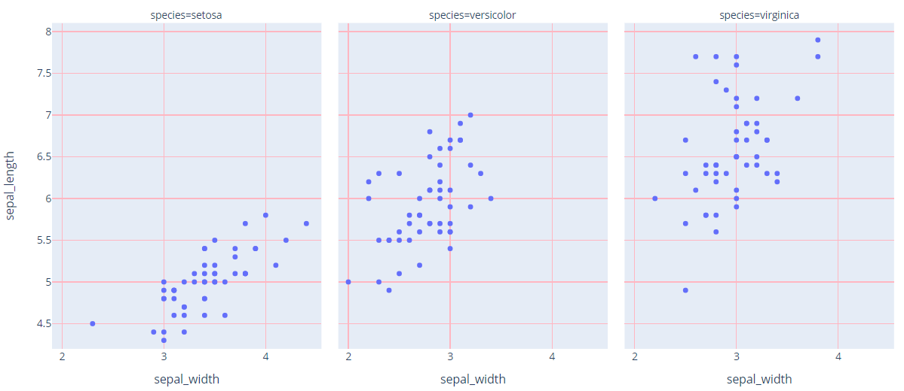

### 零线样式

`zerolinewidth` 和 `zerolinecolor` 分别设置零线宽度和颜色。

例如：

```py
import plotly.express as px

fig = px.line(y=[1, 0])

fig.update_xaxes(zeroline=True, zerolinewidth=2, zerolinecolor='LightPink')
fig.update_yaxes(zeroline=True, zerolinewidth=2, zerolinecolor='LightPink')

fig.show()
```

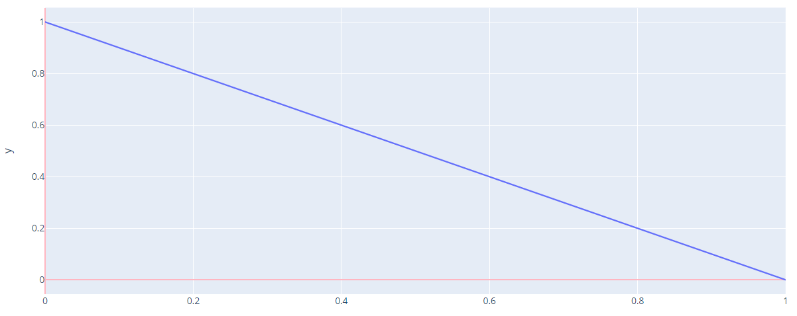

## 轴标题

### 轴标题文本

`title.text` 对应标题文本。

下面通过 magic 下划线方式设置标题内容：

```py
import plotly.express as px

fig = px.line(y=[1, 0])

fig.update_xaxes(title_text='Time')
fig.update_yaxes(title_text='Value A')

fig.show()
```

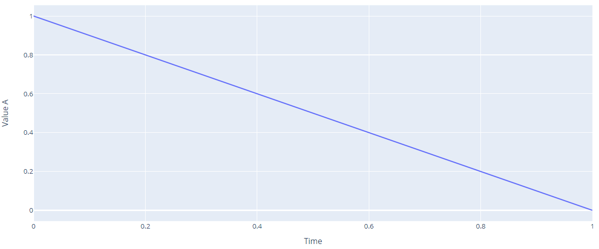

### 轴标题位置

笛卡尔坐标系中坐标轴的`standoff` （间距）属性设置刻度标签和标题之间的距离。

轴标题始终限制在边距中，所以间距 `standoff` 的实际值总是小于设置值。

plotly 模板的 `automargin` 在笛卡尔坐标系中默认为 `True`，所以在指定 `standoff` 下，将增加边距（margin）以满足轴标题。

```py
import plotly.graph_objects as go

fig = go.Figure(go.Scatter(
    mode = "lines+markers",
    y = [4, 1, 3],
    x = ["December", "January", "February"]))

fig.update_layout(
    xaxis = dict(
        tickangle = 90,
        title_text = "Month",
        title_font = {"size": 20},
        title_standoff = 25),
    yaxis = dict(
        title_text = "Temperature",
        title_standoff = 25))

fig.show()
```

`tickangle=90` 旋转刻度标签，从而增大了刻度标签占据的位置。

`title_text` 设置标题文本。

`title_standoff` 设置了轴标题和刻度标签之间的间距。

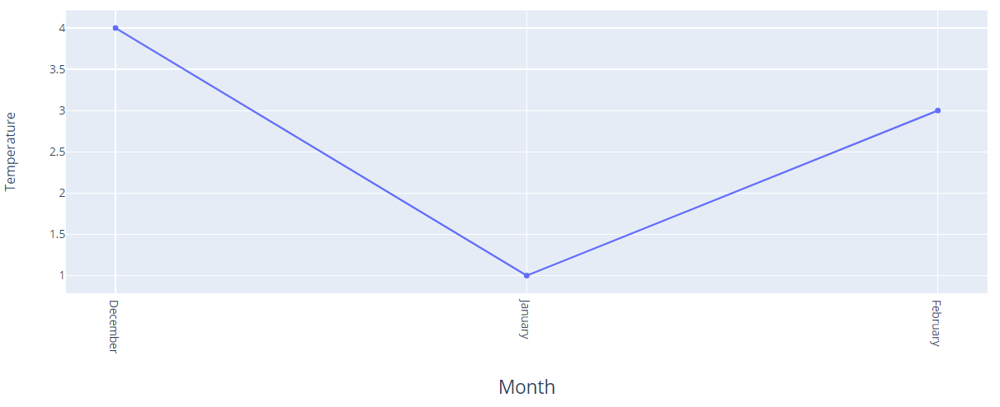

### 轴标题字体

例如，设置轴标题字体、大小、颜色：

```py
import plotly.express as px
df = px.data.iris()

fig = px.scatter(df, x="sepal_width", y="sepal_length", facet_col="species")
fig.update_xaxes(title_font=dict(size=18, family='Courier', color='crimson'))
fig.update_yaxes(title_font=dict(size=18, family='Courier', color='crimson'))

fig.show()
```

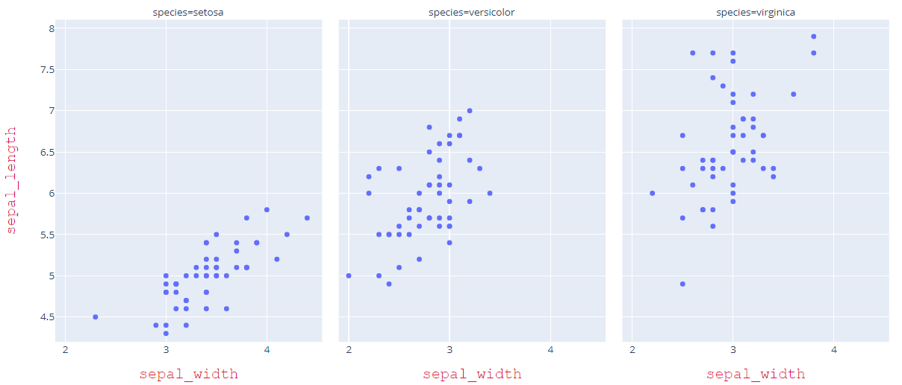

## 坐标轴尺寸

### 坐标轴范围

坐标轴的 `range` 属性通过包含两个值的 list 设置可见范围。

```py
import plotly.express as px
df = px.data.iris()

fig = px.scatter(df, x="sepal_width", y="sepal_length", facet_col="species")
fig.update_xaxes(range=[1.5, 4.5])
fig.update_yaxes(range=[3, 9])

fig.show()
```

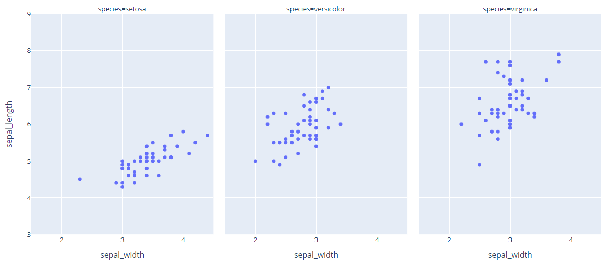

### 固定比例

`scaleanchor` 和 `scaleratio` 属性可以固定两个坐标轴单位数值内的像素比例。

例如，下面将 x 和 y 轴的 scale 比例设置为 1。

```py
import plotly.graph_objects as go

fig = go.Figure()

fig.add_trace(go.Scatter(
    x = [0,1,1,0,0,1,1,2,2,3,3,2,2,3],
    y = [0,0,1,1,3,3,2,2,3,3,1,1,0,0]
))

fig.update_layout(
    width = 800,
    height = 500,
    title = "fixed-ratio axes",
    yaxis = dict(
      scaleanchor = "x",
      scaleratio = 1,
    )
)

fig.show()
```

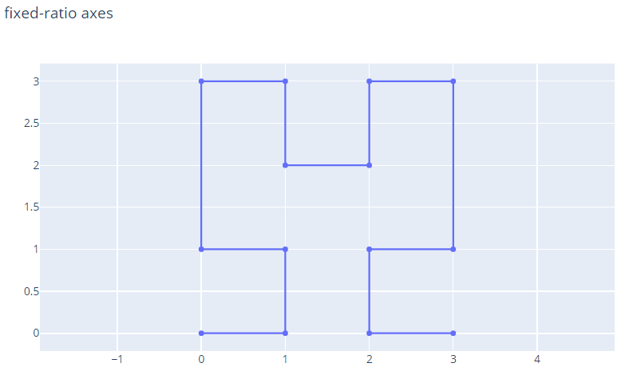

## xaxis

`layout`

### visible

`layout.xaxis`

Type: boolean

隐藏坐标轴。

当 axis 上有 cheater plot，默认为 True，否则默认为 False。

## yaxis

### `automargin`

`layout.yaxis`

Type: boolean

刻度标签很长时，是否自动增加 margins 以容纳标签。

这间接说明刻度标签放在 margin 区域。

## References

- [https://plotly.com/python/axes/](https://plotly.com/python/axes/)
