# Legend

- [Legend](#legend)
  - [Show Legend](#show-legend)
  - [Hide Legend](#hide-legend)
  - [Hide Legend Entries](#hide-legend-entries)
  - [Legend Names](#legend-names)
  - [Legend titles](#legend-titles)
  - [Horizontal Legend](#horizontal-legend)
  - [Legend Position](#legend-position)
  - [Style Legend](#style-legend)
  - [Hide the Trace Implicitly](#hide-the-trace-implicitly)
  - [Size of Legend Items](#size-of-legend-items)
  - [Grouped Legend](#grouped-legend)
  - [Legend items for continuous fields](#legend-items-for-continuous-fields)
  - [API](#api)
    - [title](#title)

2020-05-19, 14:13
***

## Show Legend

在包含多个 traces 的 charts 中默认显示 legend。

```py
import plotly.graph_objects as go

fig = go.Figure()

fig.add_trace(go.Scatter(
    x=[1, 2, 3, 4, 5],
    y=[1, 2, 3, 4, 5],
))

fig.add_trace(go.Scatter(
    x=[1, 2, 3, 4, 5],
    y=[5, 4, 3, 2, 1],
))

fig.show()
```

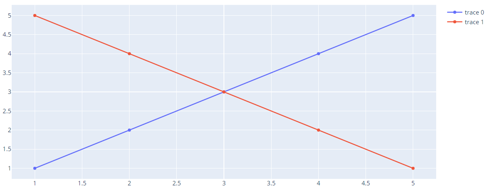

可以发现，如果没有设置，默认 legend 名称为 `trace {index}`。

如果只包含一个 trace，可以使用`layout` 对象的 `showlegend=True` 显示 legend.

```py
fig = go.Figure()

fig.add_trace(go.Scatter(
    x=[1, 2, 3, 4, 5],
    y=[1, 2, 3, 4, 5],
))

fig.update_layout(showlegend=True)

fig.show()
```

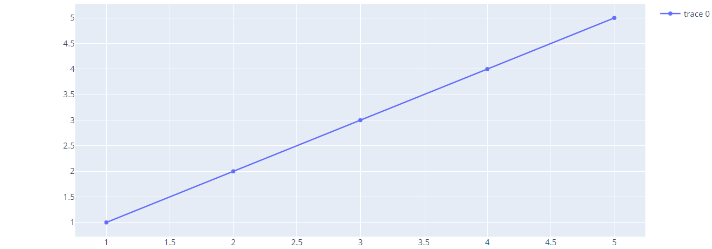

## Hide Legend

```py
import plotly.graph_objects as go

fig = go.Figure()

fig.add_trace(go.Scatter(
    x=[1, 2, 3, 4, 5],
    y=[1, 2, 3, 4, 5],
))

fig.add_trace(go.Scatter(
    x=[1, 2, 3, 4, 5],
    y=[5, 4, 3, 2, 1],
))

fig.update_layout(showlegend=False)

fig.show()
```

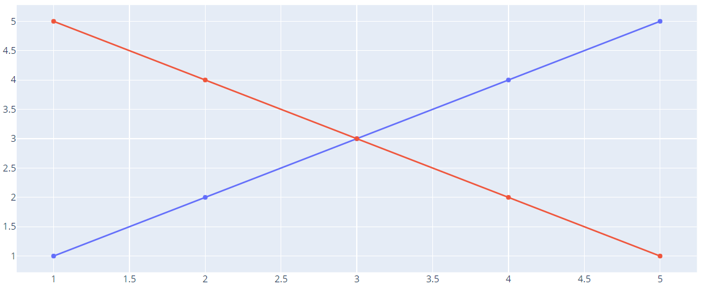

## Hide Legend Entries

```py
import plotly.graph_objects as go

fig = go.Figure()
fig.add_trace(go.Scatter(
    x=[1, 2, 3, 4, 5],
    y=[1, 2, 3, 4, 5],
    showlegend=False
))
fig.add_trace(go.Scatter(
    x=[1, 2, 3, 4, 5],
    y=[5, 4, 3, 2, 1],
))

fig.update_layout(showlegend=True)

fig.show()
```

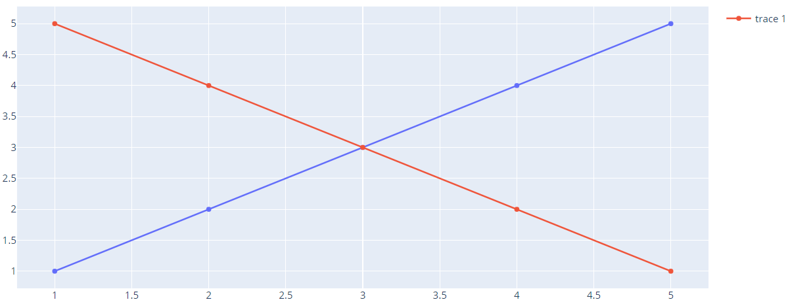

## Legend Names

```py
import plotly.graph_objects as go

fig = go.Figure()

fig.add_trace(go.Scatter(
    x=[1, 2, 3, 4, 5],
    y=[1, 2, 3, 4, 5],
    name="Positive"
))

fig.add_trace(go.Scatter(
    x=[1, 2, 3, 4, 5],
    y=[5, 4, 3, 2, 1],
    name="Negative"
))

fig.show()
```

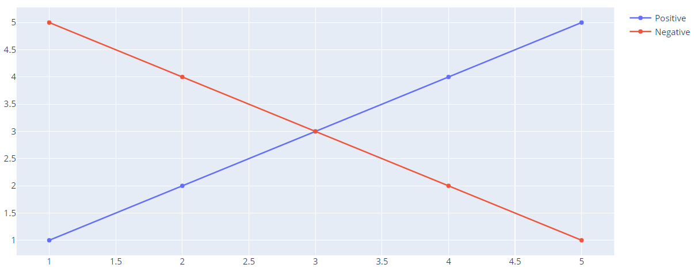

## Legend titles

```py
import plotly.graph_objects as go

fig = go.Figure()

fig.add_trace(go.Scatter(
    x=[1, 2, 3, 4, 5],
    y=[1, 2, 3, 4, 5],
    name="Increasing"
))

fig.add_trace(go.Scatter(
    x=[1, 2, 3, 4, 5],
    y=[5, 4, 3, 2, 1],
    name="Decreasing"
))

fig.update_layout(legend_title='<b> Trend </b>')
fig.show()
```

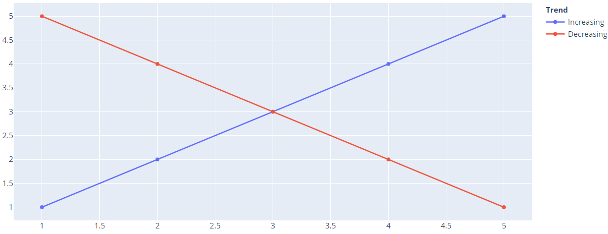

## Horizontal Legend

```py
import plotly.graph_objects as go

fig = go.Figure()

fig.add_trace(go.Scatter(
    x=[1, 2, 3, 4, 5],
    y=[1, 2, 3, 4, 5],
))

fig.add_trace(go.Scatter(
    x=[1, 2, 3, 4, 5],
    y=[5, 4, 3, 2, 1],
))

fig.update_layout(legend_orientation="h")

fig.show()
```


## Legend Position

```py
import plotly.graph_objects as go

fig = go.Figure()

fig.add_trace(go.Scatter(
    x=[1, 2, 3, 4, 5],
    y=[1, 2, 3, 4, 5],
))

fig.add_trace(go.Scatter(
    x=[1, 2, 3, 4, 5],
    y=[5, 4, 3, 2, 1],
))

fig.update_layout(legend=dict(x=-.1, y=1.2))

fig.show()
```

x 范围 [-2, 3]，用于设置 legend 的水平位置。

- 对垂直 legend，默认为 1.02
- 对水平 legend，默认为 0

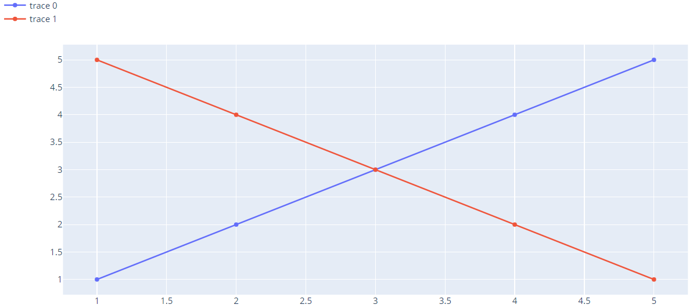

## Style Legend

```py
import plotly.graph_objects as go

fig = go.Figure()

fig.add_trace(go.Scatter(
    x=[1, 2, 3, 4, 5],
    y=[1, 2, 3, 4, 5],
))

fig.add_trace(go.Scatter(
    x=[1, 2, 3, 4, 5],
    y=[5, 4, 3, 2, 1],
))

fig.update_layout(
    legend=dict(
        x=0,
        y=1,
        traceorder="normal",
        font=dict(
            family="sans-serif",
            size=12,
            color="black"
        ),
        bgcolor="LightSteelBlue",
        bordercolor="Black",
        borderwidth=2
    )
)

fig.show()
```

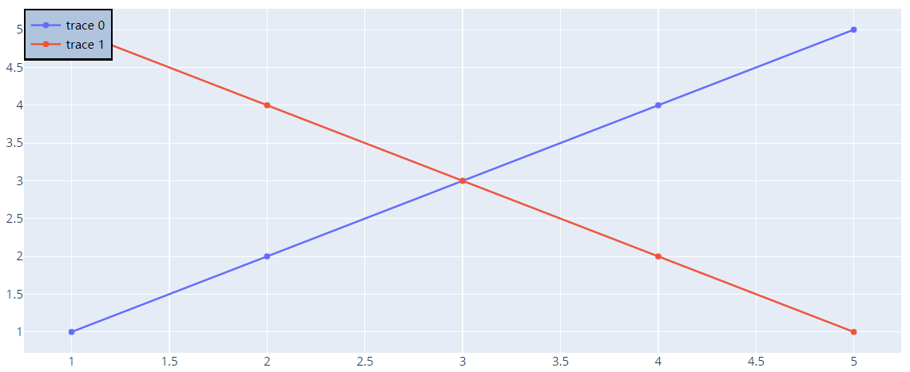

## Hide the Trace Implicitly

`Graph_objects` traces 的 `visible` 属性设置为 `legendonly`时，隐藏 trace。点击对应的 legend 名称显示被隐藏的 trace.

```py
import plotly.graph_objects as go

fig = go.Figure()

fig.add_trace(go.Scatter(
    x=[1, 2, 3, 4, 5],
    y=[1, 2, 3, 4, 5],
))

fig.add_trace(go.Scatter(
    x=[1, 2, 3, 4, 5],
    y=[5, 4, 3, 2, 1],
    visible='legendonly'
))

fig.show()
```

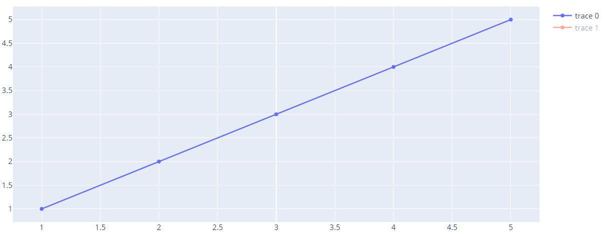

## Size of Legend Items

`itemsizing` 属性设置 legend 大小。设置为 "constant" 后，不管图中对应的图标大小如何，legend 大小固定。

```py
import plotly.graph_objects as go

fig = go.Figure()

fig.add_trace(go.Scatter(
    x=[1, 2, 3, 4, 5],
    y=[1, 2, 3, 4, 5],
    mode='markers',
    marker={'size':10}
))

fig.add_trace(go.Scatter(
    x=[1, 2, 3, 4, 5],
    y=[5, 4, 3, 2, 1],
    mode='markers',
    marker={'size':100}
))

fig.update_layout(legend= {'itemsizing': 'constant'})

fig.show()
```

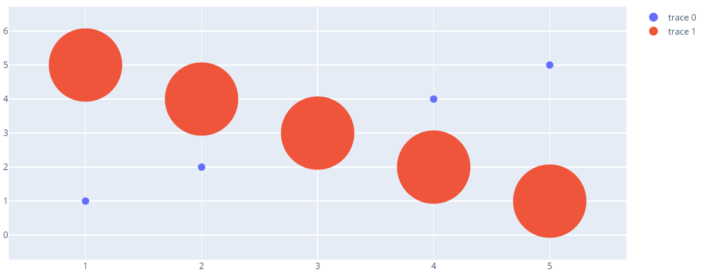

## Grouped Legend

```py
import plotly.graph_objects as go

fig = go.Figure()

fig.add_trace(go.Scatter(
    x=[1, 2, 3],
    y=[2, 1, 3],
    legendgroup="group",  # this can be any string, not just "group"
    name="first legend group",
    mode="markers",
    marker=dict(color="Crimson", size=10)
))

fig.add_trace(go.Scatter(
    x=[1, 2, 3],
    y=[2, 2, 2],
    legendgroup="group",
    name="first legend group - average",
    mode="lines",
    line=dict(color="Crimson")
))

fig.add_trace(go.Scatter(
    x=[1, 2, 3],
    y=[4, 9, 2],
    legendgroup="group2",
    name="second legend group",
    mode="markers",
    marker=dict(color="MediumPurple", size=10)
))

fig.add_trace(go.Scatter(
    x=[1, 2, 3],
    y=[5, 5, 5],
    legendgroup="group2",
    name="second legend group - average",
    mode="lines",
    line=dict(color="MediumPurple")
))

fig.show()
```

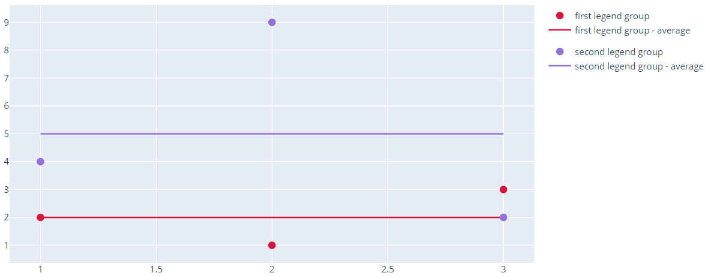

## Legend items for continuous fields

## API

- legend

Parent: `layout`

包含一个或多个键值的 dict.

- itemsizing

Parent: `layout.legend`

Type: enumerated, {"trace", "constant"}

Default: "trace"

使用方式：

```py
fig.update_layout(legend= {'itemsizing': 'constant'})
```

### title

Parent: `layout.legend`

Type: dict containing one or more of the keys listed below.
