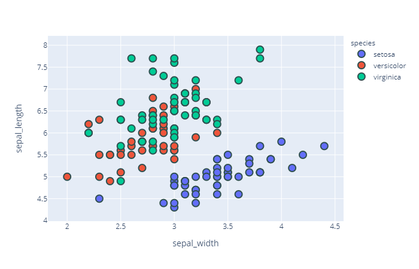
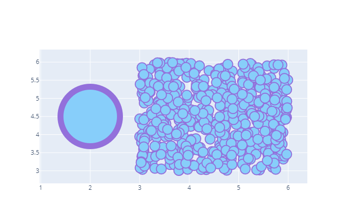
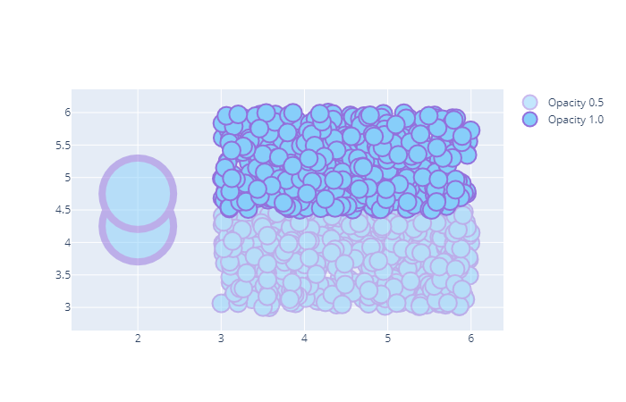
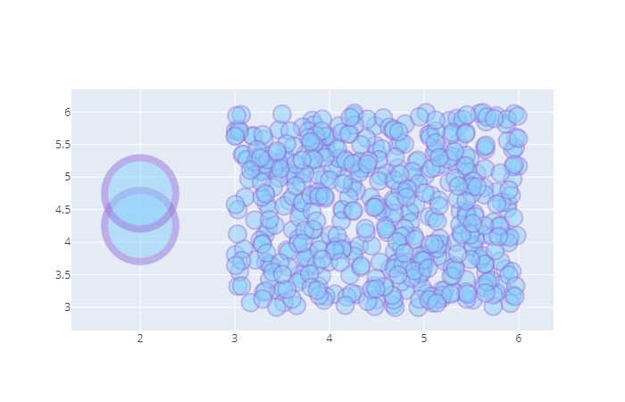
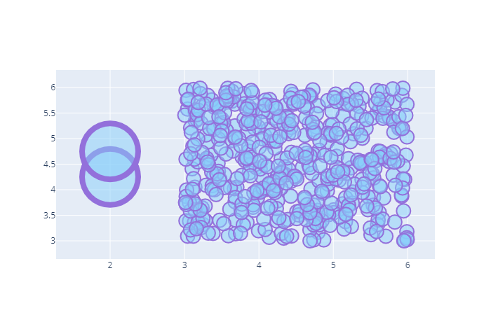
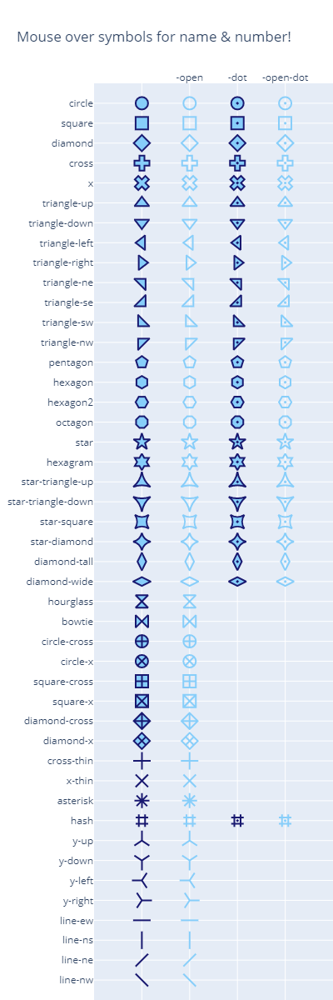

# Marker

- [Marker](#marker)
  - [添加边框](#添加边框)
  - [透明度](#透明度)
  - [Marker 透明度](#marker-透明度)
  - [Color 透明度](#color-透明度)
  - [形状](#形状)
  - [References](#references)

2020-06-13, 14:36
***

## 添加边框

例如：

```py
import plotly.express as px

df = px.data.iris()
fig = px.scatter(df, x="sepal_width", y="sepal_length", color="species")

fig.update_traces(marker=dict(size=12,
                              line=dict(width=2,
                                        color='DarkSlateGrey')),
                  selector=dict(mode='markers'))
fig.show()
```



下面添加两个散点图，使用不同的边框宽度：

```py
import plotly.graph_objects as go

# Generate example data
import numpy as np
np.random.seed(1)

x = np.random.uniform(low=3, high=6, size=(500,))
y = np.random.uniform(low=3, high=6, size=(500,))

# Build figure
fig = go.Figure()

# Add scatter trace with medium sized markers
fig.add_trace(
    go.Scatter(
        mode='markers',
        x=x,
        y=y,
        marker=dict(
            color='LightSkyBlue',
            size=20,
            line=dict(
                color='MediumPurple',
                width=2
            )
        ),
        showlegend=False
    )
)

# Add trace with large marker
fig.add_trace(
    go.Scatter(
        mode='markers',
        x=[2],
        y=[4.5],
        marker=dict(
            color='LightSkyBlue',
            size=120,
            line=dict(
                color='MediumPurple',
                width=12
            )
        ),
        showlegend=False
    )
)

fig.show()
```



## 透明度

对不重叠的标记，完全不透明没问题，当许多点重合时，就需要设置合适的透明度以使数据点可见。

在 Marker 之外设置透明度，设置的是 trace 的透明度。

```py
import plotly.graph_objects as go

# Generate example data
import numpy as np

x = np.random.uniform(low=3, high=6, size=(500,))
y = np.random.uniform(low=3, high=4.5, size=(500,))
x2 = np.random.uniform(low=3, high=6, size=(500,))
y2 = np.random.uniform(low=4.5, high=6, size=(500,))

# Build figure
fig = go.Figure()

# Add first scatter trace with medium sized markers
fig.add_trace(
    go.Scatter(
        mode='markers',
        x=x,
        y=y,
        opacity=0.5,
        marker=dict(
            color='LightSkyBlue',
            size=20,
            line=dict(
                color='MediumPurple',
                width=2
            )
        ),
        name='Opacity 0.5'
    )
)

# Add second scatter trace with medium sized markers
# and opacity 1.0
fig.add_trace(
    go.Scatter(
        mode='markers',
        x=x2,
        y=y2,
        marker=dict(
            color='LightSkyBlue',
            size=20,
            line=dict(
                color='MediumPurple',
                width=2
            )
        ),
        name='Opacity 1.0'
    )
)

# Add trace with large markers
fig.add_trace(
    go.Scatter(
        mode='markers',
        x=[2, 2],
        y=[4.25, 4.75],
        opacity=0.5,
        marker=dict(
            color='LightSkyBlue',
            size=80,
            line=dict(
                color='MediumPurple',
                width=8
            )
        ),
        showlegend=False
    )
)

fig.show()
```



## Marker 透明度

当数据点多时，使用 Marker 透明度更合适。如果有多个 traces，此时可以同时使用 trace 透明度和 marker 透明度。

```py
import plotly.graph_objects as go

# Generate example data
import numpy as np

x = np.random.uniform(low=3, high=6, size=(500,))
y = np.random.uniform(low=3, high=6, size=(500,))

# Build figure
fig = go.Figure()

# Add scatter trace with medium sized markers
fig.add_trace(
    go.Scatter(
        mode='markers',
        x=x,
        y=y,
        marker=dict(
            color='LightSkyBlue',
            size=20,
            opacity=0.5,
            line=dict(
                color='MediumPurple',
                width=2
            )
        ),
        showlegend=False
    )
)


# Add trace with large markers
fig.add_trace(
    go.Scatter(
        mode='markers',
        x=[2, 2],
        y=[4.25, 4.75],
        marker=dict(
            color='LightSkyBlue',
            size=80,
            opacity=0.5,
            line=dict(
                color='MediumPurple',
                width=8
            )
        ),
        showlegend=False
    )
)

fig.show()
```



## Color 透明度

为了更好的查看数据点，设置 `rgba`，包括 alpha 值。

例如：

```py
import plotly.graph_objects as go

# Generate example data
import numpy as np

x = np.random.uniform(low=3, high=6, size=(500,))
y = np.random.uniform(low=3, high=6, size=(500,))


# Build figure
fig = go.Figure()

# Add scatter trace with medium sized markers
fig.add_trace(
    go.Scatter(
        mode='markers',
        x=x,
        y=y,
        marker=dict(
            color='rgba(135, 206, 250, 0.5)',
            size=20,
            line=dict(
                color='MediumPurple',
                width=2
            )
        ),
        showlegend=False
    )
)


# Add trace with large markers
fig.add_trace(
    go.Scatter(
        mode='markers',
        x=[2, 2],
        y=[4.25, 4.75],
        marker=dict(
            color='rgba(135, 206, 250, 0.5)',
            size=80,
            line=dict(
                color='MediumPurple',
                width=8
            )
        ),
        showlegend=False
    )
)

fig.show()
```



## 形状

`marker_symbol` 属性用于设置 Marker 形状。

基本形状有：

- circle
- square
- diamond
- cross
- x
- triangle
- pentagon
- hexagram
- star
- hourglass
- bowtie
- asterisk
- hash
- y
- line

每个形状可以用一个数字表示

- 添加 100 等价于添加后缀 `-open` 到 symbol 名称。
- 添加 200 等价于添加后缀 `-dot` 到 symbol
- 添加 300 等价于添加后缀 `-open-dot` 或 `dot-open`

将 `marker_symbol` 设置为对应的名称或数值以设置 marker 形状：

```py
import plotly.graph_objects as go
from plotly.validators.scatter.marker import SymbolValidator

raw_symbols = SymbolValidator().values
namestems = []
namevariants = []
symbols = []
for i in range(0,len(raw_symbols),2):
    name = raw_symbols[i+1]
    symbols.append(raw_symbols[i])
    namestems.append(name.replace("-open", "").replace("-dot", ""))
    namevariants.append(name[len(namestems[-1]):])

fig = go.Figure(go.Scatter(mode="markers", x=namevariants, y=namestems, marker_symbol=symbols,
                           marker_line_color="midnightblue", marker_color="lightskyblue", 
                           marker_line_width=2, marker_size=15, 
                           hovertemplate="name: %{y}%{x}<br>number: %{marker.symbol}<extra></extra>"))
fig.update_layout(title="Mouse over symbols for name & number!",
                  xaxis_range=[-1,4], yaxis_range=[len(set(namestems)),-1], 
                  margin=dict(b=0,r=0), xaxis_side="top", height=1200, width=400)
fig.show()
```



## References

- [Styling Markers in Python](https://plotly.com/python/marker-style/)
