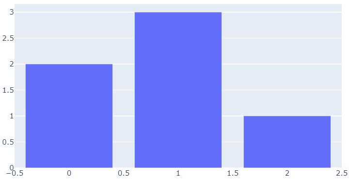

# Introduction

- [Introduction](#introduction)
  - [简介](#%e7%ae%80%e4%bb%8b)
  - [安装](#%e5%ae%89%e8%a3%85)
  - [Jupyter Notebook 支持](#jupyter-notebook-%e6%94%af%e6%8c%81)
  - [JupyterLab 支持（Python 3.5+）](#jupyterlab-%e6%94%af%e6%8c%81python-35)
  - [静态图像导出](#%e9%9d%99%e6%80%81%e5%9b%be%e5%83%8f%e5%af%bc%e5%87%ba)
  - [Geo 扩展](#geo-%e6%89%a9%e5%b1%95)

2020-04-19, 19:13
*** *

## 简介

plotly Python 库（plotly.py）是一个交互式的开源绘图库，它支持40多种图表类型，涵盖了统计、财务、地理、科学以及 3D 图形等方面。

plotly.py 构建在 plotly.js 上，使 Python 用户可以创建基于 web 的漂亮的交互式可视化图表。

通过集成 orca 图像导出工具，plotly.py 还支持非 Web 端，包括桌面程序和静态图片导出。

## 安装

通过 pip 安装：

```cmd
pip install plotly==4.6.0
```

通过 conda 安装：

```cmd
conda install -c plotly plotly=4.6.0
```

plotly.py 包含将可视化图写入HTML的所有工具。

> plotly.py 不需要网络连接。

## Jupyter Notebook 支持

安装 jupyter 之后，直接运行：

```py
import plotly.graph_objects as go
fig = go.Figure(data=go.Bar(y=[2, 3, 1]))
fig.show()
```

即可显示图形：



也可以使用 `FigureWidget` 对象：

```py
import plotly.graph_objects as go
fig = go.FigureWidget(data=go.Bar(y=[2, 3, 1]))
fig
```

## JupyterLab 支持（Python 3.5+）

安装 `jupyterlab` 和 `ipywidgets`:

```py
pip install jupyterlab==1.2 "ipywidgets>=7.5"
```

conda:

```py
conda install jupyterlab=1.2
conda install "ipywidgets=7.5"
```

运行如下命令安装 JupyterLab 扩展：

```cmd
# Avoid "JavaScript heap out of memory" errors during extension installation
# (OS X/Linux)
export NODE_OPTIONS=--max-old-space-size=4096
# (Windows)
set NODE_OPTIONS=--max-old-space-size=4096

# Jupyter widgets extension
jupyter labextension install @jupyter-widgets/jupyterlab-manager@1.1 --no-build

# jupyterlab renderer support
jupyter labextension install jupyterlab-plotly@4.6.0 --no-build

# FigureWidget support
jupyter labextension install plotlywidget@4.6.0 --no-build

# Build extensions (must be done to activate extensions since --no-build is used above)
jupyter lab build

# Unset NODE_OPTIONS environment variable
# (OS X/Linux)
unset NODE_OPTIONS
# (Windows)
set NODE_OPTIONS=
```

## 静态图像导出

使用 `plotly.io` 包中的 `to_image` 和 `write_image` 函数可以导出静态图像。

使用该功能需要安装 `orca` 命令行工具和 `psutil`, `requests` Python 包。

> `requests` 包用于 Python 进程与本地 orca 服务进程交互，不会和外部服务交互。

orca 下载地址：[https://github.com/plotly/orca/releases](https://github.com/plotly/orca/releases)

安装好后，可以导出图像：

```py
import plotly.graph_objects as go
fig = go.FigureWidget(data=go.Bar(y=[2, 3, 1]))
fig.write_image('figure.png')
```

## Geo 扩展

部分 plotly.py 特性依赖于地理形状文件。这些文件以单独的 `plotly-geo` 包分发。

```cmd
pip install plotly-geo==1.0.0
```
