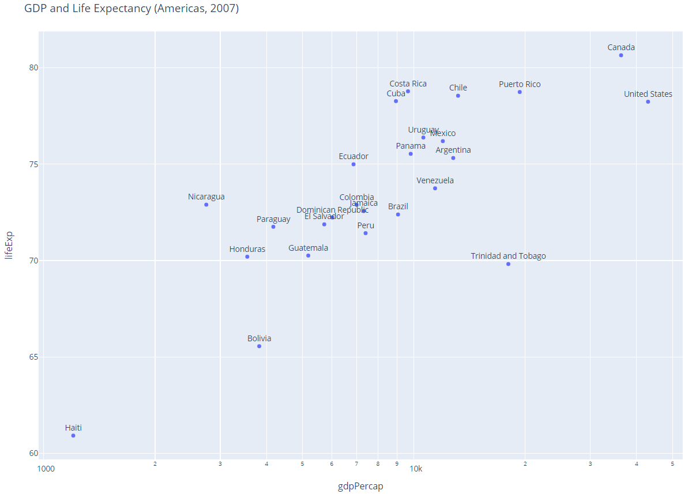
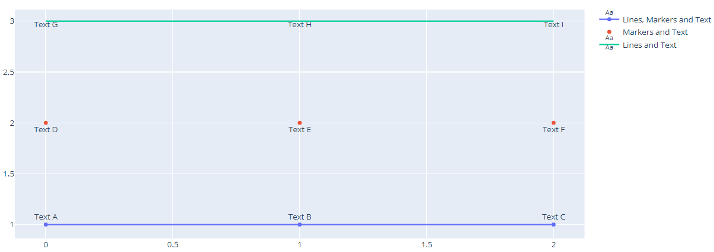
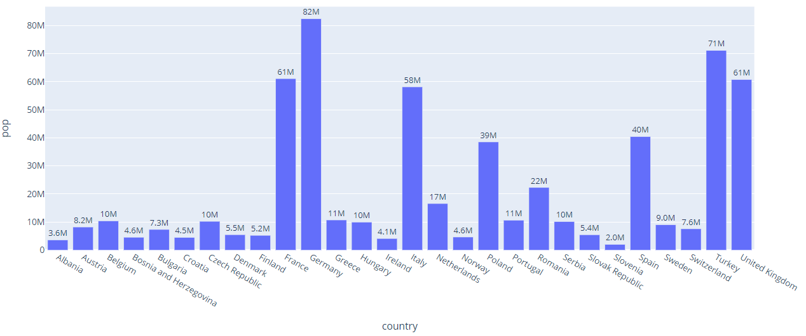
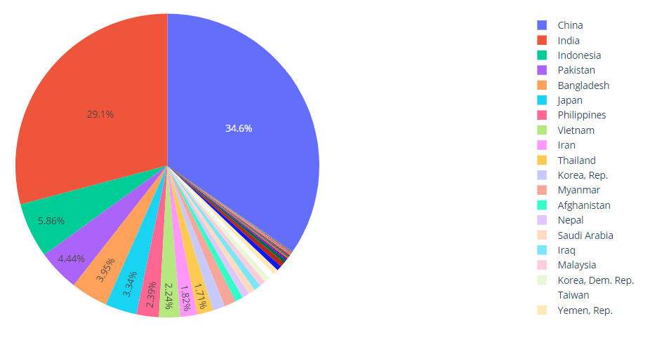
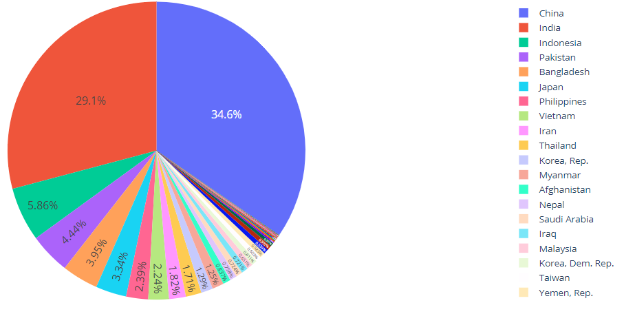

# Annotation

- [Annotation](#annotation)
  - [Text scatter plot with PX](#text-scatter-plot-with-px)
  - [Scatter 数据注释](#scatter-数据注释)
  - [设置字体大小 - uniformtext](#设置字体大小---uniformtext)
  - [设置字体大小 - fontsize](#设置字体大小---fontsize)
    - [`data[type=pie].textfont`](#datatypepietextfont)
  - [Text 格式化](#text-格式化)
    - [precision](#precision)
    - [type](#type)

2020-04-20, 16:15
***

## Text scatter plot with PX

下面使用 Express 创建一个散点图，并添加注释文本。

```py
import plotly.express as px

df = px.data.gapminder().query("year==2007 and continent=='Americas'")

fig = px.scatter(df, x="gdpPercap", y="lifeExp", text="country", log_x=True, size_max=60)

fig.update_traces(textposition='top center')

fig.update_layout(
    height=800,
    title_text='GDP and Life Expectancy (Americas, 2007)'
)

fig.show()
```

这里注释通过 `text="country"` 添加。



## Scatter 数据注释

```py
import plotly.graph_objects as go

fig = go.Figure()

fig.add_trace(go.Scatter(
    x=[0, 1, 2],
    y=[1, 1, 1],
    mode="lines+markers+text", # 线条+标记+文本
    name="Lines, Markers and Text", # Legend 名称
    text=["Text A", "Text B", "Text C"], # 设置注释文本
    textposition="top center" # 文本在数据点的正上方
))

fig.add_trace(go.Scatter(
    x=[0, 1, 2],
    y=[2, 2, 2],
    mode="markers+text",
    name="Markers and Text",
    text=["Text D", "Text E", "Text F"],
    textposition="bottom center"
))

fig.add_trace(go.Scatter(
    x=[0, 1, 2],
    y=[3, 3, 3],
    mode="lines+text",
    name="Lines and Text",
    text=["Text G", "Text H", "Text I"],
    textposition="bottom center"
))

fig.show()
```

`mode="lines+markers+text"` 表示同时显示 line, marker 和 text，对应下面的蓝线。



## 设置字体大小 - uniformtext

对 `pie`, `bar`, `sunburst`, `treemap` 等 traces，可以使用 `uniformtext` layout 参数设置所有文本标签相同的字体大小。

`minsize` 设置字体大小，`mode` 则在空间无法容下文本内容时的处理方式：隐藏（`hide`）或者溢出显示（`show`）。

```py
import plotly.express as px

df = px.data.gapminder().query("continent == 'Europe' and year == 2007 and pop > 2.e6")
fig = px.bar(df, y='pop', x='country', text='pop')
fig.update_traces(texttemplate='%{text:.2s}', textposition='outside')
fig.update_layout(uniformtext_minsize=8, uniformtext_mode='hide')
fig.show()
```



```py
import plotly.express as px

df = px.data.gapminder().query("continent == 'Asia' and year == 2007")
fig = px.pie(df, values='pop', names='country')
fig.update_traces(textposition='inside')
fig.update_layout(uniformtext_minsize=12, uniformtext_mode='hide')
fig.show()
```



## 设置字体大小 - fontsize

`pie`, `bar`, `sunburst` 和 `treemap` 等 traces 可以使用 `textfont_size` 设置最大字体大小。

```py
import plotly.express as px

df = px.data.gapminder().query("continent == 'Asia' and year == 2007")
fig = px.pie(df, values='pop', names='country')
fig.update_traces(textposition='inside', textfont_size=14)
fig.show()
```



### `data[type=pie].textfont`

设置 `textinfo` 的字体。

`textfont`

- `data[type=pie].textfont.size`

设置 chart 中允许的最大字体。

## Text 格式化

```text
 [​[fill]align][sign][symbol][0][width][,][.precision][type]
```

### precision

精度：

- 对 `f` 和 `%` 类型的值，表示小数点后显示的位数。
- 对 `g`, `r` 和 `p` 类型，小数点前后共显示的位数。

### type

- exponent ("e")

use `Number.toExponential`，转换为指数形式。例如：

```js
function expo(x, f) {
  return Number.parseFloat(x).toExponential(f);
}

console.log(expo(123456, 2));
// expected output: "1.23e+5"

console.log(expo('123456'));
// expected output: "1.23456e+5"

console.log(expo('oink'));
// expected output: "NaN"
```

- general ("g")

use `Number.toPrecision`，返回数值指定进度的字符串。例如：

```js
function precise(x) {
  return Number.parseFloat(x).toPrecision(4);
}

console.log(precise(123.456));
// expected output: "123.5"

console.log(precise(0.004));
// expected output: "0.004000"

console.log(precise('1.23e+5'));
// expected output: "1.230e+5"
```

- fixed ("f")

use `Number.toFixed`，固定小数点位数。例如：

```js
function financial(x) {
  return Number.parseFloat(x).toFixed(2);
}

console.log(financial(123.456));
// expected output: "123.46"

console.log(financial(0.004));
// expected output: "0.00"

console.log(financial('1.23e+5'));
// expected output: "123000.00"
```

- integer ("d") - use Number.toString, but ignore any non-integer values.
- rounded ("r")

四舍五入 precision 有效位数，位数不足补 0，类似于 `f`。如果未指定 precision，回退到 `g`。

- percentage ("%") - like fixed, but multiply by 100 and suffix with "%".
- rounded percentage ("p") - like rounded, but multiply by 100 and suffix with "%".
- binary ("b") - outputs the number in base 2.
- octal ("o") - outputs the number in base 8.
- hexadecimal ("x") - outputs the number in base 16, using lower-case letters for the digits above 9.
- hexadecimal ("X") - outputs the number in base 16, using upper-case letters for the digits above 9.
- character ("c") - converts the integer to the corresponding unicode character before printing.

- SI-prefix ("s")

类似 `r`，但是添加了单位后缀，例如 "9.5M" for mega，"1.00µ" for micro.
