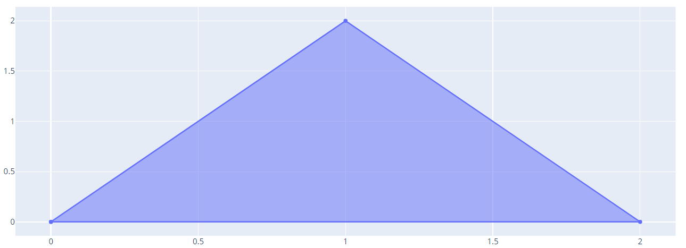
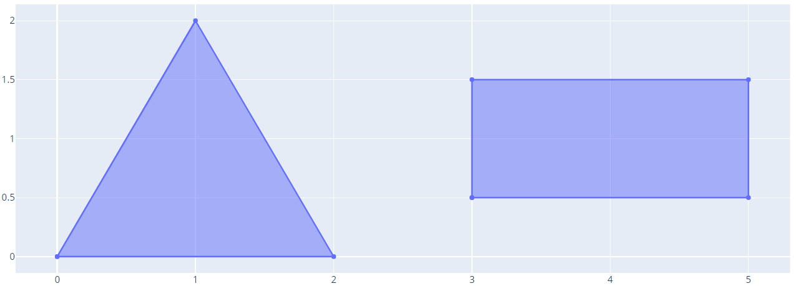
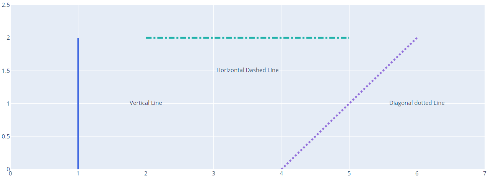
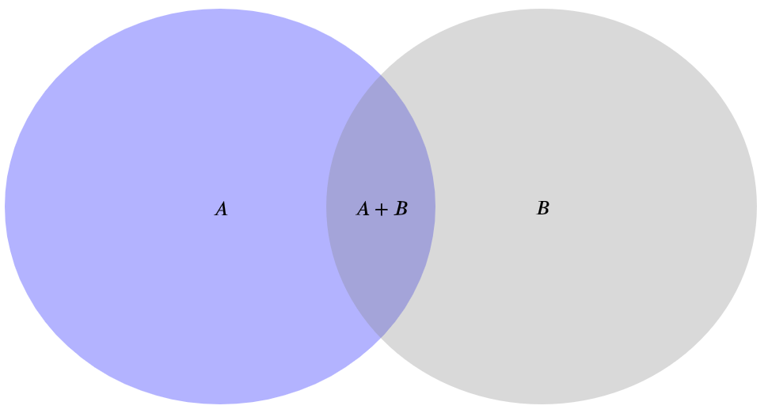
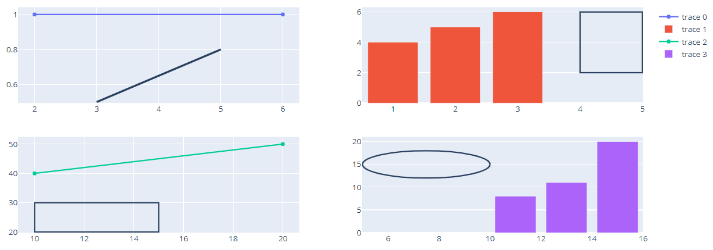
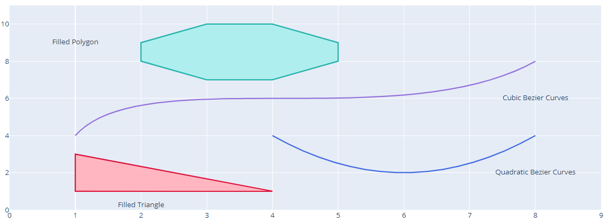

# Shapes in Python

- [Shapes in Python](#shapes-in-python)
  - [简介](#%e7%ae%80%e4%bb%8b)
  - [填充面积图（Filled Area Chart）](#%e5%a1%ab%e5%85%85%e9%9d%a2%e7%a7%af%e5%9b%befilled-area-chart)
  - [线条](#%e7%ba%bf%e6%9d%a1)
    - [相对坐标轴位置的线条](#%e7%9b%b8%e5%af%b9%e5%9d%90%e6%a0%87%e8%bd%b4%e4%bd%8d%e7%bd%ae%e7%9a%84%e7%ba%bf%e6%9d%a1)
  - [圆圈突出显示散点集](#%e5%9c%86%e5%9c%88%e7%aa%81%e5%87%ba%e6%98%be%e7%a4%ba%e6%95%a3%e7%82%b9%e9%9b%86)
  - [Venn Diagram](#venn-diagram)
  - [添加形状到 subplots](#%e6%b7%bb%e5%8a%a0%e5%bd%a2%e7%8a%b6%e5%88%b0-subplots)
  - [SVG Paths](#svg-paths)
  - [API 参考](#api-%e5%8f%82%e8%80%83)

## 简介

下面演示如何使用 plotly python 创建 SVG 形状。

## 填充面积图（Filled Area Chart）

创建填充图的方法有两种：scatter traces 和 `layout.shapes`。

`layout.shapes` 对创建 2d 图形很有用，它可用于创建各种形状，包括矩形、萧条、圆形以及自定义 SVG 路径等。

也可以使用 `scatterpolar`, `scattergeo`, `scattermapbox` 在任意子图上绘制填充图。

- 设置 scatter 的颜色，需要设置 `scatter.fill="toself"`，以将 trace 连接为闭合形状。

如果 `mode=line`（默认值），则需要重复形状数据的初始值以闭合形状。例如：

```py
import plotly.graph_objects as go

fig = go.Figure(
    go.Scatter(
        x=[0, 1, 2, 0],
        y=[0, 2, 0, 0],
        fill='toself'
    )
)
fig.show()
```



上面重复的初始值，所以三角形下面也有条线。

- 添加多个形状，除了添加更多 traces，还可以通过 `None` 分隔两个形状的数据

```py
import plotly.graph_objects as go

fig = go.Figure(
    go.Scatter(
        x=[0, 1, 2, 0, None, 3, 3, 5, 5, 3],
        y=[0, 2, 0, 0, None, 0.5, 1.5, 1.5, 0.5, 0.5],
        fill='toself'
    )
)
fig.show()
```

两个形状的数据使用 `None` 分隔，输出两个形状：



## 线条

### 相对坐标轴位置的线条

[实例](../src/plotly_test/shape_line.py)



## 圆圈突出显示散点集


## Venn Diagram

```py
import plotly.graph_objects as go

fig = go.Figure()

# Create scatter trace of text labels
fig.add_trace(go.Scatter(
    x=[1, 1.75, 2.5],
    y=[1, 1, 1],
    text=["$A$", "$A+B$", "$B$"],
    mode="text",
    textfont=dict(
        color="black",
        size=18,
        family="Arail",
    )
))

# 移除坐标轴
fig.update_xaxes(
    showticklabels=False,
    showgrid=False,
    zeroline=False,
)

fig.update_yaxes(
    showticklabels=False,
    showgrid=False,
    zeroline=False,
)

# Add circles
fig.add_shape(
    type="circle",
    fillcolor="blue",
    x0=0,
    y0=0,
    x1=2,
    y1=2,
    line_color="blue"
)
fig.add_shape(
    type="circle",
    fillcolor="gray",
    x0=1.5,
    y0=0,
    x1=3.5,
    y1=2,
    line_color="gray"
)
fig.update_shapes(dict(
    opacity=0.3,
    xref="x",
    yref="y",
    layer="below"
))
# Update figure dimensions
fig.update_layout(
    margin=dict(
        l=20,
        r=20,
        b=100
    ),
    height=600,
    width=800,
    plot_bgcolor="white"
)
fig.show()
```



## 添加形状到 subplots

使用 `make_subplots` 创建形状后，通过引用不同 axes 在不同子图中添加形状：

```py
import plotly.graph_objects as go
from plotly.subplots import make_subplots

# Create Subplots
fig = make_subplots(rows=2, cols=2)

fig.add_trace(go.Scatter(x=[2, 6], y=[1,1]), row=1, col=1)
fig.add_trace(go.Bar(x=[1,2,3], y=[4,5,6]), row=1, col=2)
fig.add_trace(go.Scatter(x=[10,20], y=[40,50]), row=2, col=1)
fig.add_trace(go.Bar(x=[11,13,15], y=[8,11,20]), row=2, col=2)

# Add shapes
fig.update_layout(
    shapes=[
        dict(type="line", xref="x1", yref="y1",
            x0=3, y0=0.5, x1=5, y1=0.8, line_width=3),
        dict(type="rect", xref="x2", yref='y2',
             x0=4, y0=2, x1=5, y1=6),
        dict(type="rect", xref="x3", yref="y3",
             x0=10, y0=20, x1=15, y1=30),
        dict(type="circle", xref="x4", yref="y4",
             x0=5, y0=12, x1=10, y1=18)])
fig.show()
```



## SVG Paths

```py
import plotly.graph_objects as go

fig = go.Figure()

# 创建文本标签
fig.add_trace(
    go.Scatter(
        x=[2, 1, 8, 8],
        y=[0.25, 9, 2, 6],
        text=["Filled Triangle",
              "Filled Polygon",
              "Quadratic Bezier Curves",
              "Cubic Bezier Curves"],
        mode="text",
    )
)

# 更新坐标轴
fig.update_xaxes(
    range=[0, 9],
    zeroline=False,
)

fig.update_yaxes(
    range=[0, 11],
    zeroline=False
)

# 添加形状
fig.update_layout(
    shapes=[
        # Quadratic Bezier Curves
        dict(
            type="path",
            path="M 4,4 Q 6,0 8,4",
            line_color="RoyalBlue",
        ),
        # Cubic Bezier Curves
        dict(
            type="path",
            path="M 1,4 C 2,8 6,4 8,8",
            line_color="MediumPurple",
        ),
        # filled Triangle
        dict(
            type="path",
            path=" M 1 1 L 1 3 L 4 1 Z",
            fillcolor="LightPink",
            line_color="Crimson",
        ),
        # filled Polygon
        dict(
            type="path",
            path=" M 3,7 L2,8 L2,9 L3,10, L4,10 L5,9 L5,8 L4,7 Z",
            fillcolor="PaleTurquoise",
            line_color="LightSeaGreen",
        ),
    ]
)

fig.show()
```



## API 参考

