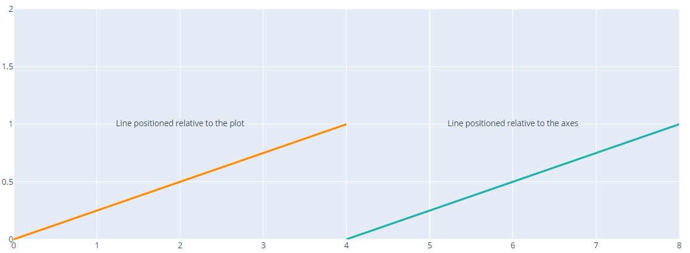
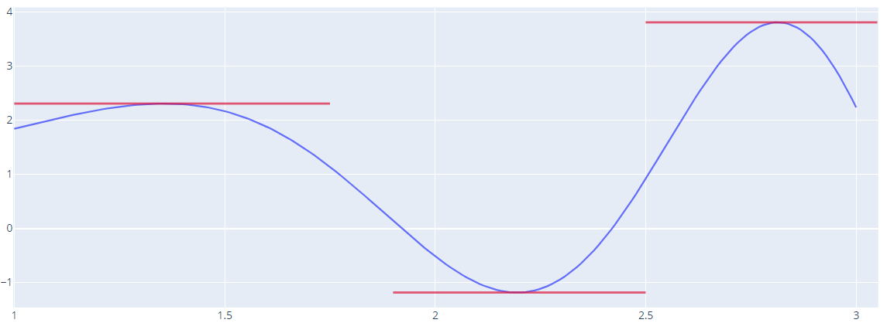
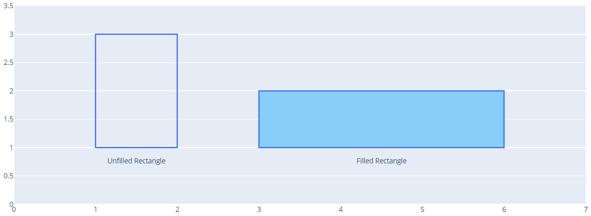
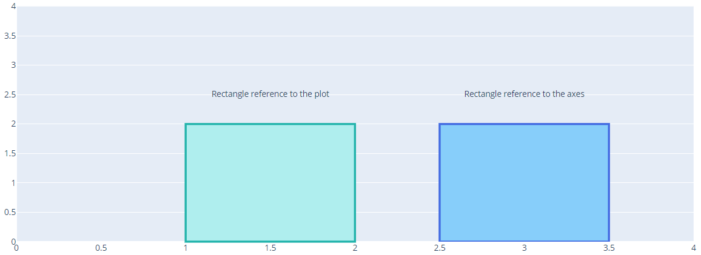
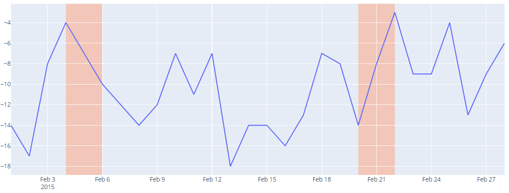
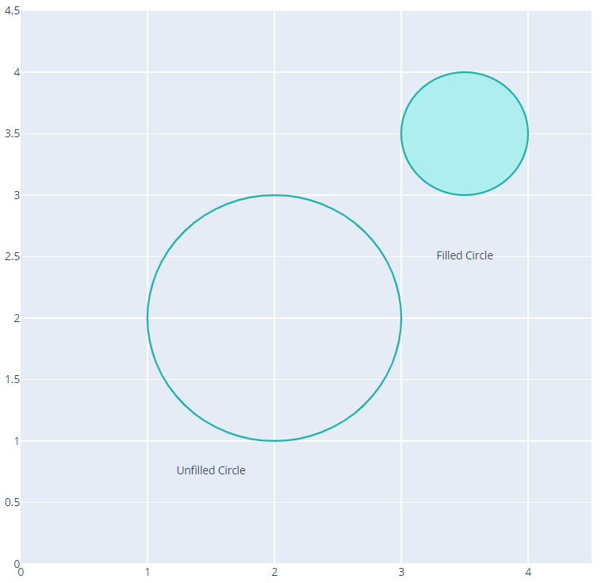
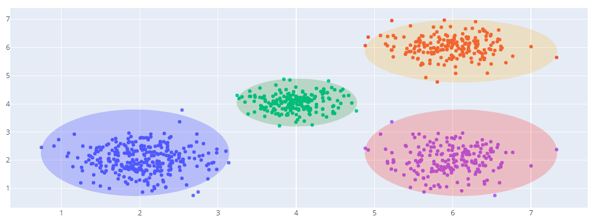

# Shapes in Python

- [Shapes in Python](#shapes-in-python)
  - [简介](#简介)
  - [填充面积图（Filled Area Chart）](#填充面积图filled-area-chart)
  - [线条](#线条)
    - [相对坐标轴的线条](#相对坐标轴的线条)
    - [相对 Plot 及坐标轴](#相对-plot-及坐标轴)
    - [绘制切线](#绘制切线)
  - [矩形](#矩形)
    - [矩形-相对坐标轴](#矩形-相对坐标轴)
    - [矩形-相对图形和坐标轴](#矩形-相对图形和坐标轴)
    - [矩形高亮时间区域](#矩形高亮时间区域)
  - [圆形](#圆形)
    - [圆形-相对坐标轴](#圆形-相对坐标轴)
    - [圆圈突出显示散点集](#圆圈突出显示散点集)
    - [Venn Diagram](#venn-diagram)
  - [添加形状到 subplots](#添加形状到-subplots)
  - [SVG Paths](#svg-paths)
  - [add_shape 参考](#add_shape-参考)
    - [`arg=None`](#argnone)
    - [`fillcolor=None`](#fillcolornone)
    - [`layer=None`](#layernone)
    - [`line=None`](#linenone)
    - [`name=None`](#namenone)
    - [type](#type)
    - [xanchor](#xanchor)
    - [`x0=None`](#x0none)
    - [`y0=None`](#y0none)
    - [`x1=None`](#x1none)
    - [`y1=None`](#y1none)
    - [xsizemode](#xsizemode)
    - [`xref`](#xref)
    - [yref](#yref)
  - [Shape 参考](#shape-参考)
    - [line](#line)

2020-04-18, 15:55
*** *

## 简介

下面演示如何使用 plotly python 创建形状。

## 填充面积图（Filled Area Chart）

创建填充图的方法有两种：scatter traces 和 `layout.shapes`。

`layout.shapes` 用于创建 2D 图形，支持矩形、线条、圆形以及 SVG 路径等。

也可以使用 `scatterpolar`, `scattergeo`, `scattermapbox` 在subplot上绘制填充图。

> 设置 scatter 的填充颜色，需要设置 `scatter.fill="toself"`，以将 trace 连接为闭合形状。

如果 `mode=line`（默认值），则需要在末尾添加状数据的初始值以闭合形状。例如：

```py
import plotly.graph_objects as go

fig = go.Figure(
    go.Scatter(
        x=[0, 1, 2, 0], # 最后一个数据和第一个相同
        y=[0, 2, 0, 0], # 最后一个数据和第一个相同
        fill='toself'
    )
)
fig.show()
```


上面重复了初始值，所以三角形下面有条线。

> 添加多个形状，除了添加更多 traces，还可以通过 `None` 分隔两个形状的数据

```py
import plotly.graph_objects as go

fig = go.Figure(
    go.Scatter(
        x=[0, 1, 2, 0, None, 3, 3, 5, 5, 3],
        y=[0, 2, 0, 0, None, 0.5, 1.5, 1.5, 0.5, 0.5],
        fill='toself'
    )
)
fig.show()
```

两个形状的数据使用 `None` 分隔，输出两个形状：


## 线条

### 相对坐标轴的线条

[实例](../src/plotly_test/shape_line.py)

```py
import plotly.graph_objects as go

fig = go.Figure()

# Create scatter trace of text labels
fig.add_trace(go.Scatter(
    x=[2, 3.5, 6],
    y=[1, 1.5, 1],
    text=["Vertical Line",
          "Horizontal Dashed Line",
          "Diagonal dotted Line"],
    mode="text",
))

# Set axes ranges
fig.update_xaxes(range=[0, 7])
fig.update_yaxes(range=[0, 2.5])

# Add shapes
fig.add_shape(
        # Line Vertical
        dict(
            type="line",
            x0=1,
            y0=0,
            x1=1,
            y1=2,
            line=dict(
                color="RoyalBlue",
                width=3
            )
))
fig.add_shape(
        # Line Horizontal
            type="line",
            x0=2,
            y0=2,
            x1=5,
            y1=2,
            line=dict(
                color="LightSeaGreen",
                width=4,
                dash="dashdot",
            ),
    )
fig.add_shape(
        # Line Diagonal
            type="line",
            x0=4,
            y0=0,
            x1=6,
            y1=2,
            line=dict(
                color="MediumPurple",
                width=4,
                dash="dot",
            )
)
fig.update_shapes(dict(xref='x', yref='y'))
fig.show()
```


### 相对 Plot 及坐标轴

```py
import plotly.graph_objects as go

fig = go.Figure()

# Create scatter trace of text labels
fig.add_trace(go.Scatter(
    x=[2, 6],
    y=[1, 1],
    text=["Line positioned relative to the plot",
          "Line positioned relative to the axes"],
    mode="text",
))

# Set axes ranges
fig.update_xaxes(range=[0, 8])
fig.update_yaxes(range=[0, 2])

# Add shapes
fig.add_shape(
        # Line reference to the axes
            type="line",
            xref="x",
            yref="y",
            x0=4,
            y0=0,
            x1=8,
            y1=1,
            line=dict(
                color="LightSeaGreen",
                width=3,
            ),
        )
fig.add_shape(
            type="line",
            xref="paper", # 相对绘图区域
            yref="paper",
            x0=0,
            y0=0,
            x1=0.5,
            y1=0.5,
            line=dict(
                color="DarkOrange",
                width=3,
            ),
        )

fig.show()
```



### 绘制切线

```py
import plotly.graph_objects as go

import numpy as np

# Generate data
x0 = np.linspace(1, 3, 200)
y0 = x0 * np.sin(np.power(x0, 2)) + 1

# Create figure with scatter trace
fig = go.Figure()

fig.add_trace(go.Scatter(
    x=x0,
    y=y0,
))

# Set title text
fig.update_layout(
    title_text="$f(x)=x\\sin(x^2)+1\\\\ f\'(x)=\\sin(x^2)+2x^2\\cos(x^2)$"
)

# Add tangent line shapes
fig.add_shape(
            type="line",
            x0=1,
            y0=2.30756,
            x1=1.75,
            y1=2.30756,
        )
fig.add_shape(
            type="line",
            x0=2.5,
            y0=3.80796,
            x1=3.05,
            y1=3.80796,
        )
fig.add_shape(
            type="line",
            x0=1.90,
            y0=-1.1827,
            x1=2.50,
            y1=-1.1827,
        )
fig.update_shapes(dict(
    xref="x",
    yref="y",
    opacity=0.7,
    line=dict(
        color="Crimson",
        width=2.5,
        )))
fig.show()
```



## 矩形

### 矩形-相对坐标轴

```py
import plotly.graph_objects as go

fig = go.Figure()

# 注释文本
fig.add_trace(go.Scatter(
    x=[1.5, 4.5],
    y=[0.75, 0.75],
    text=["Unfilled Rectangle", "Filled Rectangle"],
    mode="text",
))

# Set axes properties
fig.update_xaxes(range=[0, 7], showgrid=False)
fig.update_yaxes(range=[0, 3.5])

# Add shapes
fig.add_shape(
        # unfilled Rectangle
            type="rect",
            x0=1,
            y0=1,
            x1=2,
            y1=3,
            line=dict(
                color="RoyalBlue",
            ),
        )
fig.add_shape(
        # filled Rectangle
            type="rect",
            x0=3,
            y0=1,
            x1=6,
            y1=2,
            line=dict(
                color="RoyalBlue",
                width=2,
            ),
            fillcolor="LightSkyBlue",
        )
fig.update_shapes(dict(xref='x', yref='y'))
fig.show()
```



### 矩形-相对图形和坐标轴

```py
import plotly.graph_objects as go

fig = go.Figure()

# Create scatter trace of text labels
fig.add_trace(go.Scatter(
    x=[1.5, 3],
    y=[2.5, 2.5],
    text=["Rectangle reference to the plot",
          "Rectangle reference to the axes"],
    mode="text",
))

# Set axes properties
fig.update_xaxes(range=[0, 4], showgrid=False)
fig.update_yaxes(range=[0, 4])

# Add shapes
fig.add_shape(
        # Rectangle reference to the axes
            type="rect",
            xref="x",
            yref="y",
            x0=2.5,
            y0=0,
            x1=3.5,
            y1=2,
            line=dict(
                color="RoyalBlue",
                width=3,
            ),
            fillcolor="LightSkyBlue",
        )
fig.add_shape(
        # Rectangle reference to the plot
            type="rect",
            xref="paper", # 相对绘图区域
            yref="paper",
            x0=0.25,
            y0=0,
            x1=0.5,
            y1=0.5,
            line=dict(
                color="LightSeaGreen",
                width=3,
            ),
            fillcolor="PaleTurquoise",
        )

fig.show()
```



### 矩形高亮时间区域

```py
import plotly.graph_objects as go

fig = go.Figure()

# Add scatter trace for line
fig.add_trace(go.Scatter(
    x=["2015-02-01", "2015-02-02", "2015-02-03", "2015-02-04", "2015-02-05",
       "2015-02-06", "2015-02-07", "2015-02-08", "2015-02-09", "2015-02-10",
       "2015-02-11", "2015-02-12", "2015-02-13", "2015-02-14", "2015-02-15",
       "2015-02-16", "2015-02-17", "2015-02-18", "2015-02-19", "2015-02-20",
       "2015-02-21", "2015-02-22", "2015-02-23", "2015-02-24", "2015-02-25",
       "2015-02-26", "2015-02-27", "2015-02-28"],
    y=[-14, -17, -8, -4, -7, -10, -12, -14, -12, -7, -11, -7, -18, -14, -14,
       -16, -13, -7, -8, -14, -8, -3, -9, -9, -4, -13, -9, -6],
    mode="lines",
    name="temperature"
))

# Add shape regions
fig.update_layout(
    shapes=[
        # 1st highlight during Feb 4 - Feb 6
        dict(
            type="rect",
            # x-reference is assigned to the x-values
            xref="x",
            # y-reference is assigned to the plot paper [0,1]
            yref="paper",
            x0="2015-02-04",
            y0=0,
            x1="2015-02-06",
            y1=1,
            fillcolor="LightSalmon",
            opacity=0.5,
            layer="below",
            line_width=0,
        ),
        # 2nd highlight during Feb 20 - Feb 23
        dict(
            type="rect",
            xref="x",
            yref="paper",
            x0="2015-02-20",
            y0=0,
            x1="2015-02-22",
            y1=1,
            fillcolor="LightSalmon",
            opacity=0.5,
            layer="below",
            line_width=0,
        )
    ]
)

fig.show()
```



## 圆形

### 圆形-相对坐标轴

```py
import plotly.graph_objects as go

fig = go.Figure()

# Create scatter trace of text labels
fig.add_trace(go.Scatter(
    x=[1.5, 3.5],
    y=[0.75, 2.5],
    text=["Unfilled Circle",
          "Filled Circle"],
    mode="text",
))

# Set axes properties
fig.update_xaxes(range=[0, 4.5], zeroline=False)
fig.update_yaxes(range=[0, 4.5])

# Add circles
fig.update_layout(
    shapes=[
        # unfilled circle
        dict(
            type="circle",
            xref="x",
            yref="y",
            x0=1,
            y0=1,
            x1=3,
            y1=3,
            line_color="LightSeaGreen",
        ),
        # filled circle
        dict(
            type="circle",
            xref="x",
            yref="y",
            fillcolor="PaleTurquoise",
            x0=3,
            y0=3,
            x1=4,
            y1=4,
            line_color="LightSeaGreen",
        ),
    ]
)

# Set figure size
fig.update_layout(width=800, height=800)

fig.show()
```



### 圆圈突出显示散点集

```py
import plotly.graph_objects as go

import numpy as np
np.random.seed(1)

# Generate data
x0 = np.random.normal(2, 0.45, 300)
y0 = np.random.normal(2, 0.45, 300)

x1 = np.random.normal(6, 0.4, 200)
y1 = np.random.normal(6, 0.4, 200)

x2 = np.random.normal(4, 0.3, 200)
y2 = np.random.normal(4, 0.3, 200)

# Create figure
fig = go.Figure()

# Add scatter traces
fig.add_trace(go.Scatter(
    x=x0,
    y=y0,
    mode="markers",
))

fig.add_trace(go.Scatter(
    x=x1,
    y=y1,
    mode="markers"
))

fig.add_trace(go.Scatter(
    x=x2,
    y=y2,
    mode="markers"
))

fig.add_trace(go.Scatter(
    x=x1,
    y=y0,
    mode="markers"
))

# Add shapes
fig.update_layout(
    shapes=[
        dict(
            type="circle",
            xref="x",
            yref="y",
            x0=min(x0),
            y0=min(y0),
            x1=max(x0),
            y1=max(y0),
            opacity=0.2,
            fillcolor="blue",
            line_color="blue",
        ),
        dict(
            type="circle",
            xref="x",
            yref="y",
            x0=min(x1),
            y0=min(y1),
            x1=max(x1),
            y1=max(y1),
            opacity=0.2,
            fillcolor="orange",
            line_color="orange",
        ),
        dict(
            type="circle",
            xref="x",
            yref="y",
            x0=min(x2),
            y0=min(y2),
            x1=max(x2),
            y1=max(y2),
            opacity=0.2,
            fillcolor="green",
            line_color="green",
        ),
        dict(
            type="circle",
            xref="x",
            yref="y",
            x0=min(x1),
            y0=min(y0),
            x1=max(x1),
            y1=max(y0),
            opacity=0.2,
            fillcolor="red",
            line_color="red",
        ),
    ],
)

# Hide legend
fig.update_layout(showlegend=False)

fig.show()
```



### Venn Diagram

```py
import plotly.graph_objects as go

fig = go.Figure()

# Create scatter trace of text labels
fig.add_trace(go.Scatter(
    x=[1, 1.75, 2.5],
    y=[1, 1, 1],
    text=["$A$", "$A+B$", "$B$"],
    mode="text",
    textfont=dict(
        color="black",
        size=18,
        family="Arail",
    )
))

# 移除坐标轴
fig.update_xaxes(
    showticklabels=False,
    showgrid=False,
    zeroline=False,
)

fig.update_yaxes(
    showticklabels=False,
    showgrid=False,
    zeroline=False,
)

# Add circles
fig.add_shape(
    type="circle",
    fillcolor="blue",
    x0=0,
    y0=0,
    x1=2,
    y1=2,
    line_color="blue"
)
fig.add_shape(
    type="circle",
    fillcolor="gray",
    x0=1.5,
    y0=0,
    x1=3.5,
    y1=2,
    line_color="gray"
)
fig.update_shapes(dict(
    opacity=0.3,
    xref="x",
    yref="y",
    layer="below"
))
# Update figure dimensions
fig.update_layout(
    margin=dict(
        l=20,
        r=20,
        b=100
    ),
    height=600,
    width=800,
    plot_bgcolor="white"
)
fig.show()
```


## 添加形状到 subplots

使用 `make_subplots` 创建形状后，通过引用不同 axes 在不同子图中添加形状：

```py
import plotly.graph_objects as go
from plotly.subplots import make_subplots

# Create Subplots
fig = make_subplots(rows=2, cols=2)

fig.add_trace(go.Scatter(x=[2, 6], y=[1,1]), row=1, col=1)
fig.add_trace(go.Bar(x=[1,2,3], y=[4,5,6]), row=1, col=2)
fig.add_trace(go.Scatter(x=[10,20], y=[40,50]), row=2, col=1)
fig.add_trace(go.Bar(x=[11,13,15], y=[8,11,20]), row=2, col=2)

# Add shapes
fig.update_layout(
    shapes=[
        dict(type="line", xref="x1", yref="y1",
            x0=3, y0=0.5, x1=5, y1=0.8, line_width=3),
        dict(type="rect", xref="x2", yref='y2',
             x0=4, y0=2, x1=5, y1=6),
        dict(type="rect", xref="x3", yref="y3",
             x0=10, y0=20, x1=15, y1=30),
        dict(type="circle", xref="x4", yref="y4",
             x0=5, y0=12, x1=10, y1=18)])
fig.show()
```


## SVG Paths

```py
import plotly.graph_objects as go

fig = go.Figure()

# 创建文本标签
fig.add_trace(
    go.Scatter(
        x=[2, 1, 8, 8],
        y=[0.25, 9, 2, 6],
        text=["Filled Triangle",
              "Filled Polygon",
              "Quadratic Bezier Curves",
              "Cubic Bezier Curves"],
        mode="text",
    )
)

# 更新坐标轴
fig.update_xaxes(
    range=[0, 9],
    zeroline=False,
)

fig.update_yaxes(
    range=[0, 11],
    zeroline=False
)

# 添加形状
fig.update_layout(
    shapes=[
        # Quadratic Bezier Curves
        dict(
            type="path",
            path="M 4,4 Q 6,0 8,4",
            line_color="RoyalBlue",
        ),
        # Cubic Bezier Curves
        dict(
            type="path",
            path="M 1,4 C 2,8 6,4 8,8",
            line_color="MediumPurple",
        ),
        # filled Triangle
        dict(
            type="path",
            path=" M 1 1 L 1 3 L 4 1 Z",
            fillcolor="LightPink",
            line_color="Crimson",
        ),
        # filled Polygon
        dict(
            type="path",
            path=" M 3,7 L2,8 L2,9 L3,10, L4,10 L5,9 L5,8 L4,7 Z",
            fillcolor="PaleTurquoise",
            line_color="LightSeaGreen",
        ),
    ]
)

fig.show()
```


## add_shape 参考

`add_shape(arg=None, fillcolor=None, layer=None, line=None, name=None, opacity=None, path=None, templateitemname=None, type=None, visible=None, x0=None, x1=None, xanchor=None, xref=None, xsizemode=None, y0=None, y1=None, yanchor=None, yref=None, ysizemode=None, row=None, col=None, secondary_y=None, **kwargs)`

创建并添加一个新的 shape。

返回 Figure 实例。

### `arg=None`

Shape 实例，或者包含兼容属性的 dict。

### `fillcolor=None`

形状内部填充颜色。

### `layer=None`

形状是绘制在 traces 上层还是下层。

### `line=None`

`plotly.graph_objects.layout.shape.Line` 实例，或者是包含兼容属性的 dict.

### `name=None`

在模板中使用时，

### type

形状类型。

- `'line'`

从 (`x0`, `y0`) 到 (`x1`, `y1`) 绘制直线。

- `'circle'`

在 ((`x0`+`x1`)/2, (`y0` + `y1`)/2) 为圆心，(|(`x0`+`x1`)/2 - `x0`|, |(`y0`+`y1`)/2 -`y0`)|) 为半径绘制圆。

- `rect`

绘制矩形 (`x0`,`y0`), (`x1`,`y0`), (`x1`,`y1`), (`x0`,`y1`), (`x0`,`y0`)

- `'path'`

绘制 SVG 路径。

### xanchor

`xsizemode` 设置为 `'pixel'` 时有效。

在 x 轴上指定一个锚点位置，`x0`, `x1` 和 path 中的 `x` 都是相对锚点位置的值。

在需要将以像素定义的形状和某个数据点关联时很有用。

### `x0=None`

形状的起始 x 位置。

### `y0=None`

形状的起始 y 位置。

### `x1=None`

形状的终止 x 位置。

### `y1=None`

形状的终止 y 位置。

### xsizemode

设置形状在 x 轴的尺寸模型。

- `'scaled'`

`x0`, `x1` 以及 `path` 中的 x 坐标为相对 x 轴的数值，或者是相对图区域宽度 (`xref='paper'`)的比例值。

- `'pixel'`

`xanchor` 根据数据或绘图函数执行 x 位置，但 `x0`, `x1` 和 `path` 中的 x 坐标值是相对 `xanchor` 的像素值。以这种方式，形状能以固定宽度保持对数据或绘图函数的相对位置。

### `xref`

设置形状的 x 坐标系。

如果 x 为坐标系 id，如 "x", "x2"，则 `x` 是 x 坐标系刻度值。

如果为 `"paper"`，则 `x` 是相对绘图区域的位置，0 对应最左，1 最右。

如果坐标系类型为 `type="log"`，则应当对数据范围区 log。

如果坐标系类型为 `type='date'`，则应当将 date 转换为 unix 毫秒时间。

### yref

设置 y 坐标系。

如果设置为 y 坐标系 id，如 "y", "y2"，则 `y` 的位置是相对 y 坐标系。

如果设置为 `"paper"`，则 `y` 是相对绘图区域的位置，0 对应底部，1 顶部。

## Shape 参考

### line

`layout.shapes[].line`

用于设置形状的线条属性。如矩形边框等。

| 属性  | 类型     | 说明               |
| ----- | -------- | ------------------ |
| color | color    | 线条颜色           |
| width | >=0 数字 | 线条宽度，默认 2px |
|dash|string|虚线模式，"solid", "dot", "dash", "longdash", "dashdot", "longdashdot"，或者列表如 "5px,10px,2px,2px"|
