# Creating and Updating Figures

- [Creating and Updating Figures](#creating-and-updating-figures)
  - [图的表示方式](#%e5%9b%be%e7%9a%84%e8%a1%a8%e7%a4%ba%e6%96%b9%e5%bc%8f)
    - [字典](#%e5%ad%97%e5%85%b8)
    - [图形对象](#%e5%9b%be%e5%bd%a2%e5%af%b9%e8%b1%a1)
  - [创建图形](#%e5%88%9b%e5%bb%ba%e5%9b%be%e5%bd%a2)
    - [构造函数](#%e6%9e%84%e9%80%a0%e5%87%bd%e6%95%b0)
    - [Plotly express](#plotly-express)
    - [Figure factories](#figure-factories)
    - [子图](#%e5%ad%90%e5%9b%be)
  - [更新图](#%e6%9b%b4%e6%96%b0%e5%9b%be)
    - [添加 trace（Adding trace）](#%e6%b7%bb%e5%8a%a0-traceadding-trace)
    - [添加 trace 到 subplots](#%e6%b7%bb%e5%8a%a0-trace-%e5%88%b0-subplots)
    - [Add trace 的简易方法](#add-trace-%e7%9a%84%e7%ae%80%e6%98%93%e6%96%b9%e6%b3%95)
    - [下划线](#%e4%b8%8b%e5%88%92%e7%ba%bf)
    - [update layout](#update-layout)
    - [update trace](#update-trace)
    - [参数覆盖](#%e5%8f%82%e6%95%b0%e8%a6%86%e7%9b%96)
    - [for each trace](#for-each-trace)
    - [update axis](#update-axis)
  - [其它更新方法](#%e5%85%b6%e5%ae%83%e6%9b%b4%e6%96%b0%e6%96%b9%e6%b3%95)
    - [链式操作（Chaining figure operations）](#%e9%93%be%e5%bc%8f%e6%93%8d%e4%bd%9cchaining-figure-operations)
    - [属性赋值（Property assignment）](#%e5%b1%9e%e6%80%a7%e8%b5%8b%e5%80%bcproperty-assignment)

## 图的表示方式

NOTE: plotly 将单个图形，如条形图、散点图等，称为 trace。

### 字典

plotly.py 主要用于为 plotly.js JavaScript 库提供Python接口。在 Plotly.js 中，图形是由声明式的 JSON 数据结构指定，所以 plotly.py 需要提供 Python 字典形式的数据，以方便序列化为 JSON 数据结构。

下面是一个简单的例子，[用包含一个 bar 和标题的字典表示图](../src/plotly_test/create_dict_data.py)：

```py
fig = {
    "data": [{"type": "bar",
              "x": [1, 2, 3],
              "y": [1, 3, 2]}],
    "layout": {"title": {"text": "A Bar Chart"}}
}

# To display the figure defined by this dict, use the low-level plotly.io.show function
import plotly.io as pio
pio.show(fig)
```

可以发现，整个字典都是按照类似于 JSON 的数据结构进行组织。效果：

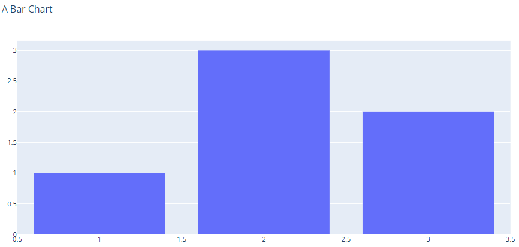

顶层 "data" 包含图数据值的列表：

- `type` 指定图类型，如 "bar", "scatter", "contour" 等
- 余下用于各种配置

顶层 "layout" 用于指定图布局的字典，相对于 trace 配置应用于特定图，layout 配置作用于整个 figure，用于自定义坐标轴、注释、形状、图例等。

### 图形对象

除了 Python 字典，plotly.py 还提供了一种创建方式，即通过一系列的图形对象创建图表。相对字典，使用图形类具有如下优点：

- Graph 对象提供了数据验证功能。如果提供了无效的属性名称或值，可以看到有用的错误信息。
- Graph 对象的 Python 文档包含对每个属性的说明。可以参看这些文档而不用专门去 plotly 官网查询参考。
- Graph 对象属性可以通过键查找（如 `fig["layout"]`），或者访问对象式的方式（`fig.layout`）。
- Graph 对象的高级API可以方便的已创建的图。

Graph 对象以树形结构保存在 `plotly.graph_objects` 包中。下面用对象方式创建上例的图：

```py
import plotly.graph_objects as go

fig = go.Figure(
    data=[go.Bar(x=[1, 2, 3], y=[1, 3, 2])],
    layout=go.Layout(
        title=go.layout.Title(text="A Bar Chart")
    )
)

fig.show()
```

还可以采用混合模式，将字典表示方式传递给构造函数：

```py
import plotly.graph_objects as go
fig = go.Figure({
    "data": [{"type": "bar",
              "x": [1, 2, 3],
              "y": [1, 3, 2]}],
    "layout": {"title": {"text": "A Bar Chart"}}
})
fig.show()
```

创建好图形对象后：

- 可以通过 `fig.to_dict()` 将图形转换为字典。
- 可以使用 `fig.to_json()` 将图形转换为 JSON。

## 创建图形

下面总结创建图形对象的各种方式。

### 构造函数

如上所示，可以将图形所需的数据和配置传递给 `plotly.graph_objects.Figure` 构造函数创建图形。

其中 trace 和 layout 可以是字典或 graph 对象。上面采用字典，这里采用图形对象指定 trace，layout 依然用字典：

```py
import plotly.graph_objects as go
fig = go.Figure(
    data=[go.Bar(x=[1, 2, 3], y=[1, 3, 2])],
    layout=dict(title=dict(text="A Bar Chart"))
)
fig.show()
```

### Plotly express

Plotly express （`plotly.express` 模块）是生成图形对象的高级API。例如：

```py
import plotly.express as px
iris = px.data.iris()
fig = px.scatter(iris, x="sepal_width", y="sepal_length", color="species")

# If you print fig, you'll see that it's just a regular figure with data and layout
# print(fig)

fig.show()
```

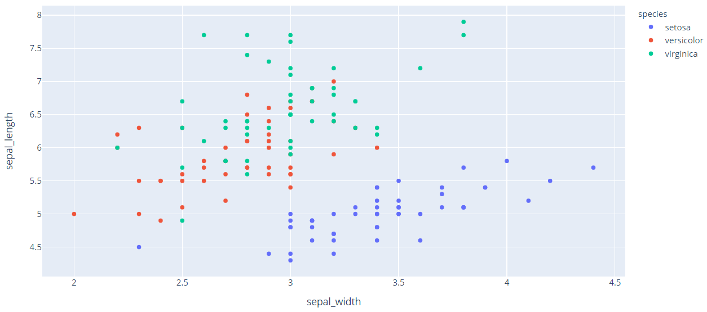

### Figure factories

Figure factories （`plotly.figure_factory` 模块）包含生成图形对象的函数。

例如，下面用 [`create_quiver`](../src/plotly_test/factory_quiver.py) 工厂方法生成 2D quiver 图：

```py
import numpy as np
import plotly.figure_factory as ff
x1,y1 = np.meshgrid(np.arange(0, 2, .2), np.arange(0, 2, .2))
u1 = np.cos(x1)*y1
v1 = np.sin(x1)*y1

fig = ff.create_quiver(x1, y1, u1, v1)
fig.show()
```

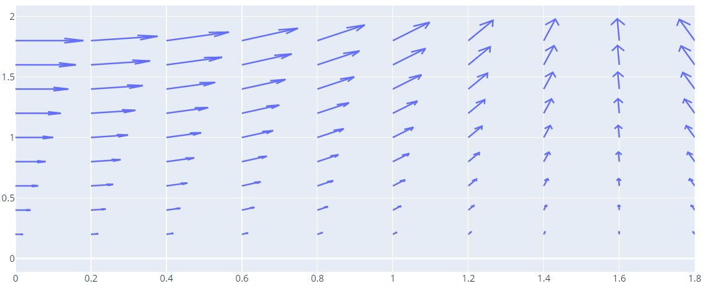

### 子图

`plotly.subplots.make_subplots` 函数可以生成包含多个网格子图区域的图形，随后可以使用 `add_trace` 往各个网格添加 trace。例：

```py
from plotly.subplots import make_subplots
fig = make_subplots(rows=1, cols=2)
fig.add_trace(go.Scatter(y=[4, 2, 1], mode="lines"), row=1, col=1)
fig.add_trace(go.Bar(y=[2, 1, 3]), row=1, col=2)
fig.show()
```

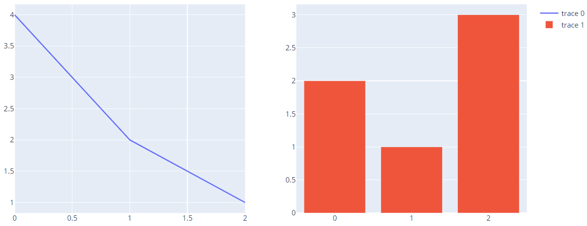

## 更新图

不管使用哪种方式创建图形，都可以继续添加 trace、修改属性。

### 添加 trace（Adding trace）

可以使用 `add_trace` 方法添加 trace 到 figure 中。该方法接受graph 对象作为参数，如 `go.Scatter`, `go.Bar` 等的实例。

例如，下面先创建一个空的 figure，然后添加 trace：

```py
import plotly.graph_objects as go
fig = go.Figure()
fig.add_trace(go.Bar(x=[1, 2, 3], y=[1, 3, 2]))
fig.show()
```

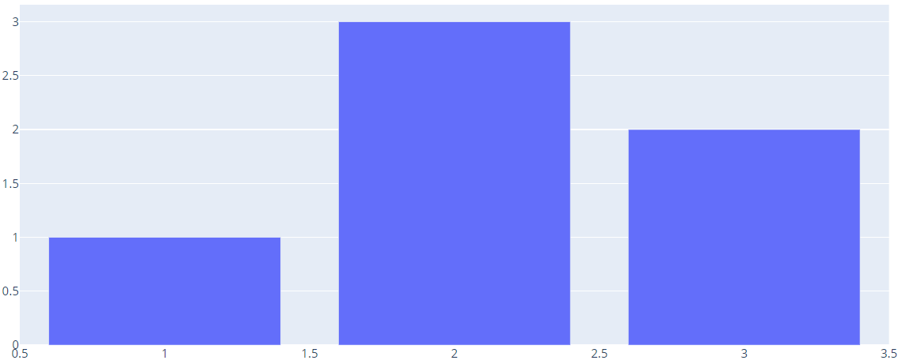

或者添加 trace 到 figure 工厂或 plotly express 创建的 figure：

```py
iris = px.data.iris()
fig = px.scatter(iris, x="sepal_width", y="sepal_length", color="species")
fig.add_trace(
    go.Scatter(
        x=[2, 4],
        y=[4, 8],
        mode="lines",
        line=go.scatter.Line(color="gray"),
        showlegend=False)
)
fig.show()
```

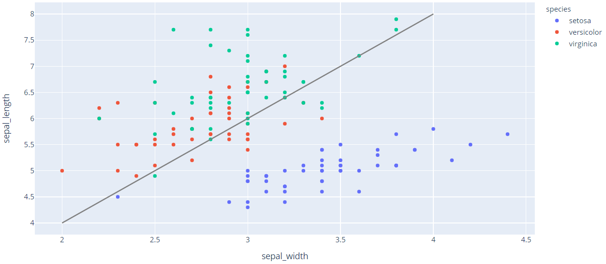

### 添加 trace 到 subplots

如果 figure 是使用 `plotly.subplots.make_subplots` 创建的，则调用 `add_trace` 时可以指定 `row` 和 `col` 参数。

```py
from plotly.subplots import make_subplots
fig = make_subplots(rows=1, cols=2)
fig.add_trace(go.Scatter(y=[4, 2, 1], mode="lines"), row=1, col=1)
fig.add_trace(go.Bar(y=[2, 1, 3]), row=1, col=2)
fig.show()
```

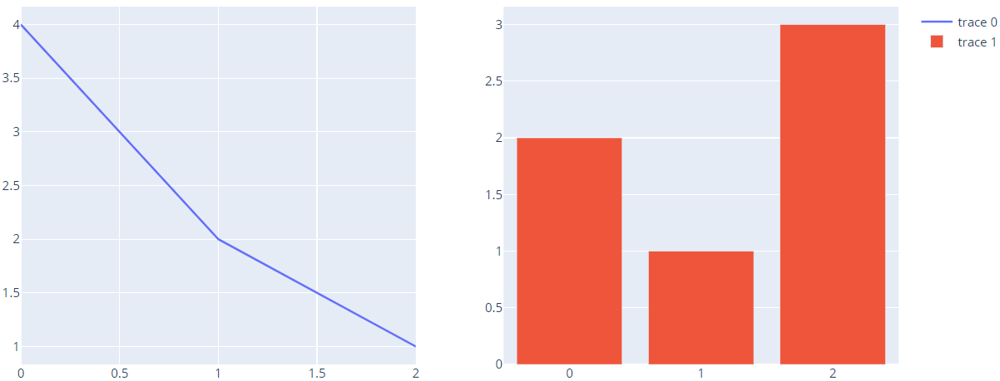

对 plotly express，使用 `facet_row` 或 `facet_col` 参数创建的 figure，也具有该功能：

```py
import plotly.express as px
iris = px.data.iris()
fig = px.scatter(iris, x="sepal_width", y="sepal_length", color="species", facet_col="species")
reference_line = go.Scatter(x=[2, 4],
                            y=[4, 8],
                            mode="lines",
                            line=go.scatter.Line(color="gray"),
                            showlegend=False)
fig.add_trace(reference_line, row=1, col=1)
fig.add_trace(reference_line, row=1, col=2)
fig.add_trace(reference_line, row=1, col=3)
fig.show()
```

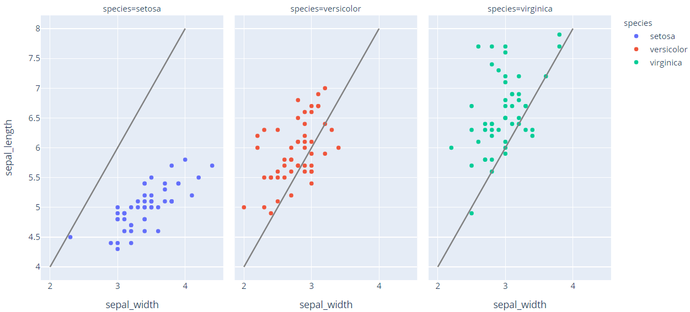

### Add trace 的简易方法

除了 `add_trace` 方法，graph figure 对象包含一系列的 `add_{trace}`方法，其中 `{trace}` 表示 trace 类型，如 `add_scatter`, `add_var` 等。

例如，使用 `add_scatter` 添加散点图，使用 `add_bar` 添加柱状图：

```py
from plotly.subplots import make_subplots

fig = make_subplots(rows=1, cols=2)
fig.add_scatter(y=[4, 2, 1], mode="lines", row=1, col=1)
fig.add_bar(y=[2, 1, 3], row=1, col=2)

fig.show()
```

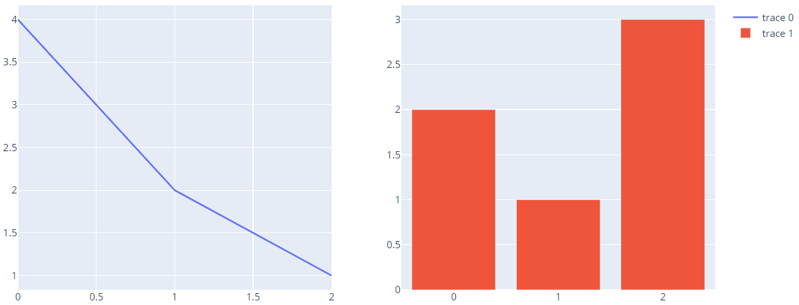

### 下划线

为了能够更容易访问属性，Plotly 支持通过下划线连接访问属性。

例如，如果不使用下划线，设置标题需要将 `layout` 属性设置为 `dict(title=dict(text="A Chart"))`，类似的，设置 scatter trace 的线条颜色需要设置 `marker` 属性为 `dict(color="crimson")`。

如下：

```py
import plotly.graph_objects as go
fig = go.Figure(
    data=[go.Scatter(y=[1, 3, 2], line=dict(color="crimson"))],
    layout=dict(title=dict(text="A Chart"))
)
fig.show()
```

而使用下划线要简单许多：

```py
import plotly.graph_objects as go
fig = go.Figure(
    data=[go.Scatter(y=[1, 3, 2], line_color="crimson")],
    layout_title_text="A Chart"
)
fig.show()
```

整个图形对象API都支持下划线表示法，大大简化了对深度嵌套的属性操作。

### update layout

Graph figure 对象的 `update_layout` 方法可用于一次更新 layout 的多个属性。

例如，下面用 `update_layout` 更新标题文本和字体：

```py
import plotly.graph_objects as go
fig = go.Figure(data=go.Bar(x=[1, 2, 3], y=[1, 3, 2]))
fig.update_layout(title_text="A Bar Chart",
                  title_font_size=30)
fig.show()
```

如下这些操作是等效的：

```py
fig.update_layout(title_text="A Bar Chart",
                  title_font_size=30)

fig.update_layout(title_text="A Bar Chart",
                  title_font=dict(size=30))


fig.update_layout(title=dict(text="A Bar Chart"),
                             font=dict(size=30))

fig.update_layout({"title": {"text": "A Bar Chart",
                             "font": {"size": 30}}})

fig.update_layout(
    title=go.layout.Title(text="A Bar Chart",
                          font=go.layout.title.Font(size=30)));
```

### update trace

- `update_traces` 方法可以设置 figure 的一个或多个 traces 的多个属性。

为了演示该方法，下面使用两个各自包含 bar 和 scatter traces 的两个 subplots 作为例子：

```py
from plotly.subplots import make_subplots
fig = make_subplots(rows=1, cols=2)

fig.add_scatter(y=[4, 2, 3.5], mode="markers",
                marker=dict(size=20, color="LightSeaGreen"),
                name="a", row=1, col=1)

fig.add_bar(y=[2, 1, 3],
            marker=dict(color="MediumPurple"),
            name="b", row=1, col=1)

fig.add_scatter(y=[2, 3.5, 4], mode="markers",
                marker=dict(size=20, color="MediumPurple"),
                name="c", row=1, col=2)

fig.add_bar(y=[1, 3, 2],
            marker=dict(color="LightSeaGreen"),
            name="d", row=1, col=2)

fig.show()
```

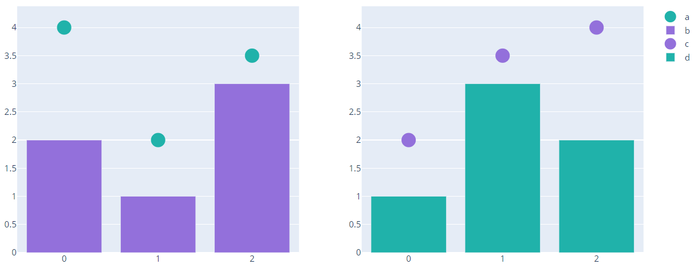

`scatter` 和 `bar` traces 都有 `marker.color` 属性，下面使用 `update_traces` 修改所有 traces 的颜色：

```py
from plotly.subplots import make_subplots
fig = make_subplots(rows=1, cols=2)

fig.add_scatter(y=[4, 2, 3.5], mode="markers",
                marker=dict(size=20, color="LightSeaGreen"),
                name="a", row=1, col=1)

fig.add_bar(y=[2, 1, 3],
            marker=dict(color="MediumPurple"),
            name="b", row=1, col=1)

fig.add_scatter(y=[2, 3.5, 4], mode="markers",
                marker=dict(size=20, color="MediumPurple"),
                name="c", row=1, col=2)

fig.add_bar(y=[1, 3, 2],
            marker=dict(color="LightSeaGreen"),
            name="d", row=1, col=2)

fig.update_traces(marker=dict(color="RoyalBlue"))

fig.show()
```

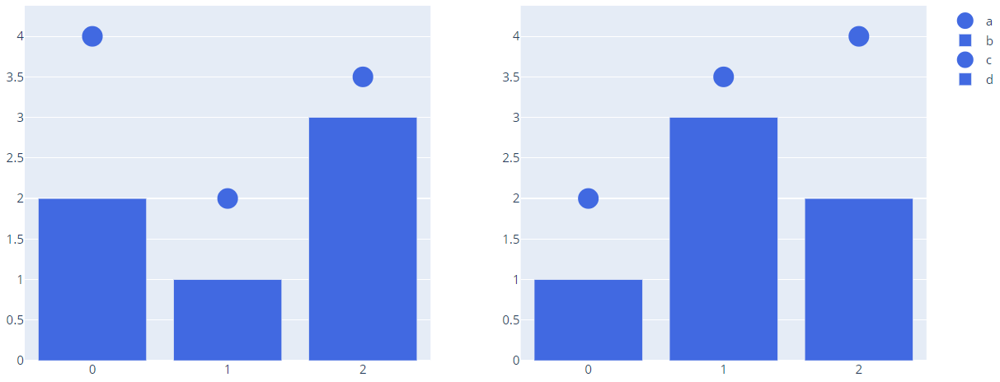

- `update_traces` 方法支持 `selector` 参数，用于选择需要更新的 traces，只有包含 selector 对应属性的 traces 才会更新。例如，只更新 `bar` 的颜色：

```py
from plotly.subplots import make_subplots
fig = make_subplots(rows=1, cols=2)

fig.add_scatter(y=[4, 2, 3.5], mode="markers",
                marker=dict(size=20, color="LightSeaGreen"),
                name="a", row=1, col=1)

fig.add_bar(y=[2, 1, 3],
            marker=dict(color="MediumPurple"),
            name="b", row=1, col=1)

fig.add_scatter(y=[2, 3.5, 4], mode="markers",
                marker=dict(size=20, color="MediumPurple"),
                name="c", row=1, col=2)

fig.add_bar(y=[1, 3, 2],
            marker=dict(color="LightSeaGreen"),
            name="d", row=1, col=2)

fig.update_traces(marker=dict(color="RoyalBlue"),
                  selector=dict(type="bar"))

fig.show()
```

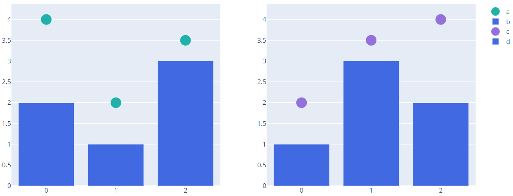

- 在 selector 中可以使用下划线

例如，更新颜色为 "MediumPurple" 的 traces：

```py
from plotly.subplots import make_subplots
fig = make_subplots(rows=1, cols=2)

fig.add_scatter(y=[4, 2, 3.5], mode="markers",
                marker=dict(size=20, color="LightSeaGreen"),
                name="a", row=1, col=1)

fig.add_bar(y=[2, 1, 3],
            marker=dict(color="MediumPurple"),
            name="b", row=1, col=1)

fig.add_scatter(y=[2, 3.5, 4], mode="markers",
                marker=dict(size=20, color="MediumPurple"),
                name="c", row=1, col=2)

fig.add_bar(y=[1, 3, 2],
            marker=dict(color="LightSeaGreen"),
            name="d", row=1, col=2)

fig.update_traces(marker_color="RoyalBlue",
                  selector=dict(marker_color="MediumPurple"))

fig.show()
```

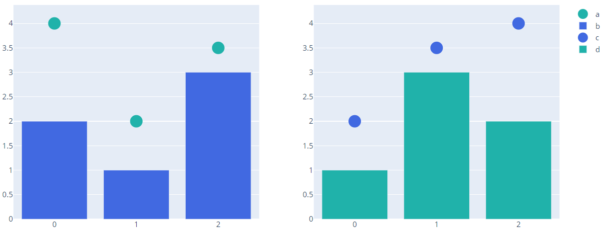

- 在包含 subplots 的 figure中，`update_traces` 方法支持 `row`, `col` 参数，以控制被更新的 trace。

例如，下面只更新第二列的 traces:

```py
from plotly.subplots import make_subplots
fig = make_subplots(rows=1, cols=2)

fig.add_scatter(y=[4, 2, 3.5], mode="markers",
                marker=dict(size=20, color="LightSeaGreen"),
                name="a", row=1, col=1)

fig.add_bar(y=[2, 1, 3],
            marker=dict(color="MediumPurple"),
            name="b", row=1, col=1)

fig.add_scatter(y=[2, 3.5, 4], mode="markers",
                marker=dict(size=20, color="MediumPurple"),
                name="c", row=1, col=2)

fig.add_bar(y=[1, 3, 2],
            marker=dict(color="LightSeaGreen"),
            name="d", row=1, col=2)

fig.update_traces(marker=dict(color="RoyalBlue"),
                  col=2)

fig.show()
```

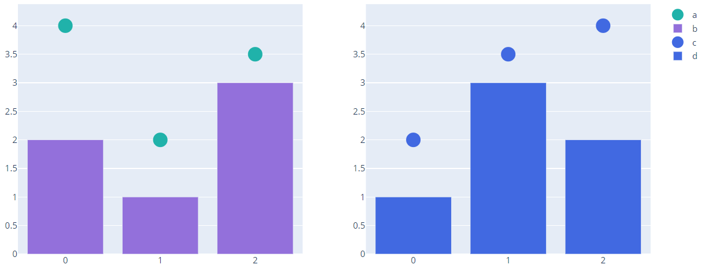

- 由 figure 工厂和 express 生成的 figure 也可以用`update_traces` 方法。

例如，使用 `update_trace` 更新express 生成的图：

```py
import plotly.express as px

df = px.data.iris()

fig = px.scatter(df, x='sepal_width', y="sepal_length", color="species", facet_col="species", trendline="ols")
fig.update_traces(
    line=dict(dash="dot", width=4),
    selector=dict(type="scatter", mode='lines')
)
fig.show()
```

### 参数覆盖

`update_layout` 和 `update_traces` 有一个 `overwrite` 关键字参数，默认为 `False`，此时将更新递归应用于现有的嵌套属性。如果将其设置为 `True`，则之前的属性被提供的值覆盖。

例如，在下例中，当调用 `update_traces` 时使用 `overwrite=True`，marker 的红色被覆盖。需要注意，使用 `marker_opacity` 不会覆盖 `marker_color`，因为此时属性从 `marker.opacity` 级别开始覆盖，只会覆盖 `opacity` 值。

```py
import plotly.graph_objects as go

fig = go.Figure(go.Bar(x=[1, 2, 3], y=[6, 4, 9],
                       marker_color='red'))
fig.update_traces(
    overwrite=True,
    marker={"opacity": 0.4}
)
fig.show()
```


### for each trace

如果需要根据 trace 的当前属性值来选择合适的 traces 更新，`update_traces` 无法处理这种情况，此时可以用 `for_each_trace` 方法。

`for_each_trace` 方法的第一个参数是更新函数，而且同 `update_traces`一样，可以使用 `selector`, `row` 和 `col` 参数。

例如，下面使用 `for_each_trace` 将 trace legend 名称中的等号替换为冒号。

```py
import plotly.express as px

df = px.data.iris()
fig = px.scatter(df, x='sepal_width', y='sepal_length', color='species')
fig.for_each_trace(
    lambda trace: trace.update(name=trace.name.replace('=', ': ')),
)
fig.show()
```

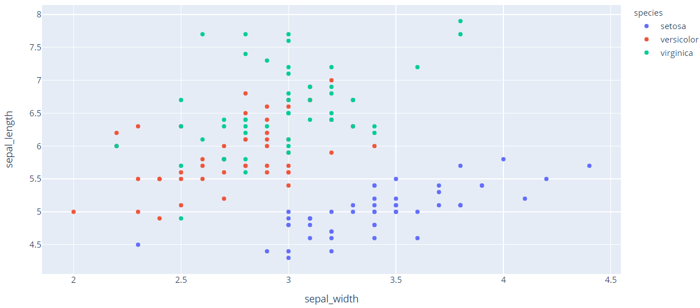

### update axis

Graph 对象支持 `update_xaxes` 和 `update_yaxes` 方法，用于更新坐标轴属性。

下面使用 `update_xaxes` 方法禁用垂直网格线。

```py
import plotly.express as px

iris = px.data.iris()
fig = px.scatter(iris, x="sepal_width", y="sepal_length", color="species", facet_col="species")
fig.update_xaxes(showgrid=False)
fig.show()
```

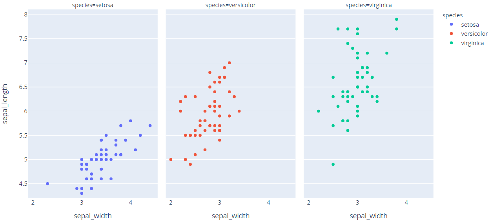

同样有 `for_each_xaxis`, `for_each_yaxis` 方法。对非笛卡尔坐标图，也有额外的 `update_{type}` 和 `for_each_{type}` 方法可用，如 `update_polar`, `for_each_polar`。

## 其它更新方法

`go` 同样支持 `update_layout_images`, `update_annotations` 和 `update_shapes` 以更新对应元素。

### 链式操作（Chaining figure operations）

上述所有更新图形的操作返回的都是图形对象。因此可以将多个操作串联在一起。

例如，下面使用链式操作创建多面散点图，然后用 `update_layout` 设置标题字体大小，`update_xaxes` 禁用垂直网格线，`update_traces` 更新趋势线的宽度和虚线模式。

> 运行下面的例子需要安装 statsmodels

```py
import plotly.express as px

df = px.data.iris()
(px.scatter(df, x="sepal_width", y="sepal_length", color="species",
            facet_col="species", trendline="ols", title="Iris Dataset")
    .update_layout(title_font_size=24)
    .update_xaxes(showgrid=False)
    .update_traces(
    line=dict(dash="dot", width=4),
    selector=dict(type="scatter", mode="lines"))
).show()
```

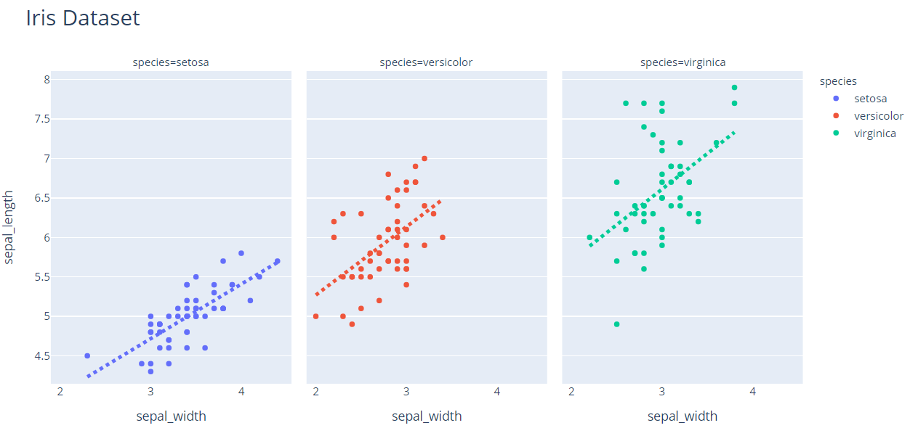

### 属性赋值（Property assignment）

可以使用属性赋值的方法更新 trace 和 layout 属性。例如：

- [使用属性赋值方式更新标题](../src/plotly_test/property_assignment.py)：

```py
import plotly.graph_objects as go

fig = go.Figure(data=go.Bar(x=[1, 2, 3], y=[1, 3, 2]))
fig.layout.title.text = "A Bar Chart"
fig.show()
```

效果：


- [使用属性赋值更新 bar 边框](../src/plotly_test/property_assignment2.py)

```py
import plotly.graph_objects as go

fig = go.Figure(data=go.Bar(x=[1, 2, 3], y=[1, 3, 2]))
fig.data[0].marker.line.width = 4
fig.data[0].marker.line.color = "black"
fig.show()
```

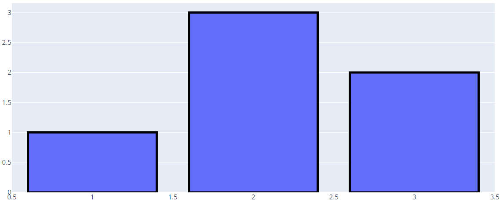
