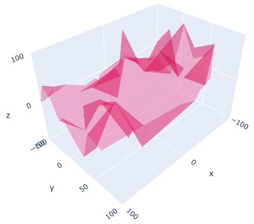
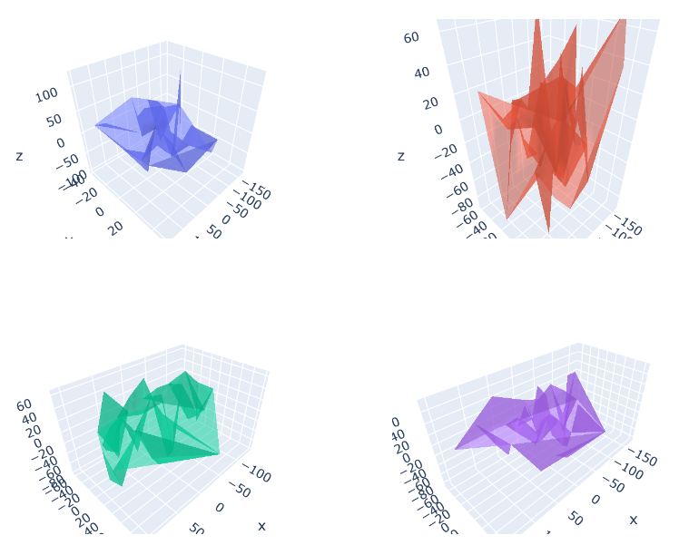
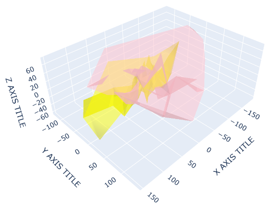
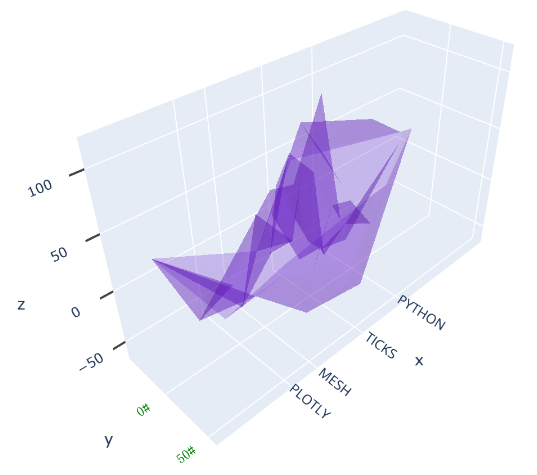
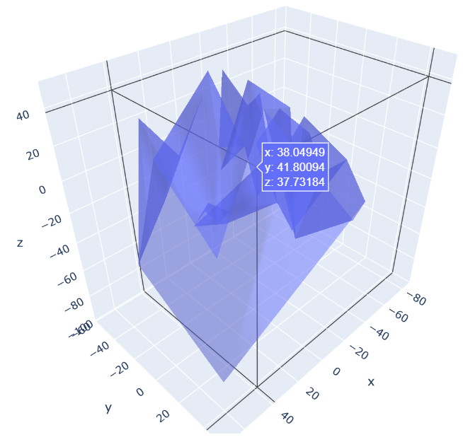
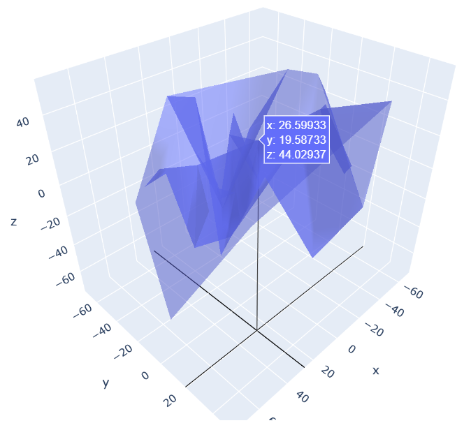

# 3D Axes

- [3D Axes](#3d-axes)
  - [简介](#简介)
  - [设置范围](#设置范围)
  - [Fixed Ratio Axes](#fixed-ratio-axes)
  - [设置坐标轴标题](#设置坐标轴标题)
  - [Ticks Formatting](#ticks-formatting)
  - [Background and Grid Color](#background-and-grid-color)
  - [Disabling tooltip spikes](#disabling-tooltip-spikes)

2020-05-07, 18:05
*** *

## 简介

3D 的 figures 在 `layout` 中包含 `scene` 属性，该属性包含 `xaxis`, `yaxis` 和 `zaxis` 等属性用于设置坐标轴的范围、标题、刻度和颜色等。

## 设置范围

```py
import numpy as np
import plotly.graph_objects as go

np.random.seed(1)

N = 70

fig = go.Figure(data=[go.Mesh3d(x=(70 * np.random.randn(N)),
                                y=(55 * np.random.randn(N)),
                                z=(40 * np.random.randn(N)),
                                opacity=0.5,
                                color='rgba(244,22,100,0.6)'
                                )])

fig.update_layout(
    scene=dict(
        xaxis=dict(nticks=4, range=[-100, 100], ),
        yaxis=dict(nticks=4, range=[-50, 100], ),
        zaxis=dict(nticks=4, range=[-100, 100], ), ),
    width=700,
    margin=dict(r=20, l=10, b=10, t=10))

fig.show()
```



## Fixed Ratio Axes

```py
import plotly.graph_objects as go
from plotly.subplots import make_subplots
import numpy as np

N = 50

fig = make_subplots(rows=2, cols=2,
                    specs=[[{'is_3d': True}, {'is_3d': True}],
                           [{'is_3d': True}, {'is_3d': True}]],
                    print_grid=False)
for i in [1,2]:
    for j in [1,2]:
        fig.append_trace(
            go.Mesh3d(
                x=(60*np.random.randn(N)),
                y=(25*np.random.randn(N)),
                z=(40*np.random.randn(N)),
                opacity=0.5,
              ),
            row=i, col=j)

fig.update_layout(width=700, margin=dict(r=10, l=10, b=10, t=10))
# fix the ratio in the top left subplot to be a cube
fig.update_layout(scene_aspectmode='cube')
# manually force the z-axis to appear twice as big as the other two
fig.update_layout(scene2_aspectmode='manual',
                  scene2_aspectratio=dict(x=1, y=1, z=2))
# draw axes in proportion to the proportion of their ranges
fig.update_layout(scene3_aspectmode='data')
# automatically produce something that is well proportioned using 'data' as the default
fig.update_layout(scene4_aspectmode='auto')
fig.show()
```



## 设置坐标轴标题

```py


Suggest an edit to this page
3D Axes in Python
How to format axes of 3d plots in Python with Plotly.


New to Plotly?
Range of axes
3D figures have an attribute in layout called scene, which contains attributes such as xaxis, yaxis and zaxis parameters, in order to set the range, title, ticks, color etc. of the axes.

For creating 3D charts, see this page.

import plotly.graph_objects as go
import numpy as np
np.random.seed(1)

N = 70

fig = go.Figure(data=[go.Mesh3d(x=(70*np.random.randn(N)),
                   y=(55*np.random.randn(N)),
                   z=(40*np.random.randn(N)),
                   opacity=0.5,
                   color='rgba(244,22,100,0.6)'
                  )])

fig.update_layout(
    scene = dict(
        xaxis = dict(nticks=4, range=[-100,100],),
                     yaxis = dict(nticks=4, range=[-50,100],),
                     zaxis = dict(nticks=4, range=[-100,100],),),
    width=700,
    margin=dict(r=20, l=10, b=10, t=10))

fig.show()
Fixed Ratio Axes
import plotly.graph_objects as go
from plotly.subplots import make_subplots
import numpy as np

N = 50

fig = make_subplots(rows=2, cols=2,
                    specs=[[{'is_3d': True}, {'is_3d': True}],
                           [{'is_3d': True}, {'is_3d': True}]],
                    print_grid=False)
for i in [1,2]:
    for j in [1,2]:
        fig.append_trace(
            go.Mesh3d(
                x=(60*np.random.randn(N)),
                y=(25*np.random.randn(N)),
                z=(40*np.random.randn(N)),
                opacity=0.5,
              ),
            row=i, col=j)

fig.update_layout(width=700, margin=dict(r=10, l=10, b=10, t=10))
# fix the ratio in the top left subplot to be a cube
fig.update_layout(scene_aspectmode='cube')
# manually force the z-axis to appear twice as big as the other two
fig.update_layout(scene2_aspectmode='manual',
                  scene2_aspectratio=dict(x=1, y=1, z=2))
# draw axes in proportion to the proportion of their ranges
fig.update_layout(scene3_aspectmode='data')
# automatically produce something that is well proportioned using 'data' as the default
fig.update_layout(scene4_aspectmode='auto')
fig.show()
Set Axes Title
import plotly.graph_objects as go
import numpy as np

# Define random surface
N = 50
fig = go.Figure()
fig.add_trace(go.Mesh3d(x=(60*np.random.randn(N)),
                   y=(25*np.random.randn(N)),
                   z=(40*np.random.randn(N)),
                   opacity=0.5,
                   color='yellow'
                  ))
fig.add_trace(go.Mesh3d(x=(70*np.random.randn(N)),
                   y=(55*np.random.randn(N)),
                   z=(30*np.random.randn(N)),
                   opacity=0.5,
                   color='pink'
                  ))

fig.update_layout(scene = dict(
                    xaxis_title='X AXIS TITLE',
                    yaxis_title='Y AXIS TITLE',
                    zaxis_title='Z AXIS TITLE'),
                    width=700,
                    margin=dict(r=20, b=10, l=10, t=10))

fig.show()
```



## Ticks Formatting

```py
import plotly.graph_objects as go
import numpy as np

# Define random surface
N = 50
fig = go.Figure(data=[go.Mesh3d(x=(60*np.random.randn(N)),
                   y=(25*np.random.randn(N)),
                   z=(40*np.random.randn(N)),
                   opacity=0.5,
                   color='rgba(100,22,200,0.5)'
                  )])

# Different types of customized ticks
fig.update_layout(scene = dict(
                    xaxis = dict(
                        ticktext= ['TICKS','MESH','PLOTLY','PYTHON'],
                        tickvals= [0,50,75,-50]),
                    yaxis = dict(
                        nticks=5, tickfont=dict(
                            color='green',
                            size=12,
                            family='Old Standard TT, serif',),
                        ticksuffix='#'),
                    zaxis = dict(
                        nticks=4, ticks='outside',
                        tick0=0, tickwidth=4),),
                    width=700,
                    margin=dict(r=10, l=10, b=10, t=10)
                  )

fig.show()
```



## Background and Grid Color

```py
import plotly.graph_objects as go
import numpy as np

N = 50
fig = go.Figure(data=[go.Mesh3d(x=(30*np.random.randn(N)),
                   y=(25*np.random.randn(N)),
                   z=(30*np.random.randn(N)),
                   opacity=0.5,)])


# xaxis.backgroundcolor is used to set background color
fig.update_layout(scene = dict(
                    xaxis = dict(
                         backgroundcolor="rgb(200, 200, 230)",
                         gridcolor="white",
                         showbackground=True,
                         zerolinecolor="white",),
                    yaxis = dict(
                        backgroundcolor="rgb(230, 200,230)",
                        gridcolor="white",
                        showbackground=True,
                        zerolinecolor="white"),
                    zaxis = dict(
                        backgroundcolor="rgb(230, 230,200)",
                        gridcolor="white",
                        showbackground=True,
                        zerolinecolor="white",),),
                    width=700,
                    margin=dict(
                    r=10, l=10,
                    b=10, t=10)
                  )
fig.show()
```


## Disabling tooltip spikes

对图中的数据点，当鼠标悬停时，默认会显示在x, y, z 轴上的投影线。通过 `showspikes` 参数可以关闭该功能。

在下例中，我们关闭 x, y 投影，值保留 `z` 投影线（在 `x-y` 平面）。

```py
import plotly.graph_objects as go
import numpy as np

N = 50
fig = go.Figure(data=[go.Mesh3d(x=(30*np.random.randn(N)),
                   y=(25*np.random.randn(N)),
                   z=(30*np.random.randn(N)),
                   opacity=0.5,)])
fig.update_layout(scene=dict(xaxis_showspikes=False,
                             yaxis_showspikes=False))
fig.show()
```


|开启 x, y 投影|关闭 x, y 投影|
|---|----|
|||
