# Theming and templates

- [Theming and templates](#theming-and-templates)
  - [简介](#简介)
  - [内置主题](#内置主题)
    - [查看可用主题](#查看可用主题)
    - [指定主题（Express）](#指定主题express)
    - [指定主题（graph object）](#指定主题graph-object)
    - [指定默认主题](#指定默认主题)
    - [禁用默认主题](#禁用默认主题)
  - [创建主题](#创建主题)
    - [layout 属性](#layout-属性)
    - [data 属性](#data-属性)
    - [Theming object tuple properties](#theming-object-tuple-properties)
    - [合并主题](#合并主题)
    - [检查内置主题](#检查内置主题)

## 简介

Plotly Python 库内置了几个主题，还支持创建和添加自定义主题。

这里主题（Theming）通常指定义可视化元素的默认样式。plotly 中使用模板（templates）对象实现主题功能。模板比传统的主题更通用，除了定义默认样式，模板还添加了注释、形状、图像等。

## 内置主题

### 查看可用主题

查看可用主题及默认主题，可以查看 `plotly.io.templates` 配置。

```py
import plotly.io as pio

print(pio.templates)
```

本机输出：

```cmd
Templates configuration
-----------------------
    Default template: 'plotly'
    Available templates:
        ['ggplot2', 'seaborn', 'simple_white', 'plotly',
         'plotly_white', 'plotly_dark', 'presentation', 'xgridoff',
         'ygridoff', 'gridon', 'none']
```

可以看到默认主题为 `plotly`，还有多种可选的主题样式。

### 指定主题（Express）

所有的 Plotly Express 函数包含一个 `template` 参数，可用于指定主题名称或 `Template` 对象（后面讨论）。

下面使用不同主题显示一个散点图：

```py
import plotly.express as px

df = px.data.gapminder()
df_2007 = df.query("year==2007")

for template in ["plotly", "plotly_white", "plotly_dark", "ggplot2", "seaborn", "simple_white", "none"]:
    fig = px.scatter(df_2007,
                     x="gdpPercap", y="lifeExp", size="pop", color="continent",
                     log_x=True, size_max=60,
                     template=template, title="Gapminder 2007: '%s' theme" % template)
    fig.show()
```

效果：

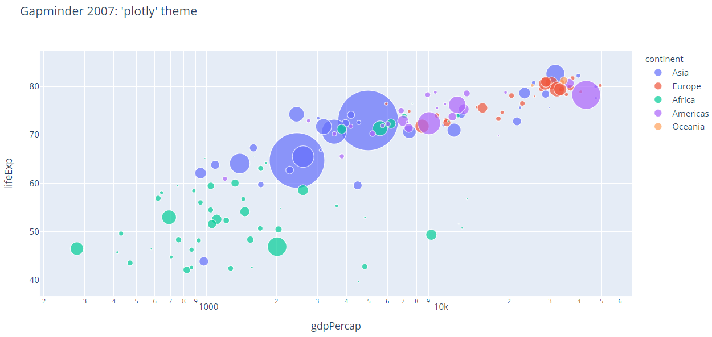

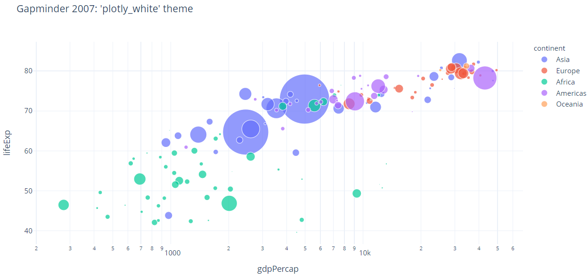

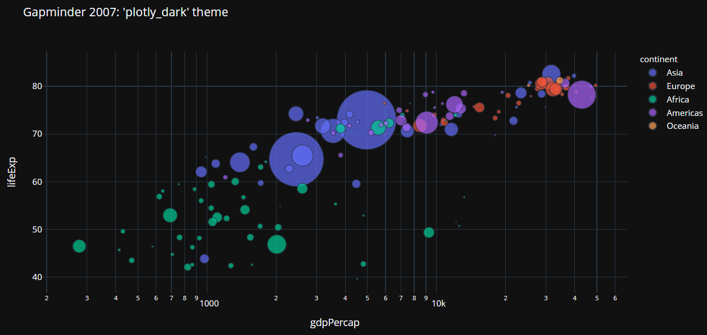

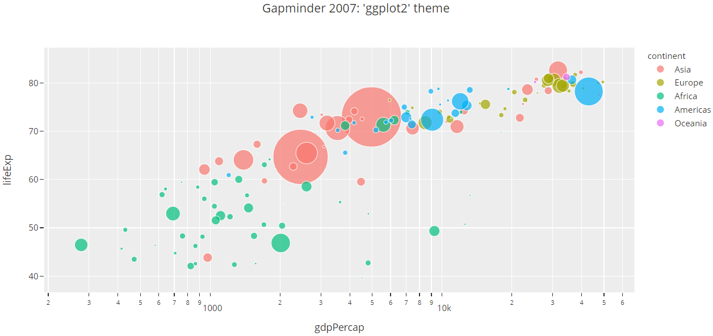

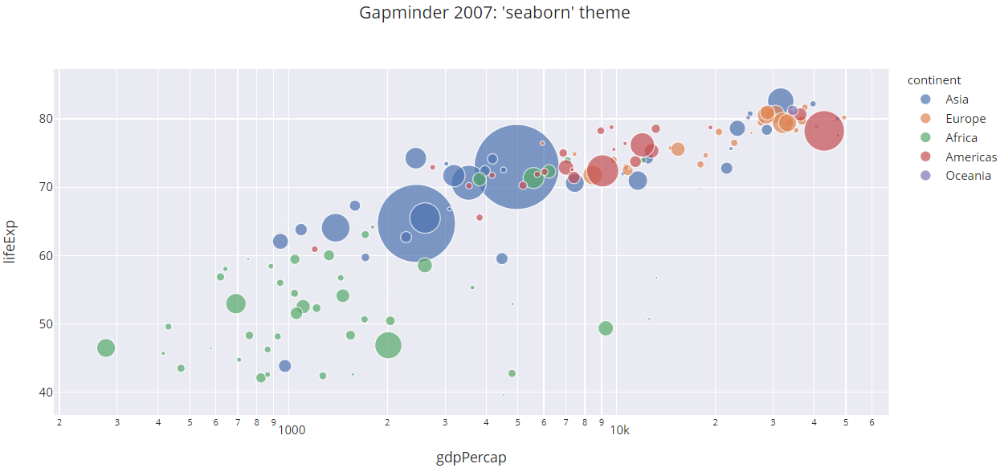

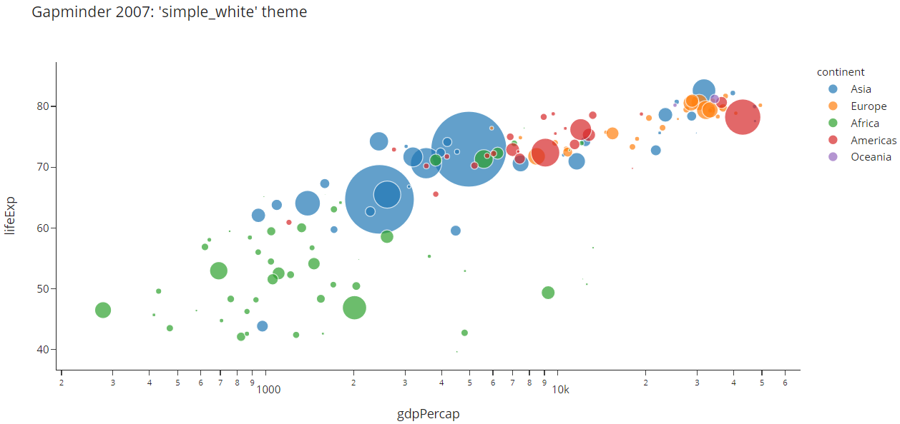

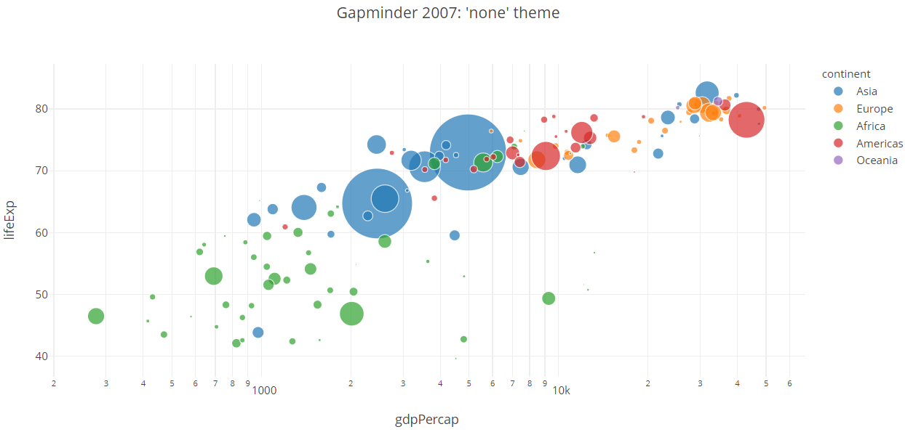

### 指定主题（graph object）

对figure 对象，可以通过 `layout` 的 `template` 属性指定主题。

例如：

```py
import plotly.graph_objects as go
import pandas as pd

z_data = pd.read_csv("https://raw.githubusercontent.com/plotly/datasets/master/api_docs/mt_bruno_elevation.csv")

fig = go.Figure(
    data=go.Surface(z=z_data.values),
    layout=go.Layout(
        title="Mt Bruno Elevation",
        width=500,
        height=500,
    ))

for template in ["plotly", "plotly_white", "plotly_dark", "ggplot2", "seaborn", "simple_white", "none"]:
    fig.update_layout(template=template, title="Mt Bruno Elevation: '%s' theme" % template)
    fig.show()
```

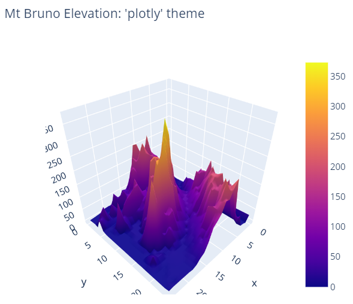

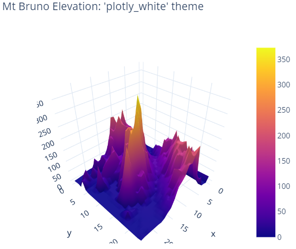

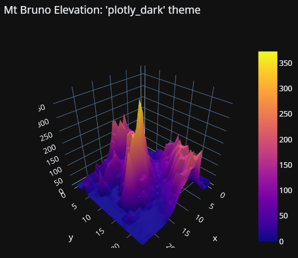

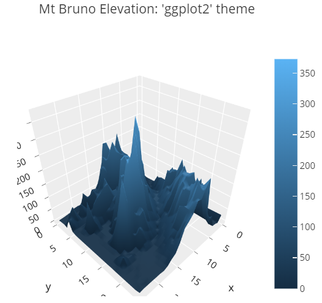

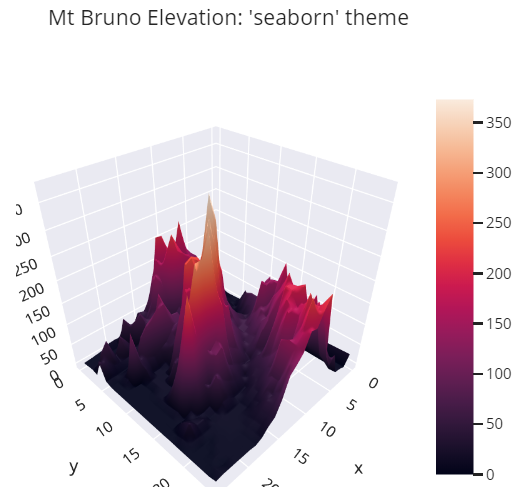

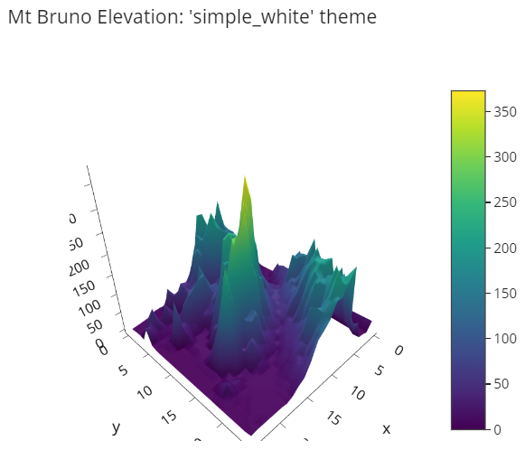

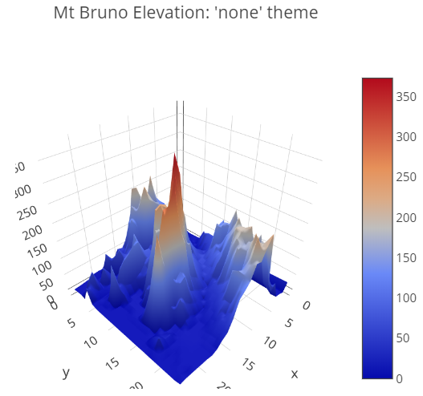

### 指定默认主题

如果没有为 express 函数或 figure 对象指定主题，默认主题被使用。默认主题为 `plotly`，但是可以通过 `plotly.io.templates.default` 属性指定默认主题。

下面将默认主题修改为 `plotly_white`，然后在创建散点图时不指定 template。

> 对 Python 程序，设置的默认主题只在当前会话中有效；对 IPython 内核，则在整个生命周期中有效，重启后则不再有效。

```py
import plotly.io as pio
import plotly.express as px

pio.templates.default = "plotly_white"

df = px.data.gapminder()
df_2007 = df.query("year==2007")

fig = px.scatter(df_2007,
                 x="gdpPercap", y="lifeExp", size="pop", color="continent",
                 log_x=True, size_max=60,
                 title="Gapminder 2007: current default theme")
fig.show()
```

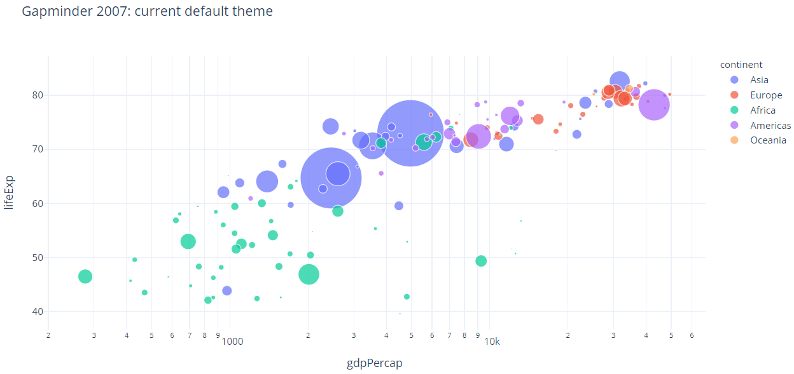

### 禁用默认主题

将默认主题设置为 `none`，其样式和 plotly.py 版本 4 一样，即不采用任何新的主题样式。

## 创建主题

plotly.py 的主题由 `plotly.graph_objects.layout` 模块中的 `Template` 类的实例表示。`Template` 是一个 graph 对象，包含两个顶层属性：`layout` 和 `data`。

### layout 属性

模板的 `layout` 属性和 figure 的 `layout` 属性结构完全相同。为模板 `layout` 设置的属性值，会作为使用该模板 figure 的属性默认值。

下面创建一个模板，将标题字体设置为 Rockwell 24，然后使用该模板创建一个 figure。

```py
import plotly.graph_objects as go

large_rockwell_template = dict(
    layout=go.Layout(title_font=dict(family="Rockwell", size=24))
)

fig = go.Figure()
fig.update_layout(title='Figure Title', template=large_rockwell_template)
fig.show()
```

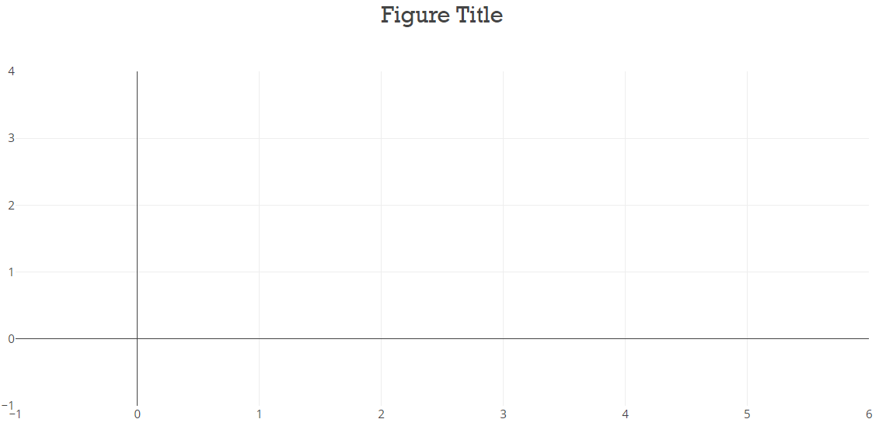

### data 属性

模板的 `data` 属性应用于添加到 figure 的 traces。`data` 属性持有 graph 对象 `go.layout.template.Data`，该对象包含支持的所有 trace 类型的属性。

下面创建一个模板，将 scatter trance markers设置为 20 diamonds，然后使用该模板创建一个 figure。

```py
import plotly.graph_objects as go

diamond_template = go.layout.Template()
diamond_template.data.scatter = [go.Scatter(marker=dict(symbol="diamond", size=20))]

fig = go.Figure()
fig.update_layout(template=diamond_template)
fig.add_scatter(y=[2, 1, 3], mode="markers")
fig.show()
```

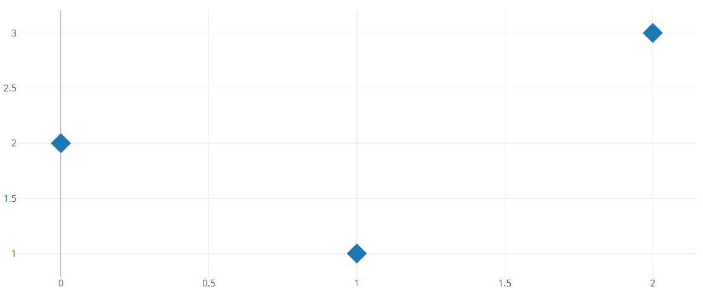

如果将 trace 类型属性设置为 trace 类型列表，则当向图中添加多个 traces，这些 traces 的默认属性按照列表循环。

```py
import plotly.graph_objects as go

symbol_template = go.layout.Template()
symbol_template.data.scatter = [
    go.Scatter(marker=dict(symbol="diamond", size=10)),
    go.Scatter(marker=dict(symbol="square", size=10)),
    go.Scatter(marker=dict(symbol="circle", size=10)),
]

fig = go.Figure()
fig.update_layout(template=symbol_template)
fig.add_scatter(y=[1, 2, 3], mode="markers", name="first")
fig.add_scatter(y=[2, 3, 4], mode="markers", name="second")
fig.add_scatter(y=[3, 4, 5], mode="markers", name="third")
fig.add_scatter(y=[4, 5, 6], mode="markers", name="forth")
fig.show()
```

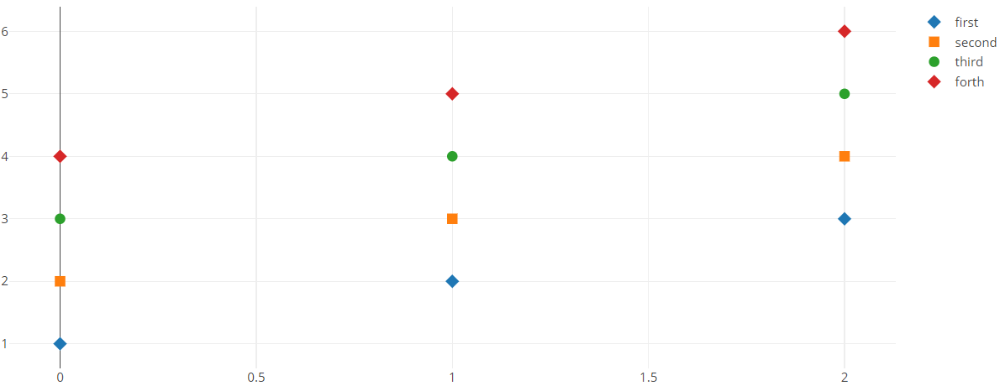

### Theming object tuple properties

figure 的有些属性以 tuple 指定。例如，figure 的文本注释可以在 `annotations` 属性中以 `go.layout.Annotation` 对象的 tuple 指定。

要配置模板中 tuple 类属性（如 `layout.annotations`）的所有元素的默认属性，可以使用模板中与 tuple 属性对应的 `*defaults` 属性（例如 `layout.template.layout.annotationdefaults`）。`*default` 属性需要设置为与之类型匹配的 graph 对象。

下面创建一个模板，指定默认注释文本颜色，然后使用该模板新建一个 figure ：

```py
import plotly.graph_objects as go

annotation_template = go.layout.Template()
annotation_template.layout.annotationdefaults = dict(font=dict(color="crimson"))

fig = go.Figure()
fig.update_layout(
     template=annotation_template,
     annotations=[
         dict(text="Look Here", x=1, y=1),
         dict(text="Look There", x=2, y=2)
     ]
 )
fig.show()
```

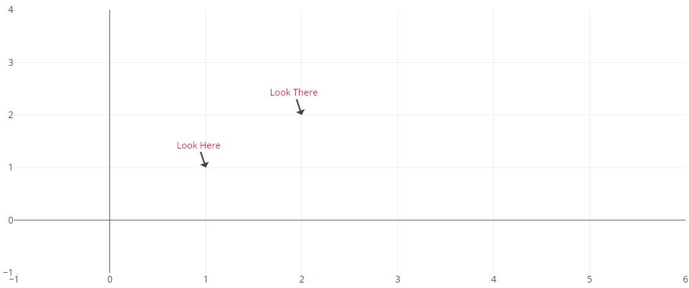


### 合并主题

如果希望在其它主题的基础上进行修改，

### 检查内置主题

