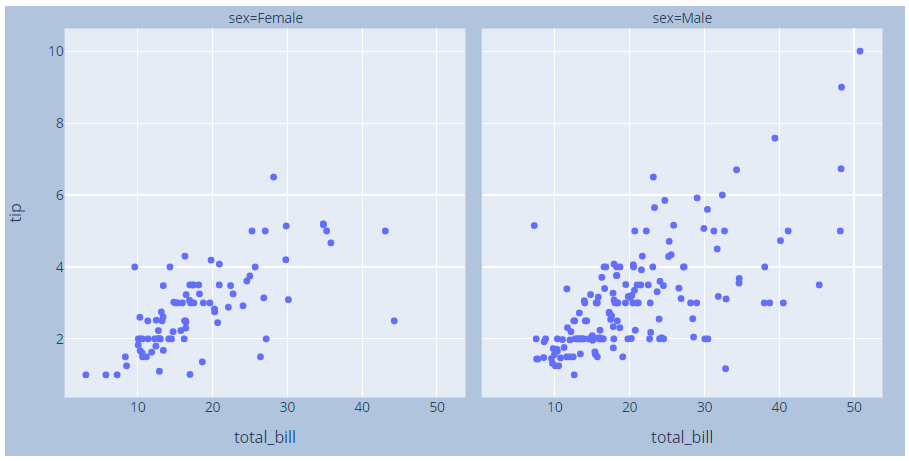
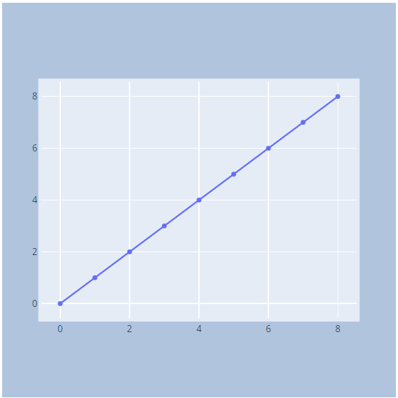
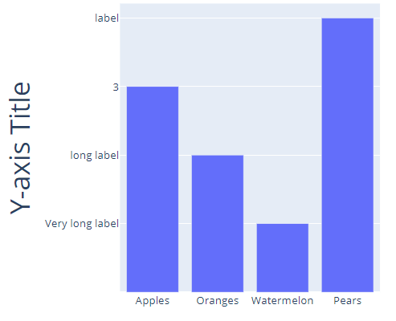

# Graph size

- [Graph size](#graph-size)
  - [Height, Width, Margin with Express](#height-width-margin-with-express)
  - [Height, Width, Margin with go](#height-width-margin-with-go)
  - [自动调整边距](#自动调整边距)

2020-04-18, 20:12
*** **

## Height, Width, Margin with Express

```py
import plotly.express as px

df = px.data.tips()
fig = px.scatter(df, x="total_bill", y="tip", facet_col="sex",
                 width=800, height=400)

fig.update_layout(
    margin=dict(l=20, r=20, t=20, b=20),
    paper_bgcolor="LightSteelBlue", # 纸张颜色，即整个绘图面板颜色
)

fig.show()
```



## Height, Width, Margin with go

```py
import plotly.graph_objects as go

fig = go.Figure()

fig.add_trace(go.Scatter(
    x=[0, 1, 2, 3, 4, 5, 6, 7, 8],
    y=[0, 1, 2, 3, 4, 5, 6, 7, 8]
))

fig.update_layout(
    autosize=False,
    width=500,
    height=500,
    margin=dict(
        l=50,
        r=50,
        b=100,
        t=100,
        pad=4
    ),
    paper_bgcolor="LightSteelBlue",
)

fig.show()
```



## 自动调整边距

设置 `automargin=True` 可以自动调整边距，以避免刻度标签被截断或与轴标题重叠。

```py
import plotly.graph_objects as go


fig = go.Figure()

fig.add_trace(go.Bar(
    x=["Apples", "Oranges", "Watermelon", "Pears"],
    y=[3, 2, 1, 4]
))

fig.update_layout(
    autosize=False,
    width=500,
    height=500,
    yaxis=dict(
        title_text="Y-axis Title",
        ticktext=["Very long label", "long label", "3", "label"],
        tickvals=[1, 2, 3, 4],
        tickmode="array",
        titlefont=dict(size=30),
    )
)

fig.update_yaxes(automargin=True)

fig.show()
```


