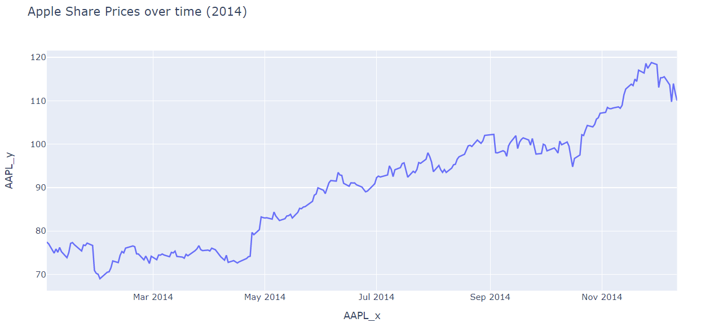
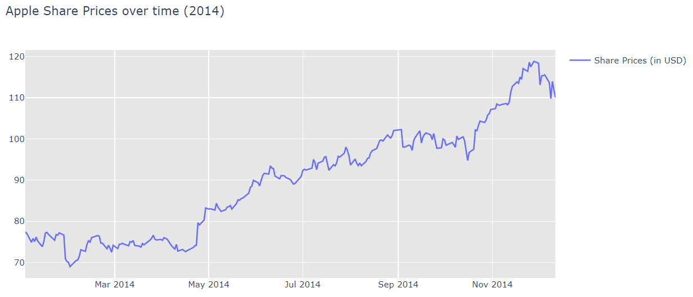

# 绘制 CSV 数据

2022-04-23, 14:26
****

## 简介

CSV 或逗号分隔值是一种非常流行的结构化数据存储格式。下面演示使用 CSV 数据绘制图形。包括从外源（URL）导入 CSV 数据，并用 plotly 和 pandas 绘图。

首先，导入数据：

```py
import pandas as pd

df = pd.read_csv('https://raw.githubusercontent.com/plotly/datasets/master/2014_apple_stock.csv')
df.head()
```

```txt
       AAPL_x     AAPL_y
0  2014-01-02  77.445395
1  2014-01-03  77.045575
2  2014-01-06  74.896972
3  2014-01-07  75.856461
4  2014-01-08  75.091947
```

## PX API

```py
import pandas as pd
import plotly.express as px

df = pd.read_csv('https://raw.githubusercontent.com/plotly/datasets/master/2014_apple_stock.csv')

fig = px.line(df, x = 'AAPL_x', y = 'AAPL_y', title='Apple Share Prices over time (2014)')
fig.show()
```



## go API

```py
import pandas as pd
import plotly.graph_objects as go

df = pd.read_csv('https://raw.githubusercontent.com/plotly/datasets/master/2014_apple_stock.csv')

fig = go.Figure(go.Scatter(x=df['AAPL_x'], y=df['AAPL_y'],
                           name="Share Prices (in USD)"))
fig.update_layout(title="Apple Share Prices over time (2014)",
                  plot_bgcolor='rgb(230, 230, 230)',
                  showlegend=True)
fig.show()
```



## 参考

- https://plotly.com/python/plot-data-from-csv/
