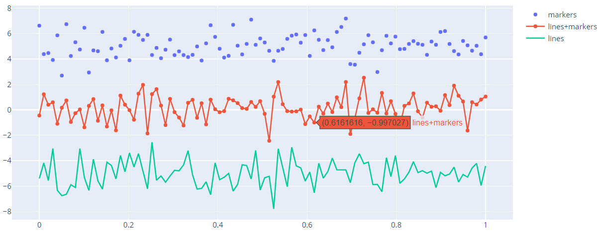

# API

- [API](#api)
  - [Figure](#figure)
    - [参数](#%e5%8f%82%e6%95%b0)
  - [Layout](#layout)
    - [showlegend](#showlegend)
  - [属性](#%e5%b1%9e%e6%80%a7)
    - [name](#name)

## Figure

### 参数

## Layout

`title_text`, 标题文本。

### showlegend

parent: `layout`

Type: boolean

是否显示 legend。如果有一个 trace，并满足如下任意条件，默认为 `True`:

- 包含两个或多个 trace
- 有 pie trace
- 显式设置 `showlegend:True`

## 属性

### name

Parent: `data`

trace 名称。在 legend 处和悬停时显示。

例如：

```py
import plotly.graph_objects as go

# Create random data with numpy
import numpy as np
np.random.seed(1)

N = 100
random_x = np.linspace(0, 1, N)
random_y0 = np.random.randn(N) + 5
random_y1 = np.random.randn(N)
random_y2 = np.random.randn(N) - 5

fig = go.Figure()

# Add traces
fig.add_trace(go.Scatter(x=random_x, y=random_y0,
                    mode='markers',
                    name='markers'))
fig.add_trace(go.Scatter(x=random_x, y=random_y1,
                    mode='lines+markers',
                    name='lines+markers'))
fig.add_trace(go.Scatter(x=random_x, y=random_y2,
                    mode='lines',
                    name='lines'))

fig.show()
```



name 在右侧的 legend 显示，图中显示时鼠标悬停时的效果。