# Bar chart

- [Bar chart](#bar-chart)
  - [简介](#%e7%ae%80%e4%bb%8b)
  - [Express API](#express-api)
    - [垂直 Bar - px](#%e5%9e%82%e7%9b%b4-bar---px)
    - [水平 Bar - px](#%e6%b0%b4%e5%b9%b3-bar---px)
    - [个性化](#%e4%b8%aa%e6%80%a7%e5%8c%96)
    - [堆叠条形图](#%e5%a0%86%e5%8f%a0%e6%9d%a1%e5%bd%a2%e5%9b%be)
    - [Facetted subplots - 分类子图](#facetted-subplots---%e5%88%86%e7%b1%bb%e5%ad%90%e5%9b%be)
    - [配置水平 bar chart](#%e9%85%8d%e7%bd%ae%e6%b0%b4%e5%b9%b3-bar-chart)
  - [水平或者垂直](#%e6%b0%b4%e5%b9%b3%e6%88%96%e8%80%85%e5%9e%82%e7%9b%b4)
    - [垂直 Bar - go](#%e5%9e%82%e7%9b%b4-bar---go)
    - [水平条形图 - go](#%e6%b0%b4%e5%b9%b3%e6%9d%a1%e5%bd%a2%e5%9b%be---go)
  - [`layout.barmode`](#layoutbarmode)
    - [Grouped Bar Chart](#grouped-bar-chart)
    - [Stacked Bar Chart](#stacked-bar-chart)
    - [Relative](#relative)
  - [Hover Text](#hover-text)
  - [Direct Labels](#direct-labels)
  - [uniformtext](#uniformtext)
  - [旋转坐标轴标签](#%e6%97%8b%e8%bd%ac%e5%9d%90%e6%a0%87%e8%bd%b4%e6%a0%87%e7%ad%be)
  - [设置单个 Bar 颜色](#%e8%ae%be%e7%bd%ae%e5%8d%95%e4%b8%aa-bar-%e9%a2%9c%e8%89%b2)
  - [设置单个 bar 宽度](#%e8%ae%be%e7%bd%ae%e5%8d%95%e4%b8%aa-bar-%e5%ae%bd%e5%ba%a6)
  - [设置初始值](#%e8%ae%be%e7%bd%ae%e5%88%9d%e5%a7%8b%e5%80%bc)
    - [对映](#%e5%af%b9%e6%98%a0)
  - [颜色样式](#%e9%a2%9c%e8%89%b2%e6%a0%b7%e5%bc%8f)
  - [排序](#%e6%8e%92%e5%ba%8f)

2020-04-19, 09:43
*** *

## 简介

Plotly 中条形图用 [`plotly.graph_objects.Bar`](https://plot.ly/python/reference/#bar) 表示。

`plotly.graph_objects` 中的 `go.Bar` 函数更为通用，[API 参考](https://plot.ly/python/reference/#bar)。

## Express API

```py
plotly.express.bar(data_frame=None, x=None, y=None, color=None, facet_row=None, facet_col=None, facet_col_wrap=0, hover_name=None, hover_data=None, custom_data=None, text=None, error_x=None, error_x_minus=None, error_y=None, error_y_minus=None, animation_frame=None, animation_group=None, category_orders={}, labels={}, color_discrete_sequence=None, color_discrete_map={}, color_continuous_scale=None, range_color=None, color_continuous_midpoint=None, opacity=None, orientation='v', barmode='relative', log_x=False, log_y=False, range_x=None, range_y=None, title=None, template=None, width=None, height=None)
```

`data_frame` 的每行对应一个矩形。

2. x

`str`, `int` or `Series` 或 array-like。

对 `str` 和 `int`，表示 `DataFrame` 中的 column label。

4. color

`str`, `int` or `Series` or array-like。

对 `str` 和 `int`，表示 `DataFrame` 中的 column label。

这些值用于给 marks 分配颜色。

- labels

dict: str -> str，默认 `{}`

默认，columns 名称用于 figure 的 axis title,legend 和 hovers。该参数用于覆盖该默认行为，dict 的 key 为 column 名称，value 为期望的 label。

### 垂直 Bar - px

使用 `px.bar` 创建条形图，`DataFrame` 的每一行用一个矩形表示。例如：

```py
import plotly.express as px
data_canada = px.data.gapminder().query("country == 'Canada'")
fig = px.bar(data_canada, x='year', y='pop')
fig.show()
```

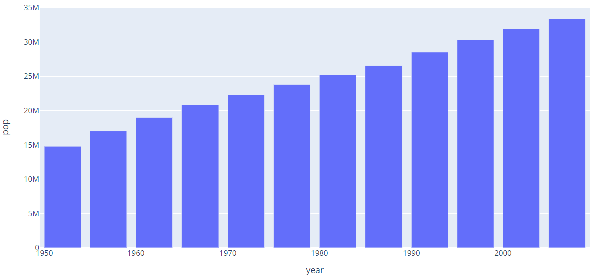

### 水平 Bar - px

设置 `orientation='h'`

```py
import plotly.express as px
df = px.data.tips()
fig = px.bar(df, x="total_bill", y="day", orientation='h')
fig.show()
```

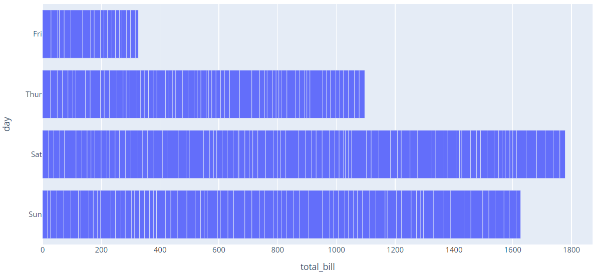

### 个性化

使用**关键字参数**个性化条形图。

例如：

```py
import plotly.express as px
data = px.data.gapminder()

data_canada = data[data.country == 'Canada']
fig = px.bar(data_canada, x='year', y='pop',
             hover_data=['lifeExp', 'gdpPercap'], color='lifeExp',
             labels={'pop':'population of Canada'}, height=400)
fig.show()
```

`color='lifeExp'` 根据 'lifeExp' 的值和当前 colorscale 分配颜色。

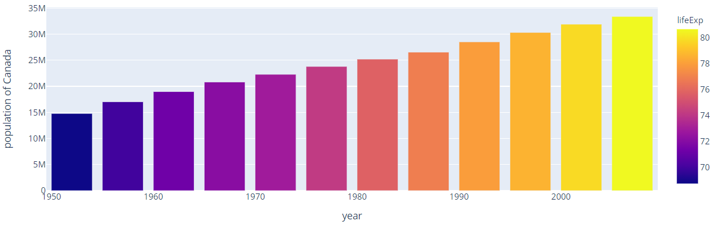

### 堆叠条形图

当多行使用相同的 `x` 值，矩形默认互相叠加：

```py
import plotly.express as px
df = px.data.tips()
fig = px.bar(df, x="sex", y="total_bill", color='time')
fig.show()
```

注意：下面的条形图堆叠在一起，高度相同分类下的加和。

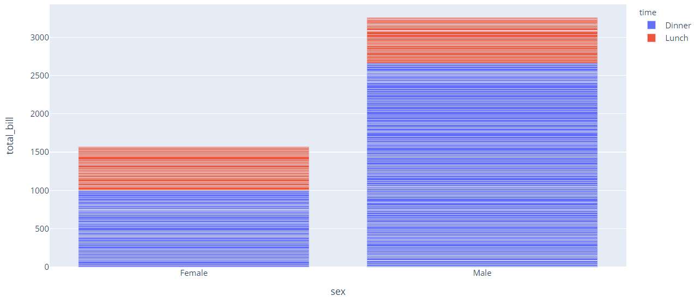

- 通过 `barmode` 修改默认堆叠行为

```py
fig = px.bar(df, x="sex", y="total_bill", color='smoker', barmode='group',
             height=400)
fig.show()
```

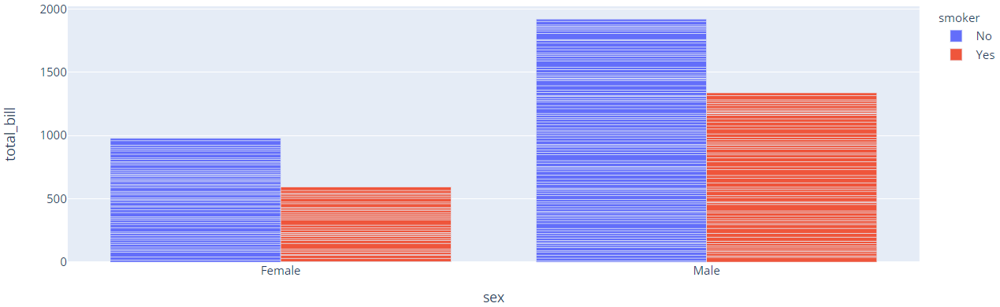

### Facetted subplots - 分类子图

使用关键字参数 `facet_row` (或 `facet_col`) 创建子图，dataframe 中和 `facet_row` 对应的每个不同值创建不同的子图。例如：

```py
import plotly.express as px
fig = px.bar(df, x="sex", y="total_bill", color="smoker", barmode="group",
             facet_row="time", facet_col="day",
             category_orders={"day": ["Thur", "Fri", "Sat", "Sun"],
                              "time": ["Lunch", "Dinner"]})
fig.show()
```

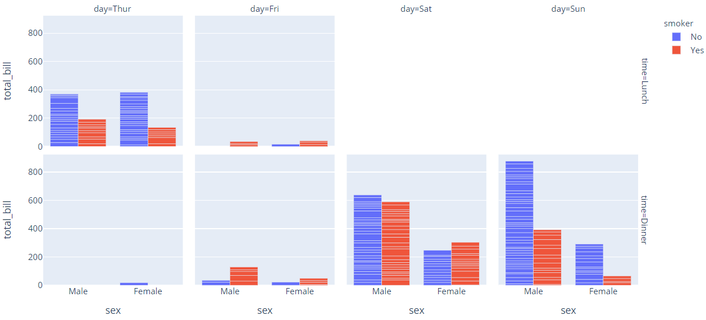

`facet_row` 指定的 "time" 有两个值，所以图分为了上下两行。

`facet_col` 指定的 "day" 包含四个值，所有图分为了四列。

### 配置水平 bar chart

- 设置颜色和hover data

```py
import plotly.express as px
df = px.data.tips()
fig = px.bar(df, x="total_bill", y="sex", color='day', orientation='h',
             hover_data=["tip", "size"],
             height=400,
             title='Restaurant bills')
fig.show()
```

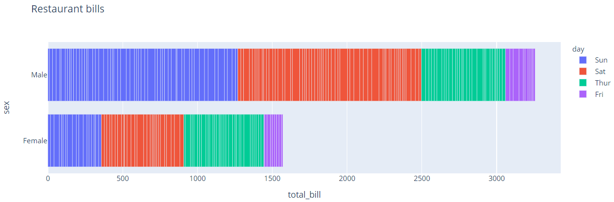

## 水平或者垂直

`orientation` 设置条形图的方向。

- 如果 `orientation` 设置为 "v"，`y` 对应数据，`x` 对应标签，默认值
- 如果 `orientation` 设置为 "h"，`x` 对应数据，`y` 对应标签

### 垂直 Bar - go

```py
import plotly.graph_objects as go
animals=['giraffes', 'orangutans', 'monkeys']

fig = go.Figure([go.Bar(x=animals, y=[20, 14, 23])])
fig.show()
```

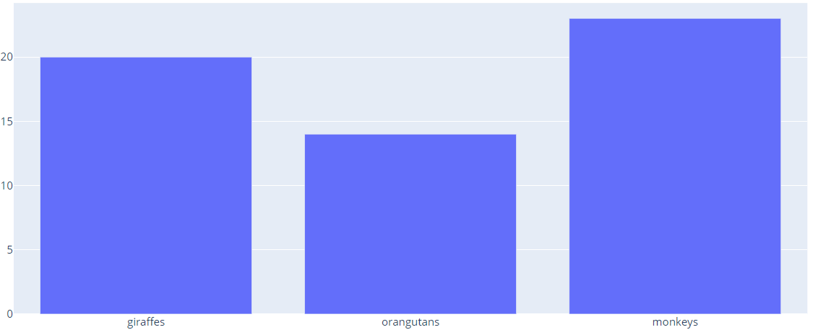

### 水平条形图 - go

```py
import plotly.graph_objects as go

fig = go.Figure(go.Bar(
            x=[20, 14, 23],
            y=['giraffes', 'orangutans', 'monkeys'],
            orientation='h'))

fig.show()
```

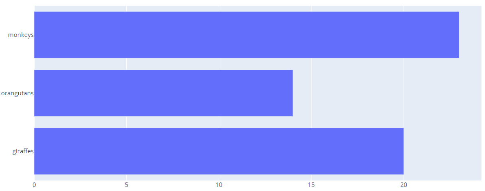

## `layout.barmode`

设置条形图的显示模式。

enum: ("stack" | "group" | "overlay" | "relative")

默认："group"

设置在相同位置的 bars 显示方式。

- `"stack"`，bars 堆叠在一起。
- `"relative"`, bars 堆叠在一起，但负值放在下面，正值放在上面。
- `"group"`，bars 以显示位置为中心并排显示。
- `"overlay"`，bars 重叠显示，对该情况，为了看到后面的 bars，需要设置透明度。

### Grouped Bar Chart

将 `barmode` 设置为 "group" 实现分组 bar chart。例如：

```py
import plotly.graph_objects as go

animals = ['giraffes', 'orangutans', 'monkeys']

fig = go.Figure(data=[
    go.Bar(name='SF Zoo', x=animals, y=[20, 14, 23]),
    go.Bar(name='LA Zoo', x=animals, y=[12, 18, 29])
])
# Change the bar mode
fig.update_layout(barmode='group')
fig.show()
```

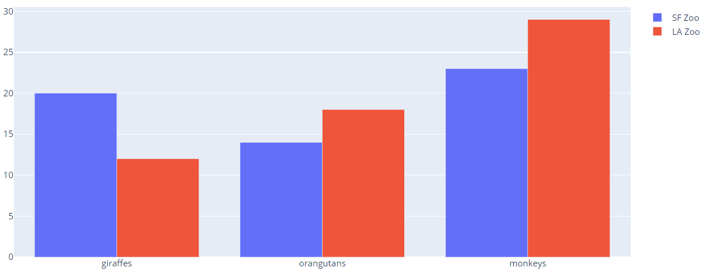

### Stacked Bar Chart

将 `barmode` 设置为 "stack" 实现堆叠 bar chart。

```py
import plotly.graph_objects as go

animals = ['giraffes', 'orangutans', 'monkeys']

fig = go.Figure(data=[
    go.Bar(name='SF Zoo', x=animals, y=[20, 14, 23]),
    go.Bar(name='LA Zoo', x=animals, y=[12, 18, 29])
])
# Change the bar mode
fig.update_layout(barmode='stack')
fig.show()
```

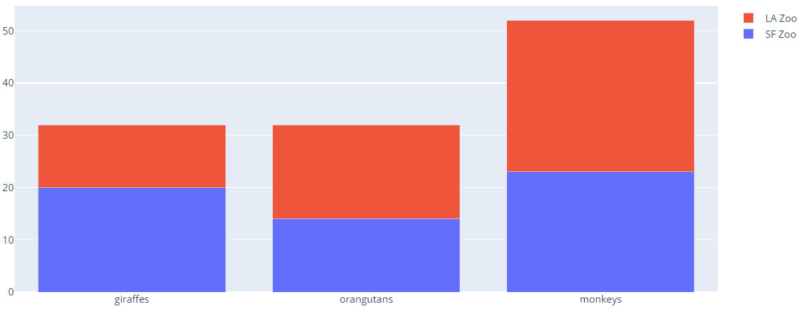

### Relative

在 "relative" 模式下，不同 bars 互相堆叠。正值在坐标轴上，负值在坐标轴下。

```py
import plotly.graph_objects as go
x = [1, 2, 3, 4]

fig = go.Figure()
fig.add_trace(go.Bar(x=x, y=[1, 4, 9, 16]))
fig.add_trace(go.Bar(x=x, y=[6, -8, -4.5, 8]))
fig.add_trace(go.Bar(x=x, y=[-15, -3, 4.5, -8]))
fig.add_trace(go.Bar(x=x, y=[-1, 3, -3, -4]))

fig.update_layout(barmode='relative', title_text='Relative Barmode')
fig.show()
```

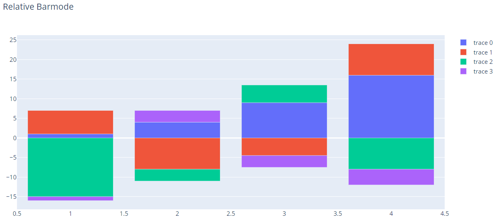

## Hover Text

将鼠标放在图上弹出来的提示文字称为 hover text。

```py
import plotly.graph_objects as go

x = ['Product A', 'Product B', 'Product C']
y = [20, 14, 23]

# Use the hovertext kw argument for hover text
fig = go.Figure(data=[go.Bar(x=x, y=y,
                             hovertext=['27% market share', '24% market share', '19% market share'])])
# custoize aspect
fig.update_traces(marker_color='rgb(158,202,225)', marker_line_color='rgb(8,48,107)',
                  marker_line_width=1.5, opacity=0.6)
fig.update_layout(title_text='January 2013 Sales Report')
fig.show()
```

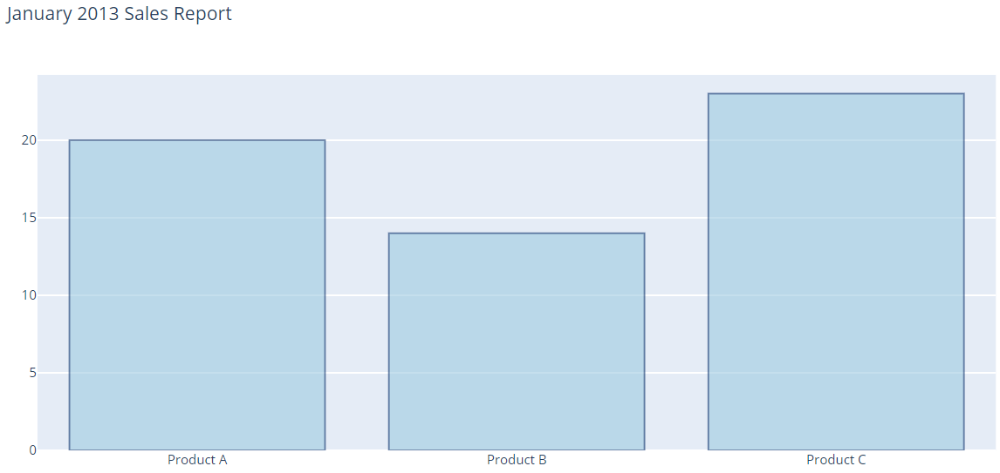

## Direct Labels

即在条形图上显示标签。

- 通过关键字参数 `text` 设置标签值
- 通过 `textposition` 设置标签位置

```py
import plotly.graph_objects as go

x = ['Product A', 'Product B', 'Product C']
y = [20, 14, 23]

# Use textposition='auto' for direct text
fig = go.Figure(data=[go.Bar(x=x, y=y,
                             text=y, textposition='auto')])
fig.show()
```

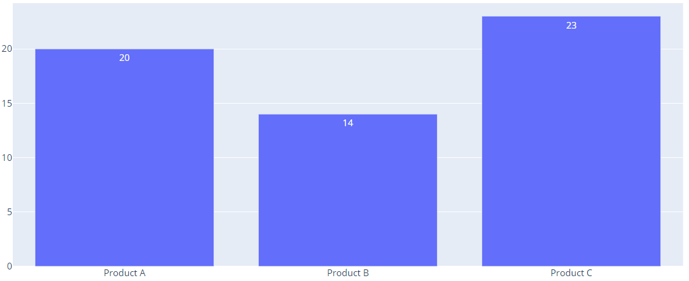

## uniformtext

通过 layout 的 `uniformtext` 参数可以设置所有的文本标签字体大小相同。

- `minsize` 属性设置字体大小
- `mode` 属性设置当空间不足以以指定 fontsize 显示标签时的行为：
  - 'hide' 隐藏标签
  - 'show' 显示标签
- `textposition`，设置标签位置

```py
import plotly.express as px

df = px.data.gapminder().query("continent == 'Europe' and year == 2007 and pop > 2.e6")
fig = px.bar(df, y='pop', x='country', text='pop')
fig.update_traces(texttemplate='%{text:.2s}', textposition='outside')
fig.update_layout(uniformtext_minsize=8, uniformtext_mode='hide')
fig.show()
```

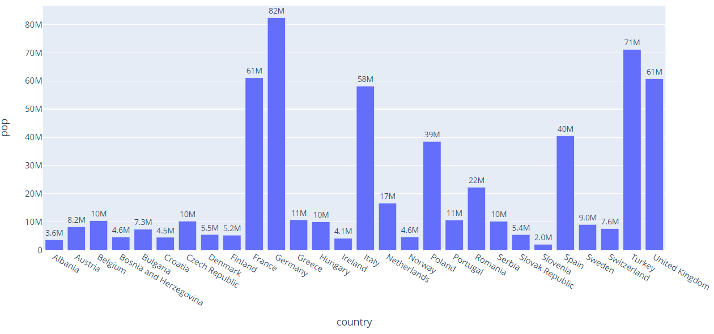

## 旋转坐标轴标签

```py
import plotly.graph_objects as go

months = ['Jan', 'Feb', 'Mar', 'Apr', 'May', 'Jun',
          'Jul', 'Aug', 'Sep', 'Oct', 'Nov', 'Dec']

fig = go.Figure()
fig.add_trace(go.Bar(
    x=months,
    y=[20, 14, 25, 16, 18, 22, 19, 15, 12, 16, 14, 17],
    name='Primary Product',
    marker_color='indianred'
))
fig.add_trace(go.Bar(
    x=months,
    y=[19, 14, 22, 14, 16, 19, 15, 14, 10, 12, 12, 16],
    name='Secondary Product',
    marker_color='lightsalmon'
))

# Here we modify the tickangle of the xaxis, resulting in rotated labels.
fig.update_layout(barmode='group', xaxis_tickangle=-45)
fig.show()
```

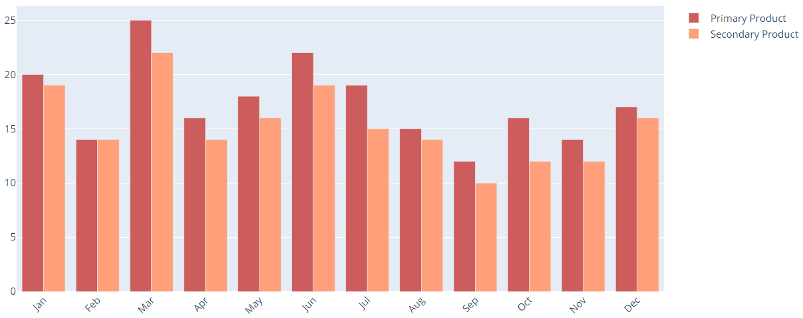

## 设置单个 Bar 颜色

```py
import plotly.graph_objects as go

colors = ['lightslategray',] * 5
colors[1] = 'crimson'

fig = go.Figure(data=[go.Bar(
    x=['Feature A', 'Feature B', 'Feature C',
       'Feature D', 'Feature E'],
    y=[20, 14, 23, 25, 22],
    marker_color=colors # marker color can be a single color value or an iterable
)])
fig.update_layout(title_text='Least Used Feature')
```

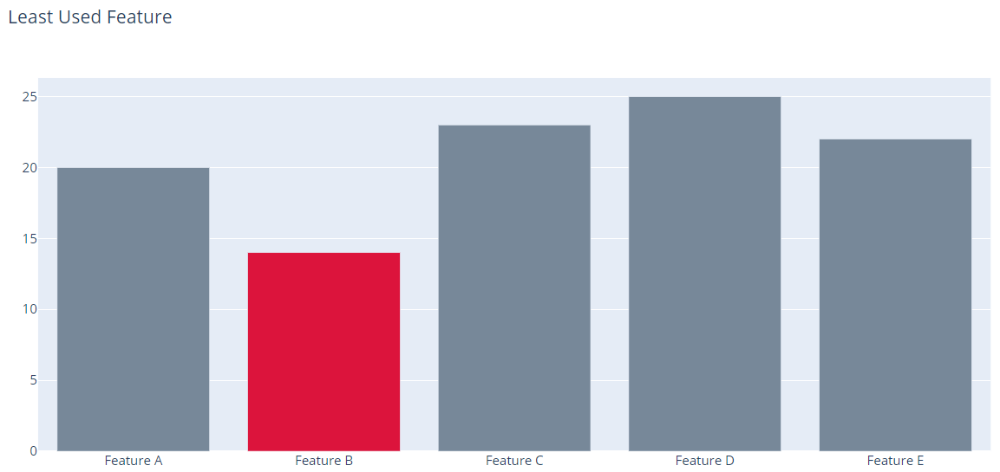

## 设置单个 bar 宽度

```py
import plotly.graph_objects as go

fig = go.Figure(data=[go.Bar(
    x=[1, 2, 3, 5.5, 10],
    y=[10, 8, 6, 4, 2],
    width=[0.8, 0.8, 0.8, 3.5, 4] # customize width here
)])

fig.show()
```

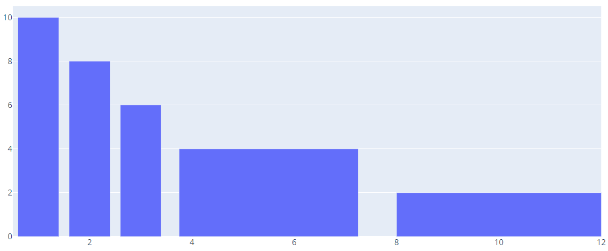

## 设置初始值

`base` 用于设置初始值位置，设置的 `y` 值都是在初始值的基础上进行增加。

```py
import plotly.graph_objects as go

years = ['2016','2017','2018']

fig = go.Figure()
fig.add_trace(go.Bar(x=years, y=[500, 600, 700],
                base=[-500,-600,-700],
                marker_color='crimson',
                name='expenses'))
fig.add_trace(go.Bar(x=years, y=[300, 400, 700],
                base=0,
                marker_color='lightslategrey',
                name='revenue'
                ))

fig.show()
```

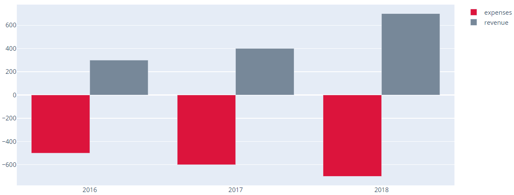

### 对映

如果设置 `base` 值的同时设置 `barmode='stack'`，可实现上下对映的形式

```py
import plotly.graph_objects as go

years = ['2016', '2017', '2018']
fig = go.Figure()
fig.add_trace(go.Bar(
    x=years,
    y=[500, 600, 700],
    base=[-500, -600, -700],
    marker_color='crimson',
    name='expenses'
))
fig.add_trace(go.Bar(
    x=years,
    y=[300, 400, 700],
    base=0,
    marker_color='lightslategrey',
    name='revenue'
))
fig.update_layout(barmode='stack', xaxis_type='category', )
fig.show()
```

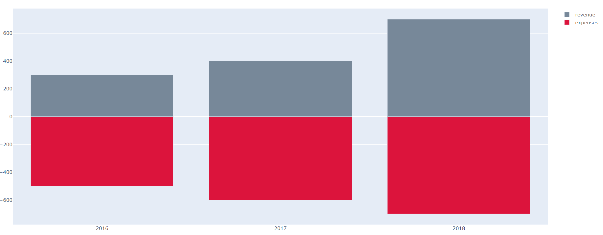

## 颜色样式

自定义样式参数较多，使用 `go.Layout()` 比使用 `fig.update` 更方便。

```py
import plotly.graph_objects as go

years = [1995, 1996, 1997, 1998, 1999, 2000, 2001, 2002, 2003,
         2004, 2005, 2006, 2007, 2008, 2009, 2010, 2011, 2012]

fig = go.Figure()
fig.add_trace(go.Bar(x=years,
                y=[219, 146, 112, 127, 124, 180, 236, 207, 236, 263,
                   350, 430, 474, 526, 488, 537, 500, 439],
                name='Rest of world',
                marker_color='rgb(55, 83, 109)'
                ))
fig.add_trace(go.Bar(x=years,
                y=[16, 13, 10, 11, 28, 37, 43, 55, 56, 88, 105, 156, 270,
                   299, 340, 403, 549, 499],
                name='China',
                marker_color='rgb(26, 118, 255)'
                ))

fig.update_layout(
    title='US Export of Plastic Scrap',
    xaxis_tickfont_size=14,
    yaxis=dict(
        title='USD (millions)',
        titlefont_size=16,
        tickfont_size=14,
    ),
    legend=dict(
        x=0,
        y=1.0,
        bgcolor='rgba(255, 255, 255, 0)',
        bordercolor='rgba(255, 255, 255, 0)'
    ),
    barmode='group',
    bargap=0.15, # gap between bars of adjacent location coordinates.
    bargroupgap=0.1 # gap between bars of the same location coordinate.
)
fig.show()
```

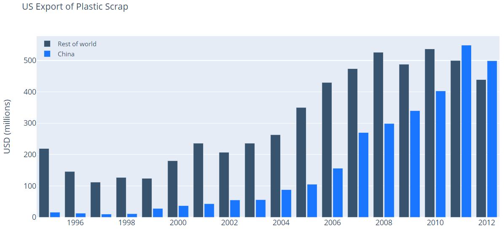

## 排序

排序设置 `categoryorder`：

- 对字符串，设置为 "category ascending" 或 "category descending"
- 对数值，设置 "total ascending" 或 "total descending"

注意，目前无法按照特定的 trace 进行排序，而只能按照总和进行排序。如果需要更多排序，可以对数据排序好再进行绘图。

实例：

```py
import plotly.graph_objects as go

x=['b', 'a', 'c', 'd']
fig = go.Figure(go.Bar(x=x, y=[2,5,1,9], name='Montreal'))
fig.add_trace(go.Bar(x=x, y=[1, 4, 9, 16], name='Ottawa'))
fig.add_trace(go.Bar(x=x, y=[6, 8, 4.5, 8], name='Toronto'))

fig.update_layout(barmode='stack', xaxis={'categoryorder':'category ascending'})
fig.show()
```

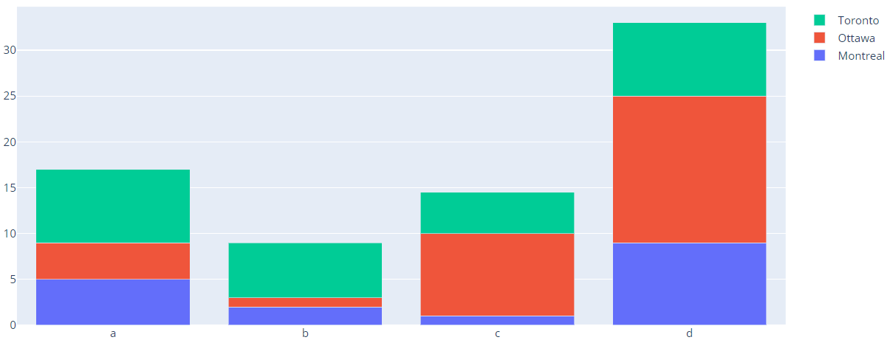

- 通过指定 `categoryarray` 指定顺序

```py
import plotly.graph_objects as go

x=['b', 'a', 'c', 'd']
fig = go.Figure(go.Bar(x=x, y=[2,5,1,9], name='Montreal'))
fig.add_trace(go.Bar(x=x, y=[1, 4, 9, 16], name='Ottawa'))
fig.add_trace(go.Bar(x=x, y=[6, 8, 4.5, 8], name='Toronto'))

fig.update_layout(barmode='stack', xaxis={'categoryorder':'array', 'categoryarray':['d','a','c','b']})
fig.show()
```

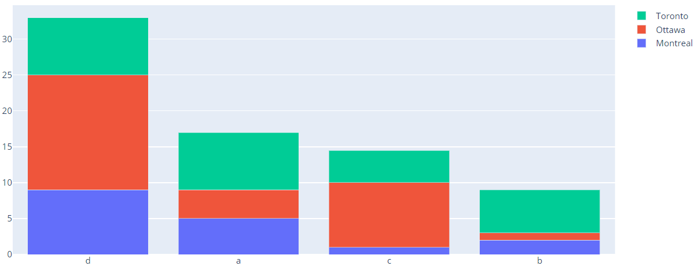

- 总值降序

设置 `categoryorder: 'total descending'`

```py
import plotly.graph_objects as go

x=['b', 'a', 'c', 'd']
fig = go.Figure(go.Bar(x=x, y=[2,5,1,9], name='Montreal'))
fig.add_trace(go.Bar(x=x, y=[1, 4, 9, 16], name='Ottawa'))
fig.add_trace(go.Bar(x=x, y=[6, 8, 4.5, 8], name='Toronto'))

fig.update_layout(barmode='stack', xaxis={'categoryorder':'total descending'})
fig.show()
```

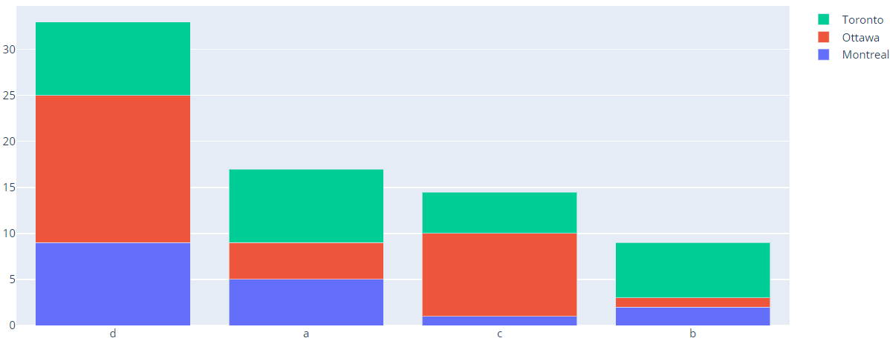
