# Contour

- [Contour](#contour)
  - [简介](#%e7%ae%80%e4%bb%8b)
  - [设置 X, Y 坐标](#%e8%ae%be%e7%bd%ae-x-y-%e5%9d%90%e6%a0%87)
  - [设置色阶](#%e8%ae%be%e7%bd%ae%e8%89%b2%e9%98%b6)
  - [size 和 range 设置](#size-%e5%92%8c-range-%e8%ae%be%e7%bd%ae)
  - [设置轴刻度间距](#%e8%ae%be%e7%bd%ae%e8%bd%b4%e5%88%bb%e5%ba%a6%e9%97%b4%e8%b7%9d)
  - [连接 gaps](#%e8%bf%9e%e6%8e%a5-gaps)
  - [平滑处理](#%e5%b9%b3%e6%bb%91%e5%a4%84%e7%90%86)
  - [着色平滑](#%e7%9d%80%e8%89%b2%e5%b9%b3%e6%bb%91)
  - [线条标签](#%e7%ba%bf%e6%9d%a1%e6%a0%87%e7%ad%be)
  - [线条](#%e7%ba%bf%e6%9d%a1)
  - [自定义 colorscale](#%e8%87%aa%e5%ae%9a%e4%b9%89-colorscale)
  - [Color Bar Title](#color-bar-title)
  - [Color Bar Size](#color-bar-size)
  - [Color Bar Ticks](#color-bar-ticks)

2020-05-04, 00:58
*** *

## 简介

2D 的等高线图（Contour Plots）需要三维数据：X、Y对应坐标，Z对应高度。

plotly 的 `go.Contour` 函数用于生成等高线图：

```py
import plotly.graph_objects as go

fig = go.Figure(data =
    go.Contour(
        z=[[10, 10.625, 12.5, 15.625, 20],
           [5.625, 6.25, 8.125, 11.25, 15.625],
           [2.5, 3.125, 5., 8.125, 12.5],
           [0.625, 1.25, 3.125, 6.25, 10.625],
           [0, 0.625, 2.5, 5.625, 10]]
    ))
fig.show()
```

这里，高度数据通过 `z` 提供，而 X,Y 默认为数组索引。

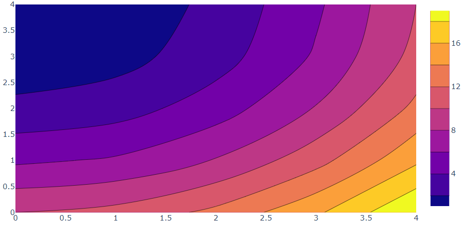

## 设置 X, Y 坐标

通过参数 `x` 和 `y` 设置坐标。

```py
import plotly.graph_objects as go

fig = go.Figure(data =
    go.Contour(
        z=[[10, 10.625, 12.5, 15.625, 20],
           [5.625, 6.25, 8.125, 11.25, 15.625],
           [2.5, 3.125, 5., 8.125, 12.5],
           [0.625, 1.25, 3.125, 6.25, 10.625],
           [0, 0.625, 2.5, 5.625, 10]],
        x=[-9, -6, -5 , -3, -1], # horizontal axis
        y=[0, 1, 4, 5, 7] # vertical axis
    ))
fig.show()
```

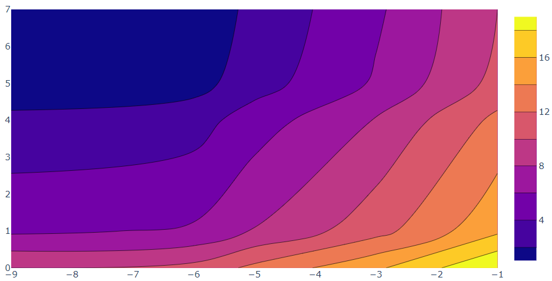

## 设置色阶

通过 `colorscale` 参数设置色阶。

```py
import plotly.graph_objects as go

fig = go.Figure(data=
go.Contour(
    z=[[10, 10.625, 12.5, 15.625, 20],
       [5.625, 6.25, 8.125, 11.25, 15.625],
       [2.5, 3.125, 5., 8.125, 12.5],
       [0.625, 1.25, 3.125, 6.25, 10.625],
       [0, 0.625, 2.5, 5.625, 10]],
    colorscale='Electric',
))
fig.show()
```

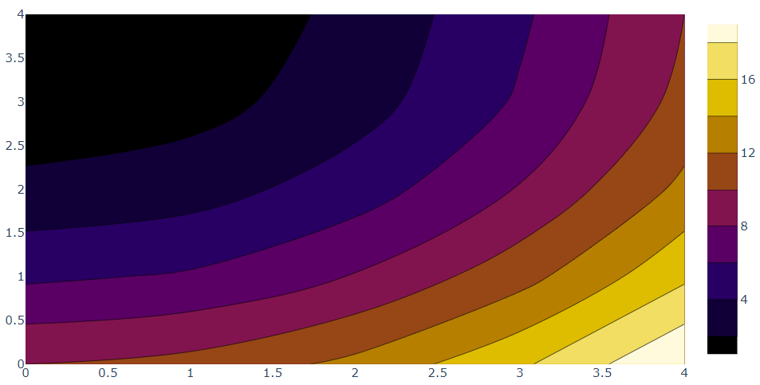

## size 和 range 设置

```py
import plotly.graph_objects as go

fig = go.Figure(data=go.Contour(
    z=[[10, 10.625, 12.5, 15.625, 20],
       [5.625, 6.25, 8.125, 11.25, 15.625],
       [2.5, 3.125, 5., 8.125, 12.5],
       [0.625, 1.25, 3.125, 6.25, 10.625],
       [0, 0.625, 2.5, 5.625, 10]],
    colorscale='Hot',
    contours=dict(
        start=0,
        end=8,
        size=2,
    ),
))

fig.show()
```

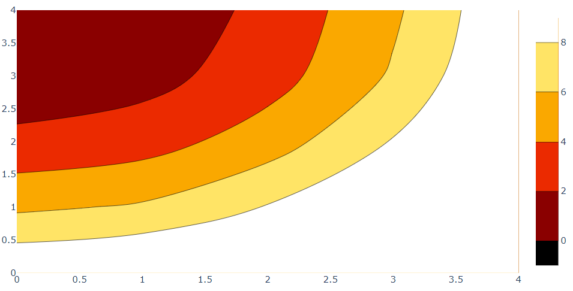

## 设置轴刻度间距

```py
import plotly.graph_objects as go

fig = go.Figure(data=go.Contour(
    z=[[10, 10.625, 12.5, 15.625, 20],
       [5.625, 6.25, 8.125, 11.25, 15.625],
       [2.5, 3.125, 5., 8.125, 12.5],
       [0.625, 1.25, 3.125, 6.25, 10.625],
       [0, 0.625, 2.5, 5.625, 10]],
    dx=10,
    x0=5,
    dy=10,
    y0=10)
)

fig.show()
```

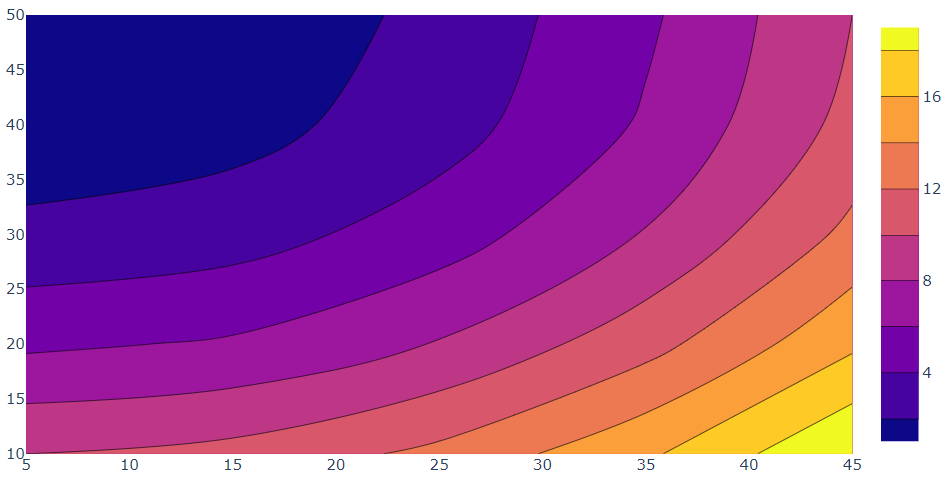

## 连接 gaps

```py
import plotly.graph_objs as go
from plotly.subplots import make_subplots

fig = make_subplots(rows=2, cols=2,
                    subplot_titles=('connectgaps = False', 'connectgaps = True'))
z = [[None, None, None, 12, 13, 14, 15, 16],
     [None, 1, None, 11, None, None, None, 17],
     [None, 2, 6, 7, None, None, None, 18],
     [None, 3, None, 8, None, None, None, 19],
     [5, 4, 10, 9, None, None, None, 20],
     [None, None, None, 27, None, None, None, 21],
     [None, None, None, 26, 25, 24, 23, 22]]

fig.add_trace(go.Contour(z=z, showscale=False), 1, 1)
fig.add_trace(go.Contour(z=z, showscale=False, connectgaps=True), 1, 2)
fig.add_trace(go.Heatmap(z=z, showscale=False, zsmooth='best'), 2, 1)
fig.add_trace(go.Heatmap(z=z, showscale=False, connectgaps=True, zsmooth='best'), 2, 2)

fig['layout']['yaxis1'].update(title='Contour map')
fig['layout']['yaxis3'].update(title='Heatmap')

fig.show()
```

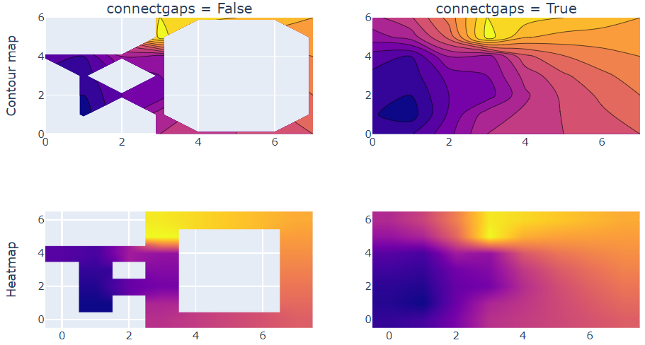

## 平滑处理

```py
import plotly.graph_objects as go
from plotly.subplots import make_subplots

z = [[2, 4, 7, 12, 13, 14, 15, 16],
     [3, 1, 6, 11, 12, 13, 16, 17],
     [4, 2, 7, 7, 11, 14, 17, 18],
     [5, 3, 8, 8, 13, 15, 18, 19],
     [7, 4, 10, 9, 16, 18, 20, 19],
     [9, 10, 5, 27, 23, 21, 21, 21],
     [11, 14, 17, 26, 25, 24, 23, 22]]

fig = make_subplots(rows=1, cols=2,
                    subplot_titles=('Without Smoothing', 'With Smoothing'))

fig.add_trace(go.Contour(z=z, line_smoothing=0), 1, 1)
fig.add_trace(go.Contour(z=z, line_smoothing=0.85), 1, 2)

fig.show()
```

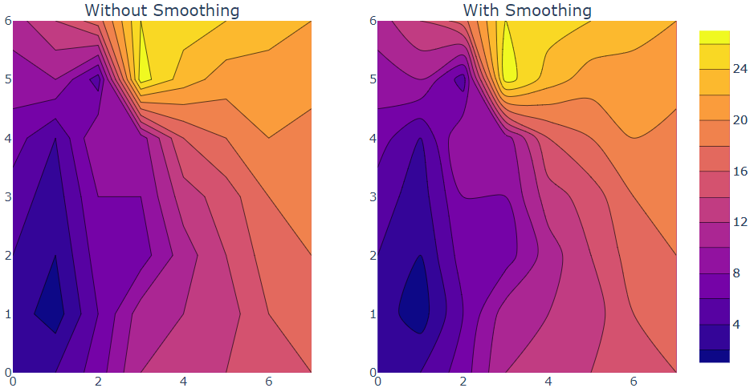

## 着色平滑

```py
import plotly.graph_objects as go

fig = go.Figure(data=
go.Contour(
    z=[[10, 10.625, 12.5, 15.625, 20],
       [5.625, 6.25, 8.125, 11.25, 15.625],
       [2.5, 3.125, 5., 8.125, 12.5],
       [0.625, 1.25, 3.125, 6.25, 10.625],
       [0, 0.625, 2.5, 5.625, 10]],
    # heatmap gradient coloring is applied between each contour level
    contours_coloring='heatmap'  # can also be 'lines', or 'none'
)
)

fig.show()
```

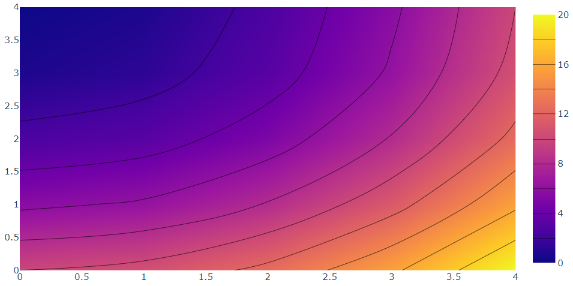

## 线条标签

```py
import plotly.graph_objects as go

fig = go.Figure(data=go.Contour(
    z=[[10, 10.625, 12.5, 15.625, 20],
       [5.625, 6.25, 8.125, 11.25, 15.625],
       [2.5, 3.125, 5., 8.125, 12.5],
       [0.625, 1.25, 3.125, 6.25, 10.625],
       [0, 0.625, 2.5, 5.625, 10]],
    contours=dict(
        coloring='heatmap',
        showlabels=True,  # show labels on contours
        labelfont=dict(  # label font properties
            size=12,
            color='white',
        )
    )))

fig.show()
```

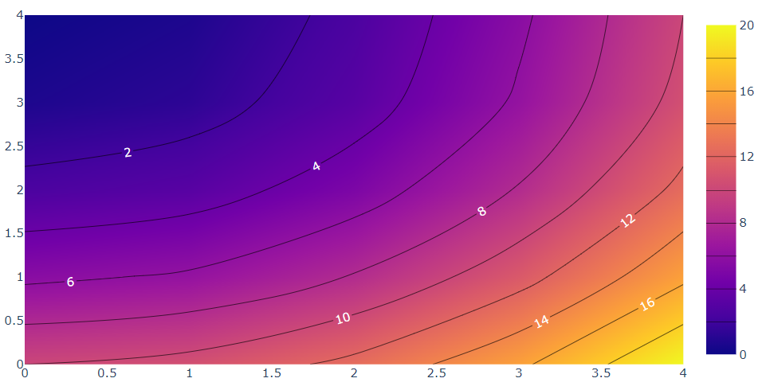

## 线条

```py
import plotly.graph_objects as go

fig = go.Figure(data=go.Contour(
    z=[[10, 10.625, 12.5, 15.625, 20],
       [5.625, 6.25, 8.125, 11.25, 15.625],
       [2.5, 3.125, 5., 8.125, 12.5],
       [0.625, 1.25, 3.125, 6.25, 10.625],
       [0, 0.625, 2.5, 5.625, 10]],
    contours_coloring='lines',
    line_width=2, ))

fig.show()
```

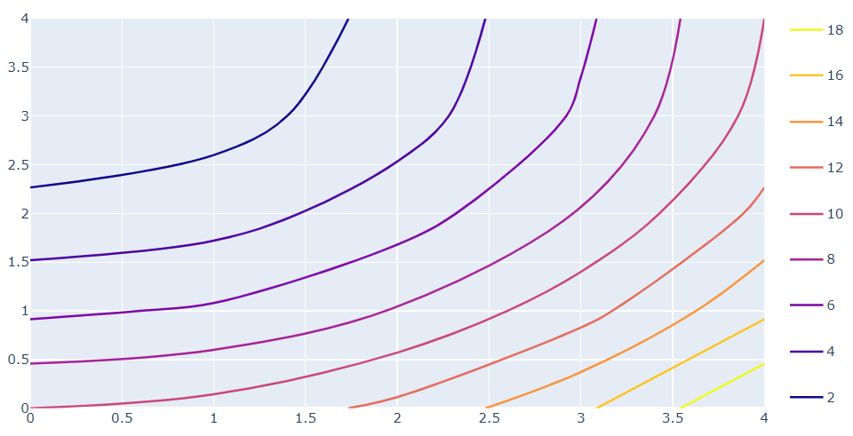

## 自定义 colorscale

```py
import plotly.graph_objects as go

# Valid color strings are CSS colors, rgb or hex strings
colorscale = [[0, 'gold'], [0.5, 'mediumturquoise'], [1, 'lightsalmon']]

fig = go.Figure(data=go.Contour(
    z=[[10, 10.625, 12.5, 15.625, 20],
       [5.625, 6.25, 8.125, 11.25, 15.625],
       [2.5, 3.125, 5., 8.125, 12.5],
       [0.625, 1.25, 3.125, 6.25, 10.625],
       [0, 0.625, 2.5, 5.625, 10]],
    colorscale=colorscale))

fig.show()
```

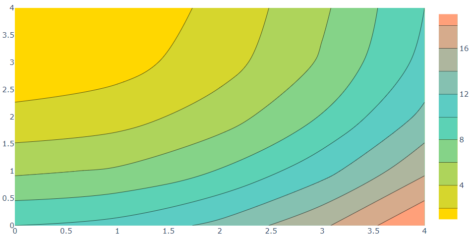

## Color Bar Title

```py
import plotly.graph_objects as go

fig = go.Figure(data=go.Contour(
    z=[[10, 10.625, 12.5, 15.625, 20],
       [5.625, 6.25, 8.125, 11.25, 15.625],
       [2.5, 3.125, 5., 8.125, 12.5],
       [0.625, 1.25, 3.125, 6.25, 10.625],
       [0, 0.625, 2.5, 5.625, 10]],
    colorbar=dict(
        title='Color bar title',  # title here
        titleside='right',
        titlefont=dict(
            size=14,
            family='Arial, sans-serif')
    )))

fig.show()
```

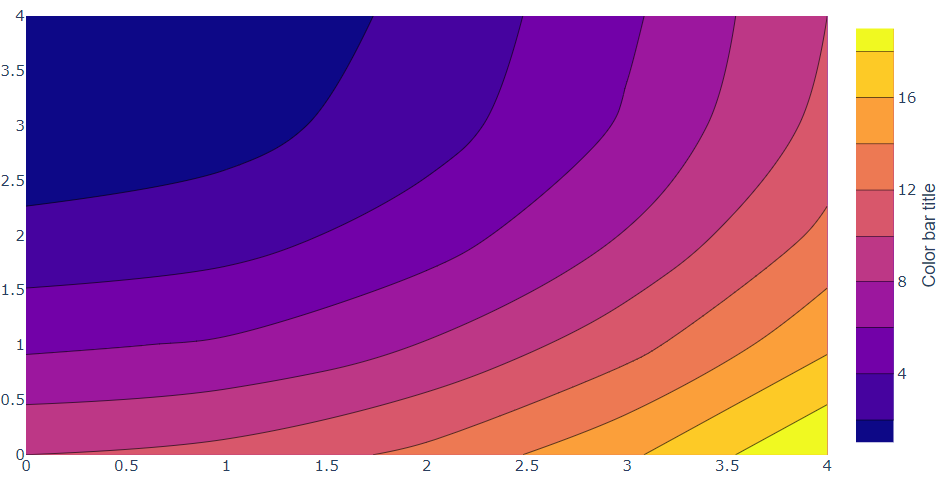

## Color Bar Size

设置 Color bar 的宽度（px）和长度（fraction of the plot height）。

```py
import plotly.graph_objects as go

fig = go.Figure(data=go.Contour(
    z=[[10, 10.625, 12.5, 15.625, 20],
       [5.625, 6.25, 8.125, 11.25, 15.625],
       [2.5, 3.125, 5., 8.125, 12.5],
       [0.625, 1.25, 3.125, 6.25, 10.625],
       [0, 0.625, 2.5, 5.625, 10]],
    colorbar=dict(
        thickness=25,
        thicknessmode='pixels',
        len=0.6,
        lenmode='fraction',
        outlinewidth=0
    )))

fig.show()
```

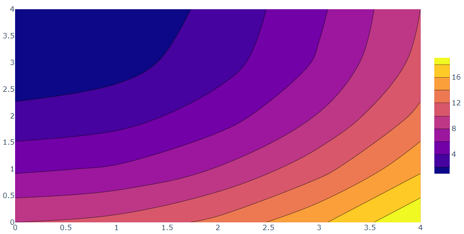

## Color Bar Ticks

```py
import plotly.graph_objects as go

fig = go.Figure(data=go.Contour(
    z=[[10, 10.625, 12.5, 15.625, 20],
       [5.625, 6.25, 8.125, 11.25, 15.625],
       [2.5, 3.125, 5., 8.125, 12.5],
       [0.625, 1.25, 3.125, 6.25, 10.625],
       [0, 0.625, 2.5, 5.625, 10]],
    colorbar=dict(nticks=10, ticks='outside',
                  ticklen=5, tickwidth=1,
                  showticklabels=True,
                  tickangle=0, tickfont_size=12)))

fig.show()
```

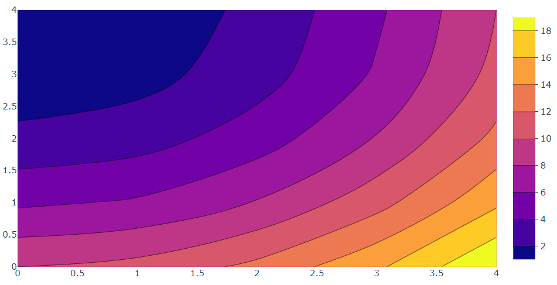
