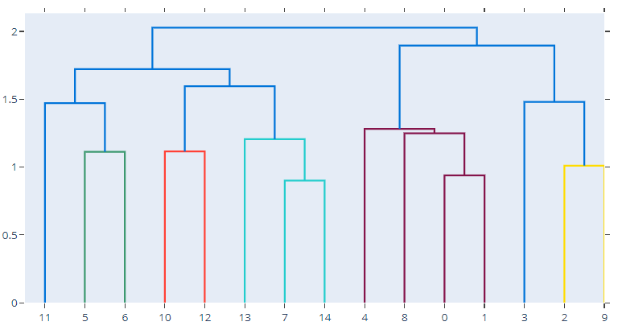

# Dendrogram

## 简介

树状图（dendrogram）用于显示树状数据。feature factory 的 `create_dendrogram` 方法对数据进行分层聚类，然后将结果以树状图显示。树的深度对应轴的数据为不同类别之间的距离。

树状图常用在计算生物学中，用于显示基因或样本的聚类。有时候放在热图的边上。

```py
import numpy as np
import plotly.figure_factory as ff

np.random.seed(1)

X = np.random.rand(15, 12)  # 15 samples, with 12 dimensions each
fig = ff.create_dendrogram(X)
fig.update_layout(width=800, height=500)
fig.show()
```




