# Heatmap

- [Heatmap](#heatmap)
  - [简介](#%e7%ae%80%e4%bb%8b)
  - [heatmap with px](#heatmap-with-px)
    - [axes 和标签设置](#axes-%e5%92%8c%e6%a0%87%e7%ad%be%e8%ae%be%e7%bd%ae)
  - [heatmap with go](#heatmap-with-go)
    - [Categorical Axis](#categorical-axis)
    - [Unequal block size](#unequal-block-size)
    - [heatmap with datetime axis](#heatmap-with-datetime-axis)
  - [Annotated heatmap](#annotated-heatmap)
    - [设置 colorscale](#%e8%ae%be%e7%bd%ae-colorscale)
    - [自定义 colorscale](#%e8%87%aa%e5%ae%9a%e4%b9%89-colorscale)
    - [自定义 Text 和 X & Y Labels](#%e8%87%aa%e5%ae%9a%e4%b9%89-text-%e5%92%8c-x--y-labels)
    - [注释数字格式化](#%e6%b3%a8%e9%87%8a%e6%95%b0%e5%ad%97%e6%a0%bc%e5%bc%8f%e5%8c%96)
    - [Custom Hovertext](#custom-hovertext)
  - [参考](#%e5%8f%82%e8%80%83)
    - [heatmap 属性](#heatmap-%e5%b1%9e%e6%80%a7)
      - [`z`](#z)
      - [`x`, `y`](#x-y)
      - [`hoverongaps`](#hoverongaps)

2020-04-30, 16:14
*** **

## 简介

热图中值到颜色的映射通过 `z` 设置。`z` 为二维或一维数据列表。

对二维数据，假设 `z` 为 N 行 M 列，则热图在 y 轴有 N 个分区，在 x 轴有 M 个分区。换句话说，`z` 的第 i 行第 j 列对应 y 轴的 i (从下到上) 、x 轴的 j (从左到右)。

另外，`x` 可以提供 M 或 M + 1 个值：

- 如果提供 M 个值，则和热图 Cell 的中心对应，所有 Cell 具有相同宽度；
- 如果提供 M + 1 个值，则和热图 cell 的边对应。

同理，`y` 可以提供 N 或 N + 1个值。

## heatmap with px

使用 `px.imshow`，输入数组的每个值由一个 heatmap pixel 表示。

例如：

```py
import plotly.express as px

fig = px.imshow([[1, 20, 30],
                 [20, 1, 60],
                 [30, 60, 1]])
fig.show()
```

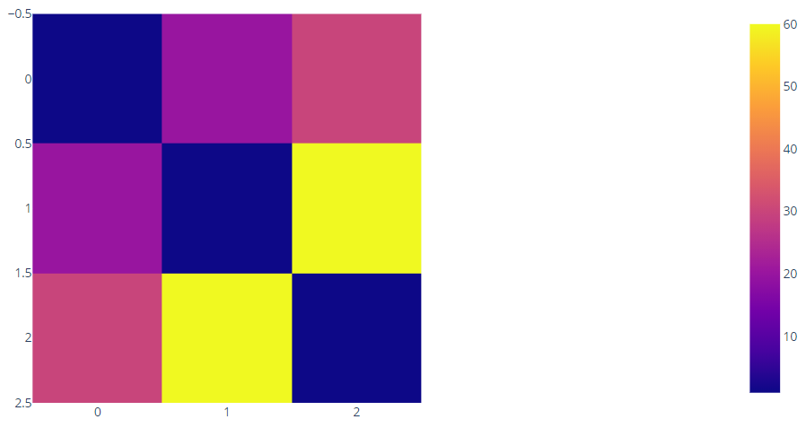

### axes 和标签设置

使用 `x`, `y` 和 `labels` 参数设置 heatmap 相关参数。使用 `.update_xaxes()` 设置 x 轴标签位置。

```py
import plotly.express as px
data=[[1, 25, 30, 50, 1], [20, 1, 60, 80, 30], [30, 60, 1, 5, 20]]
fig = px.imshow(data,
                labels=dict(x="Day of Week", y="Time of Day", color="Productivity"),
                x=['Monday', 'Tuesday', 'Wednesday', 'Thursday', 'Friday'],
                y=['Morning', 'Afternoon', 'Evening']
               )
fig.update_xaxes(side="top")
fig.show()
```

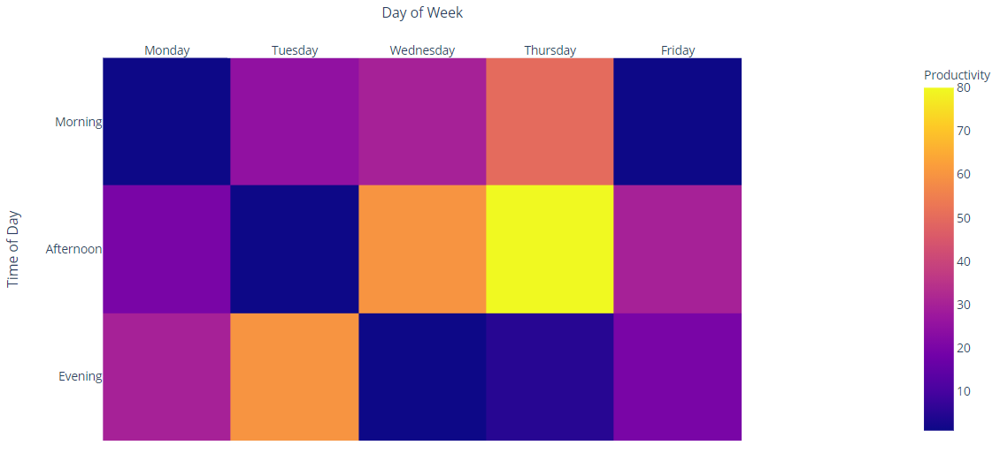

## heatmap with go

```py
import plotly.graph_objects as go

fig = go.Figure(go.Heatmap(
    z=[[1, 20, 30],
       [20, 1, 60],
       [30, 60, 1]])
)
fig.show()
```

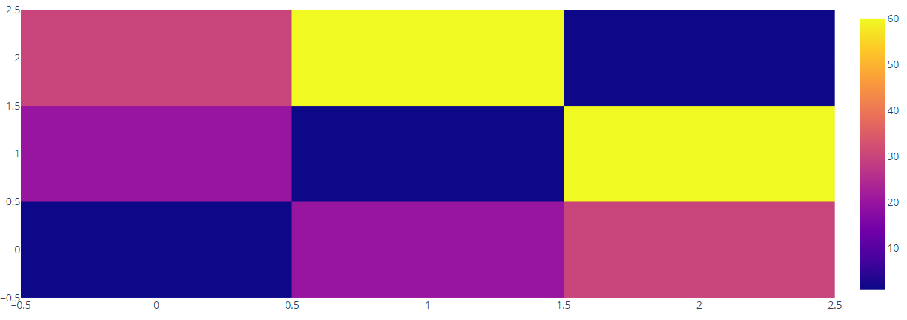

### Categorical Axis

```py
import plotly.graph_objects as go

fig = go.Figure(go.Heatmap(
    z=[[1, None, 30, 50, 1], [20, 1, 60, 80, 30], [30, 60, 1, -10, 20]],
    x=['Monday', 'Tuesday', 'Wednesday', 'Thursday', 'Friday'],
    y=['Morning', 'Afternoon', 'Evening'],
    hoverongaps=False)
)
fig.show()
```

`hoverongaps=False` 表示对缺失值，不显示任何 hover 信息。

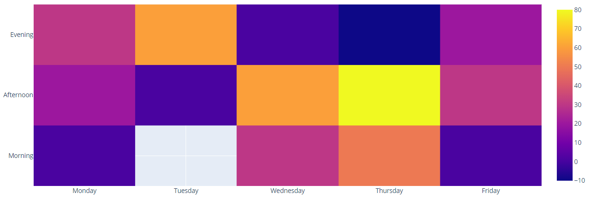

### Unequal block size

```py
import numpy as np
import plotly.graph_objects as go

phi = (1 + np.sqrt(5)) / 2.  # golden ratio
xe = [0, 1, 1 + (1 / (phi ** 4)), 1 + (1 / (phi ** 3)), phi]
ye = [0, 1 / (phi ** 3), 1 / phi ** 3 + 1 / phi ** 4, 1 / (phi ** 2), 1]

# x, y 有五个值，均比 z 多一个，对应 cell 两边，所以大小不一致
z = [[13, 3, 3, 5],
     [13, 2, 1, 5],
     [13, 10, 11, 12],
     [13, 8, 8, 8]]

fig = go.Figure(data=go.Heatmap(
    x=np.sort(xe),
    y=np.sort(ye),
    z=z,
    colorscale='Viridis'
))


# 添加样条线
def spiral(th):
    a = 1.120529
    b = 0.306349
    r = a * np.exp(-b * th)
    return r * np.cos(th), r * np.sin(th)


theta = np.linspace(-np.pi / 13, 4 * np.pi, 1000)  # angle
(x, y) = spiral(theta)

fig.add_trace(go.Scatter(x=-x + x[0], y=y - y[0],
                         line=dict(color='white', width=3)))

axis_template = dict(range=[0, 1.6], autorange=False,
                     showgrid=False, zeroline=False,
                     linecolor='black', showticklabels=False,
                     ticks='')

fig.update_layout(margin=dict(t=200, r=200, b=200, l=200),
                  xaxis=axis_template,
                  yaxis=axis_template,
                  showlegend=False,
                  width=700, height=700,
                  autosize=False)

fig.show()
```

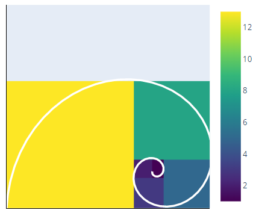

### heatmap with datetime axis

```py
import plotly.graph_objects as go
import datetime
import numpy as np
np.random.seed(1)

programmers = ['Alex','Nicole','Sara','Etienne','Chelsea','Jody','Marianne']

base = datetime.datetime.today()
dates = base - np.arange(180) * datetime.timedelta(days=1)
z = np.random.poisson(size=(len(programmers), len(dates)))

fig = go.Figure(data=go.Heatmap(
        z=z,
        x=dates,
        y=programmers,
        colorscale='Viridis'))

fig.update_layout(
    title='GitHub commits per day',
    xaxis_nticks=36)

fig.show()
```

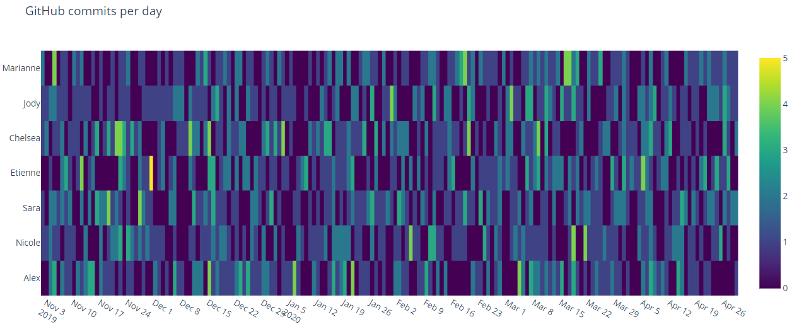

## Annotated heatmap

```py
import plotly.figure_factory as ff

z = [[.1, .3, .5, .7, .9],
     [1, .8, .6, .4, .2],
     [.2, 0, .5, .7, .9],
     [.9, .8, .4, .2, 0],
     [.3, .4, .5, .7, 1]]

fig = ff.create_annotated_heatmap(z)
fig.show()
```

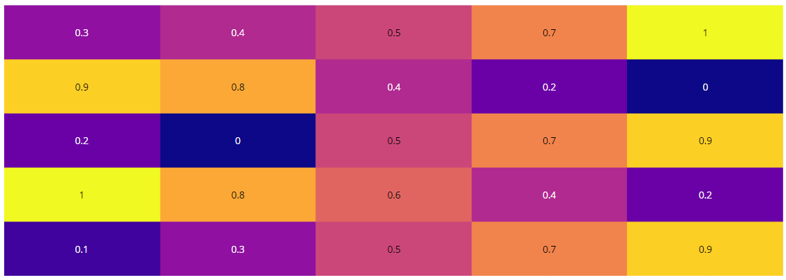

### 设置 colorscale

```py
import plotly.figure_factory as ff

z = [[.1, .3, .5, .7],
     [1, .8, .6, .4],
     [.6, .4, .2, .0],
     [.9, .7, .5, .3]]

fig = ff.create_annotated_heatmap(z, colorscale='Viridis')
fig.show()
```

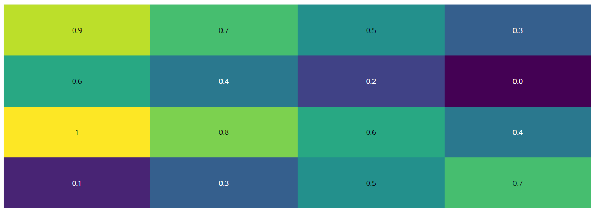

### 自定义 colorscale

```py
import plotly.figure_factory as ff

z = [[.1, .3, .5, .7],
     [1.0, .8, .6, .4],
     [.6, .4, .2, 0.0],
     [.9, .7, .5, .3]]

colorscale = [[0, 'navy'], [1, 'plum']]
font_colors = ['white', 'black']
fig = ff.create_annotated_heatmap(z, colorscale=colorscale, font_colors=font_colors)
fig.show()
```

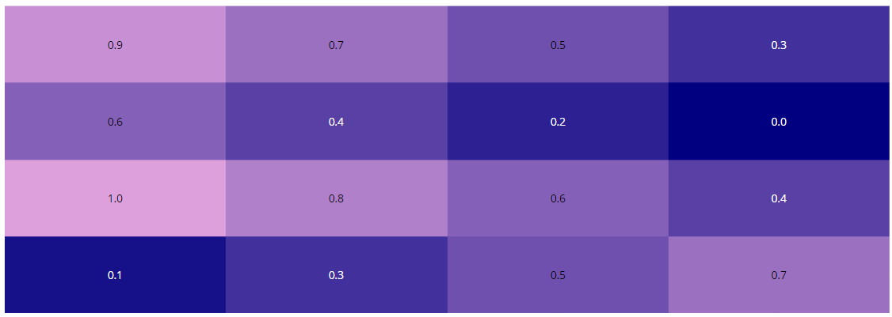

### 自定义 Text 和 X & Y Labels

`annotation_text` 对应注释，其 dimensions 应该和 `z` 一致。

```py
import plotly.figure_factory as ff

z = [[.1, .3, .5],
     [1.0, .8, .6],
     [.6, .4, .2]]

x = ['Team A', 'Team B', 'Team C']
y = ['Game Three', 'Game Two', 'Game One']

z_text = [['Win', 'Lose', 'Win'],
          ['Lose', 'Lose', 'Win'],
          ['Win', 'Win', 'Lose']]

fig = ff.create_annotated_heatmap(z, x=x, y=y, annotation_text=z_text, colorscale='Viridis')
fig.show()
```

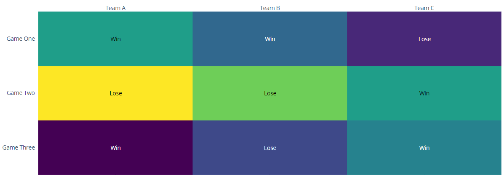

### 注释数字格式化

```py
import plotly.figure_factory as ff
import numpy as np
np.random.seed(1)

z = np.random.randn(20, 20)
z_text = np.around(z, decimals=2) # Only show rounded value (full value on hover)

fig = ff.create_annotated_heatmap(z, annotation_text=z_text, colorscale='Greys',
                                  hoverinfo='z')

# Make text size smaller
for i in range(len(fig.layout.annotations)):
    fig.layout.annotations[i].font.size = 8

fig.show()
```

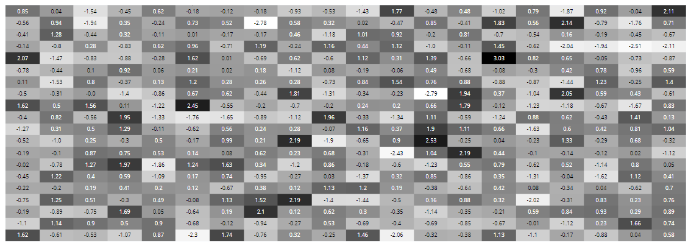

### Custom Hovertext

```py
# Add Periodic Table Data
symbol = [['H', '', '', '', '', '', '', '', '', '', '', '', '', '', '', '', '', 'He'],
         ['Li', 'Be', '', '', '', '', '', '', '', '', '', '', 'B', 'C', 'N', 'O', 'F', 'Ne'],
         ['Na', 'Mg', '', '', '', '', '', '', '', '', '', '', 'Al', 'Si', 'P', 'S', 'Cl', 'Ar'],
         ['K', 'Ca', 'Sc', 'Ti', 'V', 'Cr', 'Mn', 'Fe', 'Co', 'Ni', 'Cu', 'Zn', 'Ga', 'Ge', 'As', 'Se', 'Br', 'Kr'],
         ['Rb ', 'Sr', 'Y', 'Zr', 'Nb', 'Mo', 'Tc', 'Ru', 'Rh', 'Pd', 'Ag', 'Cd', 'In', 'Sn', 'Sb', 'Te', 'I', 'Xe' ],
         ['Cs', 'Ba', '', 'Hf', 'Ta', 'W', 'Re', 'Os', 'Ir', 'Pt', 'Au', 'Hg', 'Tl', 'Pb', 'Bi', 'Po', 'At', 'Rn' ],
         ['Fr', 'Ra', '', 'Rf', 'Db', 'Sg', 'Bh', 'Hs', 'Mt', 'Ds', 'Rg', 'Cn', 'Uut', 'Fl', 'Uup', 'Lv', 'Uus', 'Uuo'],
         ['', '', 'La', 'Ce', 'Pr', 'Nd', 'Pm', 'Sm', 'Eu', 'Gd', 'Tb', 'Dy', 'Ho', 'Er', 'Tm', 'Yb', 'Lu', ''],
         ['', '', 'Ac', 'Th', 'Pa', 'U', 'Np', 'Pu', 'Am', 'Cm', 'Bk', 'Cf', 'Es', 'Fm', 'Md', 'No', 'Lr', '' ],
         ['', '', '', '', '', '', '', '', '', '', '', '', '', '', '', '', '', ''],
         ['', 'Alkali Metal', '', '', 'Transition Metal', '', '', 'Actinide', '', '', 'Semimetal', '', '', 'Halogen', '', '', '', ''],
         ['', 'Alkaline Metal', '', '', 'Lanthanide', '', '', 'Basic Metal', '', '', 'Nonmetal', '', '', 'Noble Gas', '', '', '', '']]

element = [['Hydrogen', '', '', '', '', '', '', '', '', '', '', '', '', '', '', '', '', 'Helium'],
           ['Lithium', 'Beryllium', '', '', '', '', '', '', '', '', '', '', 'Boron', 'Carbon', 'Nitrogen', 'Oxygen', 'Fluorine', 'Neon'],
           ['Sodium', 'Magnesium', '', '', '', '', '', '', '', '', '', '', 'Aluminium', 'Silicon', 'Phosphorus', 'Sulfur', 'Chlorine', ' Argon'],
           ['Potassium', ' Calcium', ' Scandium', ' Titanium', ' Vanadium', ' Chromium',  'Manganese', 'Iron', 'Cobalt', 'Nickel', 'Copper', 'Zinc', 'Gallium', 'Germanium', 'Arsenic', 'Selenium', 'Bromine', 'Krypton'],
           ['Rubidium', 'Strontium', 'Yttrium', 'Zirconium', 'Niobium', 'Molybdenum', 'Technetium', 'Ruthenium', 'Rhodium', 'Palladium', 'Silver', 'Cadmium', 'Indium', 'Tin', 'Antimony', 'Tellurium', 'Iodine', 'Xenon'],
           [' Cesium', ' Barium', '',  'Hafnium', 'Tantalum', 'Tungsten', 'Rhenium', 'Osmium', 'Iridium', 'Platinum', 'Gold', 'Mercury', 'Thallium', 'Lead', 'Bismuth', 'Polonium', 'Astatine', 'Radon'],
           [' Francium', ' Radium', '', 'Rutherfordium','Dubnium','Seaborgium','Bohrium','Hassium','Meitnerium','Darmstadtium','Roentgenium','Copernicium','Ununtrium','Ununquadium','Ununpentium','Ununhexium','Ununseptium','Ununoctium'],
           ['', '',  'Lanthanum', 'Cerium', 'Praseodymium', 'Neodymium', 'Promethium', 'Samarium', 'Europium', 'Gadolinium', 'Terbium', 'Dysprosium', 'Holmium', 'Erbium', 'Thulium', 'Ytterbium', 'Lutetium', ''],
           ['', '', 'Actinium', 'Thorium', 'Protactinium', 'Uranium', 'Neptunium', 'Plutonium', 'Americium', 'Curium', 'Berkelium', 'Californium', 'Einsteinium','Fermium' ,'Mendelevium', 'Nobelium', 'Lawrencium', '' ],
           ['', '', '', '', '', '', '', '', '', '', '', '', '', '', '', '', '', ''],
           ['', '', '', '', '', '', '', '', '', '', '', '', '', '', '', '', '', ''],
           ['', '', '', '', '', '', '', '', '', '', '', '', '', '', '', '', '', '']]

atomic_mass = [[ 1.00794, .0, .0, .0, .0, .0, .0, .0, .0, .0, .0, .0, .0, .0, .0, .0, .0,  4.002602],
     [ 6.941, 9.012182, .0, .0, .0, .0, .0, .0, .0, .0, .0, .0,  10.811, 12.0107, 14.0067, 15.9994, 18.9984032, 20.1797],
     [ 22.98976928, 24.3050, .0, .0, .0, .0, .0, .0, .0, .0, .0, .0,  26.9815386, 28.0855, 30.973762, 32.065, 35.453, 39.948],
     [ 39.0983, 40.078, 44.955912, 47.867, 50.9415, 51.9961, 54.938045, 55.845, 58.933195, 58.6934, 63.546, 65.38, 69.723, 72.64, 74.92160, 78.96, 79.904, 83.798],
     [ 85.4678, 87.62, 88.90585, 91.224, 92.90638, 95.96, 98, 101.07, 102.90550, 106.42, 107.8682, 112.411, 114.818, 118.710, 121.760, 127.60, 126.90447, 131.293],
     [ 132.9054519, 137.327, .0, 178.49, 180.94788, 183.84, 186.207, 190.23, 192.217, 195.084, 196.966569, 200.59, 204.3833, 207.2, 208.98040, 209, 210, 222],
     [223, 226, .0, 267, 268, 271, 272, 270, 276, 281, 280, 285, 284, 289, 288, 293, 'unknown', 294],
     [.0, .0, 138.90547, 140.116, 140.90765, 144.242, 145, 150.36, 151.964, 157.25, 158.92535, 162.500, 164.93032, 167.259, 168.93421, 173.054, 174.9668, .0],
     [.0, .0, 227, 232.03806, 231.03588, 238.02891, 237, 244, 243, 247, 247, 251, 252, 257, 258, 259, 262, .0],
     [.0, .0, .0, .0, .0, .0, .0, .0, .0, .0, .0, .0, .0, .0, .0, .0, .0, .0],
     [.0, .0, .0, .0, .0, .0, .0, .0, .0, .0, .0, .0, .0, .0, .0, .0, .0, .0],
     [.0, .0, .0, .0, .0, .0, .0, .0, .0, .0, .0, .0, .0, .0, .0, .0, .0, .0]]

z = [[.8, .0, .0, .0, .0, .0, .0, .0, .0, .0, .0, .0, .0, .0, .0, .0, .0, 1.],
     [.1, .2, .0, .0, .0, .0, .0, .0, .0, .0, .0, .0, .7, .8, .8, .8, .9, 1.],
     [.1, .2, .0, .0, .0, .0, .0, .0, .0, .0, .0, .0, .6, .7, .8, .8, .9, 1],
     [.1, .2, .3, .3, .3, .3, .3, .3, .3, .3, .3, .3, .6, .7, .8, .8, .9, 1.],
     [.1, .2, .3, .3, .3, .3, .3, .3, .3, .3, .3, .3, .6, .6, .7, .7, .9, 1.],
     [.1, .2, .4, .3, .3, .3, .3, .3, .3, .3, .3, .3, .6, .6, .6, .7, .9, 1.],
     [.1, .2, .5, .3, .3, .3, .3, .3, .3, .3, .3, .3, .6, .6, .6, .6, .9, 1.],
     [.0, .0, .4, .4, .4, .4, .4, .4, .4, .4, .4, .4, .4, .4, .4, .4, .4, .0],
     [.0, .0, .5, .5, .5, .5, .5, .5, .5, .5, .5, .5, .5, .5, .5, .5, .5, .0],
     [.0, .0, .0, .0, .0, .0, .0, .0, .0, .0, .0, .0, .0, .0, .0, .0, .0, .0],
     [.1, .1, .1, .3, .3, .3, .5, .5, .5, .7, .7, .7, .9, .9, .9, .0, .0, .0],
     [.2, .2, .2, .4, .4, .4, .6, .6, .6, .8, .8, .8, 1., 1., 1., .0, .0, .0]]

# Display element name and atomic mass on hover
hover=[]
for x in range(len(symbol)):
    hover.append([i + '<br>' + 'Atomic Mass: ' + str(j)
                      for i, j in zip(element[x], atomic_mass[x])])

# Invert Matrices
symbol = symbol[::-1]
hover = hover[::-1]
z = z[::-1]

# Set Colorscale
colorscale=[[0.0, 'rgb(255,255,255)'], [.2, 'rgb(255, 255, 153)'],
            [.4, 'rgb(153, 255, 204)'], [.6, 'rgb(179, 217, 255)'],
            [.8, 'rgb(240, 179, 255)'],[1.0, 'rgb(255, 77, 148)']]

# Make Annotated Heatmap
fig = ff.create_annotated_heatmap(z, annotation_text=symbol, text=hover,
                                 colorscale=colorscale, font_colors=['black'], hoverinfo='text')
fig.update_layout(title_text='Periodic Table')
fig.show()
```

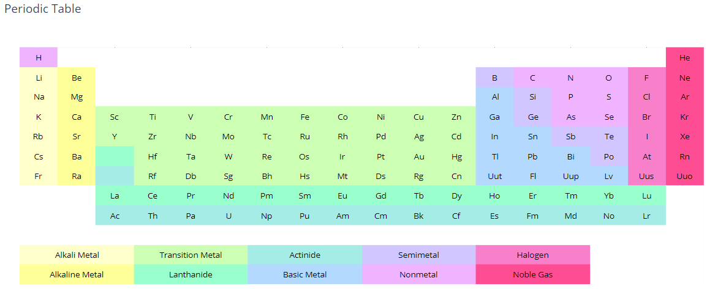

## 参考

### heatmap 属性

#### `z`

list, numpy array, Pandas series of number, strings, or datetimes.

设置 z 数据。

#### `x`, `y`

x, y 坐标值。

#### `hoverongaps`

boolean, 默认 True。

`z` 数据中的 gaps (缺失值或 nan) 是否具有与之关联的 hover 标签。

如果 `hoverongaps=True`，则哪怕是缺失值，在热图中是空的，鼠标放在上面也会有悬停信息显示。

如果 `hoverongaps=False`，鼠标放在缺失块无信息显示。
