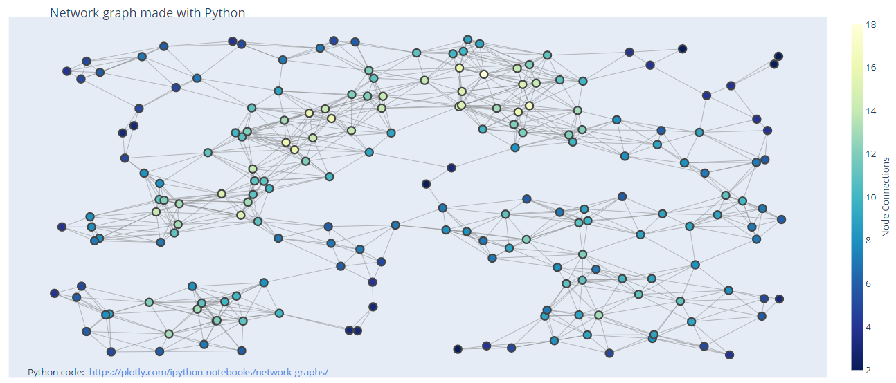

# Network Graph

- [Network Graph](#network-graph)
  - [简介](#%e7%ae%80%e4%bb%8b)
  - [流程](#%e6%b5%81%e7%a8%8b)
    - [创建 graph](#%e5%88%9b%e5%bb%ba-graph)
    - [创建 Edges](#%e5%88%9b%e5%bb%ba-edges)
    - [设置 Node 颜色](#%e8%ae%be%e7%bd%ae-node-%e9%a2%9c%e8%89%b2)
    - [创建 Network graph](#%e5%88%9b%e5%bb%ba-network-graph)

2020-05-07, 17:00
*** *

## 简介

下面使用 `networkx` 创建 network，以可视化网络图。

## 流程

### 创建 graph

下面使用 `networkx` 创建一个随机 graph:

```py
import networkx as nx
import plotly.graph_objects as go

G = nx.random_geometric_graph(200, 0.125)
```

### 创建 Edges

edges 以线段表示，nodes 以 scatter trace 表示：

```py
edge_x = []
edge_y = []
for edge in G.edges():
    x0, y0 = G.nodes[edge[0]]['pos']  # edge 起点
    x1, y1 = G.nodes[edge[1]]['pos']  # edge 终点
    edge_x.append(x0)
    edge_x.append(x1)
    edge_x.append(None)  # 添加 None，使线条分开
    edge_y.append(y0)
    edge_y.append(y1)
    edge_y.append(None)

edge_trace = go.Scatter(
    x=edge_x, y=edge_y,
    line=dict(width=0.5, color='#888'),
    hoverinfo='none',
    mode='lines')

node_x = []
node_y = []
for node in G.nodes():
    x, y = G.nodes[node]['pos']
    node_x.append(x)
    node_y.append(y)

node_trace = go.Scatter(
    x=node_x, y=node_y,
    mode='markers',
    hoverinfo='text',
    marker=dict(
        showscale=True,
        # colorscale options
        # 'Greys' | 'YlGnBu' | 'Greens' | 'YlOrRd' | 'Bluered' | 'RdBu' |
        # 'Reds' | 'Blues' | 'Picnic' | 'Rainbow' | 'Portland' | 'Jet' |
        # 'Hot' | 'Blackbody' | 'Earth' | 'Electric' | 'Viridis' |
        colorscale='YlGnBu',
        reversescale=True,
        color=[],
        size=10,
        colorbar=dict(
            thickness=15,
            title='Node Connections',
            xanchor='left',
            titleside='right'
        ),
        line_width=2))
```

### 设置 Node 颜色

根据 node 上连接的 edges 数目设置颜色。

另外也可以根据连接 edges 数设置大小，`node_trace.marker.size=node_adjacencies`。

```py
node_adjacencies = []
node_text = []
for node, adjacencies in enumerate(G.adjacency()):
    node_adjacencies.append(len(adjacencies[1]))
    node_text.append('# of connections: ' + str(len(adjacencies[1])))

node_trace.marker.color = node_adjacencies
node_trace.text = node_text
```

### 创建 Network graph

```py
fig = go.Figure(data=[edge_trace, node_trace],
                layout=go.Layout(
                    title='<br>Network graph made with Python',
                    titlefont_size=16,
                    showlegend=False,
                    hovermode='closest',
                    margin=dict(b=20, l=5, r=5, t=40),
                    annotations=[dict(
                        text="Python code: <a href='https://plotly.com/ipython-notebooks/network-graphs/'> https://plotly.com/ipython-notebooks/network-graphs/</a>",
                        showarrow=False,
                        xref="paper", yref="paper",
                        x=0.005, y=-0.002)],
                    xaxis=dict(showgrid=False, zeroline=False, showticklabels=False),
                    yaxis=dict(showgrid=False, zeroline=False, showticklabels=False))
                )
fig.show()
```


