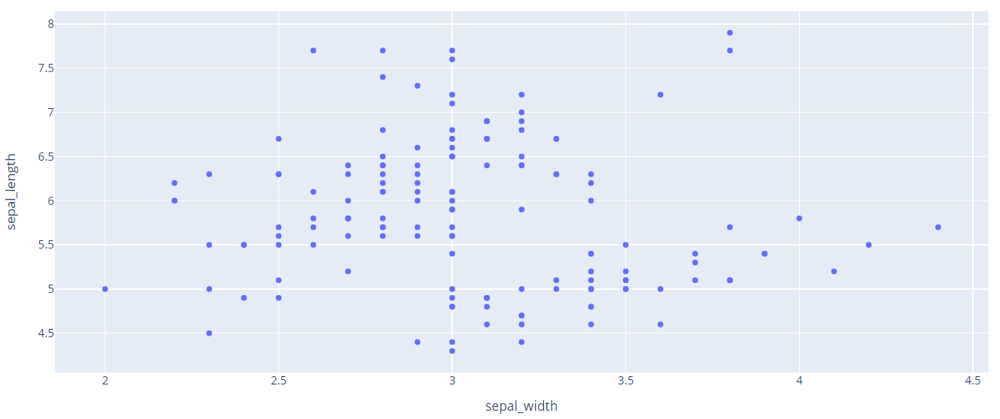
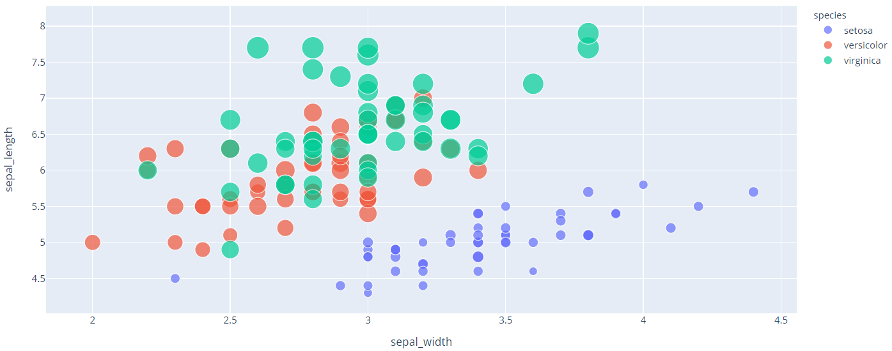
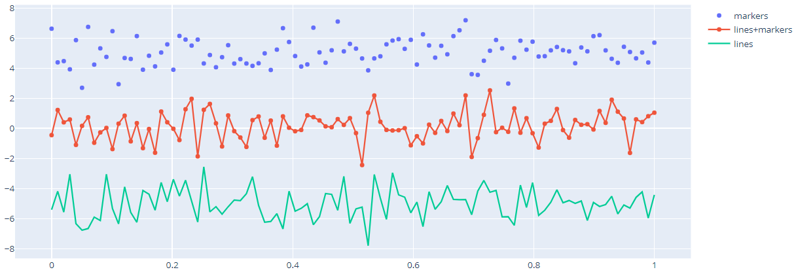
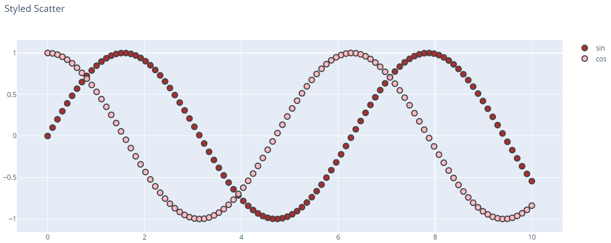
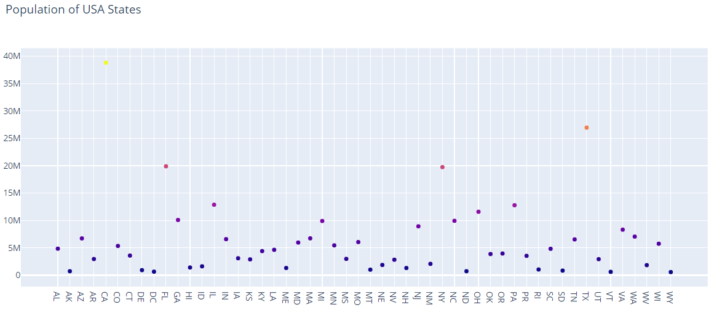
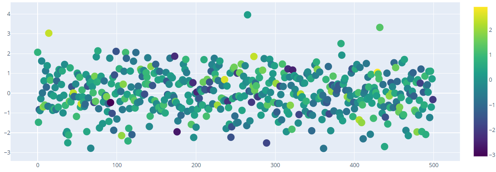
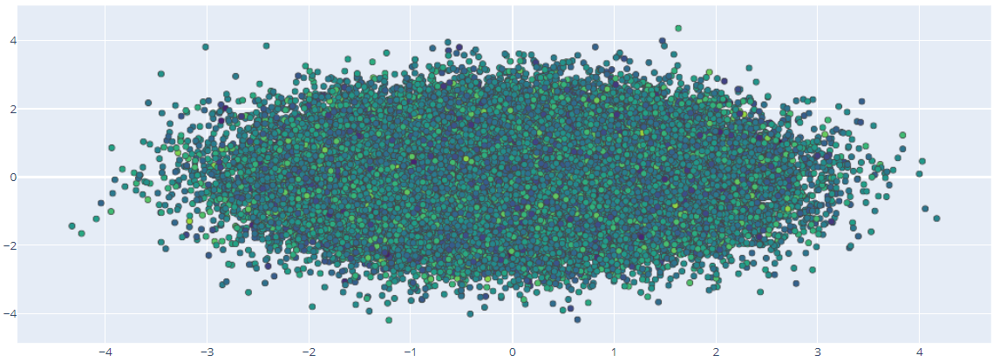
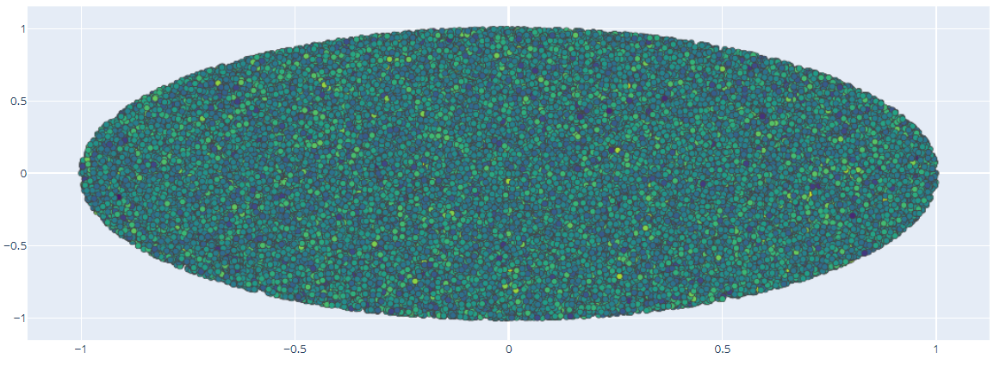
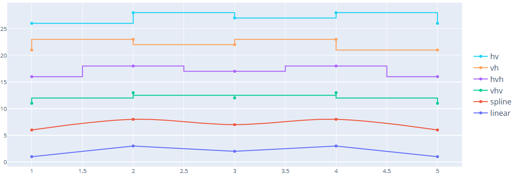

# Scatter Plot

- [Scatter Plot](#scatter-plot)
  - [Scatter plot with PX](#scatter-plot-with-px)
    - [通过 column 名称设置 color 和 size](#%e9%80%9a%e8%bf%87-column-%e5%90%8d%e7%a7%b0%e8%ae%be%e7%bd%ae-color-%e5%92%8c-size)
    - [Line plot with px](#line-plot-with-px)
  - [Scatter with go](#scatter-with-go)
  - [简单散点图](#%e7%ae%80%e5%8d%95%e6%95%a3%e7%82%b9%e5%9b%be)
  - [Line and Scatter Plots](#line-and-scatter-plots)
  - [Bubble Scatter Plots](#bubble-scatter-plots)
  - [个性化设置](#%e4%b8%aa%e6%80%a7%e5%8c%96%e8%ae%be%e7%bd%ae)
  - [Data Labels on Hover](#data-labels-on-hover)
  - [Color Dimension](#color-dimension)
  - [Large Data Sets](#large-data-sets)
  - [参考](#%e5%8f%82%e8%80%83)
    - [marker](#marker)
      - [cmin](#cmin)
      - [marker.line](#markerline)
    - [textfont](#textfont)
    - [error_x](#errorx)
    - [error_y](#errory)
    - [selectedpoints](#selectedpoints)
    - [selected](#selected)
    - [unselected](#unselected)
    - [fill](#fill)
    - [`mode`](#mode)
    - [`line`](#line)
      - [color](#color)
      - [width](#width)
      - [dash](#dash)
      - [shape](#shape)
      - [smoothing](#smoothing)
      - [simplify](#simplify)

2020-04-20, 09:38
***

## Scatter plot with PX

使用 `px.scatter` 绘制散点图，每个数据点由一个标记（marker）表示，位置由 `x`, `y` 确定。

- 通过类数组对象提供数据

```py
import plotly.express as px

fig = px.scatter(
    x=[0, 1, 2, 3, 4],
    y=[0, 1, 4, 9, 16]
)
fig.show()
```


- 通过 `DataFrame` 提供数据

```py
import plotly.express as px

df = px.data.iris()  # iris 是 pandas DataFrame
fig = px.scatter(df, x='sepal_width', y='sepal_length')
fig.show()
```



### 通过 column 名称设置 color 和 size

> `color` 和 `size` 已添加到 hover 信息中，还可以通过 `px.scatter` 的 `hover_data` 参数添加额外的 column 到 hover 中。

```py
import plotly.express as px

df = px.data.iris()
fig = px.scatter(df, x="sepal_width", y="sepal_length",
                 color="species", size="petal_length", hover_data=['petal_width'])
fig.show()
```



### Line plot with px

- 单线条

```py
import plotly.express as px
import numpy as np

t = np.linspace(0, 2*np.pi, 100)

fig = px.line(x=t, y=np.cos(t), labels={'x':'t', 'y':'cos(t)'})
fig.show()
```


- 多线条

```py
import plotly.express as px
df = px.data.gapminder().query("continent == 'Oceania'")
fig = px.line(df, x='year', y='lifeExp', color='country')
fig.show()
```


## Scatter with go

`go.Scatter` 函数更为通用。`go.Scatter` 可用于绘制散点图和线图，具体取决于 `mode` 参数。

## 简单散点图

```py
import plotly.graph_objects as go
import numpy as np

N = 1000
t = np.linspace(0, 10, 100)
y = np.sin(t)

fig = go.Figure(data=go.Scatter(x=t, y=y, mode='markers'))

fig.show()
```

`mode="markers"` 表示散点图。


## Line and Scatter Plots

使用 `mode` 参数可以选择 `markers`, `lines` 或者两者的组合。

```py
import plotly.graph_objects as go

# Create random data with numpy
import numpy as np
np.random.seed(1)

N = 100
random_x = np.linspace(0, 1, N)
random_y0 = np.random.randn(N) + 5
random_y1 = np.random.randn(N)
random_y2 = np.random.randn(N) - 5

fig = go.Figure()

# Add traces
fig.add_trace(go.Scatter(x=random_x, y=random_y0,
                    mode='markers', # 散点图
                    name='markers'))
fig.add_trace(go.Scatter(x=random_x, y=random_y1,
                    mode='lines+markers', # 散点图+线图
                    name='lines+markers'))
fig.add_trace(go.Scatter(x=random_x, y=random_y2,
                    mode='lines', # 线图
                    name='lines'))

fig.show()
```



## Bubble Scatter Plots

气泡图（Bubble charts），将额外一维信息以 marker 的大小显示。

```py
import plotly.graph_objects as go

fig = go.Figure(data=go.Scatter(
    x=[1, 2, 3, 4],
    y=[10, 11, 12, 13],
    mode='markers',
    marker=dict(size=[40, 60, 80, 100],
                color=[0, 1, 2, 3])
))

fig.show()
```

`marker=dict(size=...)` 是实现气泡图的关键点。


## 个性化设置

```py
import plotly.graph_objects as go
import numpy as np


t = np.linspace(0, 10, 100)

fig = go.Figure()

fig.add_trace(go.Scatter(
    x=t, y=np.sin(t),
    name='sin', # 名称
    mode='markers', # 模式，散点图
    marker_color='rgba(152, 0, 0, .8)' # maker 颜色
))

fig.add_trace(go.Scatter(
    x=t, y=np.cos(t),
    name='cos',
    marker_color='rgba(255, 182, 193, .9)'
))

# Set options common to all traces with fig.update_traces
fig.update_traces(mode='markers', marker_line_width=2, marker_size=10)
fig.update_layout(title='Styled Scatter',
                  yaxis_zeroline=False, xaxis_zeroline=False)


fig.show()
```



## Data Labels on Hover

```py
import plotly.graph_objects as go
import pandas as pd

data= pd.read_csv("https://raw.githubusercontent.com/plotly/datasets/master/2014_usa_states.csv")

fig = go.Figure(data=go.Scatter(x=data['Postal'],
                                y=data['Population'],
                                mode='markers',
                                marker_color=data['Population'],
                                text=data['State'])) # hover text goes here

fig.update_layout(title='Population of USA States')
fig.show()
```



## Color Dimension

```py
import plotly.graph_objects as go
import numpy as np

fig = go.Figure(data=go.Scatter(
    y = np.random.randn(500), # 500 个数据点，没有提供 x，默认为 0-499
    mode='markers',
    marker=dict(
        size=16,
        color=np.random.randn(500), #set color equal to a variable
        colorscale='Viridis', # one of plotly colorscales
        showscale=True
    )
))

fig.show()
```



## Large Data Sets

使用 `Scattergl()` 替代 `Scatter()` 实现 WebGL，以提高速度、交互性，以及绘制更多数据。

```py
import plotly.graph_objects as go
import numpy as np

N = 100000
fig = go.Figure(data=go.Scattergl(
    x = np.random.randn(N),
    y = np.random.randn(N),
    mode='markers',
    marker=dict(
        color=np.random.randn(N),
        colorscale='Viridis',
        line_width=1
    )
))

fig.show()
```



```py
import plotly.graph_objects as go
import numpy as np

N = 100000
r = np.random.uniform(0, 1, N)
theta = np.random.uniform(0, 2*np.pi, N)

fig = go.Figure(data=go.Scattergl(
    x = r * np.cos(theta), # non-uniform distribution
    y = r * np.sin(theta), # zoom to see more points at the center
    mode='markers',
    marker=dict(
        color=np.random.randn(N),
        colorscale='Viridis',
        line_width=1
    )
))

fig.show()
```



## 参考

- connectgaps

`data[type=scatter]`

Type: boolean

是否连接 gaps (如 Nan 值，缺失值)。

如果不连接，确实值会时线图前后断开。

- text

`data[type=scatter]`

Type: string or array of strings

Default: ""

设置和数据点关联的文本。

如果是单个字符串，则所有数据点上出现相同的字符串。

如果是字符串数组，则字符串一一映射到数据点上。

如果 `hoverinfo` 包含一个 `text` flag，并且没有设置 "hovertext"，则这些文本会出现在 hover 标签中。

- textposition

`data[type=scatter]`

设置 `text` 相对数据点的位置。

{"top left", "top center", "top right", "middle left", "middle center", "middle right", "bottom left", "bottom center", "bottom right"}

默认 "middle center".

- x

`data[type=scatter]`

Type: list, numpy array, Pandas series of numbers, strings, or datetimes.

设置 x 坐标。

### marker

- size

`data[type=scatter].marker`

Type: number or array of numbers。

设置 marker 大小（像素），默认 6。

如 `update_traces(marker_size=10)` 将 marker 大小设置为 10 像素。

#### cmin

`data[type=scatter].marker`

#### marker.line

Parent: `data[type=scatter].marker`

- width

`data[type=scatter].marker.line`

设置 marker 边框线宽度（px）。number or array of numbers.

如 `update_traces(marker_line_width=2)` 将 marker 线条宽度设置为 2.

### textfont

### error_x

### error_y

### selectedpoints

### selected

### unselected

### fill

Parent: `data[type=scatter]`

Type: enumerated {"none", "tozeroy", "tozerox", "tonexty", "tonextx", "toself", "tonext"}

设置填充纯色的区域。

- Defaults to "none"

unless this trace is stacked, then it gets "tonexty" ("tonextx") if `orientation` is "v" ("h") Use with `fillcolor` if not "none".

- "tozerox" and "tozeroy"

fill to x=0 and y=0 respectively.

- "tonextx" and "tonexty"

fill between the endpoints of this trace and the endpoints of the trace before it, connecting those endpoints with straight lines (to make a stacked area graph); if there is no trace before it, they behave like "tozerox" and "tozeroy".

- "toself"

将 trace 的端点连接起来，构成一个闭合形状；如果包含 gaps，则连接每个segment。

- "tonext"

如果一个 trace 完全包含另一个 trace，填充两者之间的空间（如 consecutive contour lines）；如果前面没有 trace，其效果和 "toself" 一样。

如果一个 trace 没有包含另一个 trace，不要用 "tonext"。
Traces in a `stackgroup` will only fill to (or be filled to) other traces in the same group. With multiple `stackgroup`s or some traces stacked and some not, if fill-linked traces are not already consecutive, the later ones will be pushed down in the drawing order.

### `mode`

`data[type=scatter]`

设置 scatter trace 的绘制模式。

可用模式类型:

- "lines"
- "markers"
- "text"

这三种模式可以用 `"+"` 进行任意组合，或者为 "none"。

例如 "lines", "markers", "lines+markers", "lines+markers+text", "none"。

- 如果 `mode` 包含 "text"，则 `text` 添加到对应位置，否则以 hover 形式显示。
- 如果数据点小于20，trace 没有堆叠，则默认为 "lines+markers"
- 否则为 "lines".

例如：

```py
go.Scatter(
    x=[2, 4],
    y=[4, 8],
    mode="lines",
    line=go.scatter.Line(color="gray"),
    showlegend=False)
```

### `line`

***

`data[type=scatter]`

包含如下键值属性的dict。当 scatter 的 `mode="lines"` 时，用于设置 scatter 的线条属性。

#### color

`data[type=scatter].line`

线条颜色。

#### width

`data[type=scatter].line`

Type: >=0 的数值。

线条宽度（px），默认 2px。

#### dash

`data[type=scatter].line`

设置线条的虚线样式。默认 "solid"，即实线。

{"solid", "dot", "dash", "longdash", "dashdot", "longdashdot}

"dash" 表示虚线，"dot" 表示点。

或者 dash 长度列表，如 "5px,10px,2px,2px"。

#### shape

`data[type=scatter].line`

{"linear", "spline", "hv", "vh", "hvh", "vhv"}

线条的样式，默认为 "linear"，即直线。

"spline" 表示样条线；"hv" 表示水平垂直线；"hvh" 水平、垂直、水平线。



#### smoothing

`data[type=scatter].line`

[0,1.3] 范围内的数字，默认 1.

`shape` 设置为 "spline" 才有效，设置平滑量。

- 0 表示无平滑，等效为 "linear"。

#### simplify

`data[type=scatter].line`

通过删除重合线的点来简化线。默认 True。

在过渡线中，可能需要禁用此功能，以免 SVG 路径受影响。
