# Sunburst

- [Sunburst](#sunburst)
  - [简介](#%e7%ae%80%e4%bb%8b)
  - [Sunburst with px](#sunburst-with-px)
    - [path](#path)
    - [颜色设置 - continuous](#%e9%a2%9c%e8%89%b2%e8%ae%be%e7%bd%ae---continuous)
    - [颜色设置 - discrete](#%e9%a2%9c%e8%89%b2%e8%ae%be%e7%bd%ae---discrete)
    - [颜色 - mapping](#%e9%a2%9c%e8%89%b2---mapping)
    - [缺失值](#%e7%bc%ba%e5%a4%b1%e5%80%bc)
  - [go.Sunburst](#gosunburst)
    - [重复值](#%e9%87%8d%e5%a4%8d%e5%80%bc)
  - [Branchvalues](#branchvalues)
  - [大量 Slices](#%e5%a4%a7%e9%87%8f-slices)
  - [设置文本方向](#%e8%ae%be%e7%bd%ae%e6%96%87%e6%9c%ac%e6%96%b9%e5%90%91)
  - [uniformtext](#uniformtext)
  - [continuous colorscale](#continuous-colorscale)

2020-04-27, 11:33
*** *

## 简介

Sunburst 用于可视化分层数据，从内到外对应树形结构的从根到叶。 Sunburst 扇区标签由 `labels` (`px.sunburst` 中的 `names`)和 `parent` 设置。

主要参数：

- `labels` (`px.sunburst` 中的 `names`，因为其 `labels` 保留为设置 columns 名称)：设置 sunburst 扇区标签。
- `parents`: 设置 parent 扇区。空字符串 `""` 表示根结点。
- `values`：设置扇区值

## Sunburst with px

`px.sunburst` 绘制 sunburst 图，`DataFrame` 每一行对应一个扇区。

```py
import plotly.express as px
data = dict(
    character=["Eve", "Cain", "Seth", "Enos", "Noam", "Abel", "Awan", "Enoch", "Azura"],
    parent=["", "Eve", "Eve", "Seth", "Seth", "Eve", "Eve", "Awan", "Eve" ],
    value=[10, 14, 12, 10, 2, 6, 6, 4, 4])

fig =px.sunburst(
    data,
    names='character',
    parents='parent',
    values='value',
)
fig.show()
```

`parent` 为空字符串对应根结点，这里根结点为 `"Eve"`。

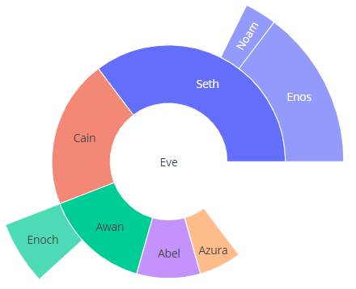

### path

分层数据一般以矩形 dataframe 提供，不同列对应不同层的数据。`px.sunburst` 可以使用 `path` 参数指定不同列，使用 `path` 时不能使用 `names` 和 `parent`。

```py
import plotly.express as px
df = px.data.tips()
fig = px.sunburst(df, path=['day', 'time', 'sex'], values='total_bill')
fig.show()
```

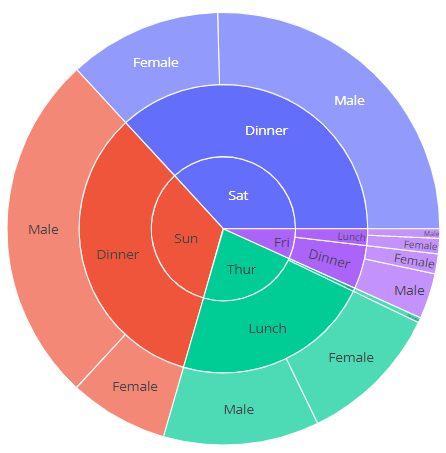

### 颜色设置 - continuous

如果使用 `color` 参数，节点的颜色为子节点颜色的权重均值。

```py
import plotly.express as px
import numpy as np
df = px.data.gapminder().query("year == 2007")
fig = px.sunburst(df, path=['continent', 'country'], values='pop',
                  color='lifeExp', hover_data=['iso_alpha'],
                  color_continuous_scale='RdBu',
                  color_continuous_midpoint=np.average(df['lifeExp'], weights=df['pop']))
fig.show()
```

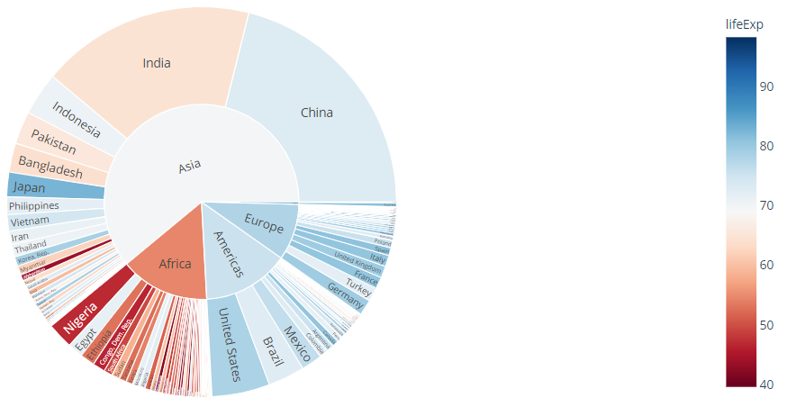

### 颜色设置 - discrete

如果 `color` 为非数值数据，则使用离散颜色。如果扇区的所有子节点颜色相同，则使用该颜色，否则使用离散颜色的第一个值。

```py
import plotly.express as px
df = px.data.tips()
fig = px.sunburst(df, path=['sex', 'day', 'time'], values='total_bill', color='day')
fig.show()
```


例如，下例中 `Saturday` 和 `Sunday` 扇区颜色和 `Dinner` 相同，因为两者都只包含 `Dinner`。不过 Female -> Friday 同时包含 lunches 和 dinners，因此使用混合色：

```py
import plotly.express as px
df = px.data.tips()
fig = px.sunburst(df, path=['sex', 'day', 'time'], values='total_bill', color='time')
fig.show()
```

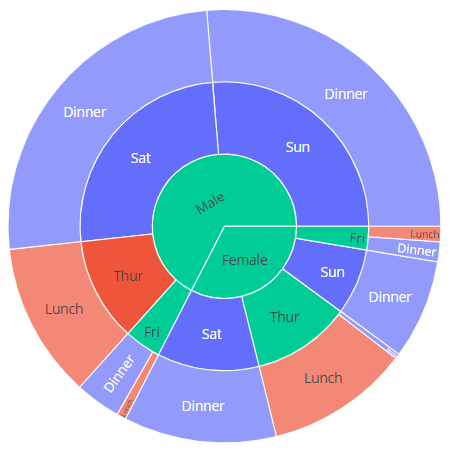

### 颜色 - mapping

```py
import plotly.express as px
df = px.data.tips()
fig = px.sunburst(df, path=['sex', 'day', 'time'], values='total_bill', color='time',
                  color_discrete_map={'(?)':'black', 'Lunch':'gold', 'Dinner':'darkblue'})
fig.show()
```


### 缺失值

对缺失值，使用 `None` 替代，`None` 的父节点必须为叶节点，即，子节点必须有且只有 `None` 。

```py
import plotly.express as px
import pandas as pd
vendors = ["A", "B", "C", "D", None, "E", "F", "G", "H", None]
sectors = ["Tech", "Tech", "Finance", "Finance", "Other",
           "Tech", "Tech", "Finance", "Finance", "Other"]
regions = ["North", "North", "North", "North", "North",
           "South", "South", "South", "South", "South"]
sales = [1, 3, 2, 4, 1, 2, 2, 1, 4, 1]
df = pd.DataFrame(
    dict(vendors=vendors, sectors=sectors, regions=regions, sales=sales)
)
print(df)
fig = px.sunburst(df, path=['regions', 'sectors', 'vendors'], values='sales')
fig.show()
```

```text
  vendors  sectors regions  sales
0       A     Tech   North      1
1       B     Tech   North      3
2       C  Finance   North      2
3       D  Finance   North      4
4    None    Other   North      1
5       E     Tech   South      2
6       F     Tech   South      2
7       G  Finance   South      1
8       H  Finance   South      4
9    None    Other   South      1
```

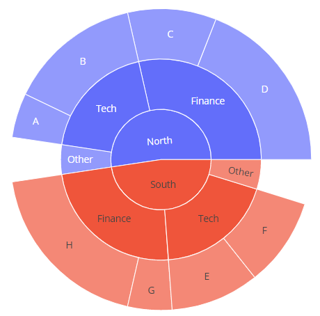

## go.Sunburst

```py
import plotly.graph_objects as go

fig =go.Figure(go.Sunburst(
    labels=["Eve", "Cain", "Seth", "Enos", "Noam", "Abel", "Awan", "Enoch", "Azura"],
    parents=["", "Eve", "Eve", "Seth", "Seth", "Eve", "Eve", "Awan", "Eve" ],
    values=[10, 14, 12, 10, 2, 6, 6, 4, 4],
))
# Update layout for tight margin
# See https://plotly.com/python/creating-and-updating-figures/
fig.update_layout(margin = dict(t=0, l=0, r=0, b=0))

fig.show()
```

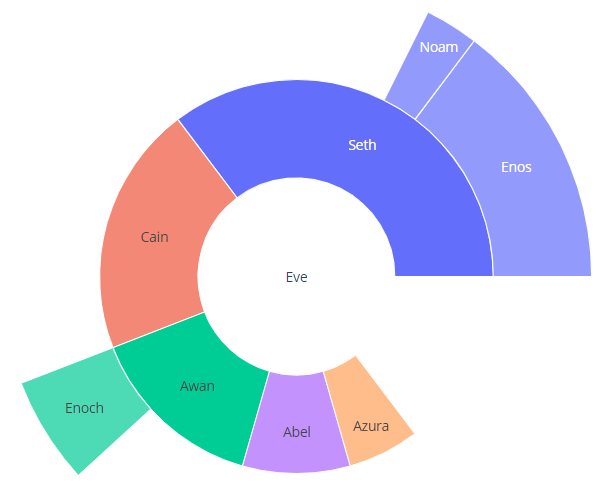

### 重复值

```py
import plotly.graph_objects as go

fig =go.Figure(go.Sunburst(
 ids=[
    "North America", "Europe", "Australia", "North America - Football", "Soccer",
    "North America - Rugby", "Europe - Football", "Rugby",
    "Europe - American Football","Australia - Football", "Association",
    "Australian Rules", "Autstralia - American Football", "Australia - Rugby",
    "Rugby League", "Rugby Union"
  ],
  labels= [
    "North<br>America", "Europe", "Australia", "Football", "Soccer", "Rugby",
    "Football", "Rugby", "American<br>Football", "Football", "Association",
    "Australian<br>Rules", "American<br>Football", "Rugby", "Rugby<br>League",
    "Rugby<br>Union"
  ],
  parents=[
    "", "", "", "North America", "North America", "North America", "Europe",
    "Europe", "Europe","Australia", "Australia - Football", "Australia - Football",
    "Australia - Football", "Australia - Football", "Australia - Rugby",
    "Australia - Rugby"
  ],
))
fig.update_layout(margin = dict(t=0, l=0, r=0, b=0))

fig.show()
```

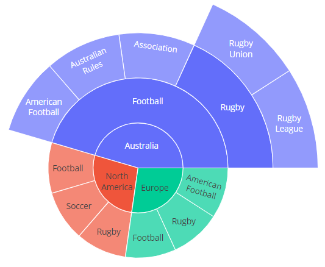

## Branchvalues

设置 `branchvalues="total"` 时，父节点的值表示楔形的总宽度。下例总，"Enoch" 值为 4，"Awan" 值为 6，所以 Enoch 的宽度是 Awans 的 4/6。

设置 `branchvalues="remainder"` 时，父节点的宽度由其值与子节点值的加和确定，此时 Enoch 的宽度是 Awan 的 4/(6 + 4)。

所以在设置为 "total" 时，子节点值的加和不能超过父节点。而设置为 "remainder" 时，子节点不可能占据父节点下的所有宽度，唯一例外的情况是根结点值为 0 时。

```py
import plotly.graph_objects as go

fig =go.Figure(go.Sunburst(
    labels=[ "Eve", "Cain", "Seth", "Enos", "Noam", "Abel", "Awan", "Enoch", "Azura"],
    parents=["",    "Eve",  "Eve",  "Seth", "Seth", "Eve",  "Eve",  "Awan",  "Eve" ],
    values=[  65,    14,     12,     10,     2,      6,      6,      4,       4],
    branchvalues="total",
))
fig.update_layout(margin = dict(t=0, l=0, r=0, b=0))

fig.show()
```

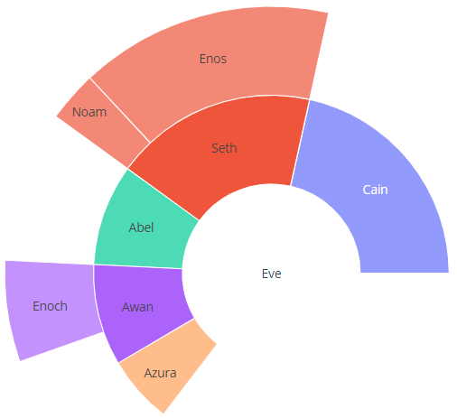

## 大量 Slices

这里使用 `domain` 属性指定 subplot 的位置：

```py
import plotly.graph_objects as go

import pandas as pd

df1 = pd.read_csv('https://raw.githubusercontent.com/plotly/datasets/718417069ead87650b90472464c7565dc8c2cb1c/sunburst-coffee-flavors-complete.csv')
df2 = pd.read_csv('https://raw.githubusercontent.com/plotly/datasets/718417069ead87650b90472464c7565dc8c2cb1c/coffee-flavors.csv')

fig = go.Figure()

fig.add_trace(go.Sunburst(
    ids=df1.ids,
    labels=df1.labels,
    parents=df1.parents,
    domain=dict(column=0)
))

fig.add_trace(go.Sunburst(
    ids=df2.ids,
    labels=df2.labels,
    parents=df2.parents,
    domain=dict(column=1),
    maxdepth=2
))

fig.update_layout(
    grid= dict(columns=2, rows=1),
    margin = dict(t=0, l=0, r=0, b=0)
)

fig.show()
```

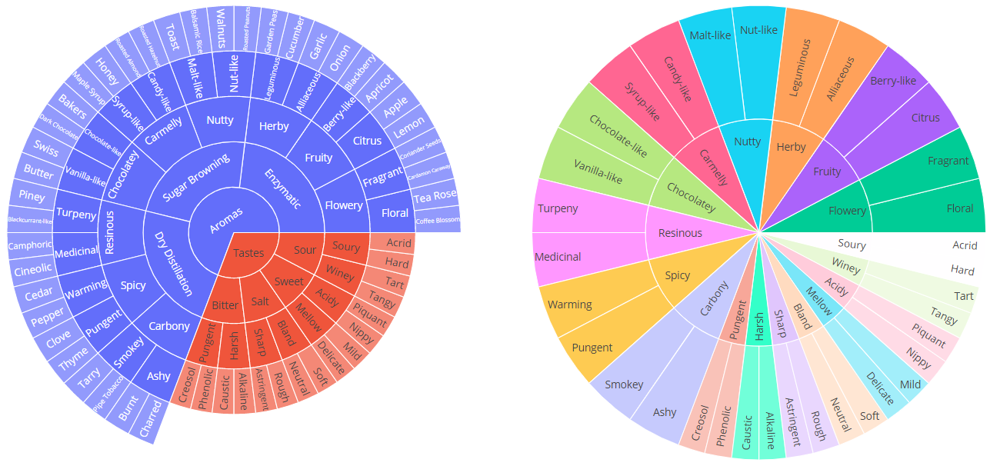

## 设置文本方向

`insidetextorientation` 属性设置文本标签的方向。

- `"auto"` 自动旋转文本，以适应扇区面积（自动调整大小）
- `"horizontal"`，文本水平
- `"radial"`，文本辐射状
- `"tangential"`，文本切线状

对 px，使用 `fig.update_traces(insidetextorientation='...')` 设置文本方向。

```py
import plotly.graph_objects as go
import pandas as pd

df = pd.read_csv('https://raw.githubusercontent.com/plotly/datasets/718417069ead87650b90472464c7565dc8c2cb1c/coffee-flavors.csv')

fig = go.Figure()

fig.add_trace(go.Sunburst(
    ids=df.ids,
    labels=df.labels,
    parents=df.parents,
    domain=dict(column=1),
    maxdepth=2,
    insidetextorientation='radial'
))

fig.update_layout(
    margin = dict(t=10, l=10, r=10, b=10)
)

fig.show()
```

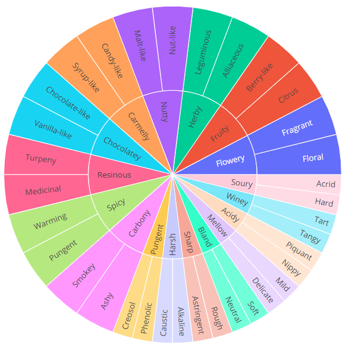

## uniformtext

```py
import plotly.graph_objects as go
import pandas as pd

df = pd.read_csv('https://raw.githubusercontent.com/plotly/datasets/718417069ead87650b90472464c7565dc8c2cb1c/sunburst-coffee-flavors-complete.csv')

fig = go.Figure(go.Sunburst(
        ids = df.ids,
        labels = df.labels,
        parents = df.parents))
fig.update_layout(uniformtext=dict(minsize=10, mode='hide'))
fig.show()
```


## continuous colorscale

下面以宽度表示销售量，以颜色表示呼叫成功率，按照 region, country 和 salesperson 分层。

```py
import plotly.graph_objects as go
from plotly.subplots import make_subplots
import pandas as pd

df = pd.read_csv('https://raw.githubusercontent.com/plotly/datasets/master/sales_success.csv')
print(df.head())

levels = ['salesperson', 'county', 'region'] # levels used for the hierarchical chart
color_columns = ['sales', 'calls']
value_column = 'calls'

def build_hierarchical_dataframe(df, levels, value_column, color_columns=None):
    """
    Build a hierarchy of levels for Sunburst or Treemap charts.

    Levels are given starting from the bottom to the top of the hierarchy,
    ie the last level corresponds to the root.
    """
    df_all_trees = pd.DataFrame(columns=['id', 'parent', 'value', 'color'])
    for i, level in enumerate(levels):
        df_tree = pd.DataFrame(columns=['id', 'parent', 'value', 'color'])
        dfg = df.groupby(levels[i:]).sum()
        dfg = dfg.reset_index()
        df_tree['id'] = dfg[level].copy()
        if i < len(levels) - 1:
            df_tree['parent'] = dfg[levels[i+1]].copy()
        else:
            df_tree['parent'] = 'total'
        df_tree['value'] = dfg[value_column]
        df_tree['color'] = dfg[color_columns[0]] / dfg[color_columns[1]]
        df_all_trees = df_all_trees.append(df_tree, ignore_index=True)
    total = pd.Series(dict(id='total', parent='',
                              value=df[value_column].sum(),
                              color=df[color_columns[0]].sum() / df[color_columns[1]].sum()))
    df_all_trees = df_all_trees.append(total, ignore_index=True)
    return df_all_trees


df_all_trees = build_hierarchical_dataframe(df, levels, value_column, color_columns)
average_score = df['sales'].sum() / df['calls'].sum()

fig = make_subplots(1, 2, specs=[[{"type": "domain"}, {"type": "domain"}]],)

fig.add_trace(go.Sunburst(
    labels=df_all_trees['id'],
    parents=df_all_trees['parent'],
    values=df_all_trees['value'],
    branchvalues='total',
    marker=dict(
        colors=df_all_trees['color'],
        colorscale='RdBu',
        cmid=average_score),
    hovertemplate='<b>%{label} </b> <br> Sales: %{value}<br> Success rate: %{color:.2f}',
    name=''
    ), 1, 1)

fig.add_trace(go.Sunburst(
    labels=df_all_trees['id'],
    parents=df_all_trees['parent'],
    values=df_all_trees['value'],
    branchvalues='total',
    marker=dict(
        colors=df_all_trees['color'],
        colorscale='RdBu',
        cmid=average_score),
    hovertemplate='<b>%{label} </b> <br> Sales: %{value}<br> Success rate: %{color:.2f}',
    maxdepth=2
    ), 1, 2)

fig.update_layout(margin=dict(t=10, b=10, r=10, l=10))
fig.show()
```

```text
   Unnamed: 0 region   county salesperson  calls  sales
0           0  North   Dallam          JE     35     23
1           1  North   Dallam          ZQ     49     13
2           2  North   Dallam          IJ     20      6
3           3  North  Hartley          WE     39     37
4           4  North  Hartley          PL     42     37
```

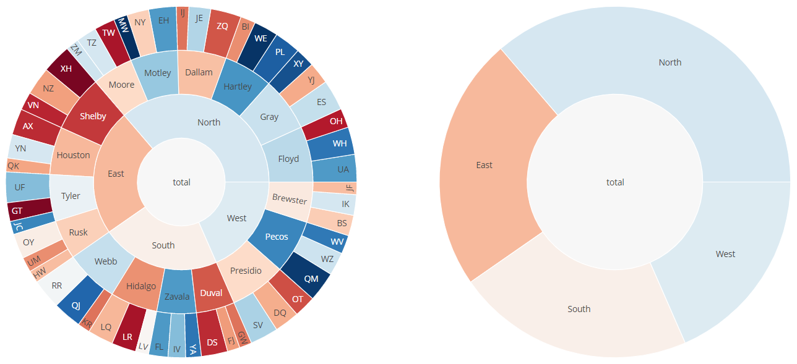
