# Violin Plots

- [Violin Plots](#violin-plots)
  - [Violin with px](#violin-with-px)
    - [基本 violin](#%e5%9f%ba%e6%9c%ac-violin)
    - [加入 box 和数据点](#%e5%8a%a0%e5%85%a5-box-%e5%92%8c%e6%95%b0%e6%8d%ae%e7%82%b9)
    - [多个 violin](#%e5%a4%9a%e4%b8%aa-violin)
  - [go.violin](#goviolin)
    - [基本 Violin - go](#%e5%9f%ba%e6%9c%ac-violin---go)
    - [多个小提琴](#%e5%a4%9a%e4%b8%aa%e5%b0%8f%e6%8f%90%e7%90%b4)
    - [分组 violin](#%e5%88%86%e7%bb%84-violin)
    - [不对称 violin](#%e4%b8%8d%e5%af%b9%e7%a7%b0-violin)
    - [高级 violin](#%e9%ab%98%e7%ba%a7-violin)
    - [Ridgeline plot](#ridgeline-plot)
  - [参考](#%e5%8f%82%e8%80%83)
    - [violin 属性](#violin-%e5%b1%9e%e6%80%a7)
      - [`name`](#name)
      - [`x`, `y`](#x-y)
      - [`x0`, `y0`](#x0-y0)
      - [`legendgroup`](#legendgroup)
      - [`scalegroup`](#scalegroup)
      - [`scalemode`](#scalemode)
      - [`side`](#side)
      - [`points`](#points)
      - [`pointpos`](#pointpos)
      - [`showlegend`](#showlegend)
      - [`jitter`](#jitter)
    - [`line`](#line)
    - [箱线图设置](#%e7%ae%b1%e7%ba%bf%e5%9b%be%e8%ae%be%e7%bd%ae)
      - [`box.visible`](#boxvisible)
      - [`box.width`](#boxwidth)
      - [`box.fillcolor`](#boxfillcolor)
      - [`box.line`](#boxline)
    - [`meanline`](#meanline)
    - [颜色](#%e9%a2%9c%e8%89%b2)
      - [`fillcolor`](#fillcolor)
      - [`opacity`](#opacity)
    - [`marker`](#marker)
      - [`marker.outliercolor`](#markeroutliercolor)
      - [`marker.symbol`](#markersymbol)
      - [`marker.opacity`](#markeropacity)
      - [`marker.size`](#markersize)
      - [`marker.color`](#markercolor)
      - [`marker.line`](#markerline)
    - [`layout` 属性](#layout-%e5%b1%9e%e6%80%a7)
      - [`layout.violinmode`](#layoutviolinmode)
      - [`layout.violingap`](#layoutviolingap)
      - [`layout.violingroupgap`](#layoutviolingroupgap)

2020-04-16, 15:46
*** **

## Violin with px

`plotly.express.violin(data_frame=None, x=None, y=None, color=None, facet_row=None, facet_col=None, facet_col_wrap=0, hover_name=None, hover_data=None, custom_data=None, animation_frame=None, animation_group=None, category_orders={}, labels={}, color_discrete_sequence=None, color_discrete_map={}, orientation='v', violinmode='group', log_x=False, log_y=False, range_x=None, range_y=None, points=None, box=False, title=None, template=None, width=None, height=None)`

1. data_frame

提供数据。

2. x

data_frame 中列的名称，或 pandas Series，或 array_link 对象。

3. y

data_frame 中列的名称，或 pandas Series，或 array_link 对象。该参数值用于确定数据点在 y 轴的位置。

4. color

`data_frame` 中列的名称（str or int），或者 pandas `Series` 或 array-like 对象。

设置颜色。

5. box

boolean, default False。

True 表示在 violins 中绘制 boxes。

hover_data, (list of str or int, or Series or array_link), data_frame 中 columns 名称 ，或 pandas Series 或 array_link 对象，用作额外的悬停提示数据。

### 基本 violin

```py
import plotly.express as px

df = px.data.tips()
fig = px.violin(df, y="total_bill")
fig.show()
```

数据如下：

```text
     total_bill   tip     sex smoker   day    time  size
0         16.99  1.01  Female     No   Sun  Dinner     2
1         10.34  1.66    Male     No   Sun  Dinner     3
2         21.01  3.50    Male     No   Sun  Dinner     3
3         23.68  3.31    Male     No   Sun  Dinner     2
4         24.59  3.61  Female     No   Sun  Dinner     4
..          ...   ...     ...    ...   ...     ...   ...
239       29.03  5.92    Male     No   Sat  Dinner     3
240       27.18  2.00  Female    Yes   Sat  Dinner     2
241       22.67  2.00    Male    Yes   Sat  Dinner     2
242       17.82  1.75    Male     No   Sat  Dinner     2
243       18.78  3.00  Female     No  Thur  Dinner     2

[244 rows x 7 columns]
```

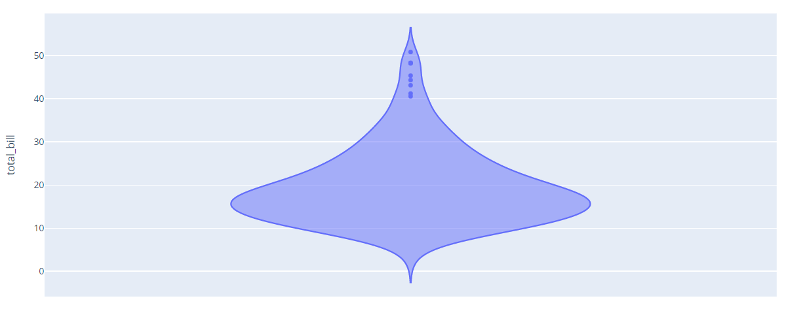

### 加入 box 和数据点

```py
import plotly.express as px

df = px.data.tips()
fig = px.violin(df, y="total_bill", box=True, # draw box plot inside the violin
                points='all', # can be 'outliers', or False
               )
fig.show()
```


### 多个 violin

```py
import plotly.express as px

df = px.data.tips()
fig = px.violin(df, y="tip", x="smoker", color="sex", box=True, points="all",
          hover_data=df.columns)
fig.show()
```

- `box=True` 表示绘制箱线图。
- `points='all'` 表示绘制所有数据点。
- `x='smoker'`，根据 'smoker' 进行分类，绘制多个小提琴。


```py
import plotly.express as px

df = px.data.tips()
fig = px.violin(df, y="tip", color="sex",
                violinmode='overlay', # draw violins on top of each other
                # default violinmode is 'group' as in example above
                hover_data=df.columns)
fig.show()
```

- `violinmode='overlay'` 将小提琴重叠起来


## go.violin

水平或垂直：

- 对垂直的小提琴图，对 `y` 进行统计。
- 对水平的 violin，对 `x` 进行统计。

如果提供了 `x` 数组，则对每个不同的 `x` 绘制一个小提琴，如果不提供 `x`，则只绘制一个小提琴。

小提琴的位置由 `'name'` 确定，如果提供了 `'x0'`，则由 `'x0'` 确定。

### 基本 Violin - go

```py
import plotly.express as px
import plotly.graph_objects as go

df = px.data.tips()

fig = go.Figure(
    go.Violin(
        y=df['total_bill'],
        box_visible=True,
        line_color='black',
        meanline_visible=True,
        fillcolor='lightseagreen',
        opacity=0.6,
        x0='Total Bill'
    )
)
fig.update_layout(yaxis_zeroline=False)
fig.show()
```

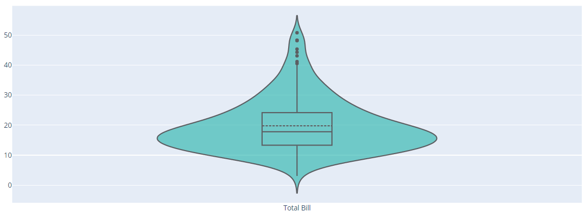

### 多个小提琴

```py
import plotly.express as px
import plotly.graph_objects as go

df = px.data.tips()
fig = go.Figure()
days = ['Thur', 'Fri', "Sat", 'Sun']
for day in days:
    fig.add_trace(go.Violin(
        x=df['day'][df['day'] == day],
        y=df['total_bill'][df['day'] == day],
        name=day,
        box_visible=True,
        meanline_visible=True
    ))
fig.show()
```

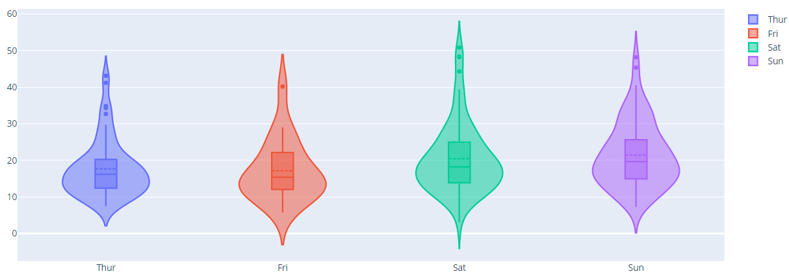

### 分组 violin

```py
import plotly.express as px
import plotly.graph_objects as go

df = px.data.tips()

fig = go.Figure()
fig.add_trace(go.Violin(
    x=df['day'][df['sex'] == 'Male'],
    y=df['total_bill'][df['sex'] == 'Male'],
    legendgroup='M',
    scalegroup='M',
    name='M',
    line_color='blue'
))
fig.add_trace(go.Violin(
    x=df['day'][df['sex'] == 'Female'],
    y=df['total_bill'][df['sex'] == 'Female'],
    legendgroup='F',
    scalegroup='F',
    name='F',
    line_color='orange'
))
fig.update_traces(box_visible=True, meanline_visible=True)
fig.update_layout(violinmode='group')
fig.show()
```

violin 中 box 内的虚线为均值线。

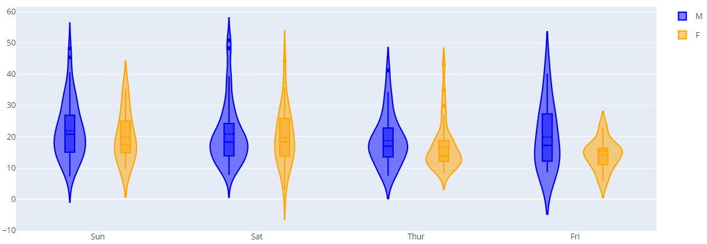

### 不对称 violin

```py
import plotly.express as px
import plotly.graph_objects as go

df = px.data.tips()

fig = go.Figure()
fig.add_trace(go.Violin(
    x=df['day'][df['smoker'] == 'Yes'],
    y=df['total_bill'][df['smoker'] == 'Yes'],
    legendgroup='Yes',
    scalegroup='Yes',
    name='Yes',
    side='negative',
    line_color='blue'
))
fig.add_trace(go.Violin(
    x=df['day'][df['smoker'] == 'No'],
    y=df['total_bill'][df['smoker'] == 'No'],
    legendgroup='No',
    scalegroup='No',
    name='No',
    side='positive',
    line_color='orange'
))
fig.update_traces(meanline_visible=True)
fig.update_layout(violingap=0, violinmode='overlay')
fig.show()
```

`side='negative'` 表示绘制左边。

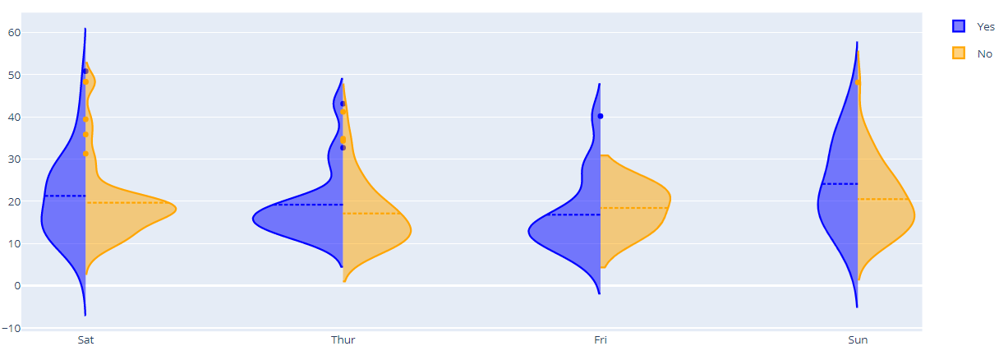

### 高级 violin

```py
import pandas as pd
import plotly.express as px
import plotly.graph_objects as go

df = px.data.tips()

pointpos_male = [-0.9, -1.1, -0.6, -0.3]
pointpos_female = [0.45, 0.55, 1, 0.4]
show_legend = [True, False, False, False]

fig = go.Figure()
for i in range(0, len(pd.unique(df['day']))):
    fig.add_trace(go.Violin(
        x=df['day'][(df['sex'] == 'Male')
                    & (df['day'] == pd.unique(df['day'])[i])],
        y=df['total_bill'][(df['sex'] == 'Male')
                           & (df['day'] == pd.unique(df['day'])[i])],
        legendgroup='M',
        scalegroup='M',
        name='M',
        side='negative',
        pointpos=pointpos_male[i],  # 设置数据点相对 violin 的位置
        line_color='lightseagreen',
        showlegend=show_legend[i]
    ))
    fig.add_trace(go.Violin(
        x=df['day'][(df['sex'] == 'Female')
                    & (df['day'] == pd.unique(df['day'])[i])],
        y=df['total_bill'][(df['sex'] == 'Female')
                           & (df['day'] == pd.unique(df['day'])[i])],
        legendgroup='F',
        scalegroup='F',
        name='F',
        side='positive',
        pointpos=pointpos_female[i],  # 设置数据点相对 violin 的位置
        line_color='mediumpurple',
        showlegend=show_legend[i]
    ))

fig.update_traces(meanline_visible=True,
                  points='all',
                  jitter=0.05,
                  scalemode='count')
fig.update_layout(
    title_text='Total bill distribution<br><i>scaled by number of bills per gender',
    violingap=0,
    violingroupgap=0,
    violinmode='overlay'
)
fig.show()
```

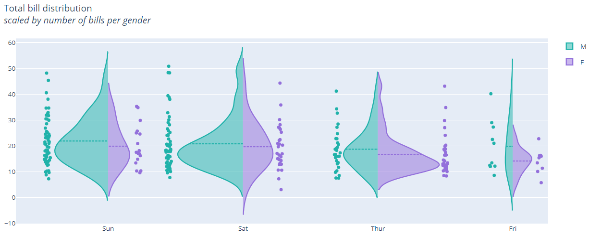

### Ridgeline plot

ridgeline plot（棱线图）用于显示多个数值分布，可用来可视化数据分布在时间或空间上的变化。

```py
import plotly.graph_objects as go
from plotly.colors import n_colors
import numpy as np
np.random.seed(1)

# 12 sets of normal distributed random data, with increasing mean and standard deviation
data = (np.linspace(1, 2, 12)[:, np.newaxis] * np.random.randn(12, 200) +
            (np.arange(12) + 2 * np.random.random(12))[:, np.newaxis])

colors = n_colors('rgb(5, 200, 200)', 'rgb(200, 10, 10)', 12, colortype='rgb')

fig = go.Figure()
for data_line, color in zip(data, colors):
    fig.add_trace(go.Violin(x=data_line, line_color=color))

fig.update_traces(orientation='h', side='positive', width=3, points=False)
fig.update_layout(xaxis_showgrid=False, xaxis_zeroline=False)
fig.show()
```

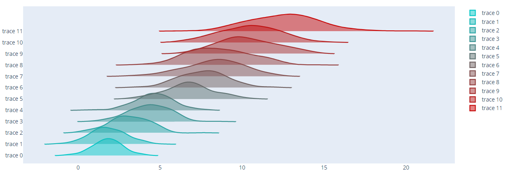

## 参考

### violin 属性

#### `name`

trace 名称。

trace 名称在 legend 和 hover 中显示。

对 violin，如果缺少 `x` 和 `x0` （对水平 violin 为 `y` 和 `y0`），且 position axis 是分类值，则 `name` 还用来作为位置坐标。

另外，`name` 还是 `scalegroup` 的默认值。

#### `x`, `y`

对垂直 violin，对 `y` 值进行统计:

- 提供 `x` 数组时，对每个不同的 `x` 绘制不同 violine。
- 不提供 `x`，绘制一个 violin。

对水平 violine, 对 `x` 值进行统计：

- 提供 `y` 数组时，，对每个不同的 `y` 绘制一个 violine。
- 不提供 `y`时，，就绘制一个 violin。

#### `x0`, `y0`

对单个小提琴，设置小提琴的位置；对多个小提琴，设置起始位置。

#### `legendgroup`

默认 ""。

设置 trace 的 legend 分组。当点击 legend 时，相同 legend 分组的 traces 同时显示或隐藏。主要用于交互显示。

#### `scalegroup`

string 类型，默认 ""。

如果多个 violin 需要根据 `scalemode` 调整大小，提供非空 `scalegroup` 可以使相同 group 的 violins 同时缩放。

例如，使用 `scalemode='width'` 缩放策略，对两组 violin：

- 如果它们的 `scalegroup` 不同，则它们各自的最大宽度对应各自最大值，两组 violin 的最大宽度相同。
- 如果它们的 `scalegroup` 相同，则选择两组中分布的最大值作为最大宽度，两组 violin 都根据该最大宽度进行缩放。

如果未定义 `width`，`scalegroup` 默认是 trace 名称，此时相同名称的 violin 链接在一起。

#### `scalemode`

enum: `width`, `count`

默认 `width`。

设置小提琴宽度的度量标准。

- `width` 表示所有 violin 具有相同的最大宽度。
- `count` 表示小提琴根据其数据点个数进行缩放。

下面不同模式的效果：

|width|count|
|---|---|
|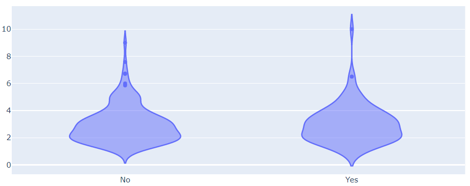|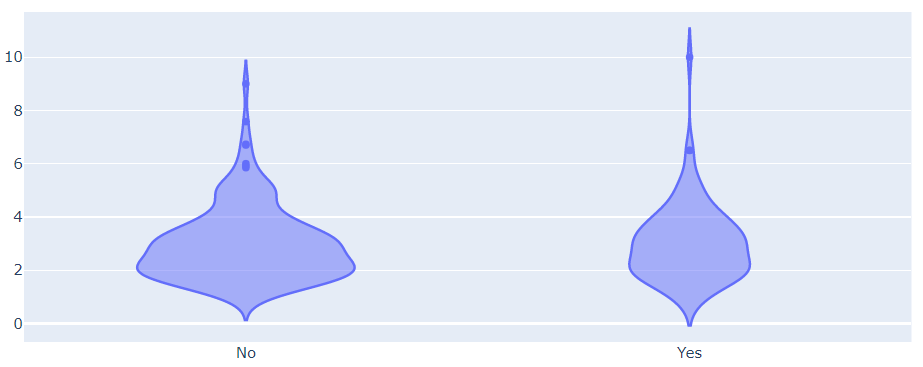|

#### `side`

enum: "both", "positive", "negative"

默认："both"

用于设置在那一侧绘制小提琴的一半。

当对比两个小提琴时，选择 `overlay` 模式，一个小提琴选择 "positive"，一个小提琴选择 "negative"，就可以很好对比。如下所示：


左侧对应 `side='negative'`，右侧对应 `side='positive'`。

#### `points`

enum：`outliers`, `suspectedoutliers`, `all`, 或 `False`。

如果设置了 `marker.outliercolor` 或 `marker.line.outliercolor`，默认为 `suspectedoutliers`，否则默认为 `outliers`。

- `outliers`, 只绘制盒须框外的数据点；
- `suspectedoutliers`, 显示离阈点，对小于 4Q1-3Q3 或大于 4Q3-3Q1 的数据点用 marker 的 `outliercolor` 高亮；
- `all`, 显示所有的数据点；
- `False`, 不显式样本点，盒须图延展到整个区域。

#### `pointpos`

[-2, 2]

设置数据点相对 violin 的位置。

- 0, 将数据点放在 violin 中心
- positive, vertical violin 的右边，horizontal violin 的上面
- negative, vertical violin 的左边，horizontal violin 的下面

#### `showlegend`

默认 True。

是否在 legend 中显示该 trace 的信息。

#### `jitter`

[0,1] 之间的值。

设置绘制数据点时的波动量：

- 0, 数据点绘制在一条直线上。
- 1, 以 violin 宽度随机波动绘制数据点。

### `line`

小提琴边框线条属性。

- `line.color`

小提琴边框颜色。

- `line.width`

小提琴边框线条宽度，默认 2px.

### 箱线图设置

`data[type=violin].box` 表示小提琴内部的箱线图属性。

#### `box.visible`

boolean, 是否在小提琴内绘制一个小的箱线图。

例如：

```py
data = go.Violin(y=df['total_bill'], box_visible=True, line_color='black',
                 meanline_visible=True, fillcolor='lightseagreen', opacity=0.6,
                 x0='Total Bill')
```

#### `box.width`

[0,1] 之间的数值，默认 0.25.

内部 box 宽度相对 violin 宽度的比例。例如，如果为 1，内部 box 和 violin 一样宽。

#### `box.fillcolor`

内部 box 的填充色。

#### `box.line`

设置内部 box 边框线条属性。

- `box.line.color`

边框线条颜色。

- `box.line.width`

边框线条宽度。

### `meanline`

`data[type=violin].meanline` 表示小提琴图的均值线属性。

- `meanline.visible`

boolean, 是否在小提琴中绘制与样本均值对应的线。

如果在设置 `meanline_visible=True`同时设置 `box_visible=True`，则在内部框内绘制均值线，否则均值线从小提琴一侧延伸到另一侧。

- `meanline.color`

均值线的颜色。

- `meanline.width`

均值线宽度。

### 颜色

#### `fillcolor`

填充颜色。

默认为 line color, marker color 或 marker line color 的半透明变体。

#### `opacity`

[0,1] 之间的值，默认为 1.

设置不透明度。

### `marker`

用于设置数据点的性质。

#### `marker.outliercolor`

默认 "rgba(0, 0, 0, 0)"。

设置离阈数据点的颜色。

#### `marker.symbol`

数据点的形状。

enum: ( "0" | "circle" | "100" | "circle-open" | "200" | "circle-dot" | "300" | "circle-open-dot" | "1" | "square" | "101" | "square-open" | "201" | "square-dot" | "301" | "square-open-dot" | "2" | "diamond" | "102" | "diamond-open" | "202" | "diamond-dot" | "302" | "diamond-open-dot" | "3" | "cross" | "103" | "cross-open" | "203" | "cross-dot" | "303" | "cross-open-dot" | "4" | "x" | "104" | "x-open" | "204" | "x-dot" | "304" | "x-open-dot" | "5" | "triangle-up" | "105" | "triangle-up-open" | "205" | "triangle-up-dot" | "305" | "triangle-up-open-dot" | "6" | "triangle-down" | "106" | "triangle-down-open" | "206" | "triangle-down-dot" | "306" | "triangle-down-open-dot" | "7" | "triangle-left" | "107" | "triangle-left-open" | "207" | "triangle-left-dot" | "307" | "triangle-left-open-dot" | "8" | "triangle-right" | "108" | "triangle-right-open" | "208" | "triangle-right-dot" | "308" | "triangle-right-open-dot" | "9" | "triangle-ne" | "109" | "triangle-ne-open" | "209" | "triangle-ne-dot" | "309" | "triangle-ne-open-dot" | "10" | "triangle-se" | "110" | "triangle-se-open" | "210" | "triangle-se-dot" | "310" | "triangle-se-open-dot" | "11" | "triangle-sw" | "111" | "triangle-sw-open" | "211" | "triangle-sw-dot" | "311" | "triangle-sw-open-dot" | "12" | "triangle-nw" | "112" | "triangle-nw-open" | "212" | "triangle-nw-dot" | "312" | "triangle-nw-open-dot" | "13" | "pentagon" | "113" | "pentagon-open" | "213" | "pentagon-dot" | "313" | "pentagon-open-dot" | "14" | "hexagon" | "114" | "hexagon-open" | "214" | "hexagon-dot" | "314" | "hexagon-open-dot" | "15" | "hexagon2" | "115" | "hexagon2-open" | "215" | "hexagon2-dot" | "315" | "hexagon2-open-dot" | "16" | "octagon" | "116" | "octagon-open" | "216" | "octagon-dot" | "316" | "octagon-open-dot" | "17" | "star" | "117" | "star-open" | "217" | "star-dot" | "317" | "star-open-dot" | "18" | "hexagram" | "118" | "hexagram-open" | "218" | "hexagram-dot" | "318" | "hexagram-open-dot" | "19" | "star-triangle-up" | "119" | "star-triangle-up-open" | "219" | "star-triangle-up-dot" | "319" | "star-triangle-up-open-dot" | "20" | "star-triangle-down" | "120" | "star-triangle-down-open" | "220" | "star-triangle-down-dot" | "320" | "star-triangle-down-open-dot" | "21" | "star-square" | "121" | "star-square-open" | "221" | "star-square-dot" | "321" | "star-square-open-dot" | "22" | "star-diamond" | "122" | "star-diamond-open" | "222" | "star-diamond-dot" | "322" | "star-diamond-open-dot" | "23" | "diamond-tall" | "123" | "diamond-tall-open" | "223" | "diamond-tall-dot" | "323" | "diamond-tall-open-dot" | "24" | "diamond-wide" | "124" | "diamond-wide-open" | "224" | "diamond-wide-dot" | "324" | "diamond-wide-open-dot" | "25" | "hourglass" | "125" | "hourglass-open" | "26" | "bowtie" | "126" | "bowtie-open" | "27" | "circle-cross" | "127" | "circle-cross-open" | "28" | "circle-x" | "128" | "circle-x-open" | "29" | "square-cross" | "129" | "square-cross-open" | "30" | "square-x" | "130" | "square-x-open" | "31" | "diamond-cross" | "131" | "diamond-cross-open" | "32" | "diamond-x" | "132" | "diamond-x-open" | "33" | "cross-thin" | "133" | "cross-thin-open" | "34" | "x-thin" | "134" | "x-thin-open" | "35" | "asterisk" | "135" | "asterisk-open" | "36" | "hash" | "136" | "hash-open" | "236" | "hash-dot" | "336" | "hash-open-dot" | "37" | "y-up" | "137" | "y-up-open" | "38" | "y-down" | "138" | "y-down-open" | "39" | "y-left" | "139" | "y-left-open" | "40" | "y-right" | "140" | "y-right-open" | "41" | "line-ew" | "141" | "line-ew-open" | "42" | "line-ns" | "142" | "line-ns-open" | "43" | "line-ne" | "143" | "line-ne-open" | "44" | "line-nw" | "144" | "line-nw-open" )

默认 "circle"。

- 形状名称后添加 100 等价于添加后缀 "-open"。
- 形状名称后添加 200 等价于添加后缀 "-dot"。
- 形状名称后添加 300 等价于添加后缀 "-open-dot" 或 "dot-open"。

#### `marker.opacity`

[0,1]，默认 1.

设置 marker 的不透明度。

#### `marker.size`

设置 marker 的尺寸。默认 6px。

#### `marker.color`

设置 marker 颜色。接收多种类型的值：

- 特定颜色，
- 数值数组
  - 根据数组的最大值和最小值映射到 colorscale
  - 如果设置了 `marker.cmin` 和 `marker.cmax`，则根据这两值映射到 colorscale。

#### `marker.line`

设置 marker 的边框线条属性。

- `marker.line.color`

设置边框颜色，默认 "#444"。接收多种类型的值：

- 特定颜色，
- 数值数组
  - 根据数组的最大值和最小值映射到 colorscale
  - 如果设置了 `marker.line.cmin` 和 `marker.line.cmax`，则根据这两值映射到 colorscale。

- `marker.line.width`

marker 边框宽度。默认 0px。

- `marker.line.outliercolor`

离阈值数据点的边框颜色。默认 `marker.color`。

- `marker.line.outlierwidth`

离阈值数据点的边框宽度，默认 1 px。

### `layout` 属性

#### `layout.violinmode`

enum: `"group"`, `"overlay"`

默认 `overlay`。

相同位置的 violin 如何显示：

- `"group"`, 以坐标位置为中心并排显示。
- `"overlay"`，重叠显示。

#### `layout.violingap`

[0,1]，默认 0.3。

设置相邻 violin 的间距。

|0|0.5|
|---|---|
|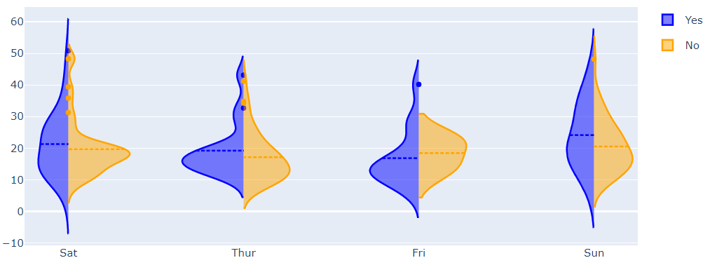|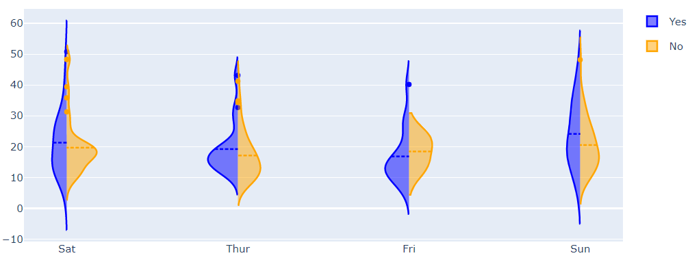|

可以发现，当 violingap=0.5 时，间距变大，留给 violin 的位置变小。

#### `layout.violingroupgap`

[0,1]，默认 0.3.

设置相同位置小提琴之间的间隔，为相对 plot 的比例值。不影响设置了 "width" 的 traces。
