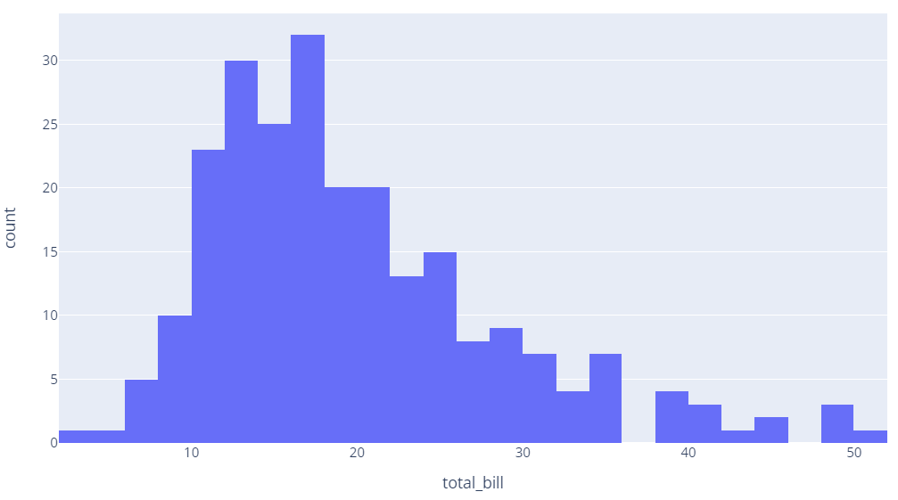
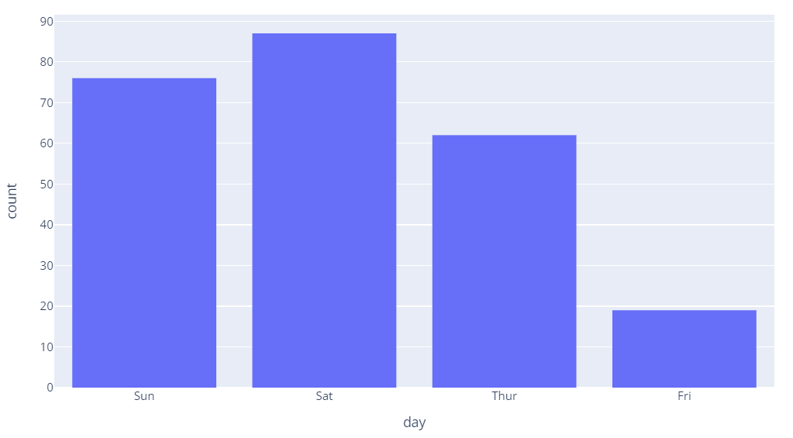

# 直方图

- [直方图](#直方图)
  - [简介](#简介)
  - [px API](#px-api)
  - [设置 bin 数](#设置-bin-数)
  - [参考](#参考)

## 简介

在统计学中，直方图用于展示数值数据的分布，数据被分到不同的 bin 中，统计每个 bin 中数据个数。在 plotly 中，直方图是一种聚合条形图，并提供了多种聚合函数，例如加和、平均、计数等，可用于可视化分类轴、日期轴以及线性轴上的数据。

## px API

```py
import plotly.express as px
df = px.data.tips()
fig = px.histogram(df, x="total_bill")
fig.show()
```



> df['total_bill'] 是一列浮点数

- 分类数据

```py
import plotly.express as px
df = px.data.tips()
# Here we use a column with categorical data
fig = px.histogram(df, x="day")
fig.show()
```



## 设置 bin 数

plotly 默认设置的 bins 数与样本数成正比，bin 数和 bin 范围可以定义。

```py

```

## 参考

- https://plotly.com/python/histograms/
- https://plotly.com/python-api-reference/generated/plotly.express.histogram
- https://plotly.com/python/reference/histogram/
