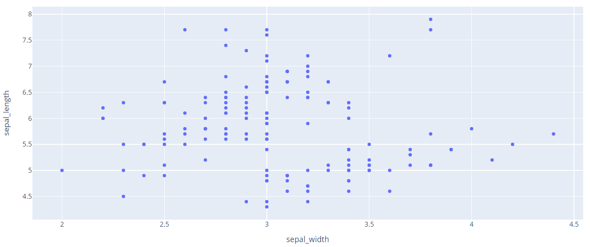
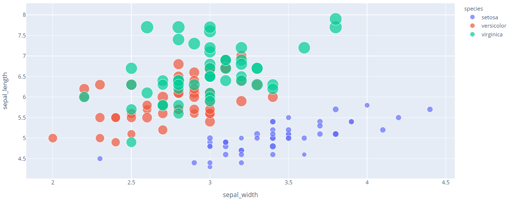
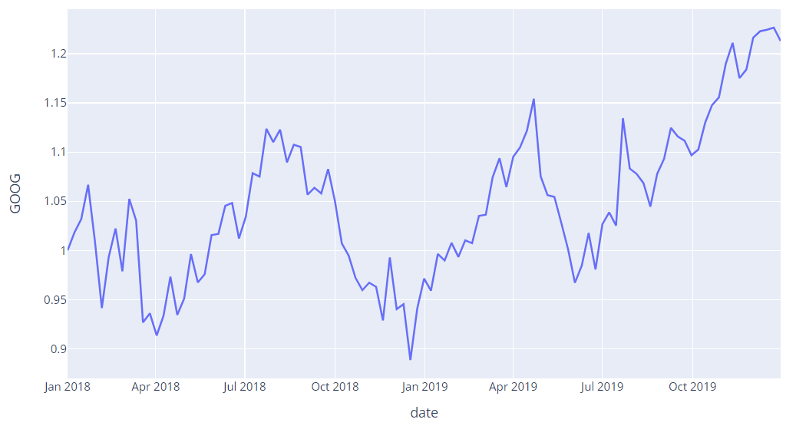
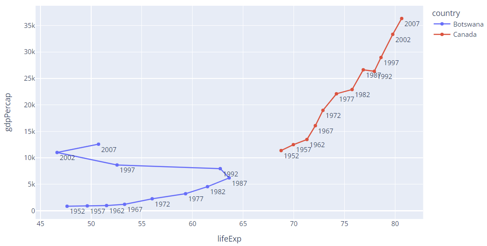
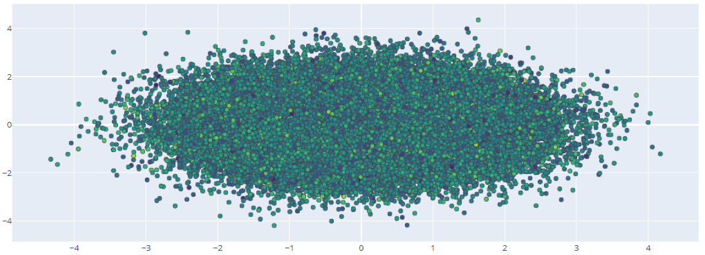

# 散点图

- [散点图](#散点图)
  - [PX API](#px-api)
    - [通过 column 名称设置 color 和 size](#通过-column-名称设置-color-和-size)
    - [通过 column 名称设置 symbol](#通过-column-名称设置-symbol)
    - [分类坐标](#分类坐标)
    - [误差线](#误差线)
    - [边缘分布图](#边缘分布图)
    - [Facetting](#facetting)
    - [趋势线](#趋势线)
    - [Line plot](#line-plot)
    - [Date 线图](#date-线图)
    - [数据顺序](#数据顺序)
    - [连接散点图](#连接散点图)
  - [go API](#go-api)
    - [简单散点图](#简单散点图)
    - [Line and Scatter Plots](#line-and-scatter-plots)
    - [气泡图](#气泡图)
    - [散点图个性化设置](#散点图个性化设置)
    - [悬停文本](#悬停文本)
    - [增加 Color Dimension](#增加-color-dimension)
    - [大数据集](#大数据集)
  - [参考](#参考)

2020-04-20, 09:38
****

## PX API

使用 `px.scatter` 绘制散点图，数据点由标记（marker）表示，位置由 `x`, `y` 确定。

- 数组作为数据源，例 1

```python
import plotly.express as px

fig = px.scatter(
    x=[0, 1, 2, 3, 4],
    y=[0, 1, 4, 9, 16]
)
fig.show()
```


- `DataFrame` 作为数据源，例 2

```py
import plotly.express as px

df = px.data.iris()  # iris 是 pandas DataFrame
fig = px.scatter(df, x='sepal_width', y='sepal_length')
fig.show()
```



> 该 API 和 pandas 结合使用比较方便。

### 通过 column 名称设置 color 和 size

大小可变的圆形 marker 散点图也称为气泡图（bubble chart）。

> `color` 和 `size` 已添加到 hover 信息中，可以通过 `px.scatter` 的 `hover_data` 参数添加额外的 column 到 hover 中。

例3：

```py
import plotly.express as px

df = px.data.iris()
fig = px.scatter(df, x="sepal_width", y="sepal_length",
                 color="species", size="petal_length", hover_data=['petal_width'])
fig.show()
```

> 这里将 `species` 列作为颜色信息。注意 `hover_data` 参数类型为 list



- 上面设置颜色的 `species` 为离散值，也可以将连续值作为颜色，例 4：

```py
import plotly.express as px

df = px.data.iris()
fig = px.scatter(df, x='sepal_width', y='sepal_length', color='petal_length')
fig.show()
```


### 通过 column 名称设置 symbol

可以将 column 值映射到 symbol，这样不同的值对应不同的 symbol。例 5：

```py
import plotly.express as px

df = px.data.iris()
fig = px.scatter(df, x="sepal_width", y="sepal_length", color="species", symbol="species")
fig.show()
```


### 分类坐标

散点图可以使用任意类型的笛卡尔轴进行绘制，包括线性轴、对数轴、分类轴以及日期轴。

其中一个轴为分类变量的散点图也称为**点图**（dot plot）。例 6：

```py
import plotly.express as px

df = px.data.medals_long()

fig = px.scatter(df, y="nation", x="count", color="medal", symbol="medal")
fig.update_traces(marker_size=10)
fig.show()
```


### 误差线

散点图支持误差线。例 7：

```py
import plotly.express as px

df = px.data.iris()
df['error'] = df['sepal_width'] / 100  # 模拟误差

fig = px.scatter(df, x='sepal_width', y='sepal_length', color='species',
                 error_x='error', error_y='error')
fig.show()
```


### 边缘分布图

散点图支持添加边缘分布图。例 8：

```py
import plotly.express as px

df = px.data.iris()
fig = px.scatter(df, x='sepal_width', y='sepal_length',
                 marginal_x="histogram",
                 marginal_y="rug")
fig.show()
```


### Facetting

散点图支持 faceting。例 9：

```py
import plotly.express as px

df = px.data.tips()
fig = px.scatter(df, x='total_bill', y='tip', color='smoker',
                 facet_col="sex", facet_row="time")
fig.show()
```


### 趋势线

散点图支持趋势线。例 10：

```py
import plotly.express as px

df = px.data.tips()
fig = px.scatter(df, x='total_bill', y='tip',
                 trendline='ols')
fig.show()
```

> 需要安装 `statsmodels` 模块才能运行。


### Line plot

- 单线条，例 11：

```py
import plotly.express as px
import numpy as np

t = np.linspace(0, 2*np.pi, 100)

fig = px.line(x=t, y=np.cos(t), labels={'x':'t', 'y':'cos(t)'})
fig.show()
```


- 多线条，例 12：

```py
import plotly.express as px
df = px.data.gapminder().query("continent == 'Oceania'")
fig = px.line(df, x='year', y='lifeExp', color='country')
fig.show()
```


- 将 `markers` 参数设置为 `True` 可以同时显示 marker。例 13：

```py
import plotly.express as px

df = px.data.gapminder().query("continent == 'Oceania'")
fig = px.line(df, x='year', y='lifeExp', color='country', markers=True)
fig.show()
```


- `symbol` 参数可以将数据映射到 maker symbol。例 14：

```py
import plotly.express as px

df = px.data.gapminder().query("continent == 'Oceania'")
fig = px.line(df, x='year', y='lifeExp', color='country', symbol='country')
fig.show()
```


### Date 线图

一个轴为日期的线图通常称为时间序列图。

当数据是 ISO 格式的日期字符串、pandas date column 或 numpy datetime array，plotly 会自动将轴类型设置为日期格式。例 15：

```py
import plotly.express as px

df = px.data.stocks()
fig = px.line(df, x='date', y='GOOG')
fig.show()
```



### 数据顺序

plotly 中线图是通过连接散点图中的点实现，即先绘制散点图，然后将这些点用线段按顺序连接。

所以如果数据顺序没指定好，可能会出现下图情况。例 16：

```py
import plotly.express as px
import pandas as pd

df = pd.DataFrame(dict(
    x = [1, 3, 2, 4],
    y = [1, 2, 3, 4]
))
fig = px.line(df, x="x", y="y", title="Unsorted Input") 
fig.show()

df = df.sort_values(by="x")
fig = px.line(df, x="x", y="y", title="Sorted Input") 
fig.show()
```


### 连接散点图

例 17：

```py
import plotly.express as px

df = px.data.gapminder().query("country in ['Canada', 'Botswana']")
fig = px.line(df, x="lifeExp", y="gdpPercap", color="country", text="year")
fig.update_traces(textposition="bottom right")
fig.show()
```



## go API

`go.Scatter` 函数更为通用。`go.Scatter` 可用于绘制散点图和线图，具体取决于 `mode` 参数。

### 简单散点图

例 18：

```py
import plotly.graph_objects as go
import numpy as np

N = 1000
t = np.linspace(0, 10, 100)
y = np.sin(t)

fig = go.Figure(data=go.Scatter(x=t, y=y, mode='markers'))

fig.show()
```

`mode="markers"` 表示散点图。


### Line and Scatter Plots

使用 `mode` 参数选择 `markers`, `lines` 或者两者都要。

例 19：

```py
import plotly.graph_objects as go

# Create random data with numpy
import numpy as np
np.random.seed(1)

N = 100
random_x = np.linspace(0, 1, N)
random_y0 = np.random.randn(N) + 5
random_y1 = np.random.randn(N)
random_y2 = np.random.randn(N) - 5

fig = go.Figure()

# Add traces
fig.add_trace(go.Scatter(x=random_x, y=random_y0,
                    mode='markers', # 散点图
                    name='markers'))
fig.add_trace(go.Scatter(x=random_x, y=random_y1,
                    mode='lines+markers', # 散点图+线图
                    name='lines+markers'))
fig.add_trace(go.Scatter(x=random_x, y=random_y2,
                    mode='lines', # 线图
                    name='lines'))

fig.show()
```


### 气泡图

气泡图（Bubble charts），将第三维信息以 marker 的大小显示。

例 20：

```py
import plotly.graph_objects as go

fig = go.Figure(data=go.Scatter(
    x=[1, 2, 3, 4],
    y=[10, 11, 12, 13],
    mode='markers',
    marker=dict(size=[40, 60, 80, 100],
                color=[0, 1, 2, 3])
))

fig.show()
```

`marker=dict(size=...)` 是实现气泡图的关键。


### 散点图个性化设置

例 21：

```py
import plotly.graph_objects as go
import numpy as np


t = np.linspace(0, 10, 100)

fig = go.Figure()

fig.add_trace(go.Scatter(
    x=t, y=np.sin(t),
    name='sin', # 名称
    mode='markers', # 散点图模式
    marker_color='rgba(152, 0, 0, .8)' # maker 颜色
))

fig.add_trace(go.Scatter(
    x=t, y=np.cos(t),
    name='cos',
    marker_color='rgba(255, 182, 193, .9)'
))

# 使用 fig.update_traces 设置所有 traces 的通用配置
fig.update_traces(mode='markers', marker_line_width=2, marker_size=10)
fig.update_layout(title='Styled Scatter',
                  yaxis_zeroline=False, xaxis_zeroline=False)

fig.show()
```


### 悬停文本

例 22：

```py
import plotly.graph_objects as go
import pandas as pd

data= pd.read_csv("https://raw.githubusercontent.com/plotly/datasets/master/2014_usa_states.csv")

fig = go.Figure(data=go.Scatter(x=data['Postal'],
                                y=data['Population'],
                                mode='markers',
                                marker_color=data['Population'],
                                text=data['State'])) # 设置悬停信息

fig.update_layout(title='Population of USA States') # 设置标题
fig.show()
```


### 增加 Color Dimension

例 23：

```py
import plotly.graph_objects as go
import numpy as np

fig = go.Figure(data=go.Scatter(
    y = np.random.randn(500), # 500 个数据点，没有提供 x，默认为 0-499
    mode='markers',
    marker=dict(
        size=16,
        color=np.random.randn(500), # 设置颜色值
        colorscale='Viridis', # 设置色阶
        showscale=True
    )
))

fig.show()
```


### 大数据集

plotly 使用 `Scattergl()` 替代 `Scatter()` 实现 WebGL，以提高速度、交互性，以及绘制更多数据。

例 24：

```py
import plotly.graph_objects as go
import numpy as np

N = 100000
fig = go.Figure(data=go.Scattergl(
    x = np.random.randn(N),
    y = np.random.randn(N),
    mode='markers',
    marker=dict(
        color=np.random.randn(N),
        colorscale='Viridis',
        line_width=1
    )
))

fig.show()
```



例 25：

```py
import plotly.graph_objects as go
import numpy as np

N = 100000
r = np.random.uniform(0, 1, N)
theta = np.random.uniform(0, 2*np.pi, N)

fig = go.Figure(data=go.Scattergl(
    x = r * np.cos(theta), # non-uniform distribution
    y = r * np.sin(theta), # zoom to see more points at the center
    mode='markers',
    marker=dict(
        color=np.random.randn(N),
        colorscale='Viridis',
        line_width=1
    )
))

fig.show()
```


## 参考

- https://plotly.com/python/line-and-scatter/
