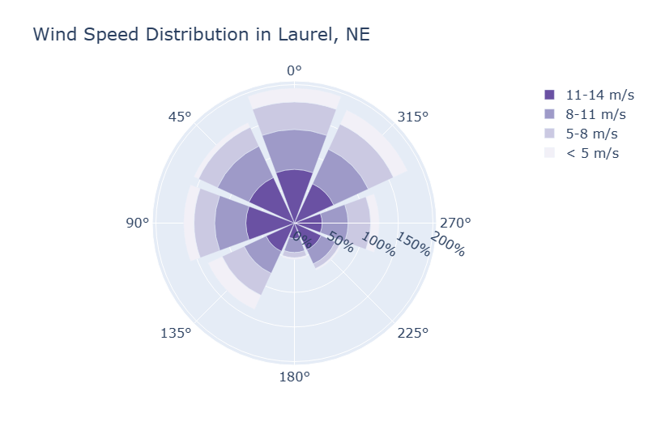

# 玫瑰图和极坐标条形图

2023-05-16
****

## 简介

风向玫瑰图（window rose chart），又称为极坐标条形图（Polar Bar Chart），用于可视化风速、风向。

可以使用 `px.bar_polar` 或 `go.Barpolar` 绘制。

## px API

```python
import plotly.express as px  
  
df = px.data.wind()  # 三维数据，风向，强度，频率  
  
# 频率对应半径，角度对应风向，颜色对应强度
fig = px.bar_polar(df, r='frequency', theta='direction',  
                   color='strength', template='plotly_dark',  
                   color_discrete_sequence=px.colors.sequential.Plasma_r)  
fig.show()
```


## go API

```python
import plotly.graph_objects as go  
  
fig = go.Figure()  
  
fig.add_trace(go.Barpolar(  
    r=[77.5, 72.5, 70.0, 45.0, 22.5, 42.5, 40.0, 62.5],  
    name='11-14 m/s',  
    marker_color='rgb(106,81,163)'  
))  
fig.add_trace(go.Barpolar(  
    r=[57.5, 50.0, 45.0, 35.0, 20.0, 22.5, 37.5, 55.0],  
    name='8-11 m/s',  
    marker_color='rgb(158,154,200)'  
))  
fig.add_trace(go.Barpolar(  
    r=[40.0, 30.0, 30.0, 35.0, 7.5, 7.5, 32.5, 40.0],  
    name='5-8 m/s',  
    marker_color='rgb(203,201,226)'  
))  
fig.add_trace(go.Barpolar(  
    r=[20.0, 7.5, 15.0, 22.5, 2.5, 2.5, 12.5, 22.5],  
    name='< 5 m/s',  
    marker_color='rgb(242,240,247)'  
))  
  
fig.update_traces(text=['North', 'N-E', 'East', 'S-E', 'South', 'S-W', 'West', 'N-W'])  
fig.update_layout(  
    title='Wind Speed Distribution in Laurel, NE',  
    font_size=16,  
    legend_font_size=16,  
    polar_radialaxis_ticksuffix='%',  
    polar_angularaxis_rotation=90,  
  
)  
fig.show()
```

每个 `Barpolar` 对应一圈柱状图，它们互相堆叠，构成下图的效果。


## 参考

- https://plotly.com/python/wind-rose-charts/
