# Discrete Color

- [Discrete Color](#discrete-color)
  - [简介](#%e7%ae%80%e4%bb%8b)
  - [Discrete Color with Express](#discrete-color-with-express)
    - [离散颜色数据](#%e7%a6%bb%e6%95%a3%e9%a2%9c%e8%89%b2%e6%95%b0%e6%8d%ae)
    - [连续颜色数据](#%e8%bf%9e%e7%bb%ad%e9%a2%9c%e8%89%b2%e6%95%b0%e6%8d%ae)
    - [数字转字符串](#%e6%95%b0%e5%ad%97%e8%bd%ac%e5%ad%97%e7%ac%a6%e4%b8%b2)
    - [字符串转数字](#%e5%ad%97%e7%ac%a6%e4%b8%b2%e8%bd%ac%e6%95%b0%e5%ad%97)
    - [颜色序列 - px](#%e9%a2%9c%e8%89%b2%e5%ba%8f%e5%88%97---px)
    - [创建颜色序列](#%e5%88%9b%e5%bb%ba%e9%a2%9c%e8%89%b2%e5%ba%8f%e5%88%97)
    - [颜色-值映射](#%e9%a2%9c%e8%89%b2-%e5%80%bc%e6%98%a0%e5%b0%84)
    - [颜色顺序](#%e9%a2%9c%e8%89%b2%e9%a1%ba%e5%ba%8f)
    - [使用连续色标](#%e4%bd%bf%e7%94%a8%e8%bf%9e%e7%bb%ad%e8%89%b2%e6%a0%87)

2020-04-28, 23:24
*** *

## 简介

离散颜色涉及如下概念：

- 颜色序列（color sequences）

颜色序列是映射到离散值的颜色列表。和连续的色阶（color scale）不同，颜色序列的每种颜色按原样使用，没有插值。

颜色序列的默认值取决于当前模板的 `layout.colorway` 属性，对许多 express 函数，可以通过 `color_discrete_sequence` 参数指定颜色序列。

- 图例（legend）

legends 是颜色和数据值之间的可视化映射。在多种 trances 的情况下，legend 的形状也会改变。在 `layout.legend` 属性中可以配置 legend。

## Discrete Color with Express

大多数 Express 函数包含一个 `color` 参数：

- 对**非数值型数据**，自动为其分配离散颜色。
- 如果数据为数值型，会自动使用连续颜色分配颜色。

这表示，对字符串形式的数字，如果要使用连续颜色，需要将其转换为数字；相反，数字型数据如果要使用离散颜色，必须将其转换为字符串。

### 离散颜色数据

`tips` 数据集中，`smoker` 为字符串

```py
import plotly.express as px

df = px.data.tips()
fig = px.scatter(df, x='total_bill', y="tip", color="smoker",
                 title="String 'smoker' values mean discrete colors")
fig.show()
```

由于 `smoker` 是字符串，所以颜色为离散颜色列表。

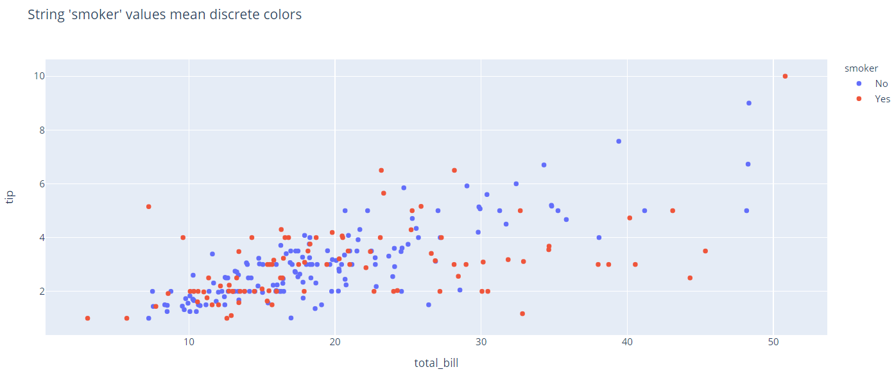

### 连续颜色数据

`size` 列包含数值

数值型数据，意味着连续颜色：[src](../src/plotly_test/color_numeric.py)

```py
import plotly.express as px

df = px.data.tips()
fig = px.scatter(df, x='total_bill', y='tip', color='size',
                 title="Numeric 'size' values mean continous color")
fig.show()
```

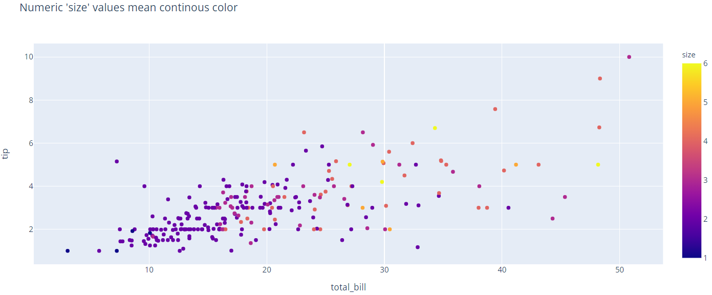

### 数字转字符串

将数值列转换为字符串很简单，但是需要注意，legend 中的顺序默认是无序的：[src](../src/plotly_test/color_num_str.py)

```py
import plotly.express as px

df = px.data.tips()
df['size'] = df['size'].astype(str)
fig = px.scatter(df, x='total_bill', y='tip', color='size',
                 title="String 'size' values mean discrete colors")
fig.show()
```

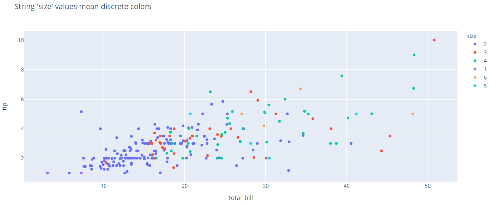

### 字符串转数字

将字符串数据转换为数值型也简单：

```py
import plotly.express as px

df = px.data.tips()
df['size'] = df['size'].astype(str)  # 转换为字符串
df['size'] = df['size'].astype(float)  # 重新转换为数值

fig = px.scatter(df, x='total_bill', y='tip', color='size',
                 title="Numeric 'size' values mean continous color")
fig.show()
```

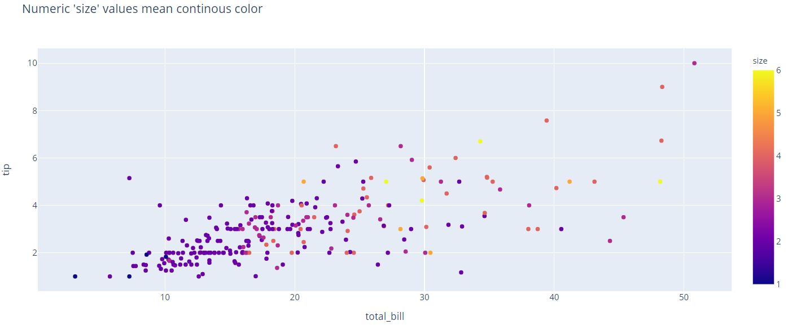

### 颜色序列 - px

Express 默认使用当前 template 的 `layout.colorway` 属性对应的颜色序列，而默认的 template 为 `plotly`，其颜色序列为 `plotly`。

`px.colors.qualitative` 模块中包含许多内置的定性颜色序列，当然也可以自定义颜色序列使用。

```py
import plotly.express as px

fig = px.colors.qualitative.swatches()
fig.show()
```

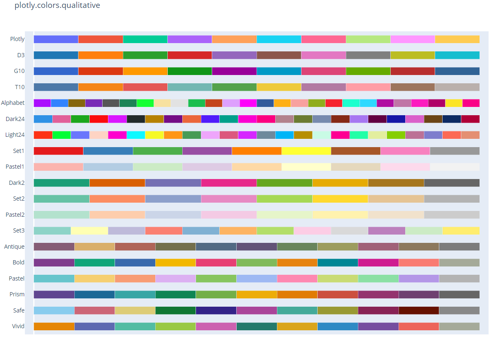

`px.colors.qualitative` 模块中的颜色序列以 CSS 颜色列表的形式保存，如 `plotly` 样式颜色：

```py
import plotly.express as px

print(px.colors.qualitative.Plotly)
```

```cmd
['#636EFA', '#EF553B', '#00CC96', '#AB63FA', '#FFA15A', '#19D3F3', '#FF6692', '#B6E880', '#FF97FF', '#FECB52']
```

下面以 `G10` 颜色序列创建一个散点图：

```py
import plotly.express as px

df = px.data.gapminder()
fig = px.line(df, y='lifeExp', x='year', color='continent', line_group='country', line_shape='spline',
              render_mode='svg', color_discrete_sequence=px.colors.qualitative.G10, title="Built-in G10 color sequence")
fig.show()
```

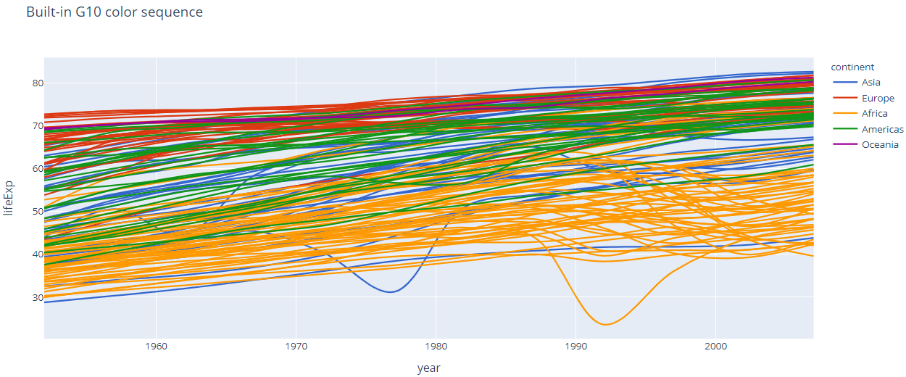

### 创建颜色序列

Express 的 `color_discrete_sequence` 参数用于设置自定义的颜色序列，接受 CSS 颜色列表：

```py
import plotly.express as px
df = px.data.gapminder().query("year == 2007")
fig = px.bar(df, y="continent", x="pop", color="continent", orientation="h", hover_name="country",
             color_discrete_sequence=["red", "green", "blue", "goldenrod", "magenta"],
             title="Explicit color sequence"
            )

fig.show()
```

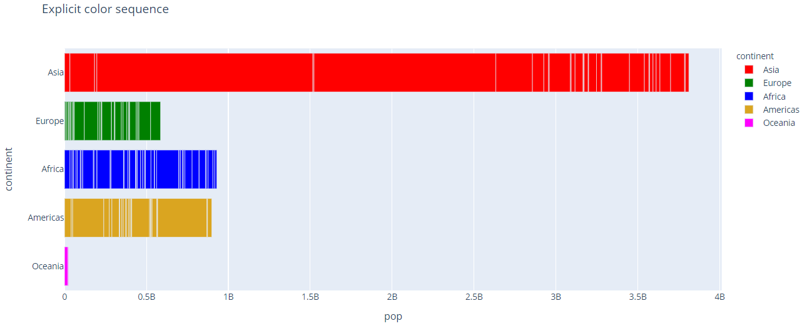

> 如果提供的颜色少于`color`映射值的 unique 值，循环使用颜色。

```py
import plotly.express as px
df = px.data.tips()
fig = px.scatter(df, x="total_bill", y="tip", color="day",
             color_discrete_sequence=["red", "blue"],
             title="<b>Ambiguous!</b> Explicit color sequence cycling because it is too short"
            )

fig.show()
```

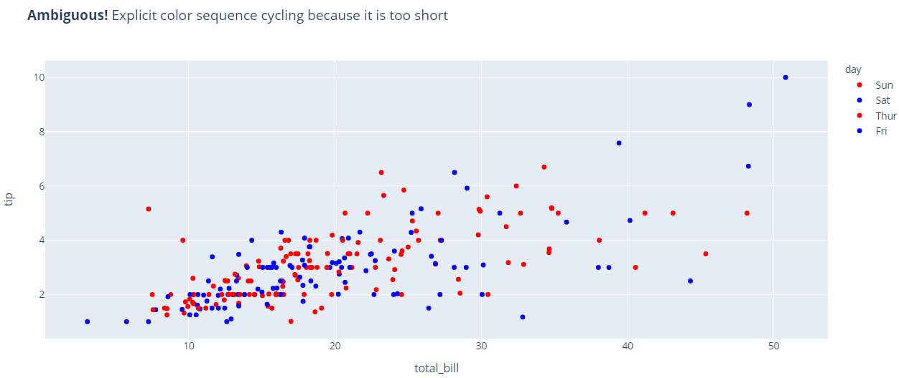

### 颜色-值映射

前面例子，都是本着先到先得的规则分配颜色，而使用 `color_discrete_map` 可以为指定数据分配知道哪个颜色。

```py
import plotly.express as px
df = px.data.gapminder().query("year == 2007")
fig = px.bar(df, y="continent", x="pop", color="continent", orientation="h", hover_name="country",
             color_discrete_map={
                "Europe": "red",
                "Asia": "green",
                "Americas": "blue",
                "Oceania": "goldenrod",
                "Africa": "magenta"},
             title="Explicit color mapping")

fig.show()
```

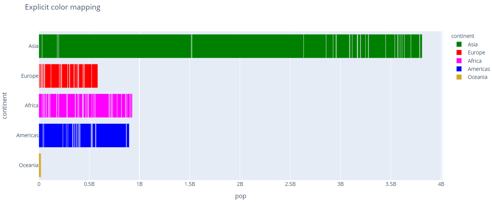

### 颜色顺序

Express 可以通过 `category_orders` 控制分类变量顺序，从而设置 colors, legends, symbols, axes 以及 facets 中的顺序。该选项可以和 `color_discrete_sequence` 或 `color_discrete_map` 结合似乎用：

```py
import plotly.express as px
df = px.data.gapminder().query("year == 2007")
fig = px.bar(df, y="continent", x="pop", color="continent", orientation="h", hover_name="country",
             color_discrete_sequence=["red", "green", "blue", "goldenrod", "magenta"],
             category_orders={"continent": ["Oceania", "Europe", "Asia", "Africa", "Americas"]},
             title="Explicit color sequence with explicit ordering"
            )

fig.show()
```

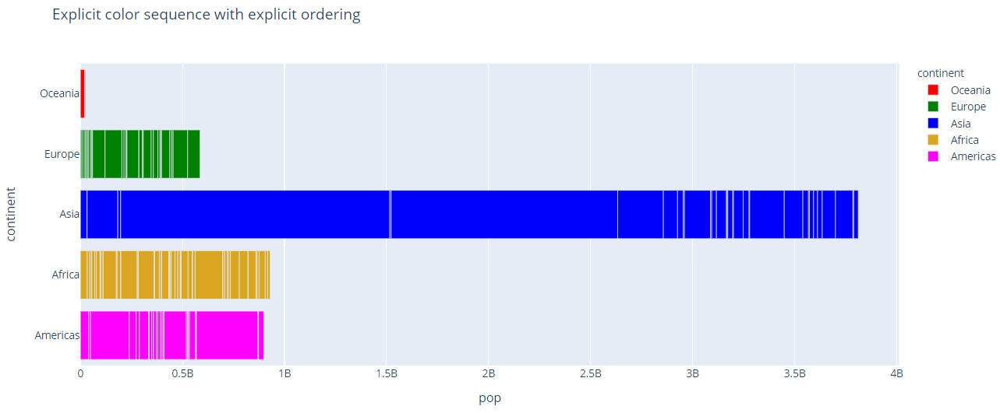

```py
import plotly.express as px
df = px.data.gapminder().query("year == 2007")
fig = px.bar(df, y="continent", x="pop", color="continent", orientation="h", hover_name="country",
             color_discrete_map={
                "Europe": "red",
                "Asia": "green",
                "Americas": "blue",
                "Oceania": "goldenrod",
                "Africa": "magenta"},
             category_orders={"continent": ["Oceania", "Europe", "Asia", "Africa", "Americas"]},
             title="Explicit color mapping with explicit ordering"
            )

fig.show()
```

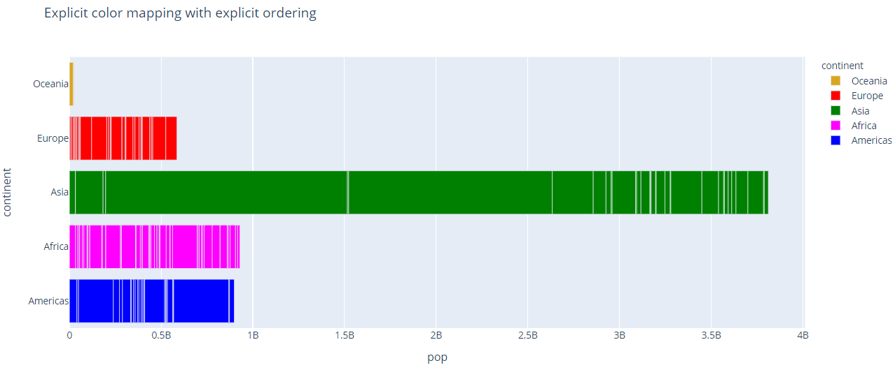

### 使用连续色标

在大多数情况下，离散（定性、分类）数据并没有前后顺序关系。但是，在某些情况下，是需要有顺序的，此时使用连续色标的一部分作为离散序列很合适。

```py
import plotly.express as px
df = px.data.wind()
fig = px.bar_polar(df, r="frequency", theta="direction", color="strength",
                   color_discrete_sequence= px.colors.sequential.Plasma_r,
                   title="Part of a continuous color scale used as a discrete sequence"
                  )
fig.show()
```

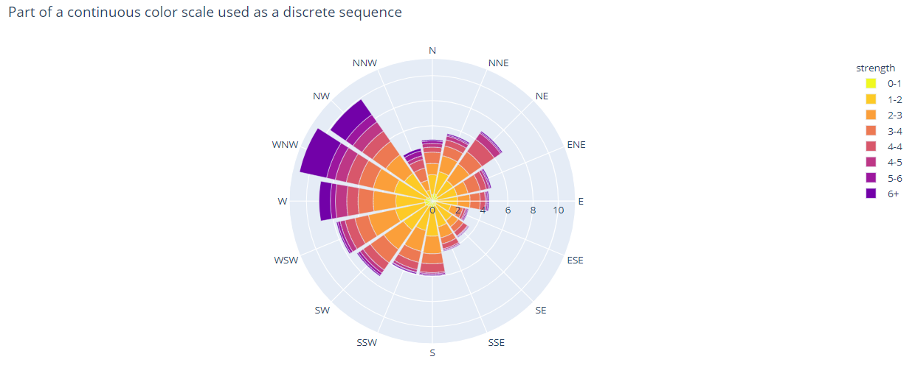

可以如此使用连续色标，是因为所有内置的连续色标和 `px.colors.qualitative` 一样，是 CSS 颜色列表：

```py
import plotly.express as px

print(px.colors.sequential.Plasma)
```

```text
['#0d0887', '#46039f', '#7201a8', '#9c179e', '#bd3786', '#d8576b', '#ed7953', '#fb9f3a', '#fdca26', '#f0f921']
```
