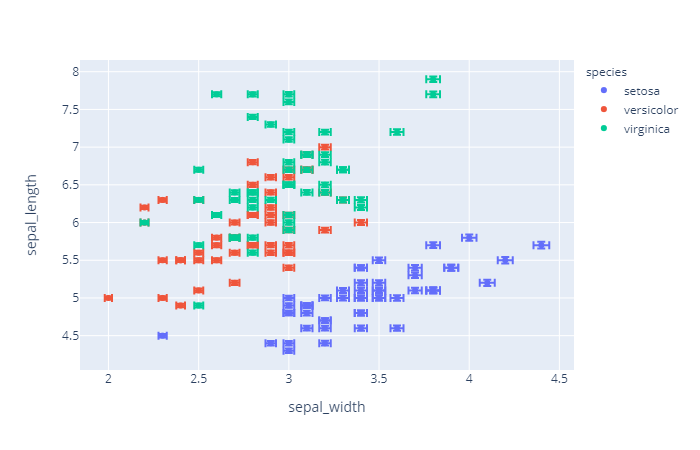
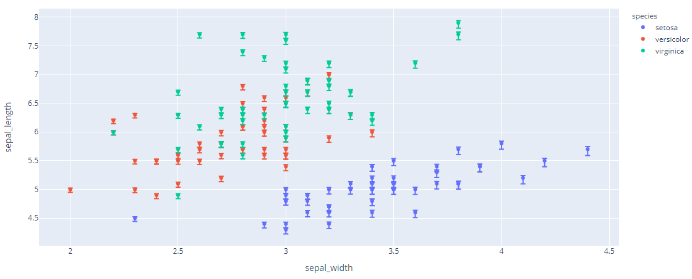

# Error Bars

- [Error Bars](#error-bars)
  - [Error Bars with Express](#error-bars-with-express)
    - [不对称 error bar](#%e4%b8%8d%e5%af%b9%e7%a7%b0-error-bar)
  - [Error bar with go](#error-bar-with-go)
  - [基本对称 Error Bar](#%e5%9f%ba%e6%9c%ac%e5%af%b9%e7%a7%b0-error-bar)

2020-05-19, 13:11
***

## Error Bars with Express

对 2D 数据点图，如 `px.scatter`, `px.line`, `px.bar` 等，x 轴的误差线通过 `error_x` 指定，y 轴误差线通过 `error_y` 指定。

```py
import plotly.express as px

df = px.data.iris()
df["e"] = df["sepal_width"] / 100
fig = px.scatter(df, x="sepal_width", y="sepal_length", color="species",
                 error_x="e", error_y="e")
fig.show()
```



### 不对称 error bar

```py
import plotly.express as px
df = px.data.iris()
df["e_plus"] = df["sepal_width"]/100
df["e_minus"] = df["sepal_width"]/40
fig = px.scatter(df, x="sepal_width", y="sepal_length", color="species",
                 error_y="e_plus", error_y_minus="e_minus")
fig.show()
```



## Error bar with go

## 基本对称 Error Bar

```py
import plotly.graph_objects as go

fig = go.Figure(data=go.Scatter(
        x=[0, 1, 2],
        y=[6, 10, 2],
        error_y=dict(
            type='data', # value of error bar given in data coordinates
            array=[1, 2, 3],
            visible=True)
    ))
fig.show()
```
