# 连续色阶和色条

- [连续色阶和色条](#连续色阶和色条)
  - [简介](#简介)
    - [color scales](#color-scales)
    - [color ranges](#color-ranges)
    - [color bar](#color-bar)
    - [color axes](#color-axes)
  - [PX API](#px-api)
    - [数字型](#数字型)
    - [数字转字符串](#数字转字符串)
    - [字符串转数字](#字符串转数字)
    - [PX 色阶](#px-色阶)
    - [反转色阶](#反转色阶)
    - [创建色阶](#创建色阶)
    - [创建离散色阶](#创建离散色阶)
    - [设置 Color range](#设置-color-range)
    - [为发散色阶指定中点颜色](#为发散色阶指定中点颜色)
    - [自定义色条](#自定义色条)
      - [隐藏色条](#隐藏色条)
      - [配置色条](#配置色条)
      - [离散色条刻度标签设置](#离散色条刻度标签设置)
      - [Log 色条刻度标签](#log-色条刻度标签)
  - [GO API](#go-api)
    - [离散 Heatmap 色阶](#离散-heatmap-色阶)
    - [Scatter 色阶](#scatter-色阶)
    - [Contour Plot 色阶](#contour-plot-色阶)
    - [Heatmap 色阶设置](#heatmap-色阶设置)
    - [设置发散色阶中点](#设置发散色阶中点)
    - [自定义 Contour 色阶](#自定义-contour-色阶)
    - [自定义 color bar](#自定义-color-bar)
    - [共享 color axis](#共享-color-axis)
    - [Log Color scale](#log-color-scale)
  - [参考](#参考)
    - [颜色类型](#颜色类型)
    - [`plotly.colors.ncolors`](#plotlycolorsncolors)

2020-04-27, 15:13
*** *

## 简介

颜色可用于表示连续和分类数据。下面介绍用颜色表示连续数值，涉及到如下几个概念。

### color scales

色阶（color scale）表示 0 到 1 数值到某个色域的映射。

默认色阶取决于当前 [template](6_theme_template.md) 的`layout.colorscales` 属性。

- px API 使用 `color_continuous_scale` 参数显式指定
- go API 使用 `graph_objects` 的 `layout.colorscales` 属性显式指定

例如 `go.Scatter` 的 `marker.colorscale` 或 `go.Heatmap` 的 `colorscale`。

例如 `[(0,"blue"), (1,"red")]` 是一个简单的色阶，两个颜色之间使用紫色插值。也可以表示为 `["blue", "red"]`，等价于内置色阶 `plotly.colors.sequential.Bluered`。

### color ranges

表示映射到色阶 [0,1] 范围数据的最大值和最小值。

Color ranges 默认是输入数据的范围：

- 大多数 PX 函数可以通过 `range_color` 或 `color_continuous_midpoint` 参数指定范围。
- go API 可以通过 `cmin`, `cmid`, `cmax` 或者 `zmin`, `zmid`, `zmax` 指定。如 `go.Scatter` 的 `layout.coloraxis.cmin`, `marker.cmin`，`go.Heatmap` 的 `cmin`。

例如，如果 color range 为 `[100, 200]`，对 `["blue", "red"]` 色阶，`color` 值 $\le100$ 为 blue，$\ge200$ 为 red。介于两者之间的则是各种紫色。

### color bar

色条（color bar）是类似于图例（Legend）的 color range 和色阶的可视化表示，可以添加刻度线和标签。

可以通过 `layout.coloraxis.colorbar` 属性配置色条，或者像 `go.Scatter` 的 `marker.colorbar`，`go.Heatmap` 的 `colorbar` 等地方配置。

### color axes

色轴（color axes）将色阶, color range 以及色条与数据联系在一起。

子图的任何可上色属性默认与其自身色轴绑定，但也可以在不同属性和子图之间共享色轴。局部色轴属性在子图内设置，如 `marker.showscale`，共享色轴属性在 Layout 中设置，如 `layout.coloraxis.showscale`。

## PX API

大多数 px 函数有 `color` 参数：

- 对数字型数据，自动成为连续色。
- 对字符串数据（离散型数据，或分类数据），自动称为离散色。

### 数字型

例如，`tips` 数据中，`size` 为数字型数据，所以自动设置为连续色：

```py
import plotly.express as px
df = px.data.tips()
fig = px.scatter(df, x="total_bill", y="tip", color="size",
                 title="Numeric 'size' values mean continous color")

fig.show()
```


### 数字转字符串

将数值转换为字符串后，对非数值型数据（离散数据），自动设置为离散色：

```py
import plotly.express as px
df = px.data.tips()
df["size"] = df["size"].astype(str)
fig = px.scatter(df, x="total_bill", y="tip", color="size",
                 title="String 'size' values mean discrete colors")

fig.show()
```

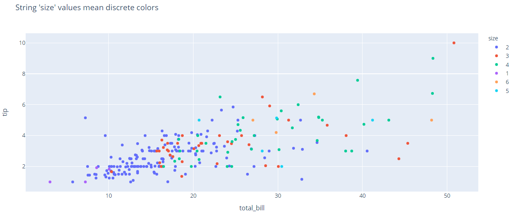

### 字符串转数字

对字符串表示的数字，可以将其转换回数字，这样就能以连续色表示：

```py
import plotly.express as px
df = px.data.tips()
df["size"] = df["size"].astype(str)
df["size"] = df["size"].astype(float)
fig = px.scatter(df, x="total_bill", y="tip", color="size",
                 title="Numeric 'size' values mean continous color")

fig.show()
```

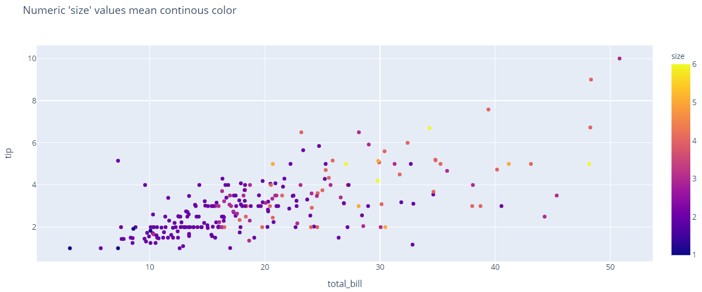

### PX 色阶

PX 默认使用当前模板的 `layout.colorscales.sequential` 色阶属性，默认模板为 `plotly`，其色阶为 `Plasma`。

下面用 PX 创建 scatter，使用 `Viridis` 色阶：

```py
import plotly.express as px
df = px.data.iris()
fig = px.scatter(df, x="sepal_width", y="sepal_length",
                 color="sepal_length", color_continuous_scale=px.colors.sequential.Viridis)

fig.show()
```

> `color` 用于指定颜色映射的属性，`color_continuous_scale` 用于指定连续色阶。

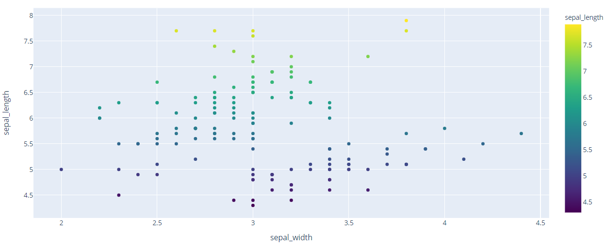

也可以直接使用色阶的名称指定色阶。例如，指定色阶为 `Inferno`：

```py
import plotly.express as px
df = px.data.iris()
fig = px.scatter(df, x="sepal_width", y="sepal_length",
                 color="sepal_length", color_continuous_scale='Inferno')

fig.show()
```

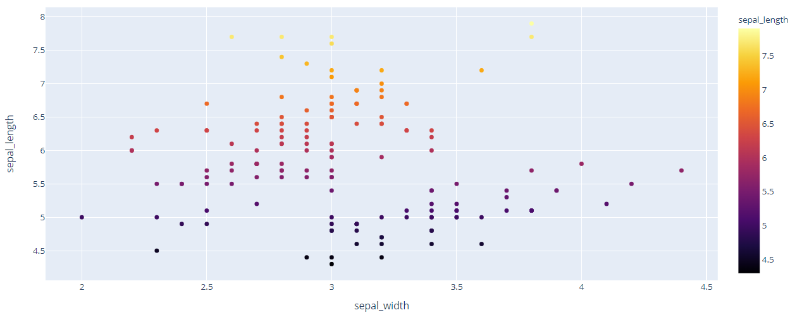

### 反转色阶

通过在内置色阶名称或 plotly 对象后添加后缀 `_r`，可以反转内置色阶，例如：

- 色阶名称添加 `_r` 后缀

```py
import plotly.express as px
df = px.data.gapminder().query("year == 2007").sort_values(by="lifeExp")
fig = px.bar(df, y="continent", x="pop", color="lifeExp", orientation="h",
             color_continuous_scale='Bluered_r', hover_name="country")

fig.show()
```

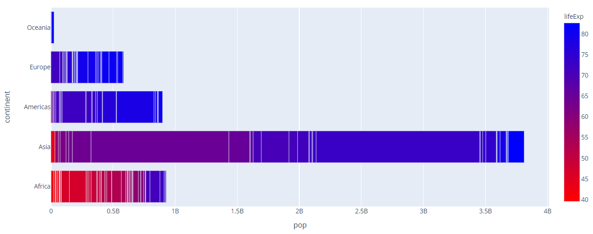

- plotly 色阶对象后添加 `_r` 后缀

```py
import plotly.express as px
data = [[1, .3, .5, .9],
        [.3, .1, .4, 1],
        [.2, .8, .9, .3]]
fig = px.imshow(data, color_continuous_scale=px.colors.sequential.Cividis_r)
fig.show()
```

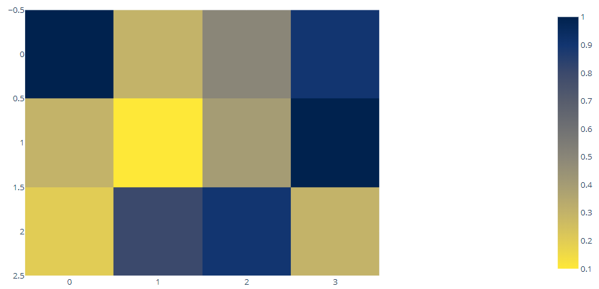

### 创建色阶

PX 的 `color_continuous_scale` 参数可以指定自定义色阶:

```py
import plotly.express as px
df = px.data.iris()
fig = px.scatter(df, x="sepal_width", y="sepal_length", color="sepal_length",
                 color_continuous_scale=["red", "green", "blue"])

fig.show()
```

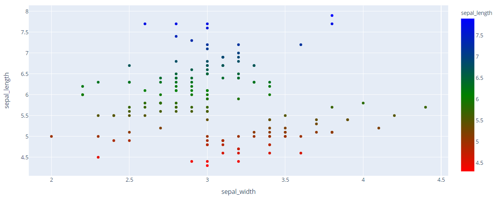

> 这里使用 CSS 颜色列表创建色阶，数据点默认等距分布。

下面和上例效果一样：

```py
import plotly.express as px
df = px.data.iris()
fig = px.scatter(df, x="sepal_width", y="sepal_length", color="sepal_length",
                 color_continuous_scale=[(0, "red"), (0.5, "green"), (1, "blue")])

fig.show()
```


> 即 `[(0, "red"), (0.5, "green"), (1, "blue")]` 和 `["red", "green", "blue"]` 等价。

### 创建离散色阶

将连续数据点指定为相同颜色可以创建离散色阶。对不支持离散颜色的图表十分有用。例如：

```py
import plotly.express as px
df = px.data.iris()
fig = px.parallel_coordinates(df, color="species_id",
                             color_continuous_scale=[(0.00, "red"),   (0.33, "red"),
                                                     (0.33, "green"), (0.66, "green"),
                                                     (0.66, "blue"),  (1.00, "blue")])
fig.show()
```

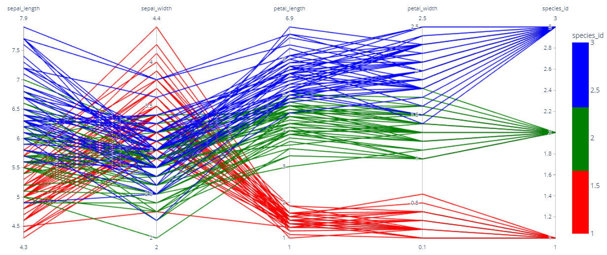

### 设置 Color range

如果输入数据的数值范围不适合用作 Color range，例如创建多个 figures，需要它们具有相同的 Color range，此时可以通过 PX 的 `range_color` 参数指定 Color range。例如：

```py
import plotly.express as px
df = px.data.iris()
fig = px.scatter(df, x="sepal_width", y="sepal_length", color="sepal_length", range_color=[5,8])

fig.show()
```

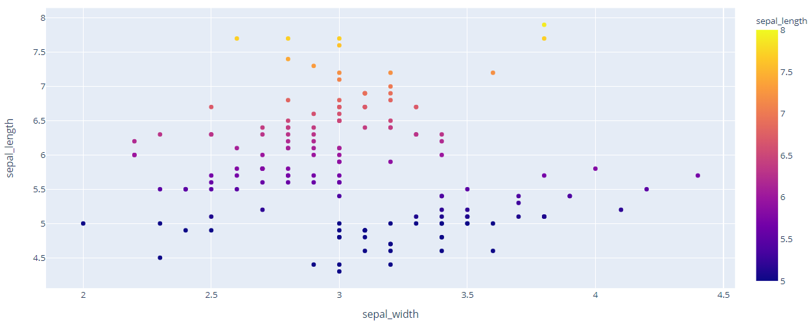

### 为发散色阶指定中点颜色

发散色阶中点颜色有一个较好的区分度，最好映射到一个有意义的数值。

px 函数的 `color_continuous_midpoint` 用于设置色阶中点的颜色。该参数不能和 `range_color` 同时使用，因为 `color_continuous_midpoint` 在囊括整个数据集的同时强制颜色以其为中心，对非对称数据导致色阶中的部分颜色在 figure 中不可见。

例如，在 choropleth map 中可以使用发散色阶高亮显示高于或低于中值的区域：

```py
import plotly.express as px

df = px.data.gapminder().query("year == 2007")
avg_lifeExp = (df['lifeExp'] * df['pop']).sum() / df['pop'].sum()
fig = px.choropleth(df, locations='iso_alpha', color='lifeExp',
                    color_continuous_scale=px.colors.diverging.BrBG,
                    color_continuous_midpoint=avg_lifeExp,
                    title="World Average Life Expectancy in 2007 in years was %.1f" % avg_lifeExp)
fig.show()
```

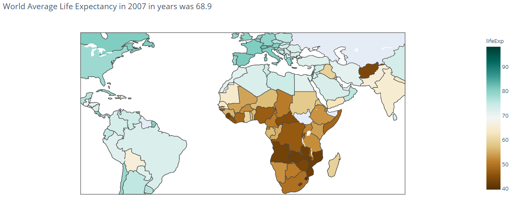

### 自定义色条

PX 的所有子图和 `layout.coloraxis` 绑定，而不是使用子图特异性的色轴。因此可以在此处配置色条。

#### 隐藏色条

下面隐藏色条:

```py
import plotly.express as px

df = px.data.tips()
fig = px.density_heatmap(df, x='total_bill', y='tip', title='No color bar on this density plot')
fig.update_layout(coloraxis_showscale=False)
fig.show()
```

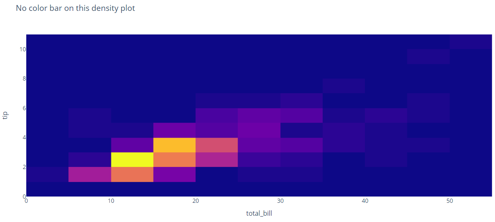

#### 配置色条

色条的标题、大小、位置、刻度线和刻度标签都可以配置。例如：

```py
import plotly.express as px
df = px.data.tips()
fig = px.density_heatmap(df, x="total_bill", y="tip", title="Customized color bar on this density plot")

fig.update_layout(coloraxis_colorbar=dict(
    title="Number of Bills per Cell",
    thicknessmode="pixels", thickness=50,
    lenmode="pixels", len=200,
    yanchor="top", y=1,
    ticks="outside", ticksuffix=" bills",
    dtick=5
))

fig.show()
```

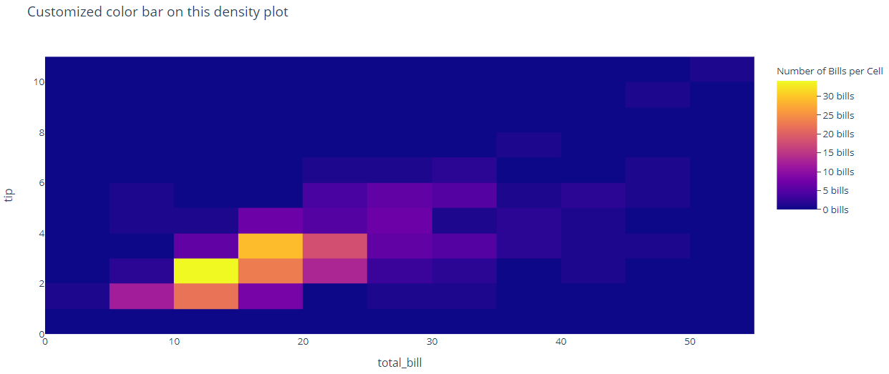

#### 离散色条刻度标签设置

```py
import plotly.express as px
df = px.data.iris()
fig = px.parallel_coordinates(df, dimensions=["sepal_length", "sepal_width", "petal_length", "petal_width"],
                             color="species_id", range_color=[0.5, 3.5],
                             color_continuous_scale=[(0.00, "red"),   (0.33, "red"),
                                                     (0.33, "green"), (0.66, "green"),
                                                     (0.66, "blue"),  (1.00, "blue")])

fig.update_layout(coloraxis_colorbar=dict(
    title="Species",
    tickvals=[1,2,3],
    ticktext=["setosa","versicolor","virginica"],
    lenmode="pixels", len=100,
))
fig.show()
```

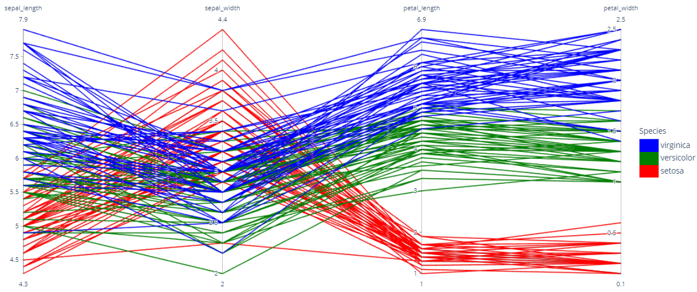

#### Log 色条刻度标签

定义对数色条上的刻度标签，使其可读性更好：

```py
import plotly.express as px
import numpy as np

df = px.data.gapminder().query("year == 2007")
fig = px.scatter(df, y="lifeExp", x="pop", color=np.log10(df["pop"]), hover_name="country", log_x=True)

fig.update_layout(coloraxis_colorbar=dict(
    title="Population",
    tickvals=[6,7,8,9],
    ticktext=["1M", "10M", "100M", "1B"],
))
fig.show()
```

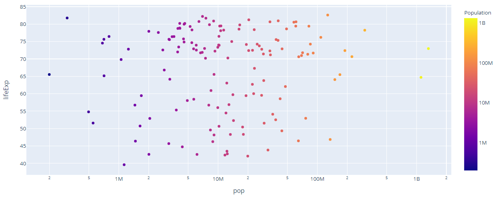

## GO API

### 离散 Heatmap 色阶

```py
import plotly.graph_objects as go

fig = go.Figure()

fig.add_trace(go.Heatmap(
    z=[[0, 1, 2, 3, 4, 5, 6, 7, 8, 9]],
    colorscale=[
        # 前 10% 数值颜色 rgb(0, 0, 0)
        [0, "rgb(0, 0, 0)"],
        [0.1, "rgb(0, 0, 0)"],

        # 10-20% 颜色 rgb(20, 20, 20)
        [0.1, "rgb(20, 20, 20)"],
        [0.2, "rgb(20, 20, 20)"],

        # 20-30% 颜色 rgb(40, 40, 40)
        [0.2, "rgb(40, 40, 40)"],
        [0.3, "rgb(40, 40, 40)"],

        # 30-40% 颜色 rgb(60, 60, 60)
        [0.3, "rgb(60, 60, 60)"],
        [0.4, "rgb(60, 60, 60)"],

        [0.4, "rgb(80, 80, 80)"],
        [0.5, "rgb(80, 80, 80)"],

        [0.5, "rgb(100, 100, 100)"],
        [0.6, "rgb(100, 100, 100)"],

        [0.6, "rgb(120, 120, 120)"],
        [0.7, "rgb(120, 120, 120)"],

        [0.7, "rgb(140, 140, 140)"],
        [0.8, "rgb(140, 140, 140)"],

        [0.8, "rgb(160, 160, 160)"],
        [0.9, "rgb(160, 160, 160)"],

        [0.9, "rgb(180, 180, 180)"],
        [1.0, "rgb(180, 180, 180)"]
    ],
    colorbar=dict(
        tick0=0,
        dtick=1
    )
))

fig.show()
```

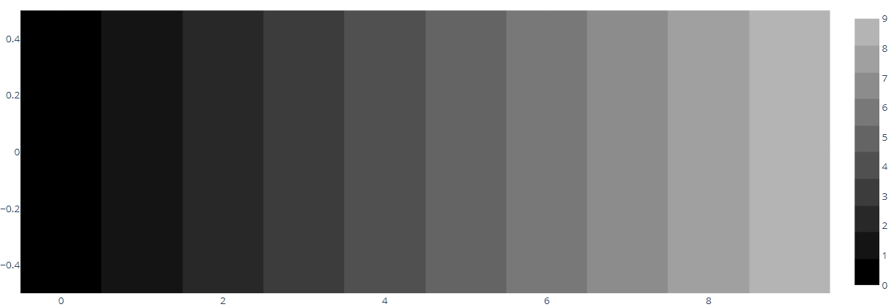

### Scatter 色阶

```py
import plotly.graph_objects as go

fig = go.Figure()

# Create list from 0 to 39 to use as x, y, and color
values = list(range(40))

fig.add_trace(go.Scatter(
    x=values,
    y=values,
    marker=dict(
        size=16,
        cmax=39,
        cmin=0,
        color=values,
        colorbar=dict(
            title="Colorbar"
        ),
        colorscale="Viridis"
    ),
    mode="markers"))

fig.show()
```

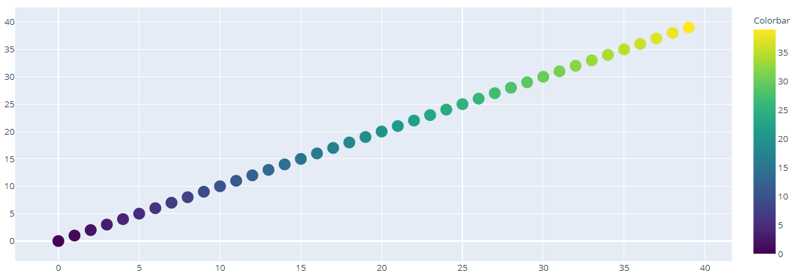

### Contour Plot 色阶

```py
import plotly.graph_objects as go

fig = go.Figure()

fig.add_trace(go.Contour(
    z=[[10, 10.625, 12.5, 15.625, 20],
       [5.625, 6.25, 8.125, 11.25, 15.625],
       [2.5, 3.125, 5., 8.125, 12.5],
       [0.625, 1.25, 3.125, 6.25, 10.625],
       [0, 0.625, 2.5, 5.625, 10]],
    colorscale="Cividis",
))

fig.show()
```

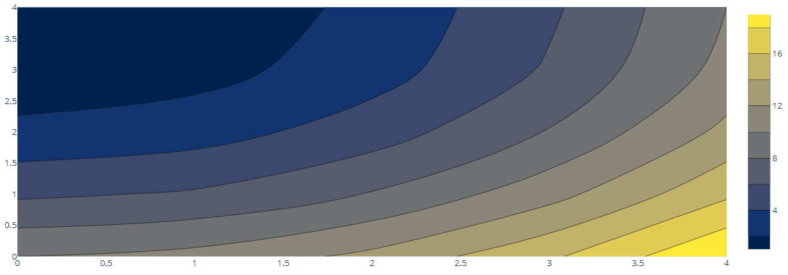

### Heatmap 色阶设置

```py
import plotly.graph_objects as go

import six.moves.urllib
import json

response = six.moves.urllib.request.urlopen(
    "https://raw.githubusercontent.com/plotly/datasets/master/custom_heatmap_colorscale.json"
)

dataset = json.load(response)

fig = go.Figure()

fig.add_trace(go.Heatmap(
    z=dataset["z"],
    colorscale=[[0.0, "rgb(165,0,38)"],
                [0.1111111111111111, "rgb(215,48,39)"],
                [0.2222222222222222, "rgb(244,109,67)"],
                [0.3333333333333333, "rgb(253,174,97)"],
                [0.4444444444444444, "rgb(254,224,144)"],
                [0.5555555555555556, "rgb(224,243,248)"],
                [0.6666666666666666, "rgb(171,217,233)"],
                [0.7777777777777778, "rgb(116,173,209)"],
                [0.8888888888888888, "rgb(69,117,180)"],
                [1.0, "rgb(49,54,149)"]]
))

fig.show()
```

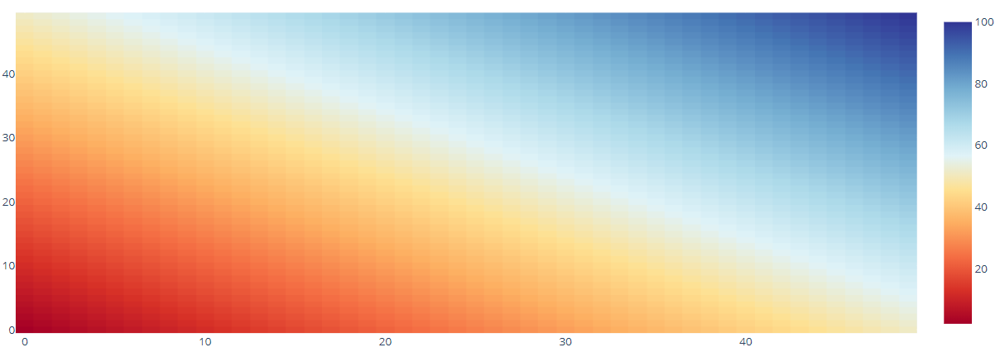

### 设置发散色阶中点

设置 `marker.cmid`，使得其到 `cmin`, `cmax` 距离相等，来设置中间颜色。

只有在 `marker.color` 为数字数组，且 `marker.cauto=True` 时才有效。

```py
import plotly.graph_objects as go

fig = go.Figure()
fig.add_trace(go.Scatter(
    y=list(range(-5,15)),
    mode="markers",
    marker={"size": 25, "color": list(range(-3,10)), "cmid": 0}))

fig.show()
```

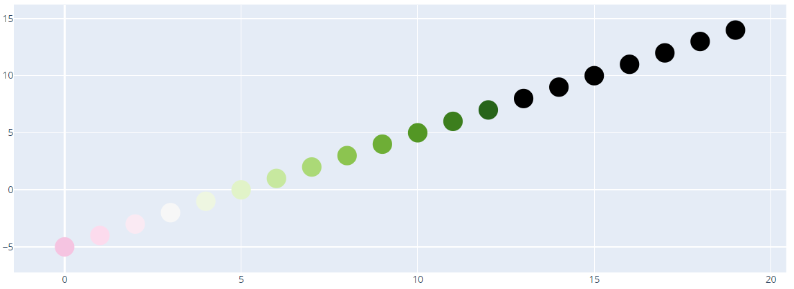

heatmap 使用 `marker.zmid` 设置 color domain 的中点：

```py
import plotly.graph_objects as go

a = list(range(-10,5))
b = list(range(-5,10))
c = list(range(-5,15))

fig = go.Figure(go.Heatmap(
    z=[a, b, c],
    colorscale='RdBu',
    zmid=0))

fig.show()
```


### 自定义 Contour 色阶

```py
import plotly.graph_objects as go

fig = go.Figure()

fig.add_trace(go.Contour(
    z=[[10, 10.625, 12.5, 15.625, 20],
       [5.625, 6.25, 8.125, 11.25, 15.625],
       [2.5, 3.125, 5., 8.125, 12.5],
       [0.625, 1.25, 3.125, 6.25, 10.625],
       [0, 0.625, 2.5, 5.625, 10]],
    colorscale=[[0, "rgb(166,206,227)"],
                [0.25, "rgb(31,120,180)"],
                [0.45, "rgb(178,223,138)"],
                [0.65, "rgb(51,160,44)"],
                [0.85, "rgb(251,154,153)"],
                [1, "rgb(227,26,28)"]],
))

fig.show()
```

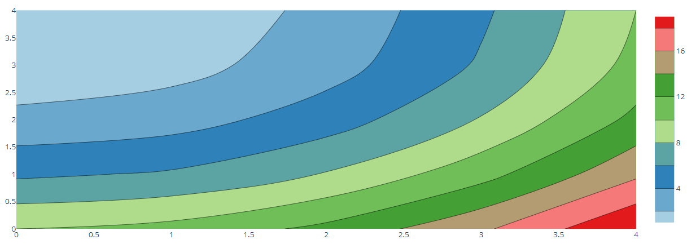

### 自定义 color bar

```py
import plotly.graph_objects as go

import six.moves.urllib
import json

# Load heatmap data
response = six.moves.urllib.request.urlopen(
    "https://raw.githubusercontent.com/plotly/datasets/master/custom_heatmap_colorscale.json")
dataset = json.load(response)

# Create and show figure
fig = go.Figure()

fig.add_trace(go.Heatmap(
    z=dataset["z"],
    colorbar=dict(
        title="Surface Heat",
        titleside="top",
        tickmode="array",
        tickvals=[2, 50, 100],
        ticktext=["Cool", "Mild", "Hot"],
        ticks="outside"
    )
))

fig.show()
```


### 共享 color axis

通过 `coloraxis` 可以设置多个 subplots 共享 colorscale.

```py
import plotly.graph_objects as go
from plotly.subplots import make_subplots

fig = make_subplots(1,2)

fig.add_trace(
 go.Heatmap(x = [1, 2, 3, 4], z = [[1, 2, 3, 4], [4, -3, -1, 1]], coloraxis = "coloraxis"), 1,1)

fig.add_trace(
 go.Heatmap(x = [3, 4, 5, 6], z = [[10, 2, 1, 0], [4, 3, 5, 6]], coloraxis = "coloraxis"),1,2)
fig.update_layout(coloraxis = {'colorscale':'viridis'})

fig.show()
```


### Log Color scale

```py
import plotly.graph_objects as go

fig = go.Figure(go.Heatmap(
    z= [[10, 100.625, 1200.5, 150.625, 2000],
       [5000.625, 60.25, 8.125, 100000, 150.625],
       [2000.5, 300.125, 50., 8.125, 12.5],
       [10.625, 1.25, 3.125, 6000.25, 100.625],
       [0, 0.625, 2.5, 50000.625, 10]],
    colorscale= [
        [0, 'rgb(250, 250, 250)'],        #0
        [1./10000, 'rgb(200, 200, 200)'], #10
        [1./1000, 'rgb(150, 150, 150)'],  #100
        [1./100, 'rgb(100, 100, 100)'],   #1000
        [1./10, 'rgb(50, 50, 50)'],       #10000
        [1., 'rgb(0, 0, 0)'],             #100000

    ],
    colorbar= dict(
        tick0= 0,
        tickmode= 'array',
        tickvals= [0, 1000, 10000, 100000]
    )
))

fig.show()
```


## 参考

### 颜色类型

有三种基本颜色类型：rgb, hex 和 tuple。

- rgb

'rgb(a,b,c)' 形式的字符串，其中 a, b, 和 c 为 [0,255] 范围的integer。

- hex

'#xxxxxx' 形式的字符串，x 为 [0,1,2,3,4,5,6,7,8,9,a,b,c,d,e,f] 种的字符。

- tuple

(a,b,c) 形式的 tuple，a, b, c 为 [0, 1] 范围的 floats。


### `plotly.colors.ncolors`

`n_colors(lowcolor, highcolor, n_colors, colortype="tuple")`

将 `lowcolor` 和 `highcolor` 拆分为 `n_colors` 种颜色的列表。

