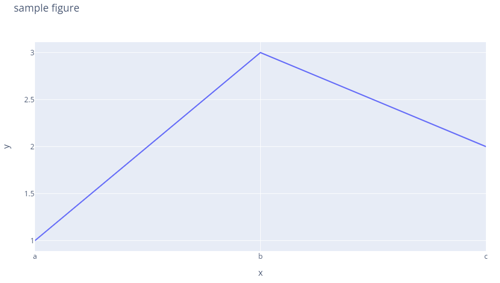

# Figure 数据结构

2022-04-14, 18:21
***

## 简介

plotly Python 包可用于创建、操作和渲染 Figure，其中渲染使用 Plotly.js JavaScript 库实现。plotly.py 使用 dict 或 `plotly.graph_objecs.Figure` 类表示 Figure，转换为 JSON 格式后传递给 plotly.js 进行渲染。

> 推荐从 plotly 的高级 API `plotly.express` 开始学习 plotly，该 API 包含简洁易用的绘图函数，返回 `plotly.graph_objects.Figure` 对象。这篇内容主要为了说明这些对象的数据结构体系，比较适合深度用户使用。

可以使用 `print(fig)` 查看 `plotly.graph_objects.Figure` 对象的底层数据结构，在 JupyterLab 中可以使用 `fig.show("json")` 查看。Figure 还支持 `fig.to_dict()` 和 `fig.to_json()` 方法。

使用 `print()` 输出 figure 中，`layout.template` 由于太长一般以省略号表示。

```py
import plotly.express as px

fig = px.line(x=["a","b","c"], y=[1,3,2], title="sample figure")
print(fig)
fig.show()
```

```txt
Figure({
    'data': [{'hovertemplate': 'x=%{x}<br>y=%{y}<extra></extra>',
              'legendgroup': '',
              'line': {'color': '#636efa', 'dash': 'solid'},
              'marker': {'symbol': 'circle'},
              'mode': 'lines',
              'name': '',
              'orientation': 'v',
              'showlegend': False,
              'type': 'scatter',
              'x': array(['a', 'b', 'c'], dtype=object),
              'xaxis': 'x',
              'y': array([1, 3, 2], dtype=int64),
              'yaxis': 'y'}],
    'layout': {'legend': {'tracegroupgap': 0},
               'template': '...',
               'title': {'text': 'sample figure'},
               'xaxis': {'anchor': 'y', 'domain': [0.0, 1.0], 'title': {'text': 'x'}},
               'yaxis': {'anchor': 'x', 'domain': [0.0, 1.0], 'title': {'text': 'y'}}}
})
```


