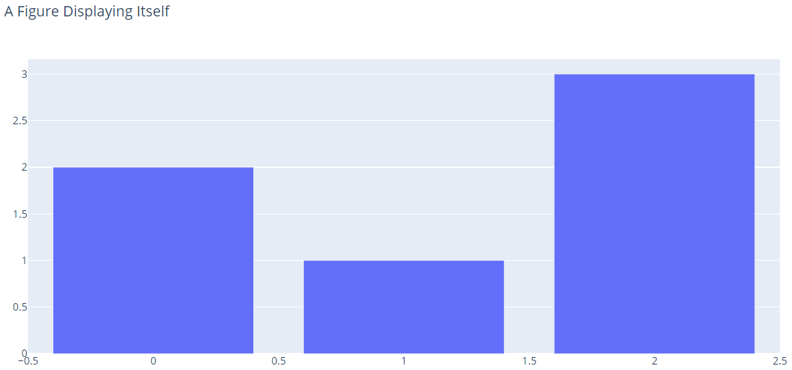

# 在 Python 中显示 Figures

- [在 Python 中显示 Figures](#在-python-中显示-figures)
  - [简介](#简介)
  - [渲染框架](#渲染框架)
    - [设置默认渲染器](#设置默认渲染器)
    - [覆盖默认渲染器](#覆盖默认渲染器)
  - [内置渲染器](#内置渲染器)
    - [交互渲染器](#交互渲染器)
    - [静态图像渲染](#静态图像渲染)
    - [json](#json)
  - [多渲染器](#多渲染器)
  - [自定义内置渲染器](#自定义内置渲染器)
  - [Dash](#dash)
  - [ipywidgets](#ipywidgets)
  - [性能](#性能)
  - [参考](#参考)

Last updated: 2022-09-23, 16:07
@author Jiawei Mao
****

## 简介

plotly.py 支持多种图表显示方式。有 5 种不同的显示方式：

1. 使用脚本或 notebook 中的渲染框架
2. 使用 web app 中的 Dash
3. 使用 ipywidgets 中的 FigureWidget
4. 导出为 HTML 文件，然后在浏览器中加载
5. 使用 Kaleido 将 figure 渲染为静态图像，如 PNG, JPEG, SVG, PDF 或 EPS。

下面分别讨论这几种方式。

## 渲染框架

渲染框架是一种可以在各种环境中显示图表的灵活方法。

调用 figure 的 `.show` 方法或将创建 figure 传递给 `plotly.io.show` 函数，在当前默认渲染框架中显示 figure。

```py
import plotly.graph_objects as go
fig = go.Figure(
    data=[go.Bar(y=[2, 1, 3])],
    layout_title_text="A Figure Displayed with fig.show()"
)
fig.show()
```


大多时候可以省略 `.show()` 调用，figure 会自动显示。

```py
import plotly.graph_objects as go
fig = go.Figure(
    data=[go.Bar(y=[2, 1, 3])],
    layout_title_text="A Figure Displaying Itself"
)
fig
```



> 准确地说，当满足以下两个条件图表会在当前默认渲染器中显示：
>
> - 首先，最后一个表达式结果为 figure；
> - 然后，在包含 IPython kernel 的环境运行。

大多情况下，plotly 会自动选择合适的渲染器。如经典的 Jupyter Notebook，JupyterLab，Visual Studio code notebooks，Google Colaboratory, Kaggle notebooks，Azure notebooks 以及 Python interactive shell。

其它情况需要兼容的渲染器才行，包括 IPython console, QtConsole, Spyder等。

接下来会说明如何配置默认的渲染器。之后会讨论内置渲染器，以及如何选择。

### 设置默认渲染器

当前可用的渲染器和默认渲染器可以通过 `plotly.io.renderers` 配置。

查看当前默认渲染器及可用渲染器列表：

```py
import plotly.io as pio

print(pio.renderers)
```

本机输出：

```cmd
Default renderer: 'browser'
Available renderers:
    ['plotly_mimetype', 'jupyterlab', 'nteract', 'vscode',
        'notebook', 'notebook_connected', 'kaggle', 'azure', 'colab',
        'cocalc', 'databricks', 'json', 'png', 'jpeg', 'jpg', 'svg',
        'pdf', 'browser', 'firefox', 'chrome', 'chromium', 'iframe',
        'iframe_connected', 'sphinx_gallery']
```

不同配置 `pio.renderers` 的输出可能不同，因为 plotly.py 在启动时会自动检测合适的渲染器。

通过将可用渲染器名称赋值给 `pio.renderers.default` 属性设置默认渲染器。例如，切换到 'svg' 渲染器，即生成 svg 图像：

```py
import plotly.io as pio
pio.renderers.default = "svg"
```

也可以在系统环境变量设置默认的渲染器。plotly.py 在启动时会检查 `PLOTLY_RENDERER` 环境变量，如果检查到该环境变量，且对应的渲染器可用，plotly.py 会将该渲染器作为默认值。

### 覆盖默认渲染器

将渲染器名称传递给 `.show()` 方法的 `renderer` 关键字，可以临时覆盖默认渲染器。例如，下面使用 `svg` 渲染器显示 figure，但不改变默认渲染器：

```py
import plotly.graph_objects as go

fig = go.Figure(
    data=[go.Bar(y=[2, 1, 3])],
    layout_title_text="A Figure Displayed with fig.show"
)

fig.show(renderer="svg")
```

## 内置渲染器

下面讨论内置渲染器，以及如何选择合适的渲染器。

### 交互渲染器

交互渲染器使用 Plotly.js JavaScript 库显示 figures，完全交互式，支持平移、缩放、悬停工具提示等。

**notebook**

该渲染器用于经典的 Jupyter Notebook。在第一次渲染 figure 时，会将完整的 plotly.js JavaScript 库捆绑到 notebook 中，因此该渲染器不需要网络。

对于要导出为 HTML 文件的 notebook，包括用 `nbconvert` 或下载为 `Download as HTML` 菜单选项，使用该渲染器都是不错的选择，因为导出 HTML 文件无需联网。

> Note: 将 plotly.js 捆绑到 notebook 会使 notebook 增大几兆，如果确定网络一直可用，可以采用 `notebook_connected` 渲染器。

**notebook_connected**

除了在线从 CDN 加载 Plotly.js 库以外，该渲染器和 `notebook` 完全相同。

该渲染器的 notebook 比 `notebook` 渲染器小几兆，但是需要网络才能显示 figures。

该渲染器适合用 `nbviewer` 分享的 notebooks，因为这类 notebook 本来就必须联网才能查看。

**kaggle 和 azure**

`notebook_connected` 的别名，因为该渲染器适合 Kaggle kernels 和 Azure notebooks。

**colab**

用于 Google Colab 的自定义渲染器。

**browser**

使用默认浏览器打开 figure。浏览器和 Python kernel 在同一个电脑才能使用，所以不适合 Jupyter Hub 或在线的 notebook 服务。

说明：

- 默认浏览器由 `webbrowser` Python 模块选择。
- `browser` 渲染器通过在本地端口上设置一次性的本地 Web 服务器来工作，将图形发送给浏览器后，Web服务器关闭，因此刷新浏览器后无法恢复图形。

**firefox, chrome, chromium**

和 `browser` 相同，但是强制使用特定浏览器。

**iframe 和 iframe_connected**

这类渲染器将图形输出为独立的 HTML 文件，然后显示引用这些 HTML 文件的 `iframe` 元素。

`iframe` 渲染器在每个 HTML 文件中包含 Plotly.js JS 包，而`iframe_connected` 渲染器仅包含 Plotly.js 在线 CDN 位置引用，和前面一样，`iframe_connected` 渲染输出的 HTML 文件要小于 `iframe`，但需要联网。

该渲染器对包含大量 figures 的 notebooks 比较有用。对 `notebook` 和 `notebook_connected`渲染器，所有 figures 的数据都保存在 notebook 中，从而导致 notebook 较大，而在 `iframe` 渲染器中，figure 数据保存在单独的 HTML 文件中，所以 notebook 要小一些。

> iframe 渲染器生成的 HTML 文件保存在 `iframe_figures` 子目录。HTML 文件根据 notebook cell 执行顺序进行命名。所以每次重启 notebook kernel，前面的 HTML 文件被覆盖。这也表示在相同目录不能使用多个用 `iframe` 渲染器的 notebook，因为 notebook 生成的 figures 可能互相覆盖。

**plotly_mimetype**

plotly_mimetype 渲染器创建一个plotly figure 的规范（MIME-type bundle），并请求当前用户界面显示它。支持该渲染器的界面包括 JupyterLab，nteract和 Visual Studio Code notebook。

**jupyterlab, nteract, vscode**

`plotly_mimetype` 的别名。

### 静态图像渲染

plotly 提供了一组静态图像渲染器，都依赖于 orca 程序。

**png, jpeg, svg**

将图像显示为静态 PNG, JPEG 或 SVG 图像。这类渲染器对不支持嵌入式 HTML 输出但支持嵌入式静态图像的用户界面很有用。包括 QtConsole, Spyder 和 PyCharm notebook。

例如：

```py
import plotly.graph_objects as go
fig = go.Figure(
    data=[go.Bar(y=[2, 1, 3])],
    layout_title_text="A Figure Displayed with the 'png' Renderer"
)
fig.show(renderer="png")
```

**pdf**

该渲染器将 figures 以静态 PDF 文件显示。这对于使用 nbconvert 的LaTeX 导出 PDF 的 notebook比较有用。

### json

在支持 json 的编辑器（JupyterLab, nteract 和 vscode 等）中，该渲染器以可折叠的交互式树结构的 JSON 文件 figure。这对于检查复杂图形结构很有用。

## 多渲染器

通过 `+` 可以指定多个渲染器。对于需要支持多种环境的 notebook 比较有用。例如，如果一个 notebook 指定默认渲染器为 `notebook+plotly_mimetype+pdf`，则该 notebook 在经典的 Jupyter Notebook, JupyterLab 以及导出 PDF 的 nbconvert 中均可用。

## 自定义内置渲染器

大部分内置渲染器可以自定义配置。通过 `plotly.io.renderers` 对象上使用字典查询渲染器的属性。例如，访问和显示 PNG 渲染器：

```py
import plotly.io as pio
png_renderer = pio.renderers["png"]
png_renderer
```

输出：

```txt
PngRenderer(width=700, height=450, scale=None)

    Renderer to display figures as static PNG images.  This renderer requires
    the orca command-line utility and is broadly compatible across IPython
    environments (classic Jupyter Notebook, JupyterLab, QtConsole, VSCode,
    PyCharm, etc) and nbconvert targets (HTML, PDF, etc.).

    mime type: 'image/png'
```

从输出可以看出，`png` 渲染器支持3个属性，`width`, `height` 和 `scale`。通过设置其属性值实现自定义。

下面通过自定义 `png` 渲染器修改图像尺寸，将 `png` 设为默认渲染器，然后显式：

```py
import plotly.io as pio
png_renderer = pio.renderers["png"]
png_renderer.width = 500
png_renderer.height = 500

pio.renderers.default = "png"

import plotly.graph_objects as go
fig = go.Figure(
    data=[go.Bar(y=[2, 1, 3])],
    layout_title_text="A Figure Displayed with the 'png' Renderer"
)
fig.show()
```

也可以临时修改渲染器参数，将对应参数传递给 `.show()` 方法即可。例如：

```py
import plotly.graph_objects as go

fig = go.Figure(
    data=[go.Bar(y=[2, 1, 3])],
    layout_title_text="A Figure Displayed with the 'png' Renderer"
)
fig.show(renderer="png", width=800, height=300)
```

## Dash

Dash 是用于构建 web 应用的 Python 框架，它内置有显式 plotly figures 的功能。

不过 Dash 没有使用上面讨论的渲染框架，所以在 Dash 应用中不能使用 `.show` 和 `plotly.io.show` 方法显示。

## ipywidgets

使用 `plotly.graph_objects.FigureWidget` 对象可以在 ipywidgets 环境显示 plotly figures。

`FigureWidget` 是 graph 对象（和 `plotly.graph_objects.Figure` 一样），所以可以按照常规 `Figure` 一样添加 traces 并更新。

另外 `FigureWidget` 也是 ipywidgets 对象，所以也可以和其它 ipywidgets 一起在 notebook 中构建界面。

需要注意的是 `FigureWidget` 也没有使用上面的渲染框架，所以也不能使用 `.show` 和 `plotly.io.show` 显示 `FigureWidget` 对象。

## 性能

无论选择哪种方法显示 figure，图形数据结构首先序列化为 JSON 字符串，然后 Pythoon 发送到浏览器（或者先转换为 HTML 文件，或使用 Kaleido 导出为静态图像）。

如果包含序列数据点，则默认的 JSON 序列化机制会很慢。如果安装了 orjson 包，plotly 将使用它来替代内置的 json 包，对大型 figure 速度可以提高 5-10x。

序列化为 JSON 后，由浏览器进行渲染，要么立即在用户浏览器显示，或者导出为 HTML，要么直接在 Kaleido 导出为静态图像。渲染时间取决于图中数据点数、traces 数以及 subplot 数。在渲染性能较慢时，建议使用 WebGL traces 来利用 GPU 加速，或者使用 Datashader 库进行 Python 端渲染，然后用 `px.imshow()` 渲染。

## 参考

- https://plotly.com/python/renderers/
