# Imshow

- [Imshow](#imshow)
  - [`px.imshow` 显示 RGB 图片数据](#pximshow-%e6%98%be%e7%a4%ba-rgb-%e5%9b%be%e7%89%87%e6%95%b0%e6%8d%ae)
  - [从图片文件读取数据数组](#%e4%bb%8e%e5%9b%be%e7%89%87%e6%96%87%e4%bb%b6%e8%af%bb%e5%8f%96%e6%95%b0%e6%8d%ae%e6%95%b0%e7%bb%84)
  - [以热图形式显示单通道二维数据](#%e4%bb%a5%e7%83%ad%e5%9b%be%e5%bd%a2%e5%bc%8f%e6%98%be%e7%a4%ba%e5%8d%95%e9%80%9a%e9%81%93%e4%ba%8c%e7%bb%b4%e6%95%b0%e6%8d%ae)
  - [选择 colorscale 显示单通道图片](#%e9%80%89%e6%8b%a9-colorscale-%e6%98%be%e7%a4%ba%e5%8d%95%e9%80%9a%e9%81%93%e5%9b%be%e7%89%87)
  - [隐藏 colorbar 和 axis label](#%e9%9a%90%e8%97%8f-colorbar-%e5%92%8c-axis-label)
  - [自定义坐标轴和轴标签](#%e8%87%aa%e5%ae%9a%e4%b9%89%e5%9d%90%e6%a0%87%e8%bd%b4%e5%92%8c%e8%bd%b4%e6%a0%87%e7%ad%be)
  - [显示 xarray image](#%e6%98%be%e7%a4%ba-xarray-image)
  - [使用方形 pixels 显示 xarray](#%e4%bd%bf%e7%94%a8%e6%96%b9%e5%bd%a2-pixels-%e6%98%be%e7%a4%ba-xarray)
  - [go.Image - 多通道图片](#goimage---%e5%a4%9a%e9%80%9a%e9%81%93%e5%9b%be%e7%89%87)
  - [定义数据范围 - zmin, zmax](#%e5%ae%9a%e4%b9%89%e6%95%b0%e6%8d%ae%e8%8c%83%e5%9b%b4---zmin-zmax)
  - [去除图片周围的宽度](#%e5%8e%bb%e9%99%a4%e5%9b%be%e7%89%87%e5%91%a8%e5%9b%b4%e7%9a%84%e5%ae%bd%e5%ba%a6)
  - [合并 image 和其它 traces](#%e5%90%88%e5%b9%b6-image-%e5%92%8c%e5%85%b6%e5%ae%83-traces)
  - [图片的 histogram](#%e5%9b%be%e7%89%87%e7%9a%84-histogram)

2020-04-30, 19:53
*** *

## `px.imshow` 显示 RGB 图片数据

`px.imshow` 可用于显示多通道（RGB）和单通道（grayscale）图像数据。

```py
import numpy as np
import plotly.express as px

img_rgb = np.array([[[255, 0, 0], [0, 255, 0], [0, 0, 255]],
                    [[0, 255, 0], [0, 0, 255], [255, 0, 0]]
                    ], dtype=np.uint8)
fig = px.imshow(img_rgb)
fig.show()
```

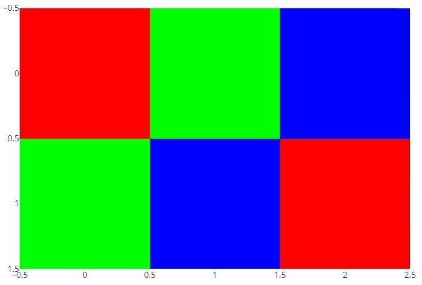

## 从图片文件读取数据数组

为了获得 `px.imshow` 所需数组，可以使用第三方库，如 PIL, scikit-image 或 opencv。下面我们使用 `skimage.io.imread` 读取图片：

```py
import plotly.express as px
from skimage import io

img = io.imread('https://upload.wikimedia.org/wikipedia/commons/thumb/0/00/Crab_Nebula.jpg/240px-Crab_Nebula.jpg')
fig = px.imshow(img)
fig.show()
```

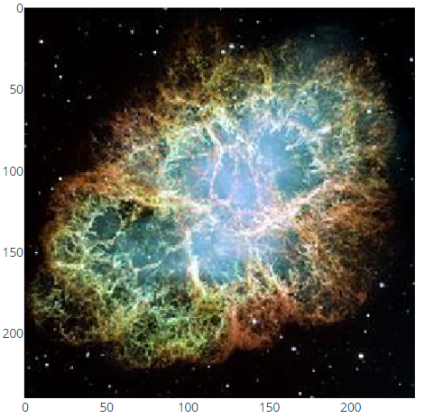

使用 `skimage.data` 中的示例数据：

```py
import plotly.express as px
from skimage import data

img = data.astronaut()
fig = px.imshow(img)
fig.show()
```

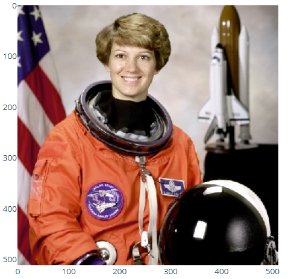

## 以热图形式显示单通道二维数据

对二维图片，`px.show` 使用指定的 colorscale 将标量数据映射到颜色，默认的 colorscale 取决于当前模板。

```py
import plotly.express as px
import numpy as np

img = np.arange(15**2).reshape((15, 15))
fig = px.imshow(img)
fig.show()
```

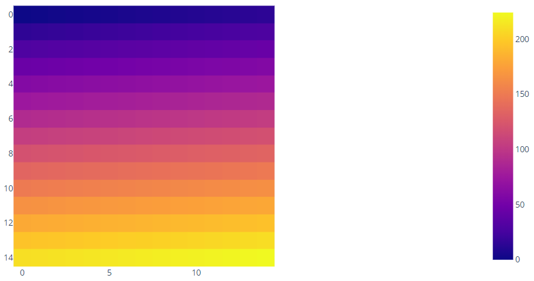

## 选择 colorscale 显示单通道图片

```py
import plotly.express as px
import numpy as np

img = np.arange(100).reshape((10, 10))
fig = px.imshow(img, color_continuous_scale='Viridis')
fig.show()
```

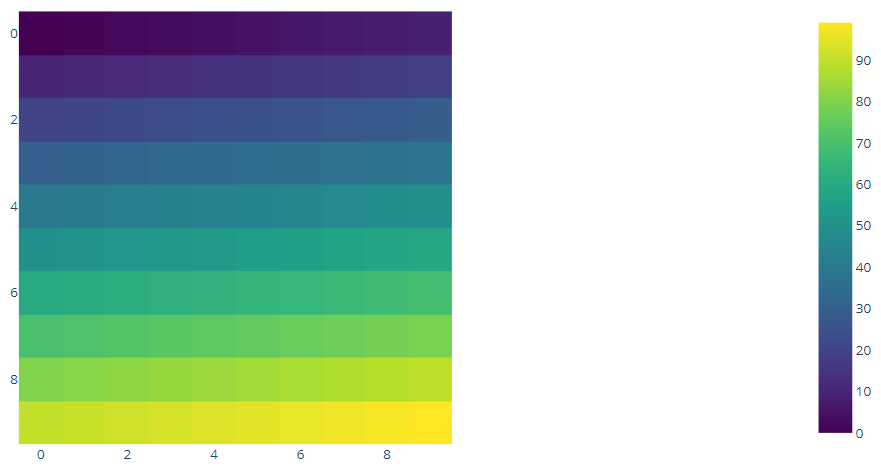

选择合适的色阶，可以将图片转换为灰度图片：

```py
import plotly.express as px
import numpy as np

img = np.arange(100).reshape((10, 10))
fig = px.imshow(img, color_continuous_scale='gray')
fig.show()
```


## 隐藏 colorbar 和 axis label

```py
import plotly.express as px
from skimage import data

img = data.camera()
fig = px.imshow(img, color_continuous_scale='gray')
fig.update_layout(coloraxis_showscale=False)
fig.update_xaxes(showticklabels=False)
fig.update_yaxes(showticklabels=False)
fig.show()
```


## 自定义坐标轴和轴标签

通过 `x`, `y` 和 `labels` 参数自定义坐标轴和标签的显示，使用 `update_xaxes()` 设置 x 坐标轴刻度标签的位置：

```py
import plotly.express as px

data = [[1, 25, 30, 50, 1], [20, 1, 60, 80, 30], [30, 60, 1, 5, 20]]
fig = px.imshow(data,
                labels=dict(x="Day of Week", y="Time of Day", color="Productivity"),
                x=['Monday', 'Tuesday', 'Wednesday', 'Thursday', 'Friday'],
                y=['Morning', 'Afternoon', 'Evening'])
fig.update_xaxes(side="top")
fig.show()
```

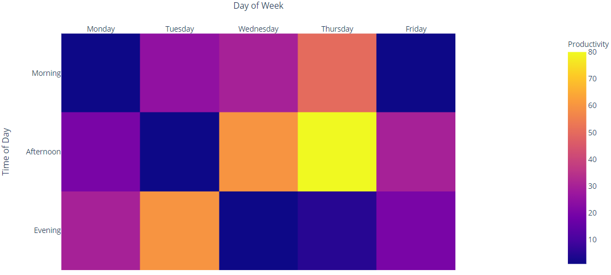

## 显示 xarray image

[xarrays](http://xarray.pydata.org/en/stable/)为标记数组。如果将 `xarray` 对象传递给 `px.imshow` 函数，其轴标签用作坐标轴标签。如果想自定义行为，可以将 `img.values` （NumPy 数组）传递给 `px.imshow`，也可以使用 `labels` 属性自定义标题。

```py
import plotly.express as px
import xarray as xr

# Load xarray from dataset included in the xarray tutorial
airtemps = xr.tutorial.open_dataset('air_temperature').air.sel(lon=250.0)
fig = px.imshow(airtemps.T, color_continuous_scale='RdBu_r', origin='lower')
fig.show()
```

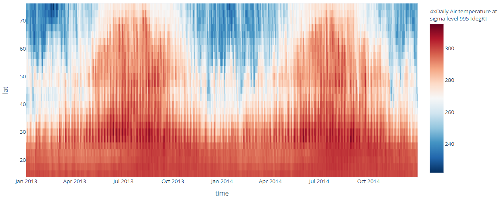

## 使用方形 pixels 显示 xarray

对 xarray，`px.show` 不强制像素点为方形，如果你希望达到这点，可以将 `aspect` 设置为 "equal"。

```py
import plotly.express as px
import xarray as xr

airtemps = xr.tutorial.open_dataset('air_temperature').air.isel(time=500)
colorbar_title = airtemps.attrs['var_desc'] + '<br>(%s)' % airtemps.attrs['units']
fig = px.imshow(airtemps, color_continuous_scale='RdBu_r', aspect='equal')
fig.show()
```

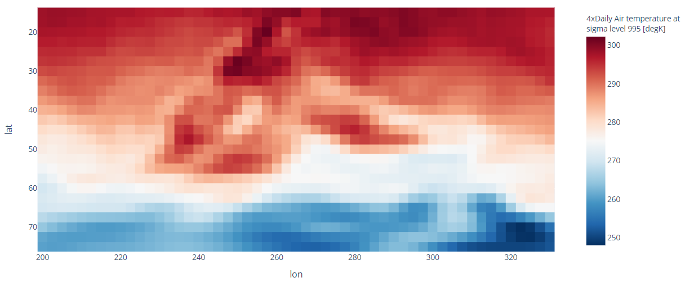

## go.Image - 多通道图片

可以使用 `go.Image` 显示都通道数据，不过 `go.Image` 只能显示多通道图片，对单通道图片，可以使用 `go.Heatmap`。

> `go.Image` 和 `go.layout.Image` 不同，后者用于设置背景图片或 logos。

```py
import plotly.graph_objects as go

img_rgb = [[[255, 0, 0], [0, 255, 0], [0, 0, 255]],
           [[0, 255, 0], [0, 0, 255], [255, 0, 0]]]
fig = go.Figure(go.Image(z=img_rgb))
fig.show()
```

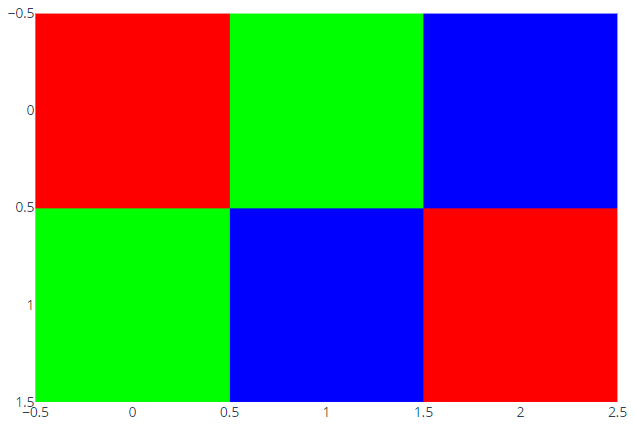

## 定义数据范围 - zmin, zmax

使用参数 `zmin` 和 `zmax` 设置数据和颜色的映射范围，对单通道数据，`zmin` 和 `zmax` 数值对应黑色 `[0, 0, 0]` 和白色 `[255, 255, 255]`。

对单通道数据，`px.imshow` 和 `go.Heatmap` 的`zmin` 和 `zmax` 参数的默认值为数据中的最小值和最大值。

对多通道数据，`px.imshow` 和 `go.Image` 使用的 `zmin` 和 `zmax` 的默认值略微不同。不管数据类型如何，`go.Image` 的默认值为 `zmin=[0, 0, 0]` 和 `zmax=[255, 255, 255]`；而 `px.imshow` 根据数据类型调整 `zmin` 和 `zmax`:

- 对 integer 类型，`zmin` 和 `zmax` 对应该该类型极值，例如，对 `uint8` 为 0 和 255，对 `uint16` 为 0 和 65535.
- 对浮点数，如果最大值小于 1，则 `zmax=1`，活着最大值小于 255，则 `zmax=255`。

这些默认值都可以通过设置 `zmin` 和 `zmax` 参数覆盖。对 `go.Image`，对所有通道都需要设置 `zmin` 和 `zmax`；对 `px.imshow`，可以使用一个标量值，应用于所有通道。

```py
import plotly.express as px
from skimage import data

img = data.astronaut()
# Increase contrast by clipping the data range between 50 and 200
fig = px.imshow(img, zmin=50, zmax=200)
# We customize the hovertemplate to show both the data and the color values
# See https://plotly.com/python/hover-text-and-formatting/#customize-tooltip-text-with-a-hovertemplate
fig.update_traces(hovertemplate="x: %{x} <br> y: %{y} <br> z: %{z} <br> color: %{color}")
fig.show()
```

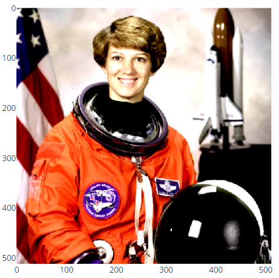

```py
import plotly.express as px
from skimage import data

img = data.astronaut()
# Stretch the contrast of the red channel only, resulting in a more red image
fig = px.imshow(img, zmin=[50, 0, 0], zmax=[200, 255, 255])
fig.show()
```

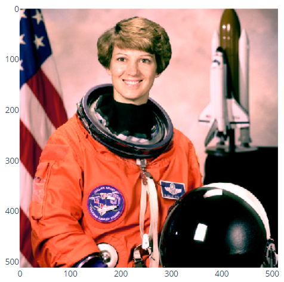

## 去除图片周围的宽度

```py
import plotly.express as px
from skimage import data

img = data.astronaut()
fig = px.imshow(img)
fig.update_layout(width=400, height=400, margin=dict(l=10, r=10, b=10, t=10))
fig.update_xaxes(showticklabels=False).update_yaxes(showticklabels=False)
fig.show()
```


## 合并 image 和其它 traces

```py
import plotly.express as px
import plotly.graph_objects as go
from skimage import data

img = data.camera()
fig = px.imshow(img, color_continuous_scale='gray')
fig.add_trace(go.Contour(z=img, showscale=False,
                         contours=dict(start=0, end=70, size=70, coloring='lines'),
                         line_width=2))
fig.add_trace(go.Scatter(x=[230], y=[100], marker=dict(color='red', size=16)))
fig.show()
```


## 图片的 histogram

```py
from plotly.subplots import make_subplots
from skimage import data

img = data.chelsea()
fig = make_subplots(1, 2)
# We use go.Image because subplots require traces, whereas px functions return a figure
fig.add_trace(go.Image(z=img), 1, 1)
for channel, color in enumerate(['red', 'green', 'blue']):
    fig.add_trace(go.Histogram(x=img[..., channel].ravel(), opacity=0.5,
                               marker_color=color, name='%s channel' %color), 1, 2)
fig.update_layout(height=400)
fig.show()
```

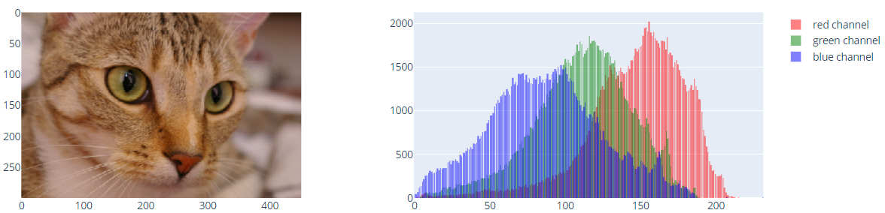
