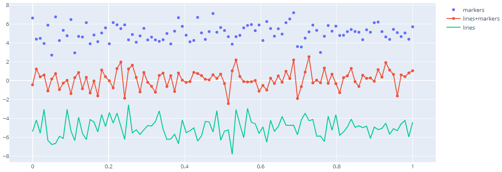

# 散点图

- [散点图](#散点图)
  - [PX API](#px-api)
    - [通过 column 名称设置 color 和 size](#通过-column-名称设置-color-和-size)
    - [通过 column 名称设置 symbol](#通过-column-名称设置-symbol)
    - [Line plot with px](#line-plot-with-px)
  - [Scatter with go](#scatter-with-go)
  - [简单散点图](#简单散点图)
  - [Line and Scatter Plots](#line-and-scatter-plots)
  - [Bubble Scatter Plots](#bubble-scatter-plots)
  - [个性化设置](#个性化设置)
  - [悬停文本](#悬停文本)
  - [Color Dimension](#color-dimension)
  - [Large Data Sets](#large-data-sets)
  - [参考](#参考)

2020-04-20, 09:38
***

## PX API

使用 `px.scatter` 绘制散点图，数据点由标记（marker）表示，位置由 `x`, `y` 确定。

- 数组作为数据源

```python
import plotly.express as px

fig = px.scatter(
    x=[0, 1, 2, 3, 4],
    y=[0, 1, 4, 9, 16]
)
fig.show()
```


- `DataFrame` 作为数据源

```py
import plotly.express as px

df = px.data.iris()  # iris 是 pandas DataFrame
fig = px.scatter(df, x='sepal_width', y='sepal_length')
fig.show()
```


> 该 API 和 pandas 结合使用比较方便。

### 通过 column 名称设置 color 和 size

大小可变的圆形标记的散点图也称为气泡图（bubble chart）。

> `color` 和 `size` 已添加到 hover 信息中，可以通过 `px.scatter` 的 `hover_data` 参数添加额外的 column 到 hover 中。

```py
import plotly.express as px

df = px.data.iris()
fig = px.scatter(df, x="sepal_width", y="sepal_length",
                 color="species", size="petal_length", hover_data=['petal_width'])
fig.show()
```

> 这里将 `species` 列作为颜色信息，


- 上面设置颜色的 `species` 为离散值，也可以将连续值作为颜色，如下

```py
import plotly.express as px

df = px.data.iris()
fig = px.scatter(df, x='sepal_width', y='sepal_length', color='petal_length')
fig.show()
```


### 通过 column 名称设置 symbol

可以将 column 值映射到 symbol，这样不同的值对应不同的 symbol。

```py
import plotly.express as px

df = px.data.iris()
fig = px.scatter(df, x="sepal_width", y="sepal_length", color="species", symbol="species")
fig.show()
```


### Line plot with px

- 单线条

```py
import plotly.express as px
import numpy as np

t = np.linspace(0, 2*np.pi, 100)

fig = px.line(x=t, y=np.cos(t), labels={'x':'t', 'y':'cos(t)'})
fig.show()
```


- 多线条

```py
import plotly.express as px
df = px.data.gapminder().query("continent == 'Oceania'")
fig = px.line(df, x='year', y='lifeExp', color='country')
fig.show()
```


## Scatter with go

`go.Scatter` 函数更为通用。`go.Scatter` 可用于绘制散点图和线图，具体取决于 `mode` 参数。

## 简单散点图

```py
import plotly.graph_objects as go
import numpy as np

N = 1000
t = np.linspace(0, 10, 100)
y = np.sin(t)

fig = go.Figure(data=go.Scatter(x=t, y=y, mode='markers'))

fig.show()
```

`mode="markers"` 表示散点图。


## Line and Scatter Plots

使用 `mode` 参数可以选择 `markers`, `lines` 或者两者的组合。

```py
import plotly.graph_objects as go

# Create random data with numpy
import numpy as np
np.random.seed(1)

N = 100
random_x = np.linspace(0, 1, N)
random_y0 = np.random.randn(N) + 5
random_y1 = np.random.randn(N)
random_y2 = np.random.randn(N) - 5

fig = go.Figure()

# Add traces
fig.add_trace(go.Scatter(x=random_x, y=random_y0,
                    mode='markers', # 散点图
                    name='markers'))
fig.add_trace(go.Scatter(x=random_x, y=random_y1,
                    mode='lines+markers', # 散点图+线图
                    name='lines+markers'))
fig.add_trace(go.Scatter(x=random_x, y=random_y2,
                    mode='lines', # 线图
                    name='lines'))

fig.show()
```



## Bubble Scatter Plots

气泡图（Bubble charts），将额外一维信息以 marker 的大小显示。

```py
import plotly.graph_objects as go

fig = go.Figure(data=go.Scatter(
    x=[1, 2, 3, 4],
    y=[10, 11, 12, 13],
    mode='markers',
    marker=dict(size=[40, 60, 80, 100],
                color=[0, 1, 2, 3])
))

fig.show()
```

`marker=dict(size=...)` 是实现气泡图的关键点。


## 个性化设置

```py
import plotly.graph_objects as go
import numpy as np


t = np.linspace(0, 10, 100)

fig = go.Figure()

fig.add_trace(go.Scatter(
    x=t, y=np.sin(t),
    name='sin', # 名称
    mode='markers', # 模式，散点图
    marker_color='rgba(152, 0, 0, .8)' # maker 颜色
))

fig.add_trace(go.Scatter(
    x=t, y=np.cos(t),
    name='cos',
    marker_color='rgba(255, 182, 193, .9)'
))

# Set options common to all traces with fig.update_traces
fig.update_traces(mode='markers', marker_line_width=2, marker_size=10)
fig.update_layout(title='Styled Scatter',
                  yaxis_zeroline=False, xaxis_zeroline=False)


fig.show()
```


## 悬停文本

```py
import plotly.graph_objects as go
import pandas as pd

data= pd.read_csv("https://raw.githubusercontent.com/plotly/datasets/master/2014_usa_states.csv")

fig = go.Figure(data=go.Scatter(x=data['Postal'],
                                y=data['Population'],
                                mode='markers',
                                marker_color=data['Population'],
                                text=data['State'])) # hover text goes here

fig.update_layout(title='Population of USA States')
fig.show()
```


## Color Dimension

```py
import plotly.graph_objects as go
import numpy as np

fig = go.Figure(data=go.Scatter(
    y = np.random.randn(500), # 500 个数据点，没有提供 x，默认为 0-499
    mode='markers',
    marker=dict(
        size=16,
        color=np.random.randn(500), #set color equal to a variable
        colorscale='Viridis', # one of plotly colorscales
        showscale=True
    )
))

fig.show()
```


## Large Data Sets

使用 `Scattergl()` 替代 `Scatter()` 实现 WebGL，以提高速度、交互性，以及绘制更多数据。

```py
import plotly.graph_objects as go
import numpy as np

N = 100000
fig = go.Figure(data=go.Scattergl(
    x = np.random.randn(N),
    y = np.random.randn(N),
    mode='markers',
    marker=dict(
        color=np.random.randn(N),
        colorscale='Viridis',
        line_width=1
    )
))

fig.show()
```


```py
import plotly.graph_objects as go
import numpy as np

N = 100000
r = np.random.uniform(0, 1, N)
theta = np.random.uniform(0, 2*np.pi, N)

fig = go.Figure(data=go.Scattergl(
    x = r * np.cos(theta), # non-uniform distribution
    y = r * np.sin(theta), # zoom to see more points at the center
    mode='markers',
    marker=dict(
        color=np.random.randn(N),
        colorscale='Viridis',
        line_width=1
    )
))

fig.show()
```


## 参考

- https://plotly.com/python/line-and-scatter/
