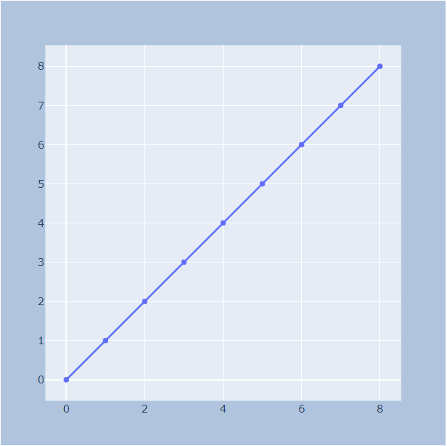
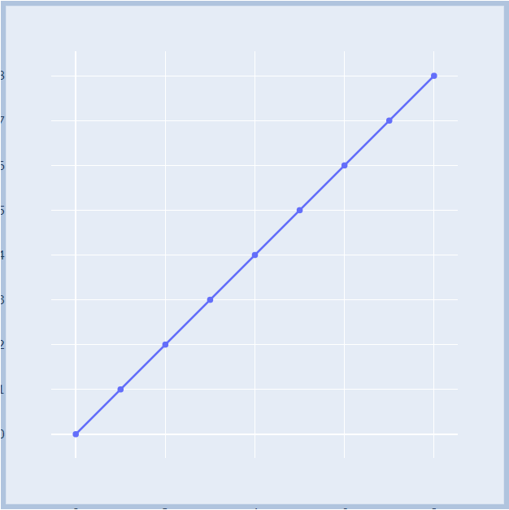

# Layout

- [Layout](#layout)
  - [Legend](#legend)
    - [showlegend](#showlegend)
  - [Title](#title)
    - [font](#font)
      - [family](#family)
    - [showlegend](#showlegend-1)
  - [Margins](#margins)
  - [Size](#size)
    - [autosize](#autosize)
    - [width](#width)
    - [height](#height)
  - [Color](#color)
    - [paper_bgcolor](#paperbgcolor)
    - [plot_bgcolor](#plotbgcolor)
    - [colorscale](#colorscale)
      - [sequential](#sequential)
  - [Font](#font-1)
    - [uniformtext](#uniformtext)
  - [`layout.grid`](#layoutgrid)
    - [`layout.grid.rows`](#layoutgridrows)
    - [`layout.grid.domain`](#layoutgriddomain)

2020-04-18, 20:17
***

## Legend

### showlegend

Type: boolean

是否绘制 legend。如果包含 trace，并且满足以下任意条件：

- 包含两个或多个 trace
- 包含 pie trace
- 某个 trace 的`showlegend`

## Title

`layout.title`

标题相关属性 dict。

| 属性   | 类型   | 说明     |
| ------ | ------ | -------- |
| `text` | string | 标题文本 |

例如：

```py
layout=dict(title=dict(text="A Bar Chart"))
```

### font

`layout.title.font`

#### family

HTML 字体 family，


### showlegend

parent: `layout`

Type: boolean

是否显示 legend。如果有一个 trace，并满足如下任意条件，默认为 `True`:

- 包含两个或多个 trace
- 有 pie trace
- 显式设置 `showlegend:True`

## Margins

`layout.margin`

margin 是外边距，即轴线到页面边框之间的距离。

| 键  | 默认值 | 说明   |
| --- | ------ | ------ |
| `l` | 80 px  | 左边距 |
| `r` | 80 px  | 右边距 |
| `t` | 100 px | 上边距 |
| `b` | 80 px  | 下边距 |

- `pad`

绘图区域和轴线之间的距离。默认 0px。

下图是 margin 均为 50px，关闭 `autoexpand`，不同 pad 的效果。

|0|45|50|
|---|---|---|
||||

`pad=50` 时，由于 pad 值和 margin 相同，所以绘图区域扩展到整个绘图纸张。

`pad=45` 时，绘图区域外剩余 5px，不足以容纳刻度标签，左侧可以看到部分刻度标签。

- `autoexpand`

默认 True.

开启边距扩展计算。legend, colorbar, updatemenus, slider, axis rangeselector and rangeslider 默认运行增加边距

## Size

### autosize

`layout`

Type: boolean

在 relayout 时是否初始化用户未定义的 layout width 或 height。

> 首次绘图时必然初始化未定义的 layout width 或 height，不管该属性是何值。

### width

`layout`

plot 宽度，默认 700 px。

至少为 10 px。

### height

`layout`

plot 高度，默认 450 px.

至少为 10 px。

## Color

### paper_bgcolor

`layout`

默认 "#fff"

设置绘制图形纸张的背景颜色。

### plot_bgcolor

`layout`

默认 "#fff"

x 和 y 轴之间绘图区域的背景色。

### colorscale

`layout`

#### sequential

## Font

### uniformtext

- `layout.uniformtext`

设置所有文本标签的字体大小，包含下面参数的 dict.

- `layout.uniformtext.mode`

Type: {False, "hide", "show"}

如果计算的文本尺寸小于 `uniformtext.minsize` 设置的最小尺寸的处理方式。

- "hide" 表示隐藏文本。
- "show" 显示文本，但不进一步缩小文本。

如果 `minsize` 大于 trace 定义的字体大小，使用 `minsize`。

- `layout.uniformtext.minsize`

默认 0。

最小文本大小。

## `layout.grid`

网格相关参数。

### `layout.grid.rows`

Type: integer greater than or equal to 1。

网格中的行数。

对 `subplots` 数组或 `yaxes` 数组，其长度为默认行数。

如果希望添加非笛卡尔 subplot，则 `rows` 也可以和 `subplots` 不同。

### `layout.grid.domain`

`layout.grid.domain.x`

Type: list
Default: [0, 1]

设置网格 subplot 的水平 domain。
