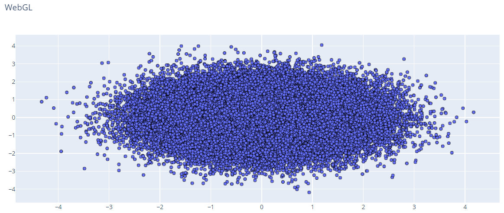
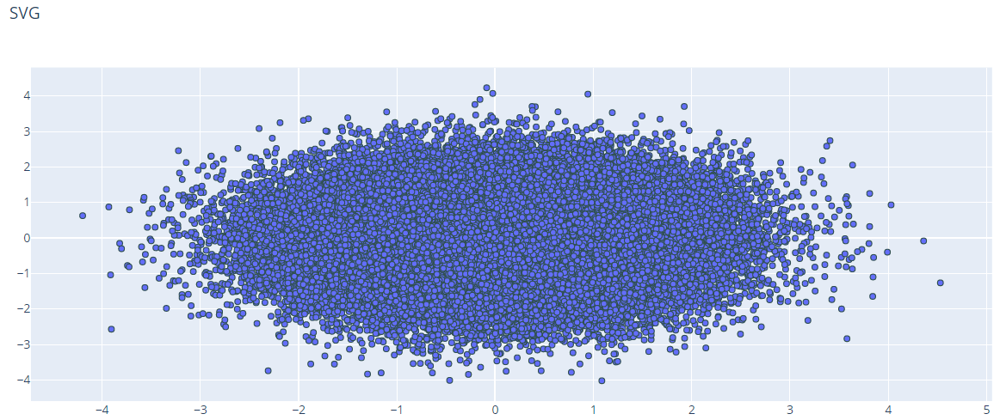
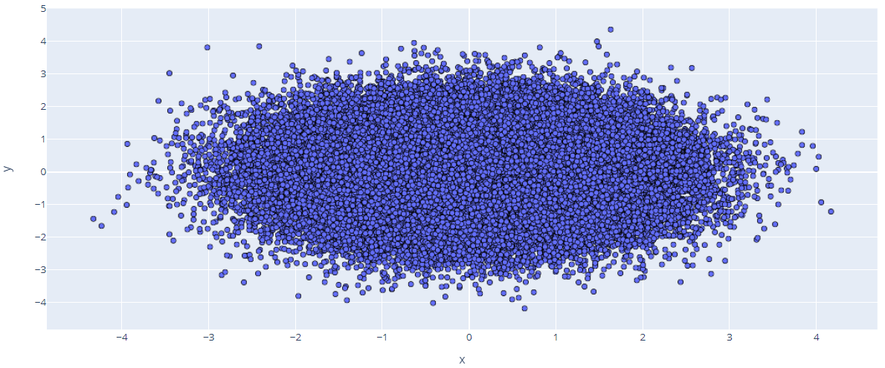
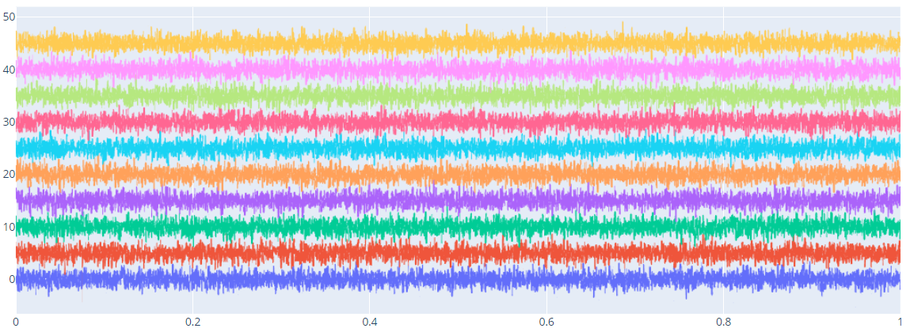

# WebGL

- [WebGL](#webgl)
  - [简介](#%e7%ae%80%e4%bb%8b)
  - [对比 WebGL 和 SVG](#%e5%af%b9%e6%af%94-webgl-%e5%92%8c-svg)
    - [WebGL 效果](#webgl-%e6%95%88%e6%9e%9c)
    - [SVG 效果](#svg-%e6%95%88%e6%9e%9c)
  - [WebGL with px](#webgl-with-px)
  - [WebGL with go](#webgl-with-go)
  - [多个 trace](#%e5%a4%9a%e4%b8%aa-trace)
  - [References](#references)

2020-04-20, 11:24
*** *

## 简介

WebGL 提高速度、改善交互性，能绘制更多数据。

使用 WebGL 可以绘制上百万的数据点，对更大的数据集，则需要使用 [datashader](datashader.md)。

## 对比 WebGL 和 SVG

可以使用 `Scattergl()` 替换 `Scatter()` 实现 WebGL，以提高速度、交互性，以及绘制更多数据点的可能。

下面使用 75,000 个随机数据对比 WebGL 和 SVG。

### WebGL 效果

```py
import plotly.graph_objects as go

import numpy as np
np.random.seed(1)

N = 75000

fig = go.Figure()
fig.add_trace(
    go.Scattergl(
        x = np.random.randn(N),
        y = np.random.randn(N),
        mode = 'markers',
        marker = dict(
            line = dict(
                width = 1,
                color = 'DarkSlateGrey')
        )
    )
)

fig.update_layout(title_text = 'WebGL')

fig.show()
```



### SVG 效果

```py
import plotly.graph_objects as go

import numpy as np

N = 75000

fig = go.Figure()
fig.add_trace(
    go.Scatter(
        x = np.random.randn(N),
        y = np.random.randn(N),
        mode = 'markers',
        marker = dict(
            line = dict(
                width = 1,
                color = 'DarkSlateGrey')
        )
    )
)

fig.update_layout(title_text = 'SVG')

fig.show()
```



从图看不出来差异，SVG 的交互延迟明显高于 WebGL。

## WebGL with px

Plotly Express 函数的 `rendermode` 参数可用于启用 WebGL 渲染。

例如，下面用 WebGL 渲染 100,000 数据点的散点图：

```py
import plotly.express as px

import pandas as pd
import numpy as np
np.random.seed(1)

N = 100000

df = pd.DataFrame(dict(x=np.random.randn(N),
                       y=np.random.randn(N)))

fig = px.scatter(df, x="x", y="y", render_mode='webgl')

fig.update_traces(marker_line=dict(width=1, color='DarkSlateGray'))

fig.show()
```



## WebGL with go

`Scattergl` 可用于创建启用 WebGL 的散点图。

```py
import plotly.graph_objects as go

import numpy as np

N = 100000

# Create figure
fig = go.Figure()

fig.add_trace(
    go.Scattergl(
        x = np.random.randn(N),
        y = np.random.randn(N),
        mode = 'markers',
        marker = dict(
            line = dict(
                width = 1,
                color = 'DarkSlateGrey')
        )
    )
)

fig.show()
```

## 多个 trace

```py
import plotly.graph_objects as go

import numpy as np

fig = go.Figure()

trace_num = 10
point_num = 5000
for i in range(trace_num):
    fig.add_trace(
        go.Scattergl(
                x = np.linspace(0, 1, point_num),
                y = np.random.randn(point_num)+(i*5)
        )
    )

fig.update_layout(showlegend=False)

fig.show()
```



## References

- [WebGL vs SVG](https://plotly.com/python/compare-webgl-svg/)
