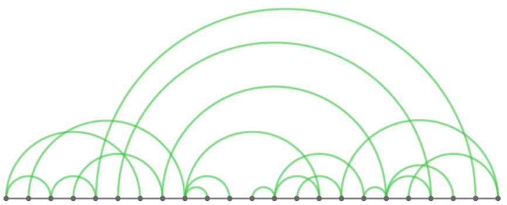
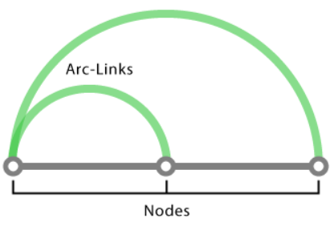
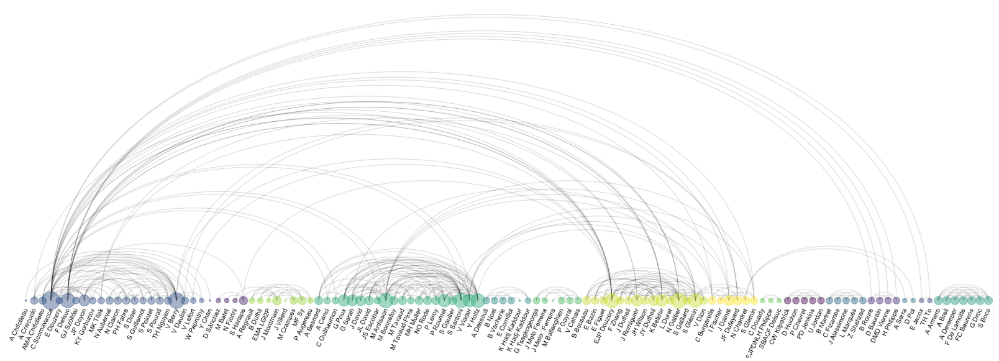

# 弧线图（Arc Diagram）

## 简介

弧线图是表示二维网络图的一种方式，是一种特殊类型的网络图。

在弧线图中，节点放在一根线上，弧线用于显示节点之间的连接。

弧线的宽度表示连接的强度或频率。

弧线图没有 2D 网络图强大，无法展示整体节点结构，连接过多时更容易重叠，但也有优点：

- 优化节点顺序后，可以很好地突出显示集群和连接
- 查找数据的 co-occurrence.
- 允许为每个节点显示标签

例如，下图是一个作者及其 100 个共同作者发表文章的情况，如果两人有共同发表的文章，以弧线相连：

## 变体

弧线图一个变体是，如果连接强烈（如权重高，连接数目多），连线越粗。即 `weighted network`。

## 绘制工具

- [d3.js](http://bl.ocks.org/sjengle/5431779)
- [Protovis](http://mbostock.github.io/protovis/ex/arc.html)
