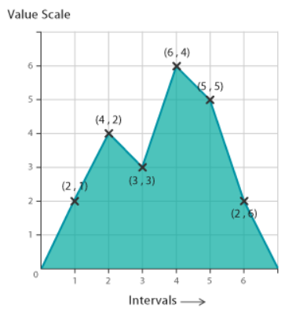

# Area Graph

- [Area Graph](#area-graph)
  - [简介](#%e7%ae%80%e4%bb%8b)
  - [工具](#%e5%b7%a5%e5%85%b7)

## 简介

面积图（Area Graph）是折线图（Line Graph）的一种，只是将线下面的区域用某类颜色或纹理填充。如下图所示：

绘制方法：在坐标系中绘制数据点，将点连成线，然后填充线下面的空间，完成面积图的绘制。

和折线图一样，面积图也是用于显示定量值在一定时间间隔或时间段内的变化。一般用于显示趋势。

## 工具

- [d3](https://observablehq.com/@d3/area-chart)
