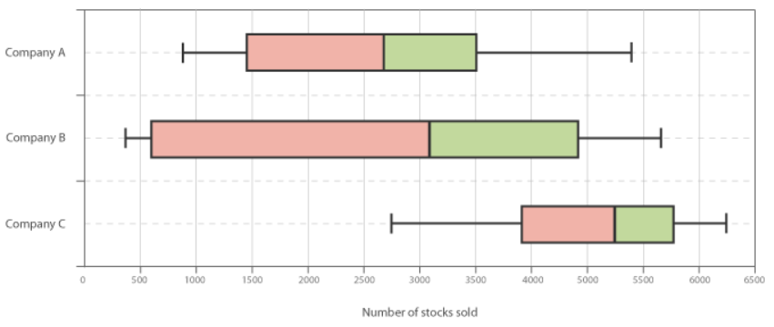
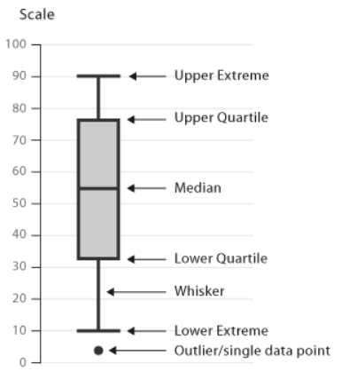

# Box & Whisker Plot

## 简介

箱线图（Box and Whisker Plot）也称为盒须图，可以很好的展示数据的四分位。

其结构如下所示：

从盒子两端延伸出来的线条称为晶须（whiskers），用于指示上下的四分位数之外的数，显示最大值和最小值

- 最大值（Upper Extreme）
- 最小值（Lower Extreme）
- 上四分位（Upper Quartile）
- 中位数（Median）
- 下四分位（Lower Quartile）

离群值（Ourlier）绘制为和晶须在一条线上的点。

虽然箱线图和[直方图](histogram.md)、[密度图](density_plot.md)相比很简单，但是它占用空间少，用于对比多个组或数据集之间的分布时很有用。

从箱线图上可以直观的看到

- 平均值、中位数、上下四分位数等统计值
- 任何异常值
- 数据分布是否对称
- 数据分布的紧密程度
- 数据分布是否有倾斜，往哪个方向倾斜

## 工具

- [d3](http://bl.ocks.org/mbostock/4061502)
- [seaborn](https://python-graph-gallery.com/boxplot/)