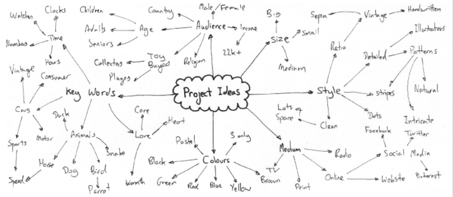
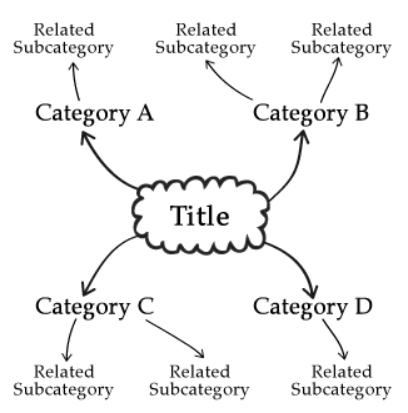

# Brainstorm

## 简介

头脑风暴（Brainstorm）也称为思维导图，将相关的想法、词汇、图片以及概念放在一起。

头脑风暴一般用在项目的初始阶段，用来产生想法、对想法组织分类等。

头脑风暴的结构如下：

- 中心为核心名称
- 从其中延伸不同的类别
- 子类别也可以发展自己的自类比

创建头脑风暴的基本方式

- 在中心绘制项目名称或核心主题，用一个形状圈起来（一般为圆圈或云）
- 联想相关的、有用的单词或项目的子项目
- 从中心分类绘制线，指向每个不同的子分类
- 对每个子分类，以相同的方式进行。

## 工具

- xmind
- mindmanager
- [MindMup, online](https://www.mindmup.com/)