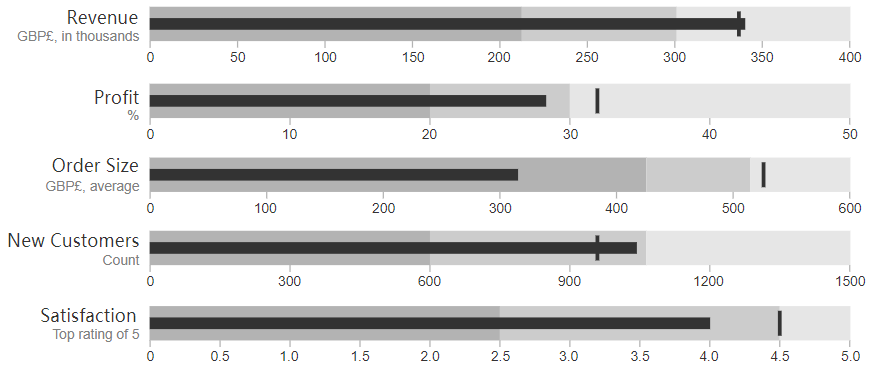
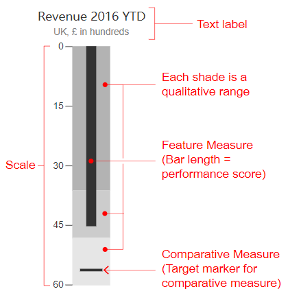

# Bullet Graph

## 简介

子弹图（Bullet Graph）一般用于展示性能。其功能类似于[条形图](bar_chart.md)，但包含了额外的可视化元素。

子弹图最初由 Stephen Few 开发用于替代仪表盘，因为原来的仪表盘空间利用率不高，显示信息不足，并且杂乱无章。

子弹图的结构如下：

主要数据由中间的长条显示，称为特征值（Feature Measure）。

在长条延伸方向和长条垂直的横线称为比较值（Comparative Measure），是和特征值进行比较的目标值。因此，如果中间长条超过了**比较值**的位置，表示你达到目标。

特征值后面的分段色条用来定性的显示得分。每种色调（上图中的不同灰度）表示不同等级，如欠佳、平均和良好。对子弹图，建议最多使用五个等级。

## 工具

- [d3](http://bl.ocks.org/mbostock/4061961)
